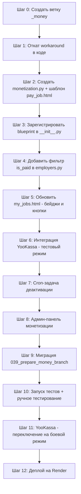

# План ветки `_money`: внедрение платёжной модели «pay-per-job»

> **Ветка:** `_money` (создаётся от `main`)
> **Цель:** замена временного workaround (все задания бесплатны) на полноценную платёжную модель.
> **Модель:** работодатель платит за публикацию задания (тариф `standard`: 490₽ / 30 дней, продление 290₽).
> **П платёжный шлюз:** YooKassa (рекомендуется; поддержка рублей, удобное API).

---

## 1. Текущее состояние: временный workaround (подлежит откату)

Миграция [`038_fix_unpaid_jobs.sql`](migrations/038_fix_unpaid_jobs.sql) проставила `is_paid=True` всем существующим заданиям. Код также содержит жёстко вшитые значения.

### 1.1. Создание задания — [`app/blueprints/jobs.py`](app/blueprints/jobs.py:480-482)

```python
# ТЕКУЩЕЕ (workaround) — строки 479–482:
# В main is_paid и paid_at уже удалены (workaround откатан):
'status': 'open',
'expires_at': (datetime.now(timezone.utc) + timedelta(days=30)).isoformat(), # ← удалить
```

### 1.2. Копирование задания — [`app/utils.py`](app/utils.py:200)

```python
# ТЕКУЩЕЕ (workaround) — строка 200:
'is_paid': True,   # ← заменить на False
```

### 1.3. Фильтрация на главной — [`app/blueprints/jobs.py`](app/blueprints/jobs.py:82,92)

```python
# ТЕКУЩЕЕ — строка 82:
query = 'status=in.(open,completed)&select=...'
# ТЕКУЩЕЕ — строка 92 (Python-фильтр):
jobs = [j for j in jobs if j.get('status') in ('open', 'completed')]
# ↑ В main фильтр is_paid удалён — осознанный отказ от модели pay-per-job
```

### 1.4. Детальный просмотр — [`app/blueprints/jobs.py`](app/blueprints/jobs.py:343-346)

```python
# В main проверка is_paid уже удалена — осознанный отказ от модели pay-per-job:
if not is_owner and not is_admin:
    if job.get('status') not in ('open', 'completed'):
        flash('Задание не найдено', 'danger')
        return redirect(url_for('jobs.index'))
```

### 1.5. Страница работодателей — [`app/blueprints/employers.py`](app/blueprints/employers.py:40,88)

```python
# ТЕКУЩЕЕ — строка 40 (список работодателей):
f'jobs?employer_id=in.({ids})&status=eq.open&select=employer_id'
# ПРОБЛЕМА: нет фильтра &is_paid=eq.true — считает неоплаченные задания

# ТЕКУЩЕЕ — строка 88 (профиль работодателя):
f'jobs?employer_id=eq.{employer_id}&status=eq.open&select=...'
# ПРОБЛЕМА: нет фильтра &is_paid=eq.true — показывает неоплаченные задания
```

---

## 2. Пошаговый план реализации

### Шаг 0. Подготовка ветки

```bash
git checkout main
git pull origin main
git checkout -b _money
```

---

### Шаг 1. Откат workaround в коде

#### 1.1. [`app/blueprints/jobs.py`](app/blueprints/jobs.py) — функция `job_new()`

Заменить строки 479–482:

```python
# БЫЛО:
'status': 'open',
'is_paid': True,
'paid_at': datetime.now(timezone.utc).isoformat(),
'expires_at': (datetime.now(timezone.utc) + timedelta(days=30)).isoformat(),

# СТАЛО:
'status': 'draft',
'is_paid': False,
# paid_at — не устанавливается (будет заполнено после оплаты)
# expires_at — не устанавливается (будет заполнено после оплаты)
```

**Важно:** статус меняется с `'open'` на `'draft'`. Задание создаётся как черновик и становится `'open'` только после оплаты.

#### 1.2. [`app/utils.py`](app/utils.py) — функция `copy_job()`

Заменить строку 200:

```python
# БЫЛО:
'is_paid': True,

# СТАЛО:
'is_paid': False,
```

И добавить поле статуса (если ещё нет):

```python
'status': 'draft',
```

#### 1.3. [`app/blueprints/jobs.py`](app/blueprints/jobs.py) — редирект после создания

Заменить строку 494:

```python
# БЫЛО:
return redirect(url_for('jobs.my_jobs'))

# СТАЛО:
return redirect(url_for('jobs.pay_job', job_id=created_job['id']))
```

---

### Шаг 2. Blueprint монетизации — [`app/blueprints/monetization.py`](app/blueprints/monetization.py) (новый файл)

Создать файл `app/blueprints/monetization.py` со следующими роутами:

```python
from flask import Blueprint, jsonify, request, session, current_app, flash, redirect, url_for, render_template
from datetime import datetime, timezone, timedelta
from app.decorators import login_required, role_required
from app.utils import supabase_request, supabase_admin_request

monetization_bp = Blueprint('monetization', __name__)
```

#### 2.1. Страница оплаты: `GET /jobs/<job_id>/pay`

```python
@monetization_bp.route('/jobs/<job_id>/pay')
@login_required
@role_required('employer')
def pay_job_page(job_id):
    """Страница выбора тарифа и оплаты."""
    # Проверка владельца
    job_resp = supabase_request('GET', f'jobs?id=eq.{job_id}&select=id,employer_id,is_paid,status')
    if not job_resp.ok or not job_resp.json():
        flash('Задание не найдено', 'danger')
        return redirect(url_for('jobs.my_jobs'))

    job = job_resp.json()[0]
    if job['employer_id'] != session['user_id']:
        flash('Нет доступа', 'danger')
        return redirect(url_for('jobs.my_jobs'))

    if job.get('is_paid'):
        flash('Задание уже оплачено', 'info')
        return redirect(url_for('jobs.my_jobs'))

    # Загружаем тарифы
    tariffs_resp = supabase_request('GET', 'tariff_settings?is_active=eq.true&order=price.asc')
    tariffs = tariffs_resp.json() if tariffs_resp.ok else []

    return render_template('pay_job.html', job=job, tariffs=tariffs)
```

#### 2.2. Обработка платежа: `POST /jobs/<job_id>/pay`

```python
@monetization_bp.route('/jobs/<job_id>/pay', methods=['POST'])
@login_required
@role_required('employer')
def pay_job_process(job_id):
    """Обработка платежа (интеграция с YooKassa)."""
    tariff_key = request.form.get('tariff', 'standard')

    # Проверка владельца
    job_resp = supabase_request('GET', f'jobs?id=eq.{job_id}&select=id,employer_id,is_paid,status')
    if not job_resp.ok or not job_resp.json():
        flash('Задание не найдено', 'danger')
        return redirect(url_for('jobs.my_jobs'))

    job = job_resp.json()[0]
    if job['employer_id'] != session['user_id']:
        flash('Нет доступа', 'danger')
        return redirect(url_for('jobs.my_jobs'))

    if job.get('is_paid'):
        flash('Задание уже оплачено', 'info')
        return redirect(url_for('jobs.my_jobs'))

    # Получаем тариф
    tariff_resp = supabase_request('GET', f'tariff_settings?tariff_key=eq.{tariff_key}&is_active=eq.true')
    if not tariff_resp.ok or not tariff_resp.json():
        flash('Тариф не найден', 'danger')
        return redirect(url_for('jobs.pay_job_page', job_id=job_id))

    tariff = tariff_resp.json()[0]

    # ─── Интеграция с YooKassa ───
    # TODO: заменить на реальный вызов API YooKassa
    # payment = yookassa_create_payment(
    #     amount=tariff['price'],
    #     description=f'Публикация задания #{job_id}',
    #     return_url=url_for('monetization.pay_job_callback', job_id=job_id, _external=True)
    # )
    # return redirect(payment['confirmation']['confirmation_url'])

    # Эмуляция оплаты (для dev-тестирования):
    transaction_id = f'emulated_{job_id}_{int(datetime.now(timezone.utc).timestamp())}'

    # Запись в job_payments
    payment_record = {
        'job_id': job_id,
        'employer_id': session['user_id'],
        'amount': tariff['price'],
        'tariff': tariff_key,
        'type': 'publication',
        'status': 'paid',
        'transaction_id': transaction_id,
        'paid_at': datetime.now(timezone.utc).isoformat(),
    }
    pay_resp = supabase_request('POST', 'job_payments', json=payment_record)

    if not pay_resp.ok:
        current_app.logger.error(f'Failed to record payment: {pay_resp.text}')
        flash('Ошибка записи платежа', 'danger')
        return redirect(url_for('jobs.pay_job_page', job_id=job_id))

    # Обновление задания: is_paid=True, paid_at, expires_at, status='open'
    now_iso = datetime.now(timezone.utc).isoformat()
    expires_iso = (datetime.now(timezone.utc) + timedelta(days=tariff['duration_days'])).isoformat()

    update_resp = supabase_request('PATCH', f'jobs?id=eq.{job_id}', json={
        'is_paid': True,
        'paid_at': now_iso,
        'expires_at': expires_iso,
        'status': 'open',
        'tariff': tariff_key,
    })

    if not update_resp.ok:
        current_app.logger.error(f'Failed to update job after payment: {update_resp.text}')
        flash('Ошибка активации задания', 'danger')
        return redirect(url_for('jobs.pay_job_page', job_id=job_id))

    flash('Задание успешно оплачено и опубликовано!', 'success')
    return redirect(url_for('jobs.my_jobs'))
```

#### 2.3. Callback от платёжного шлюза: `POST /api/payments/callback`

```python
@monetization_bp.route('/api/payments/callback', methods=['POST'])
def pay_job_callback():
    """Callback от YooKassa. Вызывается платёжным шлюзом, не пользователем."""
    # TODO: верификация IP и подписи webhook
    # TODO: обработка статусов: succeeded, canceled
    # В случае succeeded — активировать задание (аналогично pay_job_process)
    return jsonify({'status': 'ok'}), 200
```

#### 2.4. API продления: `POST /api/jobs/<job_id>/renew`

```python
@monetization_bp.route('/api/jobs/<job_id>/renew', methods=['POST'])
@login_required
@role_required('employer')
def renew_job(job_id):
    """Продление оплаченного задания (новая оплата = renewal_price)."""
    # Проверка владельца
    job_resp = supabase_request('GET', f'jobs?id=eq.{job_id}&select=id,employer_id,is_paid,expires_at,tariff')
    if not job_resp.ok or not job_resp.json():
        return jsonify({'success': False, 'error': 'Задание не найдено'}), 404

    job = job_resp.json()[0]
    if job['employer_id'] != session['user_id']:
        return jsonify({'success': False, 'error': 'Нет доступа'}), 403

    if not job.get('is_paid'):
        return jsonify({'success': False, 'error': 'Задание не оплачено'}), 400

    # Получаем тариф и renewal_price
    tariff_key = job.get('tariff', 'standard')
    tariff_resp = supabase_request('GET', f'tariff_settings?tariff_key=eq.{tariff_key}')
    if not tariff_resp.ok or not tariff_resp.json():
        return jsonify({'success': False, 'error': 'Тариф не найден'}), 500

    tariff = tariff_resp.json()[0]
    renewal_price = tariff.get('renewal_price', tariff['price'])

    # ─── Интеграция с YooKassa (renewal) ───
    # TODO: реальный вызов API

    # Эмуляция
    transaction_id = f'renew_{job_id}_{int(datetime.now(timezone.utc).timestamp())}'

    # Запись в job_payments
    payment_record = {
        'job_id': job_id,
        'employer_id': session['user_id'],
        'amount': renewal_price,
        'tariff': tariff_key,
        'type': 'renewal',
        'status': 'paid',
        'transaction_id': transaction_id,
        'paid_at': datetime.now(timezone.utc).isoformat(),
    }
    supabase_request('POST', 'job_payments', json=payment_record)

    # Продление: expires_at = now + duration_days
    new_expires = (datetime.now(timezone.utc) + timedelta(days=tariff['duration_days'])).isoformat()
    supabase_request('PATCH', f'jobs?id=eq.{job_id}', json={'expires_at': new_expires})

    return jsonify({'success': True, 'message': f'Задание продлено до {new_expires[:10]}'})
```

#### 2.5. Регистрация blueprint в [`app/__init__.py`](app/__init__.py)

Добавить после строки 152 (импорт `employers_bp`):

```python
from app.blueprints.monetization import monetization_bp
```

Добавить после строки 167 (регистрация `employers_bp`):

```python
app.register_blueprint(monetization_bp)
```

---

### Шаг 3. Автоматическая деактивация просроченных заданий

#### 3.1. Код в приложении (фильтрация при каждом запросе)

В [`app/blueprints/jobs.py`](app/blueprints/jobs.py) строки 92-93 — фильтр по `expires_at` уже присутствует:

```python
jobs = [j for j in jobs if not j.get('expires_at') or j['expires_at'] > now]
```

Этот код **оставить**. Он скрывает просроченные задания из ленты без изменения статуса в БД.

#### 3.2. Периодическая задача для БД (cron / Render Cron Job)

Создать endpoint `GET /api/cron/expire-jobs` (добавить в [`app/blueprints/monetization.py`](app/blueprints/monetization.py)):

```python
@monetization_bp.route('/api/cron/expire-jobs', methods=['GET'])
def cron_expire_jobs():
    """Закрывает просроченные оплаченные задания.
    Вызывается Render Cron Job раз в час.
    Защита: Render Cron передаёт заголовок с секретом."""
    cron_secret = request.headers.get('X-Cron-Secret', '')
    if cron_secret != current_app.config.get('CRON_SECRET', ''):
        return jsonify({'error': 'Unauthorized'}), 403

    now_iso = datetime.now(timezone.utc).isoformat()

    # Найти просроченные открытые задания
    resp = supabase_admin_request('GET',
        f'jobs?is_paid=eq.true&status=in.(open,completed)&expires_at=lt.{now_iso}&select=id')

    if not resp.ok or not resp.json():
        return jsonify({'expired': 0})

    expired_jobs = resp.json()
    count = len(expired_jobs)

    if count > 0:
        ids = ','.join(j['id'] for j in expired_jobs)
        supabase_admin_request('PATCH', f'jobs?id=in.({ids})', json={'status': 'expired'})
        current_app.logger.info(f'Cron: expired {count} jobs')

    return jsonify({'expired': count})
```

Добавить `CRON_SECRET` в [`app/config.py`](app/config.py):

```python
CRON_SECRET = os.environ.get('CRON_SECRET', 'dev-secret-change-me')
```

И в Render Environment Variables + Render Cron Job:
- URL: `https://trudnik.onrender.com/api/cron/expire-jobs`
- Schedule: `0 * * * *` (каждый час)
- Header: `X-Cron-Secret: <значение CRON_SECRET>`

---

### Шаг 4. Фильтрация на странице работодателя

#### 4.1. Список работодателей — [`app/blueprints/employers.py`](app/blueprints/employers.py:40)

```python
# БЫЛО (строка 40):
f'jobs?employer_id=in.({ids})&status=eq.open&select=employer_id'

# СТАЛО:
f'jobs?employer_id=in.({ids})&status=eq.open&is_paid=eq.true&select=employer_id'
```

#### 4.2. Профиль работодателя — [`app/blueprints/employers.py`](app/blueprints/employers.py:88)

```python
# БЫЛО (строка 88):
f'jobs?employer_id=eq.{employer_id}&status=eq.open&select=...'

# СТАЛО:
f'jobs?employer_id=eq.{employer_id}&status=eq.open&is_paid=eq.true&select=...'
```

---

### Шаг 5. Страница «Мои задания» — статус оплаты и продление

#### 5.1. Запрос в БД — [`app/blueprints/jobs.py`](app/blueprints/jobs.py:517-522)

Убедиться, что `my_jobs()` всегда запрашивает поля `is_paid`, `paid_at`, `expires_at`, `tariff`. Текущий запрос использует `select=*`, поэтому все поля уже приходят. **Изменений не требуется.**

#### 5.2. Шаблон [`templates/my_jobs.html`](templates/my_jobs.html)

Добавить для каждого задания:

1. **Бейдж статуса оплаты:**
   - `is_paid=True`: зелёный бейдж «Оплачено»
   - `is_paid=False`: красный бейдж «Не оплачено» + кнопка «Оплатить» → `url_for('jobs.pay_job_page', job_id=job.id)`

2. **Информация о сроке:**
   - `expires_at` в будущем: «Активно до ДД.ММ.ГГГГ»
   - `expires_at` < сегодня: «Срок истёк» + кнопка «Продлить» (вызывает `POST /api/jobs/<id>/renew`)

3. **Фильтр по статусу оплаты:**
   - Добавить query-параметр `paid` (all/paid/unpaid) в роут `my_jobs()` и соответствующий UI.

---

### Шаг 6. Административная панель монетизации

Добавить в [`app/blueprints/admin.py`](app/blueprints/admin.py):

#### 6.1. `GET /api/admin/monetization-settings` (уже ожидается тестом)

```python
@admin_bp.route('/api/admin/monetization-settings')
@login_required
@role_required('admin')
def get_monetization_settings():
    """Получить настройки тарифов (только админ)."""
    resp = supabase_request('GET', 'tariff_settings?order=price.asc')
    return jsonify(resp.json() if resp.ok else [])
```

#### 6.2. `GET /api/admin/payments` (уже ожидается тестом)

```python
@admin_bp.route('/api/admin/payments')
@login_required
@role_required('admin')
def get_payments():
    """Получить список платежей (только админ)."""
    resp = supabase_request('GET', 'job_payments?select=*,job:jobs(organization_name)&order=created_at.desc&limit=100')
    return jsonify(resp.json() if resp.ok else [])
```

#### 6.3. `PUT /api/admin/monetization-settings` — редактирование тарифов

```python
@admin_bp.route('/api/admin/monetization-settings', methods=['PUT'])
@login_required
@role_required('admin')
def update_monetization_settings():
    """Обновить тариф (только админ)."""
    data = request.get_json()
    tariff_key = data.get('tariff_key')
    # ... PATCH tariff_settings
```

---

## 3. Изменения в БД (миграции)

### 3.1. Новая миграция: `039_prepare_money_branch.sql`

```sql
-- Миграция: Подготовка к ветке _money
-- Убираем workaround: сбрасываем is_paid/paid_at/expires_at для будущих заданий
-- Существующие задания НЕ трогаем — они должны остаться оплаченными.

-- Устанавливаем DEFAULT FALSE для is_paid (уже есть, но проверяем)
ALTER TABLE jobs ALTER COLUMN is_paid SET DEFAULT FALSE;

-- Убираем DEFAULT NOW() для paid_at (если был установлен)
ALTER TABLE jobs ALTER COLUMN paid_at DROP DEFAULT;

-- Убираем DEFAULT для expires_at (если был установлен)
ALTER TABLE jobs ALTER COLUMN expires_at DROP DEFAULT;

-- Проверяем, что статус 'draft' разрешён constraint'ом
-- (уже добавлен в миграции 022_new_monetization_model.sql)
-- Если нет — добавить:
-- ALTER TABLE jobs DROP CONSTRAINT IF EXISTS jobs_status_check;
-- ALTER TABLE jobs ADD CONSTRAINT jobs_status_check 
--     CHECK (status IN ('draft', 'open', 'in_progress', 'completed', 'cancelled', 'paid', 'expired'));
```

### 3.2. Таблица `tariff_settings` — предзаполнение (уже сделано в миграции 022)

```sql
-- Уже выполнено, проверяем:
-- tariff_key='standard', price=490, duration_days=30, renewal_price=290, is_active=true
```

При необходимости добавить ещё тарифы (premium, business) через админ-панель или дополнительные INSERT.

### 3.3. Индексы (уже созданы в миграции 022)

```sql
-- Уже есть:
CREATE INDEX IF NOT EXISTS idx_jobs_expires ON jobs(expires_at) WHERE status = 'open';
CREATE INDEX IF NOT EXISTS idx_job_payments_job ON job_payments(job_id);
CREATE INDEX IF NOT EXISTS idx_job_payments_employer ON job_payments(employer_id);
```

Дополнительно рекомендуется:

```sql
-- Индекс для cron-задачи:
CREATE INDEX IF NOT EXISTS idx_jobs_expired_lookup ON jobs(expires_at, is_paid, status)
    WHERE is_paid = TRUE AND status IN ('open', 'completed');

-- Индекс для фильтра is_paid на employers:
CREATE INDEX IF NOT EXISTS idx_jobs_employer_paid ON jobs(employer_id, is_paid, status);
```

---

## 4. План тестирования

### 4.1. Unit-тесты (в [`test_monetization.py`](test_monetization.py))

| # | Сценарий | Ожидаемый результат |
|---|----------|---------------------|
| 1 | Создание задания → статус `draft`, `is_paid=False` | Задание создано, не видно в ленте |
| 2 | `GET /jobs/<id>/pay` → страница с выбором тарифа | 200, в HTML есть `tariff_key=standard`, цена 490₽ |
| 3 | `POST /jobs/<id>/pay` с `tariff=standard` → оплата | Редирект на `my_jobs`, задание `status=open`, `is_paid=True` |
| 4 | Повторная оплата уже оплаченного задания | Flash «уже оплачено», редирект |
| 5 | Чужое задание → 403 | Нет доступа |
| 6 | `POST /api/jobs/<id>/renew` → продление | `expires_at` увеличивается на 30 дней |
| 7 | Продление неоплаченного задания | Ошибка «Задание не оплачено» |
| 8 | Задание видно в ленте только если `is_paid=True` и `expires_at > now` | Неоплаченные и просроченные не видны |
| 9 | Страница работодателя: считаются только `is_paid=True` задания | `open_jobs_counts` корректен |
| 10 | Профиль работодателя: видны только оплаченные открытые задания | Неоплаченные не видны |
| 11 | Cron: просроченные задания → статус `expired` | `GET /api/cron/expire-jobs` → статус сменился |
| 12 | Админ: `GET /api/admin/monetization-settings` → 200 | JSON с тарифами |
| 13 | Админ: `GET /api/admin/payments` → 200 | JSON с платежами |
| 14 | Работодатель: `GET /api/admin/*` → 403 | Доступ запрещён |

### 4.2. Ручное тестирование (чеклист)

- [ ] **Создание → оплата → публикация:** полный цикл в браузере
- [ ] **Оплата через YooKassa (тестовый режим):** редирект на YooKassa → оплата → callback → активация
- [ ] **Callback YooKassa:** симуляция через `curl` / Postman
- [ ] **Продление:** кнопка «Продлить» → оплата → новый `expires_at`
- [ ] **Просрочка:** задание с `expires_at` в прошлом → не видно в ленте → cron меняет статус
- [ ] **Мои задания:** бейджи «Оплачено»/«Не оплачено», кнопки «Оплатить»/«Продлить»
- [ ] **Страница работодателей:** счётчик заданий учитывает только оплаченные
- [ ] **Админ-панель:** тарифы и платежи видны только админу
- [ ] **Обратная совместимость:** существующие задания (с `is_paid=True`) продолжают работать
- [ ] **CSRF-защита:** все мутирующие запросы с корректным токеном

### 4.3. Нагрузочное тестирование

- Проверить, что фильтр `is_paid=eq.true` не создаёт проблем при большом количестве заданий
- Проверить, что cron-задача не блокирует БД при большом количестве просроченных заданий

---

## 5. Очерёдность шагов (рекомендуемый порядок)



---

## 6. Интеграция YooKassa — детализация

### 6.1. Установка SDK

```bash
pip install yookassa
```

Добавить в [`requirements.txt`](requirements.txt):
```
yookassa>=3.0.0
```

### 6.2. Конфигурация в [`app/config.py`](app/config.py)

```python
YOOKASSA_SHOP_ID = os.environ.get('YOOKASSA_SHOP_ID', '')
YOOKASSA_SECRET_KEY = os.environ.get('YOOKASSA_SECRET_KEY', '')
YOOKASSA_RETURN_URL = os.environ.get('YOOKASSA_RETURN_URL', 'https://trudnik.onrender.com')
```

### 6.3. Сервисный модуль: [`app/services/payment_service.py`](app/services/payment_service.py) (новый)

```python
import yookassa
from yookassa import Payment
from flask import current_app, url_for

def init_yookassa():
    yookassa.Configuration.account_id = current_app.config['YOOKASSA_SHOP_ID']
    yookassa.Configuration.secret_key = current_app.config['YOOKASSA_SECRET_KEY']

def create_payment(job_id: str, amount: float, description: str) -> dict:
    """Создать платёж в YooKassa. Возвращает словарь с confirmation_url."""
    init_yookassa()
    payment = Payment.create({
        'amount': {
            'value': f'{amount:.2f}',
            'currency': 'RUB',
        },
        'confirmation': {
            'type': 'redirect',
            'return_url': current_app.config['YOOKASSA_RETURN_URL'] + url_for('monetization.pay_job_callback', job_id=job_id),
        },
        'capture': True,
        'description': description,
        'metadata': {
            'job_id': job_id,
        },
    })
    return {
        'id': payment.id,
        'confirmation_url': payment.confirmation.confirmation_url,
        'status': payment.status,
    }

def check_payment(payment_id: str) -> str:
    """Проверить статус платежа. Возвращает: 'succeeded', 'pending', 'canceled'."""
    init_yookassa()
    payment = Payment.find_one(payment_id)
    return payment.status
```

### 6.4. Переменные окружения Render

| Переменная | Назначение |
|------------|------------|
| `YOOKASSA_SHOP_ID` | ID магазина в YooKassa |
| `YOOKASSA_SECRET_KEY` | Секретный ключ YooKassa |
| `YOOKASSA_RETURN_URL` | https://trudnik.onrender.com |
| `CRON_SECRET` | Секрет для защиты cron-эндпоинта |

---

## 7. Риски и предостережения

| Риск | Меры |
|------|------|
| Существующие задания перестанут быть видны после отката `is_paid=True` | Миграция 038 уже проставила флаг всем существующим — они останутся видимыми. **Не запускать сброс is_paid на существующих данных.** |
| Черновики (`status=draft`) видны в my_jobs, но не в публичной ленте | `my_jobs()` не фильтрует по статусу, когда `status_filter='all'` — черновики будут видны владельцу. Фильтр в `index()` пропускает только `open/completed` — черновики не просочатся. |
| RLS для `job_payments`: политика `FOR INSERT WITH CHECK (true)` | Позволяет любому аутентифицированному пользователю вставлять записи. Защита на уровне кода (проверка employer_id). Рассмотреть ужесточение. |
| Cron-задача доступна без авторизации | Защита через `X-Cron-Secret` заголовок. |
| Двойная оплата | Проверка `job.get('is_paid')` перед созданием платежа. |

---

## 8. Сводная таблица затронутых файлов

| Файл | Действие | Что изменится |
|------|----------|---------------|
| [`app/blueprints/jobs.py`](app/blueprints/jobs.py) | Изменить | `job_new()`: `is_paid=False`, `status='draft'`, редирект на оплату |
| [`app/utils.py`](app/utils.py) | Изменить | `copy_job()`: `is_paid=False`, `status='draft'` |
| [`app/blueprints/employers.py`](app/blueprints/employers.py) | Изменить | Добавить `is_paid=eq.true` в фильтры строк 40 и 88 |
| [`app/blueprints/monetization.py`](app/blueprints/monetization.py) | **Создать** | Blueprint монетизации: оплата, продление, cron, callback |
| [`app/services/payment_service.py`](app/services/payment_service.py) | **Создать** | Сервис интеграции с YooKassa |
| [`app/__init__.py`](app/__init__.py) | Изменить | Импорт и регистрация `monetization_bp` |
| [`app/config.py`](app/config.py) | Изменить | Добавить `CRON_SECRET`, `YOOKASSA_*` |
| [`migrations/039_prepare_money_branch.sql`](migrations/039_prepare_money_branch.sql) | **Создать** | Сброс DEFAULT для workaround-полей |
| [`templates/pay_job.html`](templates/pay_job.html) | **Создать** | Шаблон страницы выбора тарифа и оплаты |
| [`templates/my_jobs.html`](templates/my_jobs.html) | Изменить | Бейджи статуса оплаты, кнопки «Оплатить»/«Продлить» |
| [`requirements.txt`](requirements.txt) | Изменить | Добавить `yookassa` |
| [`test_monetization.py`](test_monetization.py) | Изменить | Адаптировать тесты под новый flow (создание → draft → оплата → open) |
