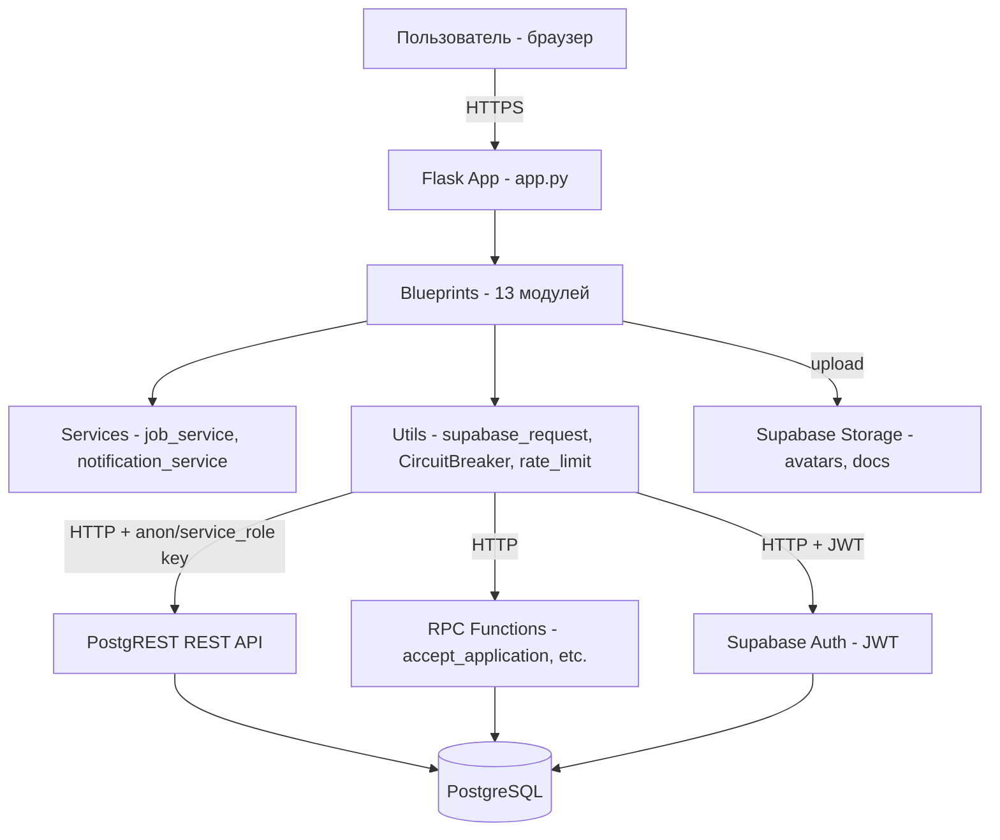
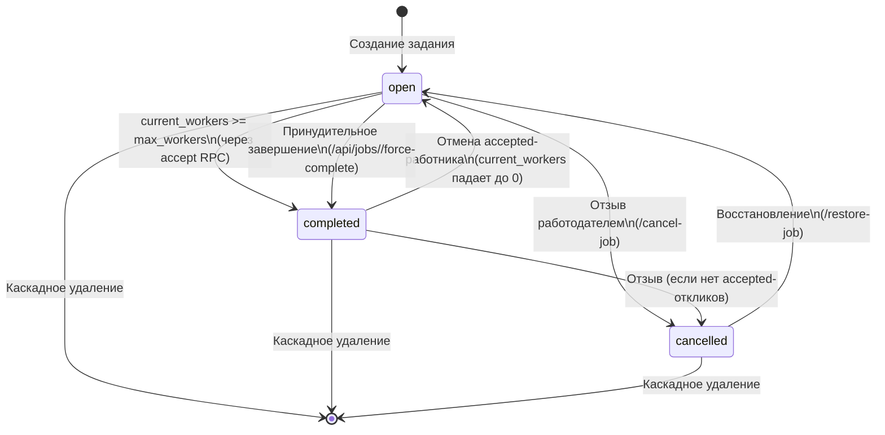
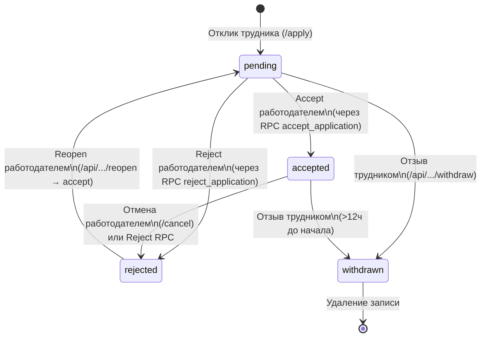
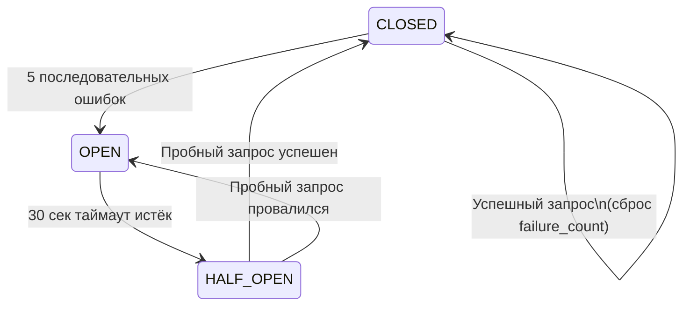

# TESTING BLUEPRINT — Архитектура и бизнес-логика приложения «Трудник»

> **Актуализировано на основе анализа исходного кода (2026-06-17).**
> Все данные основаны исключительно на реальном коде проекта (ветка `main`).
> **Статус монетизации:** отключена в main. Приложение работает в бесплатном режиме (`is_paid=True` всегда).

---

## 1. Общая архитектура

### 1.1. Структура проекта

```
trudnik/
├── app.py                          # Точка входа WSGI: from app import app
├── requirements.txt                # Flask, requests, python-dotenv, jwt, gunicorn
├── render.yaml                     # Деплой на Render.com
├── conftest.py                     # PyTest фикстуры и хелперы (CSRF, логин, сессии)
├── apply_migrations.py             # Применение миграций через exec_sql
├── apply_new_migrations.py         # Обновлённый скрипт миграций (с проверкой дубликатов)
├── check_schema.py                 # Валидатор схемы БД: сверка кода с Supabase (таблицы, колонки, RLS)
├── tailwind.config.js              # TailwindCSS конфигурация
├── app/
│   ├── __init__.py                 # create_app() — фабрика приложения
│   ├── config.py                   # Config — переменные окружения + бизнес-константы
│   ├── decorators.py               # @login_required, @role_required
│   ├── utils.py                    # Supabase HTTP, CircuitBreaker, rate_limit, sanitize
│   ├── blueprints/
│   │   ├── __init__.py
│   │   ├── auth.py                 # /login, /register, /logout
│   │   ├── jobs.py                 # /, /workers, /job/new, /my-jobs, /jobs/<id>, etc.
│   │   ├── jobs_api.py             # /api/search/jobs, /api/search/workers, /api/invite, etc.
│   │   ├── applications.py         # /apply, /my-applications, accept/reject/withdraw
│   │   ├── admin.py                # /admin, управление пользователями/заданиями/справочниками
│   │   ├── profile.py              # /profile, /profile/update, /verify-employer, delete account
│   │   ├── chat.py                 # /chats, /chat/<id>, /api/send_message, poll
│   │   ├── employers.py            # /employers, /employers/<id>, избранное API
│   │   ├── favorites.py            # /favorites, /favorite/<id>, API избранного
│   │   ├── notifications.py        # /notifications, настройки уведомлений
│   │   ├── ratings.py              # /api/ratings, /ratings/user/<id>, /jobs/<id>/rate-workers
│   │   ├── blacklist.py            # /blacklist, /blacklist/<id>, /unblock/<id>
│   │   └── seo.py                  # /robots.txt, /sitemap.xml
│   └── services/
│       ├── __init__.py
│       ├── job_service.py          # search_jobs, search_workers, check_job_visibility, etc.
│       └── notification_service.py # create, get_notifications, mark_read, preferences
├── migrations/                     # SQL-миграции (001–042)
├── static/                         # CSS, JS, изображения, PWA
├── templates/                      # Jinja2-шаблоны (40+ файлов)
├── archive/                        # Архивные файлы (не используются)
└── tests/                          # (тесты в корне: test_*.py)
```

> **Примечание:** Файл [`.gitignore`](.gitignore:1) исключает из отслеживания сгенерированные артефакты тестирования: `server.log`, `*_output.html`, `*_output.txt`, `*_output2.txt`, `*_output3.txt`, а также `*_report.txt`. Эти файлы создаются при ручном и автоматизированном тестировании и не должны попадать в репозиторий.

### 1.2. Технологический стек

| Слой | Технология |
|------|-----------|
| **Backend** | Python 3.x + Flask |
| **База данных** | PostgreSQL (Supabase) |
| **Аутентификация** | Supabase Auth (JWT: access_token + refresh_token) |
| **API к БД** | PostgREST (REST API поверх PostgreSQL) |
| **RPC** | PostgreSQL функции (`accept_application`, `reject_application`, `delete_job_cascade`, `delete_user_cascade`) |
| **Фронтенд** | Jinja2 + TailwindCSS + Vanilla JS |
| **Карты** | Яндекс.Карты API |
| **Деплой** | Render.com (WSGI через Gunicorn) |
| **Тестирование** | PyTest + Selenium + requests (HTTP-клиент) |
| **Синхронизация схемы** | `check_schema.py` (валидатор), `apply_new_migrations.py` (применение миграций) |
| **Безопасность** | Circuit Breaker (устойчивость), CSP nonce (XSS-защита), `sanitize_postgrest` (инъекции) |

### 1.3. Схема взаимодействия компонентов



### 1.4. Потоки данных

**Основной поток:** Пользователь → Flask Blueprint → `supabase_request()` / `supabase_admin_request()` → PostgREST → PostgreSQL → JSON → Jinja2-шаблон → HTML

**RPC-поток (атомарные операции):** Flask Blueprint → `supabase_rpc()` → PostgreSQL function → JSON-результат

**Поток загрузки файлов:** Flask Blueprint → `upload_to_storage()` → Supabase Storage → публичный URL

---

## 2. Все маршруты (Routes)

### 2.1. Блюпринт `auth` (авторизация)

| Метод | URL | Auth | Роль | Описание | Вход | Ответ |
|-------|-----|------|------|----------|------|-------|
| GET, POST | `/login` | Нет | — | Вход в систему | POST: form(email, password) | HTML login.html / редирект |
| GET, POST | `/register` | Нет | — | Регистрация | POST: form(full_name, email, password, role, city, skills, religion, inn, is_self_employed, desired_payment, experience, contact, portfolio_link, skill_ids, religion_id) | HTML register.html / редирект |
| GET | `/logout` | Нет | — | Выход (очистка сессии) | — | Редирект на /login |

Ошибки: 429 (rate limit), 400 (CSRF/валидация)

### 2.2. Блюпринт `jobs` (задания — публичные + работодатель)

| Метод | URL | Auth | Роль | Описание | Вход | Ответ |
|-------|-----|------|------|----------|------|-------|
| GET | `/` | Нет | — | Главная страница — список заданий с фильтрацией | Query: city, payment_min, payment_max, lat, lng, radius, sort, skills, religion | HTML index.html |
| GET | `/workers` | Нет | — | Список трудников с фильтрацией | Query: city, experience, payment_from, payment_to, rating_min, skills, religion | HTML workers.html |
| GET | `/jobs/<job_id>` | Нет* | — | Детальная страница задания | Path: job_id UUID | HTML job_detail.html |
| GET, POST | `/job/new` | Да | employer | Создание нового задания | POST: form(title, description, address, work_type, deadline, payment, city, latitude, longitude, preferred_religion, max_workers) | HTML job_new.html / редирект |
| GET | `/my-jobs` | Да | employer** | Список заданий работодателя | Query: status (all/open/cancelled/completed) | HTML my_jobs.html |
| POST | `/my-jobs/action` | Да | employer** | Массовое действие: restore/cancel/delete/duplicate | Form: action, job_ids[] | Редирект + flash |
| POST | `/repost-job/<job_id>` | Да | employer | Дублирование задания | Path: job_id | JSON / редирект |
| GET, POST | `/cancel-job/<job_id>` | Да | employer | Отзыв задания | Path: job_id | JSON / редирект |
| GET, POST | `/restore-job/<job_id>` | Да | employer | Восстановление отменённого задания | Path: job_id | JSON / редирект |
| GET, POST | `/delete-job/<job_id>` | Да | employer | Каскадное удаление задания | Path: job_id, JSON body: {confirm: bool} при accepted-откликах | JSON / редирект |
| POST | `/api/jobs/<job_id>/force-complete` | Да | employer | Принудительное завершение задания | Path: job_id | JSON |
| GET, POST | `/jobs/<job_id>/edit` | Да | employer | Редактирование задания | Path: job_id, POST: form поля | HTML job_new.html / редирект |
| GET | `/invitations` | Да | — | HTML-страница приглашений | — | HTML invitations.html |
| POST | `/api/invitations/reject-all` | Да | worker** | Отклонить все ожидающие приглашения | — | JSON |
| POST | `/favorite-job/<job_id>` | Да | — | Добавить задание в избранное | Path: job_id | Редирект |
| POST | `/unfavorite-job/<job_id>` | Да | — | Удалить задание из избранного | Path: job_id | Редирект |

> \* `/jobs/<job_id>` требует аутентификации только для проверки `already_applied`, `my_app_status`, `is_employer_favorited`.
> \*\* Роль проверяется внутри функции-обработчика, а не через декоратор `@role_required`.

### 2.3. Блюпринт `jobs_api` (JSON API)

| Метод | URL | Auth | Роль | Описание | Вход | Ответ |
|-------|-----|------|------|----------|------|-------|
| GET | `/api/skills` | Нет | — | Список навыков | — | JSON {skills: [...]} |
| GET | `/api/religions` | Нет | — | Список вероисповеданий | — | JSON {religions: [...]} |
| GET | `/api/search/jobs` | Нет | — | Поиск заданий (FTS + фильтры + пагинация) | Query: q, status, lat, lng, radius, min_pay, max_pay, skills, date_from, date_to, available_slots, page, per_page, sort | JSON {results, total, page, per_page, pages} |
| GET | `/api/search/workers` | Нет | — | Поиск трудников (FTS + фильтры + пагинация) | Query: q, skills, rating_min, lat, lng, radius, page, per_page, sort | JSON {results, total, page, per_page, pages} |
| POST | `/api/invite/<job_id>/<worker_id>` | Да | employer | Пригласить трудника на задание | Path: job_id, worker_id; JSON body: {message} | JSON |
| GET | `/api/invitations` | Да | — | Список приглашений (JSON) | — | JSON {invitations: [...]} |
| POST | `/api/invitations/<id>/respond` | Да | worker | Принять/отклонить приглашение | Path: id; JSON: {action: "accept"|"reject"} | JSON |

### 2.4. Блюпринт `applications` (отклики)

| Метод | URL | Auth | Роль | Описание | Вход | Ответ |
|-------|-----|------|------|----------|------|-------|
| GET, POST | `/apply/<job_id>` | Да | — | Откликнуться на задание | Path: job_id | Редирект |
| POST | `/apply-selected` | Да | — | Массовый отклик на выбранные задания | Form: job_ids[] | Редирект + flash |
| POST | `/unapply/<job_id>` | Да | — | Отозвать отклик | Path: job_id | Редирект |
| POST | `/unapply-selected` | Да | — | Массовый отзыв откликов | Form: job_ids[] | Редирект + flash |
| POST | `/api/applications/<app_id>/withdraw` | Да | — | Отзыв отклика (API) | Path: app_id | JSON |
| GET | `/my-applications` | Да | employer | Список откликов на мои задания | Query: skills | HTML my_applications.html |
| GET, POST | `/api/applications/test` | Нет | — | Тестовый эндпоинт | — | JSON |
| POST | `/application/<app_id>/cancel` | Да | employer | Отмена принятого работника | Path: app_id | Редирект |
| POST | `/api/applications/batch` | Да | employer | Массовая операция: accept/reject/reopen | JSON: {app_ids, action} | JSON |

### 2.5. API-роуты на объекте `app` (из-за проблем с blueprint-роутингом на Render)

| Метод | URL | Auth | Роль | Описание | Вход | Ответ |
|-------|-----|------|------|----------|------|-------|
| POST | `/api/applications/<app_id>/accept` | Да | employer | Принять отклик (атомарный RPC) | Path: app_id | JSON |
| POST | `/api/applications/<app_id>/reject` | Да | employer | Отклонить отклик (атомарный RPC) | Path: app_id | JSON |
| POST | `/api/applications/<app_id>/reopen` | Да | employer | Повторно принять отклонённый отклик | Path: app_id | JSON |

### 2.6. Блюпринт `admin` (администрирование)

| Метод | URL | Auth | Роль | Описание | Вход | Ответ |
|-------|-----|------|------|----------|------|-------|
| GET | `/api/health` | Нет | — | Health check | — | JSON {status, timestamp} |
| GET | `/admin` | Да | admin | Админ-панель (дашборд/пользователи/задания/верификация) | Query: tab | HTML admin.html |
| POST | `/admin/users/<user_id>/role` | Да | admin | Смена роли пользователя | Form: role | Редирект |
| POST | `/admin/users/<user_id>/delete` | Да | admin | Каскадное удаление пользователя | Path: user_id | Редирект |
| POST | `/admin/jobs/<job_id>/status` | Да | admin | Смена статуса задания | Form: status | Редирект |
| POST | `/admin/jobs/<job_id>/delete` | Да | admin | Удаление задания | Path: job_id | Редирект |
| GET | `/admin/skills` | Да | admin | Список навыков (JSON) | — | JSON |
| POST | `/admin/skills` | Да | admin | Добавить навык | JSON: {name} | JSON |
| POST | `/admin/skills/reorder` | Да | admin | Изменить порядок навыков | JSON: {items: [{id, sort_order}]} | JSON |
| PUT | `/admin/skills/<skill_id>` | Да | admin | Обновить навык | JSON: {name} | JSON |
| DELETE | `/admin/skills/<skill_id>` | Да | admin | Удалить навык | Path: skill_id | JSON |
| GET | `/admin/religions` | Да | admin | Список вероисповеданий | — | JSON |
| POST | `/admin/religions` | Да | admin | Добавить вероисповедание | JSON: {name} | JSON |
| POST | `/admin/religions/reorder` | Да | admin | Изменить порядок | JSON: {items: [{id, sort_order}]} | JSON |
| PUT | `/admin/religions/<id>` | Да | admin | Обновить вероисповедание | JSON: {name} | JSON |
| DELETE | `/admin/religions/<id>` | Да | admin | Удалить вероисповедание | Path: id | JSON |
| POST | `/admin/approve/<user_id>` | Да | admin | Верифицировать работодателя | Path: user_id | Редирект |
| POST | `/admin/reject/<user_id>` | Да | admin | Отклонить верификацию | Path: user_id | Редирект |
| POST | `/admin/verify-employer/<user_id>` | Да | admin | Верифицировать работодателя (альтернативный) | Path: user_id | Редирект |

### 2.7. Блюпринт `profile` (профиль)

| Метод | URL | Auth | Роль | Описание | Вход | Ответ |
|-------|-----|------|------|----------|------|-------|
| GET | `/profile` | Да | — | Профиль текущего пользователя | — | HTML profile.html |
| POST | `/profile/update` | Да | — | Обновление профиля | Form: full_name, phone, bio, city, religion, portfolio_link, skills, experience, desired_payment, inn, is_self_employed, contact, photo (file) | Редирект |
| POST | `/profile/delete-photo` | Да | — | Удалить фото профиля | — | Редирект |
| POST | `/profile/delete-account` | Да | — | Полное удаление аккаунта (каскадное RPC) | — | Редирект |
| POST | `/profile/change-password` | Да | — | Смена пароля | Form: new_password, confirm_password | Редирект |
| GET, POST | `/verify-employer` | Да | — | Заявка на верификацию | POST: file(document) | HTML verify_employer.html / редирект |
| GET | `/profile/<user_id>` | Нет | — | Публичный профиль пользователя | Path: user_id | HTML profile_worker.html |

### 2.8. Блюпринт `chat` (чат)

| Метод | URL | Auth | Роль | Описание | Вход | Ответ |
|-------|-----|------|------|----------|------|-------|
| GET | `/chats` | Да | — | Список чатов (только accepted-заявки) | — | HTML chats_list.html |
| GET | `/chat/<application_id>` | Да | — | Чат по заявке | Path: application_id | HTML chat.html |
| GET | `/chat/new/<worker_id>` | Да | employer | Найти существующий чат с работником | Path: worker_id | Редирект |
| POST | `/api/send_message` | Да | — | Отправить сообщение | JSON: {application_id, content} | JSON |
| GET | `/api/messages/<app_id>/poll` | Да | — | Polling новых сообщений | Query: since_id | JSON {messages, user_id} |
| POST | `/api/delete-chats` | Да | — | Удалить чаты | JSON: {application_ids} | JSON |

### 2.9. Блюпринт `employers` (работодатели)

| Метод | URL | Auth | Роль | Описание | Вход | Ответ |
|-------|-----|------|------|----------|------|-------|
| GET | `/employers` | Да | — | Список работодателей | Query: page, city, skills, q | HTML employers.html |
| GET | `/employers/<employer_id>` | Да | — | Профиль работодателя + его задания | Path: employer_id | HTML employer_detail.html |
| POST | `/employers/<employer_id>/favorite` | Да | — | Toggle избранного работодателя (form) | Path: employer_id | Редирект |
| POST | `/api/employers/favorites/add` | Да | — | Добавить в избранное (API) | JSON: {employer_id} | JSON |
| POST | `/api/employers/favorites/remove` | Да | — | Удалить из избранного (API) | JSON: {employer_id} | JSON |
| POST | `/api/employers/favorites/check` | Да | — | Проверить избранное (API) | JSON: {employer_id} | JSON |

### 2.10. Блюпринт `favorites` (избранное)

| Метод | URL | Auth | Роль | Описание | Вход | Ответ |
|-------|-----|------|------|----------|------|-------|
| GET | `/favorites` | Да | — | Страница избранного | — | HTML favorites.html |
| POST | `/favorite/<target_id>` | Да | — | Добавить в избранное (form) | Path: target_id | Редирект |
| POST | `/unfavorite/<target_id>` | Да | — | Удалить из избранного (form) | Path: target_id | Редирект |
| POST | `/api/favorites/add` | Да | — | Добавить трудника в избранное (API) | JSON: {worker_id} | JSON |
| POST | `/api/favorites/remove` | Да | — | Удалить из избранного (API) | JSON: {worker_id} | JSON |
| POST | `/api/favorites/check` | Да | — | Проверить избранное (API) | JSON: {worker_id} | JSON |
| POST | `/api/favorites/remove-selected` | Да | — | Массовое удаление из избранного | JSON: {worker_ids} | JSON |

### 2.11. Блюпринт `notifications` (уведомления)

| Метод | URL | Auth | Роль | Описание | Вход | Ответ |
|-------|-----|------|------|----------|------|-------|
| GET | `/notifications` | Да | — | Страница уведомлений (авто-чтение) | — | HTML notifications.html |
| GET | `/api/notifications/unread-count` | Да | — | Количество непрочитанных | — | JSON {unread} |
| GET | `/api/notifications` | Да | — | Пагинированный список | Query: page, per_page | JSON |
| POST | `/api/notifications/read-all` | Да | — | Пометить все прочитанными | — | JSON |
| POST | `/api/notifications/<id>/delete` | Да | — | Удалить одно уведомление | Path: id | JSON |
| POST | `/api/notifications/delete-all` | Да | — | Удалить все (кроме приглашений) | — | JSON |
| POST | `/notification/<id>/read` | Да | — | Пометить одно прочитанным (form) | Path: id | Редирект |
| GET | `/notifications/settings` | Да | — | Страница настроек | — | HTML notification_settings.html |
| GET | `/api/notifications/preferences` | Да | — | Получить настройки | — | JSON |
| POST | `/api/notifications/preferences` | Да | — | Сохранить настройку | JSON: {type, enabled} | JSON |

### 2.12. Блюпринт `ratings` (рейтинги)

| Метод | URL | Auth | Роль | Описание | Вход | Ответ |
|-------|-----|------|------|----------|------|-------|
| GET | `/api/ratings/<job_id>` | Нет | — | Оценки по заданию | Path: job_id | JSON |
| GET | `/api/ratings/user/<user_id>` | Нет | — | Агрегированный рейтинг пользователя | Path: user_id | JSON |
| POST | `/api/ratings` | Да | — | Создать/обновить оценку | JSON: {job_id, rated_user_id, rating(1-5), comment, target_type} | JSON |
| GET | `/api/ratings/user/<user_id>/details` | Нет | — | Детальные оценки пользователя | Path: user_id | JSON |
| GET | `/ratings/user/<user_id>` | Нет | — | HTML-страница оценок | Path: user_id | HTML user_ratings.html |
| GET | `/jobs/<job_id>/rate-workers` | Да | employer | Страница оценки работников задания | Path: job_id | HTML rate_workers.html |

### 2.13. Блюпринт `blacklist` (чёрный список)

| Метод | URL | Auth | Роль | Описание | Вход | Ответ |
|-------|-----|------|------|----------|------|-------|
| GET | `/blacklist` | Да | employer, admin | Список заблокированных трудников | — | HTML blacklist.html |
| POST | `/blacklist/<user_id>` | Да | employer, admin | Заблокировать трудника | Path: user_id | JSON / редирект |
| POST | `/unblock/<user_id>` | Да | employer, admin | Разблокировать трудника | Path: user_id | JSON / редирект |

> \* Роль `worker` получает 403 при доступе к ЧС. Администратор (`admin`) имеет доступ к блокировке/разблокировке трудников как со страницы `/workers`, так и через `/blacklist`.

### 2.14. Блюпринт `seo` (SEO)

| Метод | URL | Auth | Роль | Описание | Вход | Ответ |
|-------|-----|------|------|----------|------|-------|
| GET | `/robots.txt` | Нет | — | robots.txt | — | text/plain |
| GET | `/sitemap.xml` | Нет | — | Sitemap | — | application/xml |

### 2.15. Прочие маршруты (на объекте `app`)

| Метод | URL | Auth | Роль | Описание | Вход | Ответ |
|-------|-----|------|------|----------|------|-------|
| GET | `/sw.js` | Нет | — | Service Worker (PWA) | — | static/sw.js |
| GET | `/offline` | Нет | — | Offline fallback (PWA) | — | HTML offline.html |
| GET | `/.well-known/assetlinks.json` | Нет | — | Digital Asset Links (TWA) | — | application/json |
| GET | `/health` | Нет | — | Health check (БД + приложение) | — | JSON {status, database} |

---

## 3. Бизнес-логика

### 3.1. Регистрация и аутентификация

**Регистрация** ([`app/blueprints/auth.py`](app/blueprints/auth.py:61)):
1. Валидация обязательных полей: `full_name`, `email`, `password`, `role` (worker/employer)
2. Валидация ИНН (12 цифр) для worker
3. Создание пользователя через Supabase Auth (`/auth/v1/signup`)
4. Заполнение профиля через `PATCH /profiles` (с service_role если доступен)
5. Сохранение навыков в `user_skills` (с валидацией UUID каждого skill_id)
6. Редирект на `/login`

**Вход** ([`app/blueprints/auth.py`](app/blueprints/auth.py:14)):
1. POST на Supabase Auth `/auth/v1/token?grant_type=password`
2. Сохранение `access_token`, `refresh_token`, `user_id`, `role` в сессии
3. 3 попытки с экспоненциальной задержкой при rate limit (429)
4. Редирект: employer → `/my-jobs`, worker → `/`

**Автообновление токена** ([`app/decorators.py`](app/decorators.py:14)):
- `@login_required` проверяет JWT exp через `jwt.decode(verify_signature=False)`
- При истечении вызывает `refresh_access_token()` → Supabase `/auth/v1/token?grant_type=refresh_token`
- При неудаче — очистка сессии и редирект на `/login`

### 3.2. Создание задания (работодатель)

**Маршрут:** [`/job/new`](app/blueprints/jobs.py:233)

1. Загрузка справочников `skills` и `religions` из БД
2. Серверная валидация длины полей: title(255), description(5000), address(500)
3. Проверка стоп-слов (юридически значимо: ст. 15 ТК РФ)
   - Стоп-слова: `["ставка", "зарплата", "штат", "трудовая", "график", "постоянная работа", "вахта"]`
   - Поиск в title и description (case-insensitive)
   - При обнаружении — отказ с пояснением
4. Формирование `job_data`:
   - `status = 'open'`
   - `is_paid = True`
   - `paid_at = now()`
   - `expires_at = now() + 30 days`
   - `current_workers = 0`
   - `max_workers` из формы (умолчание: 1)
5. POST в `jobs` через `supabase_request`
6. Редирект на `/my-jobs`

### 3.3. Поиск заданий (трудник)

**Маршрут:** [`/`](app/blueprints/jobs.py:61) и [`/api/search/jobs`](app/blueprints/jobs_api.py:54)

1. Построение PostgREST-запроса с фильтрами:
   - Статус: `open`, `completed` (только оплаченные `is_paid=true`)
   - Город: `ilike.*{city}*`
   - Оплата: `payment_amount=gte.{min}`, `lte.{max}`
   - Религия: `preferred_religion=eq.{religion}`
   - FTS: `search_vector=fts.russian.{q}`
   - Свободные места: `current_workers=lt.max_workers`
2. Клиентская гео-фильтрация: `calculate_distance()` + отсев по `radius`
3. Сортировка: by distance, payment (asc/desc), created_at (desc)
4. Для залогиненных worker: определение `applied_job_ids`

### 3.4. Отклик на задание

**Маршрут:** [`/apply/<job_id>`](app/blueprints/applications.py:13)

1. Проверка: уже откликался? → flash + редирект
2. Проверка: задание существует, статус = `open`
3. Проверка: не собственное задание (`employer_id != user_id`)
4. Проверка: не в чёрном списке у работодателя
5. Проверка: есть свободные места (`current_workers < max_workers`)
6. POST в `applications` с `{job_id, worker_id}`
7. Уведомление работодателю: `notify(employer_id, 'application_received', ...)`

### 3.5. Accept/Reject отклика (работодатель) — атомарные RPC

**Accept** через RPC `accept_application(p_job_id, p_app_id)`:
1. `SELECT ... FOR UPDATE` на задание — блокировка строки
2. Проверка: статус = `open`
3. Проверка: `current_workers < max_workers`
4. `UPDATE jobs SET status = completed/open, current_workers += 1`
5. `UPDATE applications SET status = 'accepted'` (только если `status = 'pending'`)
6. Откат при отсутствии отклика: восстановление `current_workers`
7. Массовое отклонение остальных pending-откликов по заданию
8. Возврат JSON: `{success, new_status, current_workers, job_status}`

**Reject** через RPC `reject_application(p_job_id, p_app_id)`:
1. Если статус был `accepted`: уменьшение `current_workers`, возврат статуса задания (`open` если 0 workers)
2. Если статус был `pending`: просто `SET status = 'rejected'`

**Reopen**: принимает `rejected`-отклик, вызывает ту же логику что и `accept`.

### 3.6. Бронирование мест (max_workers)

- `max_workers` задаётся при создании/редактировании задания
- `current_workers` увеличивается атомарно через RPC `accept_application`
- При `current_workers >= max_workers` → статус `completed`
- При отмене принятого работника → `current_workers -= 1`; если становится 0 → статус `open`
- Проверка свободных мест при отклике: на стороне Flask и в RPC
- Проверка при приглашении: `current_workers >= max_workers` → отказ

### 3.7. Приглашение трудника (работодатель)

**Маршрут:** [`/api/invite/<job_id>/<worker_id>`](app/blueprints/jobs_api.py:97)

1. Проверка владения заданием
2. Проверка: не приглашён ли уже (дубликат)
3. Проверка свободных мест
4. POST в `invitations`
5. Уведомление труднику: `notify(worker_id, 'application_received', 'Вас пригласили...')`

**Ответ трудника:** `POST /api/invitations/<id>/respond` с `{action: "accept"|"reject"}`
- При accept: создаётся accepted-отклик через `supabase_admin_request('POST', 'applications', ...)`
- Обновляется `current_workers`, статус задания может стать `completed`
- Уведомления обеим сторонам

### 3.8. Каскадное удаление задания

**RPC:** `delete_job_cascade(p_job_id)` ([`migrations/ALL_PENDING.sql`](migrations/ALL_PENDING.sql:188)):
1. Проверка существования задания
2. Удаление из: `applications`, `job_skills`, `job_photos`, `job_favorites`, `invitations`, `notifications` (по ILIKE)
3. Удаление самого задания

**Flask-путь** ([`/delete-job/<job_id>`](app/blueprints/jobs.py:554)):
- Дополнительно удаляет `_archive_contact_payments` и `job_payments` через `supabase_admin_request`
- Требует подтверждения (`confirm: true`), если есть accepted-отклики

### 3.9. Каскадное удаление пользователя

**RPC:** `delete_user_cascade(p_user_id)` ([`migrations/ALL_PENDING.sql`](migrations/ALL_PENDING.sql:244)):
1. Если роль = `employer`: каскадное удаление всех заданий через `delete_job_cascade`
2. Удаление из: `applications`, `notifications`, `favorites`, `job_favorites`, `blacklists`, `ratings`, `invitations`, `user_skills`, `push_subscriptions`, `messages`
3. Удаление профиля
4. Дополнительно: удаление из `auth.users` через Supabase Admin API

### 3.10. Чат

**Правила доступа:**
- Чат доступен только для accepted-заявок ([`app/blueprints/chat.py`](app/blueprints/chat.py:114))
- Отправка сообщений разрешена только если задание в статусе `completed` ([`app/blueprints/chat.py`](app/blueprints/chat.py:121))
- Участники: worker_id и employer_id (через join с jobs)
- XSS-санитизация сообщений: `html.escape(content, quote=True)`
- Максимальная длина сообщения: 2000 символов
- Polling: `/api/messages/<app_id>/poll?since_id=...`

### 3.11. Рейтинговая система

**Создание/обновление оценки** ([`app/blueprints/ratings.py`](app/blueprints/ratings.py:56)):
1. Валидация: rating 1-5, target_type = worker/employer
2. Нельзя оценить себя
3. Оценить можно только `completed`-задание
4. Оценщик должен быть участником (employer задания или accepted-работник)
5. UPSERT: один пользователь — одна оценка на задание (по `rater_user_id + job_id`)
6. После сохранения: пересчёт среднего рейтинга через `update_rating()`

**`update_rating()`** ([`app/utils.py`](app/utils.py:440)):
- Запрашивает все оценки пользователя, считает среднее, обновляет `profiles.rating`

### 3.12. Избранное

Два типа избранного:
- **Задания:** таблица `job_favorites` (user_id + job_id) — через [`/favorite-job/<id>`](app/blueprints/jobs.py:696)
- **Работодатели/Трудники:** таблица `favorites` (user_id + target_id + favorite_type) — через [`/favorite/<target_id>`](app/blueprints/favorites.py:47)

Особенности:
- Employer видит избранных трудников (worker)
- Worker видит избранных работодателей (employer) + избранные задания
- Для избранных трудников определяется статус приглашения (pending/accepted)

### 3.13. Чёрный список

- Доступен employer и admin ([`app/blueprints/blacklist.py`](app/blueprints/blacklist.py:9))
- Worker получает 403 при попытке доступа
- На странице `/workers`: кнопки блокировки/разблокировки отображаются для ролей `employer` и `admin` (условие `` в [`workers.html`](templates/workers.html:176))
- Блокировка: `POST /blacklist/<user_id>` → `blacklists` таблица
- Проверка при отклике: если трудник в ЧС работодателя → отказ ([`app/blueprints/applications.py`](app/blueprints/applications.py:37))

### 3.14. Система уведомлений

**Типы уведомлений** ([`app/services/notification_service.py`](app/services/notification_service.py:8)):
`status_change`, `application_received`, `application_accepted`, `application_rejected`, `worker_accepted`, `worker_rejected`, `worker_applied`, `new_application`, `force_complete`, `withdraw`, `job_cancelled`, `invitation`, `new_message`, `cheque_reminder`

**Механика:**
- Создание через `notify()` → проверка настроек пользователя → `supabase_admin_request('POST', 'notifications')`
- Настройки хранятся в `profiles.notification_prefs` (jsonb)
- Каждый тип можно включить/выключить индивидуально
- Авто-чтение при открытии страницы `/notifications`
- Приглашения фильтруются отдельно (не показываются в общих уведомлениях)
- Кеширование счётчика непрочитанных в сессии (30 сек)

### 3.15. Монетизация (ОТСУТСТВУЕТ в main-ветке)

> **Важно:** В текущей версии (ветка `main`) монетизация **полностью отключена**. Приложение работает в режиме **бесплатного доступа** без каких-либо платежей.

**Текущее поведение (main):**
- `is_paid = True` при создании любого задания (всегда)
- `paid_at = now()` при создании (автоматически)
- `expires_at = now() + 30 days` при создании
- Задание сразу публикуется со статусом `open`, видно всем пользователям
- Никаких платёжных шлюзов, paywall, тарифов — **не используется**
- Нет блюпринта `monetization.py` в регистрации (ветка `main`)

**Таблицы монетизации в БД (существуют, но не используются в main):**
- `job_payments` — платежи за задания (созданы миграциями 022, 029; код main не создаёт записи)
- `tariff_settings` — настройки тарифов (заполнены миграцией 022; не читаются в main)
- `_archive_contact_payments` — архив старых платежей за контакты (pay-per-contact, удалённая модель)
- `monetization_settings` — настройки монетизации (не используются)
- `receipts` — чеки (не создаются в main)

> Все таблицы монетизации сохранены в БД для обратной совместимости и возможности возврата монетизации в ветке `main_money`. При тестировании main-ветки проверки платежей **не требуются**.

### 3.16. Административные функции

- Просмотр статистики (дашборд)
- Поиск/фильтрация пользователей и заданий
- Смена роли пользователя
- Каскадное удаление пользователя/задания
- Управление справочниками: skills (CRUD + reorder), religions (CRUD + reorder)
- Верификация работодателей (approve/reject)

---

## 4. Модель данных (Supabase)

### 4.1. Таблицы

| Таблица | Назначение | Ключевые колонки |
|---------|-----------|-----------------|
| `profiles` | Пользователи (создаются триггером из auth.users) | id(PK), role, full_name, phone, photo_url, bio, city, experience, desired_payment, skills(text[]), religion, religion_id(UUID), rating, total_reviews, verification_status, verification_doc_url, inn, is_self_employed, email_public, portfolio_link, notification_prefs(jsonb), contact, search_vector(tsvector) |
| `jobs` | Задания | id(PK), employer_id(FK→profiles), organization_name, work_type(UUID→skills), detailed_description, date_time, payment_amount, address, city, lat, lng, status(open/completed/cancelled), max_workers, current_workers, is_paid, paid_at, expires_at, tariff, preferred_religion(UUID→religions), search_vector(tsvector) |
| `applications` | Отклики | id(PK), job_id(FK→jobs CASCADE), worker_id(FK→profiles), status(pending/accepted/rejected/withdrawn), created_at |
| `messages` | Сообщения чата | id(PK), application_id(FK→applications CASCADE), sender_id(FK→profiles CASCADE), content, created_at |
| `invitations` | Приглашения | id(PK), job_id(FK→jobs), employer_id(FK→profiles), worker_id(FK→profiles), status(pending/accepted/rejected), message, created_at, responded_at |
| `ratings` | Оценки/отзывы | id(PK), job_id(FK→jobs), rated_user_id(FK→profiles), rater_user_id(FK→profiles), rating(1-5), rating_type(worker/employer), target_type, comment, created_at, updated_at |
| `favorites` | Избранное (пользователи) | user_id(FK→profiles), target_id(FK→profiles), favorite_type(worker/employer), created_at |
| `job_favorites` | Избранное (задания) | user_id(FK→profiles), job_id(FK→jobs), created_at |
| `blacklists` | Чёрный список | user_id(FK→profiles), blocked_user_id(FK→profiles), created_at |
| `notifications` | Уведомления | id(PK), user_id(FK→profiles), type, message, data(jsonb), is_read, created_at |
| `skills` | Справочник навыков | id(PK), name, sort_order, created_at |
| `religions` | Справочник вероисповеданий | id(PK), name, sort_order, created_at |
| `user_skills` | Связь трудник↔навык | user_id(FK→profiles), skill_id(FK→skills) |
| `job_skills` | Связь задание↔навык | job_id(FK→jobs), skill_id(FK→skills) |
| `job_photos` | Фото заданий | id(PK), job_id(FK→jobs), photo_url, order_num |
| `job_payments` | Платежи за задания | id(PK), job_id(FK→jobs), employer_id, amount, tariff, type, status, transaction_id, paid_at |
| `_archive_contact_payments` | Архив платежей за контакты | id(PK), employer_id, worker_id, job_id, application_id, amount, status |
| `tariff_settings` | Настройки тарифов | id(PK), tariff_key, price, duration_days, renewal_price, is_active |
| `push_subscriptions` | Web Push подписки | id(PK), user_id(FK→profiles), endpoint, p256dh, auth |
| `receipts` | Чеки | id(PK), contact_payment_id, church_name, church_inn, service_description, amount, status, receipt_json |
| `employer_details` | Детали работодателя | id(PK), name, description, address, city, lat, lng |
| `monetization_settings` | Настройки монетизации | id(PK), key, value, updated_at |
| `schema_migrations` | Версионирование схемы | version(PK), applied_at, description |

> **Примечание о монетизационных таблицах:** `job_payments`, `tariff_settings`, `_archive_contact_payments`, `monetization_settings` и `receipts` существуют в БД (созданы миграциями 006, 022, 029), но **не используются** в текущей версии main-ветки. Сохранены для обратной совместимости и будущей ветки `main_money`. При тестировании main проверки этих таблиц не требуются.

### 4.2. RPC-процедуры

| Процедура | Параметры | Описание |
|-----------|-----------|----------|
| `accept_application` | `p_job_id uuid`, `p_app_id uuid` | Атомарный accept: блокировка строки задания, проверка мест, обновление статусов |
| `reject_application` | `p_job_id uuid`, `p_app_id uuid` | Атомарный reject: уменьшение current_workers если был accepted |
| `delete_job_cascade` | `p_job_id uuid` | Каскадное удаление задания и всех связанных записей |
| `delete_user_cascade` | `p_user_id uuid` | Каскадное удаление пользователя, его заданий и всех связанных записей |
| `exec_sql` | `sql_query text` | Выполнение SQL (только service_role, поддерживает SELECT и DDL) |

### 4.3. RLS-политики

RLS включён на всех пользовательских таблицах. Основные принципы:
- Пользователь видит/редактирует свои данные (`WHERE id = auth.uid()`)
- Работодатель видит отклики на свои задания (`WHERE job.employer_id = auth.uid()`)
- Админ видит всё (`WHERE EXISTS (SELECT 1 FROM profiles WHERE id = auth.uid() AND role = 'admin')`)
- Публичный доступ к `skills`, `religions` (SELECT)
- `supabase_admin_request` обходит RLS через `service_role` key

### 4.4. CHECK-constraints

- `jobs.status IN ('open', 'completed', 'cancelled')`
- `applications.status IN ('pending', 'accepted', 'rejected', 'withdrawn')`
- `ratings.rating BETWEEN 1 AND 5`
- `ratings.target_type IN ('worker', 'employer')`

---

## 5. Безопасность

### 5.1. Аутентификация (JWT через Supabase Auth)

- Токены: `access_token` (короткоживущий) + `refresh_token` (долгоживущий)
- Хранение: серверная сессия Flask (`session['access_token']`, `session['refresh_token']`)
- Автообновление: `@login_required` проверяет exp и вызывает `refresh_access_token()`
- Запросы к Supabase: заголовок `Authorization: Bearer {access_token or anon_key}`

### 5.2. CSRF-защита

- Глобальная проверка в `@app.before_request` ([`app/__init__.py`](app/__init__.py:62)):
  - Пропускает GET/HEAD/OPTIONS
  - Пропускает `/login`, `/register`
  - Отключена в `TESTING` режиме
  - Проверяет `X-CSRF-Token` заголовок (для fetch/AJAX)
  - Проверяет `_csrf_token` в form data (для обычных форм)
  - Токен генерируется при первом запросе: `secrets.token_hex(32)`

### 5.3. CSP (Content Security Policy)

Добавляется через `@app.after_request` ([`app/__init__.py`](app/__init__.py:41)):

**Политика CSP:**
- `default-src 'self'`
- `script-src 'self' 'nonce-{random}' https://cdn.jsdelivr.net https://api-maps.yandex.ru https://yastatic.net` — все inline-скрипты используют `nonce="{{ csp_nonce }}"`, генерируемый через `secrets.token_hex(24)`
- `style-src 'self' 'unsafe-inline' https://cdn.jsdelivr.net https://fonts.googleapis.com` — для стилей используется `'unsafe-inline'` (TailwindCSS требует динамических стилей)
- `font-src 'self' https://fonts.gstatic.com`
- `img-src 'self' data: https:`
- `connect-src 'self' https://*.supabase.co https://*.maps.yandex.net https://yastatic.net https://geocode-maps.yandex.ru`
- `frame-src 'self'`

**Дополнительные заголовки безопасности:**
- `X-Content-Type-Options: nosniff`
- `X-Frame-Options: DENY`
- `Strict-Transport-Security: max-age=31536000; includeSubDomains`
- `Referrer-Policy: strict-origin-when-cross-origin`
- `X-XSS-Protection: 1; mode=block`
- `Permissions-Policy: camera=(), microphone=(), geolocation=self`

**Nonce-механизм и замена inline-обработчиков:**
- Nonce генерируется в `@app.before_request` → `g.csp_nonce = secrets.token_hex(24)` ([`app/__init__.py`](app/__init__.py:37))
- Внедряется в шаблоны через `@app.context_processor` → `{'csp_nonce': ...}` ([`app/__init__.py`](app/__init__.py:32))
- Все inline `<script>` используют `<script nonce="{{ csp_nonce }}">`
- **Все inline-обработчики (`onclick`, `onsubmit`, `onerror`) заменены на `addEventListener`** внутри скриптов с nonce:
  - `onclick` на кнопках → делегирование событий через `addEventListener('click', ...)` ([`base.html`](templates/base.html:1125))
  - `onsubmit` на формах → `addEventListener('submit', ...)` ([`base.html`](templates/base.html:1115))
  - `onerror` на изображениях → `addEventListener('error', ...)` ([`workers.html`](templates/workers.html:362))
  - Исключение: `onclick` для программно создаваемых элементов confirm-модала — назначается через JS (безопасно, т.к. скрипт защищён nonce)

### 5.4. Rate Limiting

`@rate_limit` декоратор ([`app/utils.py`](app/utils.py:469)):
- In-memory, per-IP
- Окно: `Config.RATE_LIMIT_WINDOW` (60 секунд)
- Максимум: `Config.RATE_LIMIT_MAX` (10 запросов)
- Отключён в `TESTING` режиме
- При превышении: JSON `{"error": "..."} 429` или flash + редирект

### 5.5. Санитизация ввода

`sanitize_postgrest()` ([`app/utils.py`](app/utils.py:513)):
1. URL-декодирование
2. Удаление опасных символов: `( ) , ; " ' &`
3. Экранирование PostgREST-спецсимволов: `.` → `\\.`, `*` → `\\*`
4. Whitelist-фильтрация (русские + английские буквы + базовые символы)

XSS-защита в чате: `html.escape(content, quote=True)` перед сохранением.

### 5.6. Circuit Breaker

`CircuitBreaker` класс ([`app/utils.py`](app/utils.py:24)):
- 3 состояния: CLOSED → OPEN → HALF_OPEN
- Порог: 5 последовательных ошибок
- Таймаут восстановления: 30 секунд
- Два экземпляра: `_cb_supabase` (пользовательские запросы), `_cb_admin` (admin-запросы)
- При OPEN: все запросы возвращают `SupabaseResponse(ok=False, status_code=503)`

### 5.7. Ролевая модель

| Роль | Права |
|------|-------|
| `worker` | Просмотр заданий, отклик, чат (только accepted), избранное, рейтинг |
| `employer` | Создание/редактирование заданий, просмотр откликов, accept/reject, приглашения, чат, ЧС, избранное |
| `admin` | Админ-панель, управление пользователями/заданиями/справочниками, верификация |

---

## 6. Состояния и переходы

### 6.1. Жизненный цикл задания



**Статусы задания:** `open` | `completed` | `cancelled`

| Переход | Триггер | Условия |
|---------|---------|---------|
| → open | Создание/восстановление | is_paid=true |
| open → completed | accept RPC: current_workers >= max_workers | — |
| completed → open | reject accepted: current_workers становится 0 | — |
| open → cancelled | `/cancel-job` | Нет accepted-откликов (иначе ошибка) |
| cancelled → open | `/restore-job` | Только из cancelled |
| open → completed | `/api/jobs/<id>/force-complete` | Только employer-владелец |
| * → удалён | `delete_job_cascade` RPC | Требует подтверждения при accepted-откликах |

### 6.2. Жизненный цикл заявки



**Статусы заявки:** `pending` | `accepted` | `rejected` | `withdrawn`

| Переход | Триггер | Условия |
|---------|---------|---------|
| → pending | `/apply/<job_id>` | Статус задания=open, есть свободные места, не в ЧС |
| pending → accepted | RPC `accept_application` | Работодатель-владелец, места есть |
| pending → rejected | RPC `reject_application` | Работодатель-владелец |
| accepted → rejected | `/application/<app_id>/cancel` или RPC reject | 12ч до начала (если completed) |
| pending → withdrawn | `/api/.../withdraw` | Автор отклика; запись удаляется |
| accepted → withdrawn | `/api/.../withdraw` | Автор отклика; >12ч до начала |
| rejected → accepted | `/api/.../reopen` → accept | Только из rejected |

### 6.3. Состояния Circuit Breaker



---

## 7. Тестовые сценарии (чеклист)

### 7.1. Smoke-тесты (базовая работоспособность)

- [ ] GET `/health` → 200 + `{"status": "healthy", "database": "connected"}`
- [ ] GET `/` — главная страница загружается без ошибок (200)
- [ ] GET `/login` — страница входа загружается (200)
- [ ] GET `/register` — страница регистрации загружается (200)
- [ ] GET `/api/skills` — возвращает JSON со списком навыков
- [ ] GET `/api/religions` — возвращает JSON со списком вероисповеданий
- [ ] GET `/robots.txt` — возвращает text/plain
- [ ] GET `/sitemap.xml` — возвращает XML
- [ ] GET `/api/health` (admin blueprint) — `{"status": "ok"}`
- [ ] GET `/offline` — PWA offline-страница
- [ ] Статические файлы отдаются (/static/...)

### 7.2. Функциональные тесты — Аутентификация

- [ ] **Регистрация worker:** все обязательные поля → успех, редирект на `/login`
- [ ] **Регистрация employer:** все обязательные поля → успех
- [ ] **Регистрация с ИНН:** 12 цифр → успех; не 12 цифр → ошибка валидации
- [ ] **Регистрация без обязательных полей:** ошибки валидации для каждого поля
- [ ] **Регистрация с дублирующимся email:** ошибка от Supabase
- [ ] **Вход с правильными данными:** worker → `/`, employer → `/my-jobs`
- [ ] **Вход с неправильным паролем:** flash-сообщение об ошибке
- [ ] **Выход:** сессия очищается, редирект на `/login`
- [ ] **Автообновление токена:** истёкший access_token → автоматическое обновление через refresh_token
- [ ] **Rate limit на login:** 10+ попыток → 429

### 7.3. Функциональные тесты — Задания (Employer)

- [ ] **Создание задания:** все поля → задание появляется в `/my-jobs`
- [ ] **Создание со стоп-словами:** отказ с указанием найденных слов
- [ ] **Валидация длины полей:** title > 255, description > 5000, address > 500 → ошибка
- [ ] **Просмотр `/my-jobs`:** фильтрация по статусу (all/open/cancelled/completed)
- [ ] **Редактирование задания:** изменение полей → успех
- [ ] **Редактирование с accepted-откликами:** можно менять только description и contact_phone
- [ ] **Дублирование задания:** `/repost-job/<id>` → новое задание со status=open
- [ ] **Отзыв задания:** `/cancel-job/<id>` → статус=cancelled; pending отклики → rejected
- [ ] **Отзыв с accepted-откликами:** ошибка (предварительная блокировка)
- [ ] **Восстановление задания:** `/restore-job/<id>` → статус=open, current_workers=0
- [ ] **Принудительное завершение:** `/api/jobs/<id>/force-complete` → completed
- [ ] **Удаление задания:** каскадное удаление всех связанных записей
- [ ] **Удаление с accepted-откликами:** требует `{confirm: true}` в JSON

### 7.4. Функциональные тесты — Задания (Worker/Публичные)

- [ ] **Главная страница:** отображаются только оплаченные задания в статусах open/completed
- [ ] **Фильтрация по городу:** `?city=Москва` — корректный ilike
- [ ] **Фильтрация по оплате:** `?payment_min=1000&payment_max=5000`
- [ ] **Гео-фильтрация:** `?lat=...&lng=...&radius=10` — задания в радиусе
- [ ] **Сортировка:** `?sort=payment_asc`, `?sort=payment_desc`, `?sort=distance`
- [ ] **Фильтрация по навыкам:** `?skills=плотник,электрик`
- [ ] **Фильтрация по религии:** `?religion=...`
- [ ] **Детальная страница задания:** `/jobs/<id>` — полная информация
- [ ] **Все задания оплачены по умолчанию:** `is_paid=True` для всех новых заданий (main-ветка, без монетизации)
- [ ] **Видимость для владельца:** работодатель видит своё задание в любом статусе

### 7.5. Функциональные тесты — Отклики

- [ ] **Отклик на задание:** `/apply/<job_id>` → статус pending
- [ ] **Повторный отклик:** flash «Вы уже откликались»
- [ ] **Отклик на своё задание:** flash-ошибка
- [ ] **Отклик при заполненных местах:** отказ
- [ ] **Отклик при статусе != open:** отказ
- [ ] **Отклик из чёрного списка:** отказ
- [ ] **Массовый отклик:** `/apply-selected` — отклик на несколько заданий
- [ ] **Отзыв отклика (pending):** `/api/.../withdraw` → withdrawn + удаление
- [ ] **Отзыв отклика (accepted):** `/api/.../withdraw` → withdrawn, current_workers--, статус задания может измениться
- [ ] **Отзыв accepted < 12ч до начала:** отказ с указанием оставшегося времени
- [ ] **Accept отклика (работодатель):** → accepted, current_workers++, возможен completed
- [ ] **Reject отклика (работодатель):** → rejected, current_workers-- (если был accepted)
- [ ] **Reopen отклика:** rejected → accepted
- [ ] **Массовый accept/reject/reopen:** `/api/applications/batch`
- [ ] **Отмена принятого работника:** `/application/<id>/cancel`
- [ ] **Отмена при статусе cancelled:** отказ

### 7.6. Функциональные тесты — Приглашения

- [ ] **Приглашение трудника:** `/api/invite/<job_id>/<worker_id>` → invitation создан
- [ ] **Повторное приглашение:** отказ (дубликат)
- [ ] **Приглашение при заполненных местах:** отказ
- [ ] **Ответ accept:** создаётся accepted-отклик, current_workers++, уведомления
- [ ] **Ответ reject:** статус = rejected
- [ ] **Ответ на не-своё приглашение:** 403
- [ ] **Ответ не-worker:** 403
- [ ] **Отклонить все приглашения:** `/api/invitations/reject-all`

### 7.7. Функциональные тесты — Чат

- [ ] **Список чатов:** только accepted-заявки с участием пользователя
- [ ] **Открытие чата:** проверка доступа (участник заявки)
- [ ] **Отправка сообщения:** только для accepted-заявок
- [ ] **Отправка сообщения при статусе != completed:** отказ
- [ ] **XSS-санитизация:** HTML-теги экранируются
- [ ] **Длина сообщения > 2000:** ошибка 400
- [ ] **Polling:** `/api/messages/<id>/poll?since_id=...`
- [ ] **Удаление чатов:** `/api/delete-chats`

### 7.8. Функциональные тесты — Профиль

- [ ] **Просмотр профиля:** `/profile` — загрузка данных
- [ ] **Обновление профиля:** все поля, включая skills, bio (≤1000 символов)
- [ ] **Загрузка фото:** валидация расширения (jpg/png/gif/webp), размера (≤5MB)
- [ ] **Удаление фото:** `/profile/delete-photo`
- [ ] **Смена пароля:** валидация (≥6 символов, совпадение), обновление через Supabase Auth
- [ ] **Заявка на верификацию:** загрузка документа (pdf/jpg/png)
- [ ] **Удаление аккаунта:** каскадное удаление + `auth.users`
- [ ] **Публичный профиль:** `/profile/<user_id>` — доступен без аутентификации

### 7.9. Функциональные тесты — Рейтинги

- [ ] **Создание оценки:** rating 1-5, completed задание
- [ ] **Обновление оценки:** UPSERT (один пользователь — одна оценка на задание)
- [ ] **Самооценка:** отказ
- [ ] **Оценка не-completed задания:** отказ
- [ ] **Оценка не-участником:** отказ (403)
- [ ] **Пересчёт среднего рейтинга:** `update_rating()` обновляет `profiles.rating`
- [ ] **Страница rate-workers:** загрузка accepted-работников и существующих оценок

### 7.10. Функциональные тесты — Избранное

- [ ] **Добавление задания в избранное:** `/favorite-job/<id>`
- [ ] **Удаление задания из избранного:** `/unfavorite-job/<id>`
- [ ] **Добавление трудника в избранное (employer):** `/api/favorites/add`
- [ ] **Удаление из избранного:** `/api/favorites/remove`
- [ ] **Массовое удаление:** `/api/favorites/remove-selected`
- [ ] **Добавление работодателя в избранное (worker):** `/api/employers/favorites/add`
- [ ] **Страница избранного:** корректное разделение типов

### 7.11. Функциональные тесты — Чёрный список

- [ ] **Блокировка трудника:** `/blacklist/<user_id>`
- [ ] **Разблокировка:** `/unblock/<user_id>`
- [ ] **Worker получает 403 при доступе к `/blacklist`**
- [ ] **Заблокированный трудник не может откликнуться**

### 7.12. Функциональные тесты — Уведомления

- [ ] **Создание уведомлений:** при отклике, accept, reject, сообщении и т.д.
- [ ] **Проверка настроек:** отключенный тип не создаёт уведомление
- [ ] **Авто-чтение:** при открытии `/notifications`
- [ ] **Отделение приглашений:** не показываются в общих уведомлениях
- [ ] **Кеширование счётчика:** 30 секунд в сессии
- [ ] **Удаление уведомлений:** одиночное и массовое
- [ ] **Mark all read:** `/api/notifications/read-all`

### 7.13. Функциональные тесты — Админ

- [ ] **Дашборд:** статистика пользователей и заданий
- [ ] **Смена роли пользователя:** worker ↔ employer ↔ admin
- [ ] **Каскадное удаление пользователя**
- [ ] **Смена статуса задания**
- [ ] **CRUD справочников:** skills, religions
- [ ] **Верификация работодателя:** approve/reject
- [ ] **Доступ к `/admin` без роли admin:** редирект

### 7.14. Функциональные тесты — Поиск (API)

- [ ] **`/api/search/jobs`:** пагинация (page, per_page), фильтры, сортировка
- [ ] **`/api/search/workers`:** FTS, фильтрация по навыкам/рейтингу, гео
- [ ] **`/api/search/jobs?available_slots=true`:** только задания с местами
- [ ] **Пустой результат:** `{"results":[],"total":0,...}`

### 7.15. Интеграционные тесты (сквозные сценарии)

- [ ] **Полный цикл:** Регистрация → Создание задания → Поиск → Отклик → Accept → Чат → Завершение → Рейтинг
- [ ] **Цикл с приглашением:** Employer приглашает Worker → Worker принимает → Чат
- [ ] **Цикл с отменой:** Accept → Cancel → current_workers корректный, статус задания корректный
- [ ] **Цикл с max_workers=3:** 3 accept → completed; 4-й accept → отказ; 1 отмена → open
- [ ] **Каскадное удаление:** удаление employer → все задания удалены → все отклики удалены → все сообщения удалены
- [ ] **ЧС + отклик:** employer блокирует worker → worker не может откликнуться
- [ ] **RPC accept_application (атомарность):** два одновременных accept на последнее место → только один успешен (SELECT FOR UPDATE)
- [ ] **RPC delete_job_cascade:** удаление задания → все связанные записи (applications, job_skills, job_photos, job_favorites, invitations, notifications) удалены
- [ ] **RPC delete_user_cascade:** удаление пользователя → все его задания удалены каскадно → удалён из auth.users
- [ ] **Circuit Breaker (CLOSED→OPEN):** 5 последовательных ошибок Supabase → цепь размыкается → запросы возвращают 503 без реальных HTTP-вызовов
- [ ] **Circuit Breaker (OPEN→HALF_OPEN→CLOSED):** 30 сек таймаут → пробный запрос → успех → цепь замыкается, failure_count сбрасывается
- [ ] **Circuit Breaker (HALF_OPEN→OPEN):** пробный запрос провалился → цепь снова размыкается

### 7.16. Тесты безопасности

- [ ] **CSRF:** POST без токена → 400; неверный токен → 400
- [ ] **XSS в чате:** `<script>alert(1)</script>` → `<script>...`
- [ ] **PostgREST инъекция:** `?city=Москва' OR '1'='1` → санитизация через `sanitize_postgrest`
- [ ] **Path traversal:** `?city=../etc/passwd` → санитизация, нет выхода за пределы
- [ ] **Доступ к чужим данным:** worker не может PATCH чужие задания
- [ ] **Доступ к админке без роли admin:** редирект
- [ ] **Доступ к ЧС для worker:** 403
- [ ] **CSP-заголовки:** присутствуют во всех ответах
- [ ] **CSP nonce:** все inline-скрипты имеют валидный `nonce` атрибут
- [ ] **CSP-ошибки в консоли:** 0 CSP-ошибок (отсутствие `unsafe-inline` для скриптов, все обработчики через addEventListener)
- [ ] **Security headers:** `X-Content-Type-Options`, `X-Frame-Options`, `HSTS`, `Referrer-Policy`

### 7.17. Нагрузочные тесты

- [ ] **Rate limiting:** 11 POST-запросов за 60 сек с одного IP → 429
- [ ] **Circuit Breaker:** 5 последовательных ошибок → OPEN → запросы блокируются
- [ ] **Circuit Breaker восстановление:** 30 сек → HALF_OPEN → успешный запрос → CLOSED
- [ ] **Connection pooling:** переиспользование TCP-соединений через `_session` и `_admin_session`
- [ ] **Максимальный размер батча:** `MAX_BATCH_SIZE=50` — `/api/applications/batch` с 51 элементом → 400

### 7.18. Edge Cases (граничные условия)

- [ ] **max_workers=0:** (невалидно, должно быть ≥1)
- [ ] **max_workers=100:** массовое бронирование
- [ ] **Пустой список заданий:** главная страница без ошибок
- [ ] **Невалидный UUID:** `/jobs/not-a-uuid` → 404 или редирект
- [ ] **Удалённое задание:** `/jobs/<deleted_id>` → flash «Задание не найдено»
- [ ] **Истёкший токен без refresh_token:** очистка сессии, редирект на login
- [ ] **Supabase недоступен:** Circuit Breaker → 503 заглушка
- [ ] **Загрузка файла > 5MB:** ошибка
- [ ] **Невалидный формат файла:** ошибка (jpg/png/gif/webp для фото; pdf/jpg/png для документов)
- [ ] **ИНН не 12 цифр:** ошибка валидации при регистрации и обновлении профиля
- [ ] **Пустой skills:** задание без фильтрации по навыкам
- [ ] **Дата задания в прошлом:** (нет валидации в коде — потенциальная проблема)
- [ ] **expires_at в прошлом:** задание не отображается в поиске
- [ ] **Одновременные отклики на последнее место:** RPC с `SELECT FOR UPDATE` предотвращает гонку
- [ ] **Отзыв accepted при 0 часов до начала:** отказ
- [ ] **Восстановление не-cancelled задания:** отказ (409)
- [ ] **Редактирование не-своего задания:** отказ (403)

---

---

## 8. Страницы приложения (фронтенд)

### 8.1. Список страниц и UI-элементов

На основе анализа 28 шаблонов Jinja2 (`templates/`) и файла [`base.html`](templates/base.html:1).

| № | Страница | Шаблон | Маршрут | Доступ | Ключевые UI-элементы |
|---|----------|--------|---------|--------|-----------------------|
| 1 | Главная (Задания) | [`index.html`](templates/index.html:1) | `/` | Все | Карточки заданий, фильтр навыков, чекбоксы выбора, кнопки «Откликнуться»/«Отозвать»/«В избранное», фильтры «Все»/«Новые»/«Откликнулся» (для worker) |
| | **Кнопки действий** | Только иконка (44×44 min touch). Блокировка/избранное — в правом верхнем углу карточки, всегда только иконки. Написать/Пригласить — в нижней панели. | Иконка + текст |
| 3 | Создание/Редактирование | [`job_new.html`](templates/job_new.html:1) | `/job/new`, `/jobs/<id>/edit` | employer | Форма с floating-лейблами: название, описание, адрес, город, оплата, дата, max_workers, навыки, вероисповедание, кнопка отправки |
| 4 | Трудники | [`workers.html`](templates/workers.html:1) | `/workers` | Все | Сетка карточек трудников: аватар, имя, рейтинг (★), навыки, оплата. Кнопки блокировки/разблокировки (🚫/🔓) и избранного (★) — компактные иконки в правом верхнем углу карточки. Кнопка «Написать» и «Пригласить» — в нижней панели действий карточки. Блокировка доступна employer и admin. |
| 5 | Работодатели | [`employers.html`](templates/employers.html:1) | `/employers` | Да | Сетка карточек работодателей: логотип, название, город, описани, статистика заданий |
| 6 | Профиль работодателя | [`employer_detail.html`](templates/employer_detail.html:1) | `/employers/<id>` | Да | Информация о работодателе + список его заданий |
| 7 | Мои задания | [`my_jobs.html`](templates/my_jobs.html:1) | `/my-jobs` | employer | Статистика (всего/идёт набор/окончен/отозван), табы фильтрации, чекбоксы + массовые действия (вернуть/отозвать/дублировать/удалить), карточки заданий |
| 8 | Отклики | [`my_applications.html`](templates/my_applications.html:1) | `/my-applications` | employer | Фильтр по заданиям/навыкам, карточки откликов со статусами, кнопки accept/reject/reopen/chat, массовая панель действий |
| 9 | Приглашения | [`invitations.html`](templates/invitations.html:1) | `/invitations` | worker | Список приглашений: задание, работодатель, сообщение, кнопки «Принять»/«Отклонить», кнопка «Отклонить все» |
| 10 | Вход | [`login.html`](templates/login.html:1) | `/login` | Гости | Форма: email, пароль, чекбокс «Запомнить», кнопка «Войти», ссылка на регистрацию |
| 11 | Регистрация | [`register.html`](templates/register.html:1) | `/register` | Гости | Форма: ФИО, email, пароль, роль, город, навыки, вероисповедание, ИНН, самозанятость, оплата, опыт, контакт, портфолио |
| 12 | Профиль (свой) | [`profile.html`](templates/profile.html:1) | `/profile` | Да | Аватар, данные профиля, форма редактирования (floating-лейблы), загрузка фото, смена пароля, удаление аккаунта, верификация |
| 13 | Публичный профиль | [`profile_worker.html`](templates/profile_worker.html:1) | `/profile/<id>` | Все | Аватар, имя, рейтинг, навыки, опыт, контакт, портфолио, кнопка «В избранное»/«Заблокировать» |
| 14 | Верификация | [`verify_employer.html`](templates/verify_employer.html:1) | `/verify-employer` | Да | Форма загрузки документа (pdf/jpg/png), статус заявки |
| 15 | Чат | [`chat.html`](templates/chat.html:1) | `/chat/<app_id>` | Да | Список сообщений (с автопрокруткой), поле ввода, кнопка отправки, polling новых сообщений |
| 16 | Список чатов | [`chats_list.html`](templates/chats_list.html:1) | `/chats` | Да | Список активных чатов: имя собеседника, задание, последнее сообщение |
| 17 | Избранное | [`favorites.html`](templates/favorites.html:1) | `/favorites` | Да | Вкладки: «Трудники»/«Работодатели»/«Задания», карточки, кнопки удаления, массовое удаление |
| 18 | Чёрный список | [`blacklist.html`](templates/blacklist.html:1) | `/blacklist` | employer/admin | Список заблокированных: аватар, имя, кнопка «Разблокировать» |
| 19 | Уведомления | [`notifications.html`](templates/notifications.html:1) | `/notifications` | Да | Список уведомлений с иконками типов, кнопки «Прочитано»/«Удалить», «Прочитать все», «Удалить все» |
| 20 | Настройки уведомлений | [`notification_settings.html`](templates/notification_settings.html:1) | `/notifications/settings` | Да | Переключатели для каждого типа уведомлений (вкл/выкл) |
| 21 | Оценка работников | [`rate_workers.html`](templates/rate_workers.html:1) | `/jobs/<id>/rate-workers` | employer | Список accepted-работников, звёзды (1-5) + комментарий для каждого, существующие оценки |
| 22 | Оценки пользователя | [`user_ratings.html`](templates/user_ratings.html:1) | `/ratings/user/<id>` | Все | Агрегированный рейтинг, список отзывов с комментариями |
| 23 | Админ-панель | [`admin.html`](templates/admin.html:1) | `/admin` | admin | Дашборд, вкладки «Пользователи»/«Задания»/«Верификация»/«Справочники», таблицы с поиском, CRUD-формы |
| 24 | Ошибка | [`error.html`](templates/error.html:1) | — (обработчик) | Все | Код ошибки, сообщение, кнопка «На главную» |
| 25 | Офлайн | [`offline.html`](templates/offline.html:1) | `/offline` | Все | Иконка, сообщение «Нет соединения», кнопка «Попробовать снова» |
| 26 | Базовый макет | [`base.html`](templates/base.html:1) | — (extends) | Все | Header (логотип, поиск, уведомления, приглашения, админка, ЧС, профиль), Bottom Navigation (mobile), Toast-контейнер, Confirm Modal, Loading Overlay, Offline Bar, PWA Install Banner |

> \* Доступ к `/jobs/<id>`: гости — только просмотр; залогиненные — дополнительно `already_applied`, `my_app_status`, `is_employer_favorited`.

### 8.2. Общие UI-компоненты (из [`base.html`](templates/base.html:1))

| Компонент | Расположение | Видимость | Описание |
|-----------|-------------|-----------|----------|
| **Sticky Header** | `fixed top-0`, h-14 | Все страницы | Логотип «Трудник», поиск (ПК), кнопки уведомлений, приглашений (worker), админки (admin), ЧС (employer/admin), профиля |
| **Мобильный поиск** | `fixed top-0 z-60` | Мобильные (md:hidden) | Выдвижная строка поиска с кнопкой «Назад» |
| **Bottom Navigation** | `fixed bottom-0`, 5 кнопок | Только mobile, скрыта на страницах профиля | **Employer:** Мои задания, Отклики, Трудники, Избранное, Чаты. **Worker:** Задания, Работодатели, Чаты, Избранное |
| **CTA-панель (гости)** | `fixed bottom-0` | Незарегистрированные | Кнопки «Войти» и «Регистрация» |
| **Toast Container** | `fixed top-0 right-0`, z-9999 | Все страницы | Контейнер для toast-уведомлений (slide-in анимация) |
| **Confirm Modal** | `modal-backdrop`, z-100 | Все страницы | Кастомный диалог подтверждения (заменяет `confirm()`) |
| **Loading Overlay** | `fixed inset-0`, z-9999 | При submit форм | Полупрозрачный фон + спиннер + «Пожалуйста, подождите...» |
| **Offline Bar** | `fixed top-0`, z-101 | При потере сети | Жёлтая полоса «⚠ Нет соединения с интернетом» |
| **PWA Install Banner** | `fixed bottom-20`, z-90 | До установки PWA | Баннер «Установите приложение» с кнопкой установки |

### 8.3. Панель фильтра навыков (`_filter_skills.html`)

Переиспользуемый компонент, встраивается на страницы заданий и трудников.

| Элемент | Поведение |
|---------|-----------|
| Кнопка-триггер «Фильтр» | Показывает бейдж с количеством выбранных навыков |
| Мобильная панель | Bottom sheet drawer с backdrop, анимация slide-up |
| Десктопная панель | Выпадающее меню справа от кнопки (320px) |
| Поиск навыков | Локальная фильтрация чекбоксов по мере ввода |
| Кнопка «Применить» | Перезагрузка страницы с GET-параметром `skills` |
| Кнопка «Сбросить» | Снятие всех чекбоксов + перезагрузка |

---

## 9. JavaScript-функциональность

### 9.1. Глобальные функции ([`base.html`](templates/base.html:864))

| Функция | Назначение | Параметры |
|---------|-----------|-----------|
| `handleSearchSubmit(form)` | Обработка поиска с десктопа | `form` — HTMLFormElement |
| `toggleMobileSearch()` | Открыть/закрыть мобильную строку поиска | — |
| `showToast(message, type)` | Показать toast-уведомление | `message` — текст, `type` — `'success'`/`'error'`/`'warning'`/`'info'` |
| `showConfirm(message, onConfirm, options)` | Показать модальное окно подтверждения | `message` — текст, `onConfirm` — callback, `options` — `{title, okText, danger}` |

**Особенности `showToast()`:**
- Авто-скрытие через 3.5 секунды (fade-out 300ms)
- Цвета: success (зелёный), error (красный), warning (жёлтый), info (синий)
- Иконка зависит от типа
- Кнопка «Закрыть» (×) для ручного скрытия
- На мобильных (≤767px) анимация сверху вниз, на десктопе — справа налево

**Особенности `showConfirm()`:**
- Модальное окно с backdrop blur, блокирует скролл body
- Закрытие: кнопка «Отмена», клик вне окна, клавиша Escape
- Кнопка «Подтвердить» может быть danger (красная) или primary (оранжевая)
- Fallback на нативный `confirm()` если DOM-элементы не найдены

### 9.2. CSRF-автоматизация ([`base.html`](templates/base.html:1118))

| Механизм | Описание |
|----------|----------|
| Внедрение в формы | При `DOMContentLoaded` во все `<form>` добавляется `<input type="hidden" name="_csrf_token">` |
| Патч `fetch()` | Все вызовы `fetch()` автоматически получают заголовок `X-CSRF-Token` |
| Источник токена | `<meta name="csrf-token" content="...">` в `<head>` |

### 9.3. Защита от двойной отправки ([`base.html`](templates/base.html:1156))

- При `submit` формы: кнопка `button[type="submit"]` блокируется (`disabled`, `opacity: 0.6`) на 3 секунды
- Кнопка восстанавливается через `setTimeout(3000)`

### 9.4. Loading Overlay ([`base.html`](templates/base.html:1177))

| Триггер | Поведение |
|---------|-----------|
| `submit` любой формы (без `data-no-loader`) | Показ `#loading-overlay` (flex) |
| Клик по `<a class="needs-loader">` | Показ `#loading-overlay` (flex) |
| Событие `pageshow` (bfcache) | Скрытие `#loading-overlay` |

### 9.5. PWA-функциональность ([`base.html`](templates/base.html:983))

| Функция | Описание |
|---------|----------|
| `beforeinstallprompt` | Сохраняет `deferredPrompt`, показывает `#install-banner` |
| Кнопка «Установить» | Вызывает `deferredPrompt.prompt()` |
| Обнаружение standalone | Если приложение уже установлено (`display-mode: standalone`) — баннер скрыт |

### 9.6. Офлайн-детектирование ([`base.html`](templates/base.html:1029))

- События `online`/`offline` на `window`
- При офлайне: показ `#offline-bar`, сдвиг `main` на 2.5rem
- При восстановлении: скрытие бара + toast «Соединение восстановлено»

### 9.7. Floating Label инициализация ([`base.html`](templates/base.html:1057))

- При `DOMContentLoaded`: на всех `<select>` в `.floating-label-group` устанавливается `data-has-value`
- `MutationObserver` для динамически добавленных `<select>`
- CSS-классы `.error` и `.success` для валидации

### 9.8. Версия приложения ([`base.html`](templates/base.html:1094))

- Клик по логотипу на главной странице → toast с версией (`git_version`)
- Только если текущий путь = `/`

### 9.9. AJAX-взаимодействия — Отклики ([`static/js/applications.js`](static/js/applications.js:1))

**Функции:**

| Функция | Назначение | HTTP-запрос |
|---------|-----------|-------------|
| `acceptApplication(appId)` | Принять отклик | `POST /api/applications/<appId>/accept` → JSON |
| `rejectApplication(appId)` | Отклонить отклик | `POST /api/applications/<appId>/reject` → JSON |
| `reopenApplication(appId)` | Повторно принять отклонённый | `POST /api/applications/<appId>/reopen` → JSON |
| `batchAction(action)` | Массовая операция | `POST /api/applications/batch` → JSON |
| `toggleSelectAll()` | Выбрать/снять все чекбоксы | — |
| `updateMassActionsBar()` | Обновить панель массовых действий (счётчик, кнопки) | — |

**Особенности:**
- Все операции AJAX, без перезагрузки страницы
- Оптимистичное обновление UI (с откатом при ошибке)
- Offline Queue: неудачные запросы сохраняются в `localStorage` (ключ `trudnik_offline_queue`)
- При восстановлении сети: автоматическая отправка очереди, toast-уведомления о результате
- Перезагрузка страницы после успешной обработки всей очереди

### 9.10. AJAX-взаимодействия — Избранное ([`static/js/favorites.js`](static/js/favorites.js:1))

| Функция | Назначение | HTTP-запрос |
|---------|-----------|-------------|
| `toggleFavorite(workerId, btn, event)` | Переключить избранное (трудник) | `POST /api/favorites/add` или `POST /api/favorites/remove` |
| `updateButtonUI(btn, isFavorited)` | Обновить внешний вид кнопки (звезда ↔ сердце, цвет) | — |

**Особенности:**
- Оптимистичное обновление UI: кнопка меняется мгновенно, при ошибке — откат
- Универсальная функция, вызывается из любого шаблона
- `event.stopPropagation()` предотвращает всплытие на родительскую карточку

### 9.11. AJAX-взаимодействия — Детали задания ([`templates/job_detail.html`](templates/job_detail.html:100))

| Функция | Назначение | HTTP-запрос |
|---------|-----------|-------------|
| `cancelJobDetail(jobId)` | Отозвать задание | `POST /cancel-job/<jobId>` (confirm) |
| `restoreJobDetail(jobId)` | Восстановить задание | `POST /restore-job/<jobId>` (confirm) |
| `forceCompleteJob(jobId)` | Принудительно завершить | `POST /api/jobs/<jobId>/force-complete` (confirm) |
| `deleteJobAdmin(jobId)` | Удалить задание (админ) | `POST /admin/jobs/<jobId>/delete` (confirm) |
| `withdrawApplication(appId)` | Отозвать отклик (трудник) | `POST /api/applications/<appId>/withdraw` (confirm) |
| `copyText(btn, text)` | Скопировать ID задания в буфер | `navigator.clipboard.writeText()` |
| **Таймер обратного отсчёта** | Считает время до начала задания | Клиентский JS, обновляется каждую секунду |

Все destructive-операции используют `showConfirm()` для подтверждения.

### 9.12. AJAX-взаимодействия — Трудники ([`templates/workers.html`](templates/workers.html:68))

| Функция | Назначение | HTTP-запрос |
|---------|-----------|-------------|
| `inviteWorker(workerId, name, btn)` | Пригласить трудника | `POST /api/invite/<job_id>/<worker_id>` (prompt для job_id) |
| `toggleBlock(btn, workerId, evt)` | Заблокировать/разблокировать | `POST /blacklist/<workerId>` или `POST /unblock/<workerId>` |


**Расположение скриптов:**
- `inviteWorker()` — в блоке ``, доступен только работодателям
- `toggleBlock()` — в блоке ``, доступен работодателям и администраторам
- `favorites.js` — подключается для всех ролей (через `<script src>`)

**`toggleBlock()` — особенности реализации (refactored 2026-06):**
- Переменная `isBlocking` (ранее `isUnblock`) корректно отражает направление действия: `true` = блокировка, `false` = разблокировка
- Null-safe проверки: `if (blockBtn)` / `if (unblockBtn)` перед манипуляциями с DOM
- Дифференцированные диалоги подтверждения: для блокировки — «Заблокировать этого работника? Он не сможет откликаться на ваши задания.», для разблокировки — «Разблокировать этого работника? Он снова сможет откликаться на ваши задания.»
- CSRF-защита: заголовок `X-CSRF-Token` передаётся во всех fetch-запросах
- После успешной блокировки: кнопка 🚫 скрывается, показывается 🔓; при разблокировке — наоборот
- Toast-уведомления: «🔒 Работник заблокирован» / «🔓 Работник разблокирован»

**Расположение кнопок на карточке трудника:**
- Кнопки блокировки/разблокировки (🚫/🔓) и избранного (★) — в правом верхнем углу карточки (`absolute top-2 right-2`), компактные (32x32px), только иконки
- Кнопки «Написать» и «Пригласить» — в нижней панели действий, с текстовыми подписями
- Мобильное выпадающее меню «Ещё» — **полностью удалено** (ранее содержало дублирующие кнопки блокировки/избранного)

**Event delegation (CSP-safe, без inline-атрибутов):**
- `data-action="block"` → `toggleBlock()`
- `data-action="unblock"` → `toggleBlock()`
- `data-action="chat"` → редирект на `/chat/new/<workerId>`
- `.favorite-btn` → `toggleFavorite()`
- `button[id^="invite-btn-"]` → `inviteWorker()`
- `button[id^="block-btn-"], button[id^="unblock-btn-"]` → `toggleBlock()` (fallback)
- Обработчик `more-menu` — **удалён**
### 9.13. Чат — Polling ([`templates/chat.html`](templates/chat.html:1))

- Автоматический polling новых сообщений: `GET /api/messages/<app_id>/poll?since_id=<last_id>`
- Интервал опроса задаётся в шаблоне
- Автопрокрутка вниз при новых сообщениях (если пользователь уже внизу)

### 9.14. Filter Drawer ([`templates/_filter_skills.html`](templates/_filter_skills.html:87))

- Загрузка списка навыков: `fetch('/api/skills')` → JSON
- Локальный поиск: фильтрация чекбоксов по мере ввода в `#<id>-search`
- Мобильный: bottom sheet с backdrop, анимация `translateY`
- Десктопный: выпадающее меню с `scaleIn`
- Закрытие: кнопка «×», клик на backdrop, клавиша Escape

---

## 10. Сообщения и обратная связь

### 10.1. Flash-сообщения (сервер → клиент)

Flash-сообщения преобразуются в toast-уведомления через механизм в [`base.html`](templates/base.html:711).

**Категории flash-сообщений (из анализа кода blueprints):**

| Категория | Использование | Примеры |
|-----------|--------------|---------|
| `success` | Успешные действия | «Задание создано», «Отклик отправлен», «Профиль обновлён», «Работник принят» |
| `error` | Ошибки | «Неверный пароль», «Задание не найдено», «Вы уже откликались», «Мест нет» |
| `warning` | Предупреждения | «Задание уже завершено», «До начала менее 12 часов» |
| `info` | Информационные | «Восстановлено», «Отклонено», статистика |

**Поток flash-сообщений:**
1. Flask: `flash('message', 'category')`
2. Jinja2: рендеринг в `#flash-toasts` (скрытый div с data-атрибутами)
3. JS: инициализация очереди `window._toastQueue`
4. Если `showToast` уже доступен — немедленный показ, иначе — отложенный

### 10.2. Toast-уведомления (клиент)

| Тип | CSS-класс | Цвет фона | Иконка |
|-----|-----------|-----------|--------|
| `success` | `bg-success text-white` | Зелёный (#10b981) | ✓ (галочка) |
| `error` | `bg-danger text-white` | Красный (#ef4444) | ✕ (крестик) |
| `warning` | `bg-warning text-neutral-800` | Жёлтый (#f59e0b) | ⚠ (треугольник) |
| `info` | `bg-info text-white` | Синий (#3b82f6) | ⓘ (инфо) |

**Жизненный цикл тоста:**
1. Создание → анимация slide-in (0.3s)
2. Показ → 3.5 секунды
3. Скрытие → opacity + translateX (0.3s) → удаление из DOM

### 10.3. Валидация форм

**Серверная валидация (Flask):**

| Поле | Правило | Где |
|------|---------|-----|
| `full_name` | Обязательное | Регистрация, профиль |
| `email` | Обязательное, валидный формат | Регистрация |
| `password` | ≥ 6 символов | Регистрация, смена пароля |
| `confirm_password` | Совпадение с `new_password` | Смена пароля |
| `inn` | Ровно 12 цифр (для worker) | Регистрация, профиль |
| `title` | ≤ 255 символов | Создание задания |
| `description` | ≤ 5000 символов | Создание задания |
| `address` | ≤ 500 символов | Создание задания |
| `bio` | ≤ 1000 символов | Профиль |
| `content` (чат) | ≤ 2000 символов | Отправка сообщения |
| `rating` | 1–5 | Оценка |
| `photo` | jpg/png/gif/webp, ≤ 5MB | Профиль |
| `document` | pdf/jpg/png | Верификация |
| Стоп-слова | `["ставка", "зарплата", "штат", ...]` | Создание задания |

**Клиентская валидация (CSS):**

| Состояние | CSS-класс | Визуальный эффект |
|-----------|-----------|-------------------|
| Ошибка | `.floating-label-group.error` | Красная рамка, показ `.error-text` |
| Успех | `.floating-label-group.success` | Зелёная рамка |
| Фокус | `input:focus` | Оранжевая рамка + ring (3px) |

### 10.4. Состояния загрузки

| Элемент | Триггер | Визуал |
|---------|---------|--------|
| **Loading Overlay** | submit формы, клик по `.needs-loader` | Полупрозрачный фон + спиннер + текст |
| **Skeleton Loader** | CSS-класс `.skeleton` | Анимированный shimmer-градиент (1.5s) |
| **Кнопка отправки** | submit формы | Блокировка на 3 сек: `disabled`, `opacity: 0.6` |
| **Спиннер загрузки** | Встроен в loading overlay | SVG-круг с анимацией `spin` (0.8s) |

### 10.5. Пустые состояния

Сценарии, требующие проверки:

| Страница | Условие пустоты | Ожидаемое поведение |
|----------|-----------------|---------------------|
| [`index.html`](templates/index.html:1) | Нет заданий | Сообщение «Заданий не найдено» или пустая сетка без ошибок |
| [`workers.html`](templates/workers.html:1) | Нет трудников | Сообщение об отсутствии результатов |
| [`my_jobs.html`](templates/my_jobs.html:1) | Нет заданий у работодателя | Статистика: 0/0/0/0, нет карточек |
| [`my_applications.html`](templates/my_applications.html:1) | Нет откликов | Сообщение «Нет откликов» |
| [`chats_list.html`](templates/chats_list.html:1) | Нет чатов | Сообщение «Нет активных чатов» |
| [`favorites.html`](templates/favorites.html:1) | Нет избранного | Сообщение «Список пуст» |
| [`blacklist.html`](templates/blacklist.html:1) | Нет заблокированных | Сообщение «Чёрный список пуст» |
| [`notifications.html`](templates/notifications.html:1) | Нет уведомлений | Сообщение «Уведомлений нет» |
| [`invitations.html`](templates/invitations.html:1) | Нет приглашений | Сообщение «Нет приглашений» |

---

## 11. Карта навигации и ролевые представления

### 11.1. Навигационная структура

```mermaid
flowchart TD
    Guest[Гость - не залогинен]
    Worker[Трудник - worker]
    Employer[Работодатель - employer]
    Admin[Администратор - admin]

    Guest -->|GET| Index["/ — Задания (главная)"]
    Guest -->|GET| Workers["/workers — Трудники"]
    Guest -->|GET| JobDetail["/jobs/id — Детали задания"]
    Guest -->|GET| Login["/login — Вход"]
    Guest -->|GET| Register["/register — Регистрация"]
    Guest -->|GET| PublicProfile["/profile/id — Публичный профиль"]
    Guest -->|GET| UserRatings["/ratings/user/id — Оценки"]

    Worker -->|Bottom Nav| W_Jobs["/ — Задания"]
    Worker -->|Bottom Nav| W_Employers["/employers — Работодатели"]
    Worker -->|Bottom Nav| W_Chats["/chats — Чаты"]
    Worker -->|Bottom Nav| W_Favorites["/favorites — Избранное"]
    Worker -->|Header| W_Notifications["/notifications — Уведомления"]
    Worker -->|Header| W_Invitations["/invitations — Приглашения"]
    Worker -->|Header| W_Profile["/profile — Профиль"]

    Employer -->|Bottom Nav| E_MyJobs["/my-jobs — Мои задания"]
    Employer -->|Bottom Nav| E_Applications["/my-applications — Отклики"]
    Employer -->|Bottom Nav| E_Workers["/workers — Трудники"]
    Employer -->|Bottom Nav| E_Favorites["/favorites — Избранное"]
    Employer -->|Bottom Nav| E_Chats["/chats — Чаты"]
    Employer -->|Header| E_Notifications["/notifications — Уведомления"]
    Employer -->|Header| E_Blacklist["/blacklist — ЧС"]
    Employer -->|Header| E_Profile["/profile — Профиль"]
    Employer -->|Действие| E_NewJob["/job/new — Создать задание"]
    Employer -->|Действие| E_Rate["/jobs/id/rate-workers — Оценить"]

    Admin -->|Header| A_Admin["/admin — Админ-панель"]
    Admin -->|Header| A_Notifications["/notifications — Уведомления"]
    Admin -->|Header| A_Blacklist["/blacklist — ЧС"]
    Admin -->|Header| A_Profile["/profile — Профиль"]
```



### 11.2. Ролевые различия в UI

#### Worker (Трудник)

| Страница | Видимые элементы | Скрытые элементы |
|----------|-----------------|------------------|
| **Bottom Nav** | Задания, Работодатели, Чаты, Избранное | Мои задания, Отклики |
| **Header** | Поиск, Уведомления, Приглашения (с бейджем), Профиль | Админка, ЧС |
| **Главная** | Чекбоксы заданий, фильтры «Все/Новые/Откликнулся», кнопки «Откликнуться»/«Отозвать»/«В избранное», массовая панель | Кнопки создания/редактирования заданий |
| **Детали задания** | Кнопка «Откликнуться», статус своего отклика, кнопка «Отозвать», кнопка «Работодатель в избранное» | Редактирование, управление откликами |
| **Трудники** | Кнопка «Написать» | «Пригласить», «Заблокировать» |

#### Employer (Работодатель)

| Страница | Видимые элементы | Скрытые элементы |
|----------|-----------------|------------------|
| **Bottom Nav** | Мои задания, Отклики, Трудники, Избранное, Чаты | Задания (публичные) |
| **Header** | Поиск, Уведомления, ЧС, Профиль | Приглашения, Админка |
| **Главная** | Кнопки управления своими заданиями (владелец) | Чекбоксы выбора, массовые отклики |
| **Детали задания** | Редактировать, Отозвать, Завершить, Управление откликами, Оценить (владелец) | Кнопка «Откликнуться» |
| **Трудники** | «Пригласить», «Заблокировать», «В избранное», «Написать» | — |
| `/my-jobs` | Статистика, табы, массовые действия (вернуть/отозвать/дублировать/удалить) | — |
| `/my-applications` | Карточки откликов, accept/reject/reopen/chat, массовые действия | — |

#### Admin (Администратор)

| Страница | Видимые элементы |
|----------|-----------------|
| **Header** | Поиск, Уведомления, Админка (фиолетовая), ЧС, Профиль |
| **Детали задания** | Кнопка «Удалить задание» (без подтверждения владения) |
| `/admin` | Дашборд, вкладки «Пользователи/Задания/Верификация/Справочники», CRUD навыков/религий |

#### Guest (Гость)

| Страница | Видимые элементы |
|----------|-----------------|
| **Bottom** | CTA-панель: «Войти» + «Регистрация» |
| **Header** | Только логотип |
| **Главная** | Карточки заданий (без кнопок действий) |
| **Детали задания** | Только информация, без кнопок |

### 11.3. Навигационные переходы

| Откуда | Куда | Способ |
|--------|------|--------|
| Главная | Детали задания | Клик по карточке |
| Главная | Фильтр навыков | Кнопка «Фильтр» → панель → «Применить» |
| Главная (worker) | Отклик | Кнопка «Откликнуться» → форма POST |
| Детали (employer) | Редактирование | Кнопка «Редактировать» |
| Детали (employer) | Управление откликами | Кнопка «Управление откликами» |
| Детали (employer) | Оценка работников | Кнопка «Оценить работников» |
| Детали (worker) | Отзыв отклика | Кнопка «Отозвать отклик» → confirm |
| Детали (accepted) | Чат | Кнопка «Написать в чат» |
| Мои задания | Создать | Кнопка «Создать» |
| Трудники | Профиль трудника | Клик по карточке |
| Трудники | Чат | Кнопка «Написать» |
| Профиль | Редактирование | Форма на странице |
| Чат → Список чатов | Назад | Кнопка «← Чаты» |

---

## 12. Адаптивность и мобильная версия

### 12.1. Breakpoints (TailwindCSS)

Из анализа шаблонов и Tailwind-классов:

| Breakpoint | Префикс | Характерное поведение |
|------------|---------|-----------------------|
| **Mobile** (default) | — | Bottom navigation, карточки в 1 колонку, скрытый десктопный поиск |
| `sm` (640px+) | `sm:` | Карточки в 2 колонки, показ текста на кнопках |
| `md` (768px+) | `md:` | Показ десктопного поиска, Toast справа (360px), скрытие мобильного поиска |
| `lg` (1024px+) | `lg:` | Карточки заданий/трудников в 3 колонки |
| `xl` (1280px+) | `xl:` | Трудники в 4 колонки |

### 12.2. Адаптивные компоненты

| Компонент | Мобильный (<768px) | Десктоп (≥768px) |
|-----------|-------------------|-------------------|
| **Header поиск** | Скрыт; кнопка с иконкой лупы → выдвижная панель | Видимый inline input |
| **Bottom Navigation** | Видна (`fixed bottom-0`) | Скрыта (навигация через header) |
| **Toast** | Сверху, full-width, анимация сверху | Справа, 360px, анимация справа |
| **Фильтр навыков** | Bottom sheet drawer + backdrop | Dropdown справа от кнопки (320px) |
| **Сетка заданий** | 1 колонка | 2 колонки (sm), 3 колонки (lg) |
| **Сетка трудников** | 1 колонка | 2 колонки (sm), 3 колонки (lg), 4 колонки (xl) |
| **Кнопки действий** | Только иконка (44×44 min touch). Блокировка/избранное — в правом верхнем углу карточки, всегда только иконки. «Написать»/«Пригласить» — в нижней панели. | Иконка + текст |
| **Массовая панель** | `left-4 right-4` (full-width - отступы) | Авто-ширина, `right-4` |

### 12.3. Мобильные особенности

| Особенность | Реализация |
|-------------|-----------|
| **Touch targets** | Минимальный размер: 44×44px (`.touch-target`) |
| **Safe areas** | `padding-bottom: max(env(safe-area-inset-bottom), ...)` для bottom nav и панелей |
| **Viewport** | `width=device-width, initial-scale=1.0, viewport-fit=cover` |
| **iOS Status Bar** | `apple-mobile-web-app-status-bar-style: black-translucent` |
| **Apple Touch Icon** | 192×192 и 512×512 |
| **Splash Screen** | Для iPhone 14/15 Pro (430×932, @3x) |
| **PWA** | `manifest.json`, Service Worker, `display: standalone` |
| **TWA** | Digital Asset Links (`.well-known/assetlinks.json`) |
| **Scroll** | `scrollbar-gutter: stable` для предотвращения сдвигов |
| **Overflow** | `overflow-x: hidden` на body |

### 12.4. Тест-кейсы адаптивности

- [ ] **Grid перестроение:** 1→2→3→4 колонки при изменении ширины
- [ ] **Bottom nav видимость:** только на <768px и не на страницах профиля
- [ ] **Десктопный поиск:** видим на ≥768px, скрыт на мобильных
- [ ] **Мобильный поиск:** выдвижная панель, автофокус при открытии
- [ ] **Фильтр навыков:** bottom sheet на мобильных, dropdown на десктопе
- [ ] **Toast:** адаптивная позиция и анимация
- [ ] **Touch targets:** ≥44×44px для всех интерактивных элементов
- [ ] **Safe areas:** контент не перекрывается системными панелями (iPhone notch)
- [ ] **Кнопки:** на мобильных — только иконка (включая кнопки блокировки/избранного в правом верхнем углу карточек), на десктопе — иконка + текст
- [ ] **Горизонтальный скролл:** отсутствует на всех разрешениях
- [ ] **PWA standalone:** нет bottom nav (браузерной), баннер скрыт

---

## 13. End-to-end сценарии по ролям

### 13.1. Полный путь Трудника (Worker)

```
Регистрация → Вход → Поиск заданий → Фильтрация → Отклик →
Ожидание → Принятие → Чат → Выполнение → Получение оценки
```

| Шаг | Страница | Действие | Ожидаемый результат |
|-----|----------|----------|---------------------|
| 1 | `/register` | Заполнить форму (роль=worker, ИНН=12 цифр) | Редирект на `/login` |
| 2 | `/login` | Войти с email + пароль | Редирект на `/`, сессия установлена |
| 3 | `/` | Просмотр списка заданий | Карточки заданий (open/completed), bottom nav worker |
| 4 | `/` | Нажать «Фильтр», выбрать навыки, «Применить» | Перезагрузка с фильтром `?skills=...` |
| 5 | `/` | Нажать «Новые» | Фильтрация по новым заданиям |
| 6 | `/` | Нажать «Откликнуться» на задании | Flash «Отклик отправлен», кнопка меняется на «Отклик отправлен» + «Отозвать» |
| 7 | `/jobs/<id>` | Открыть детали задания где откликнулся | Статус «Отклик отправлен» (pending), кнопка «Отозвать отклик» |
| 8 | — | Работодатель принимает отклик (другой пользователь) | Уведомление «Ваш отклик принят» |
| 9 | `/jobs/<id>` | Проверить статус отклика | Статус «Принято ✓», кнопка «Отозвать отклик» |
| 10 | `/jobs/<id>` | Нажать «Написать в чат» | Переход в чат `/chat/<app_id>` |
| 11 | `/chat/<id>` | Отправить сообщение | Сообщение появляется, polling подгружает новые |
| 12 | `/jobs/<id>/rate-workers` | (Работодатель оценивает) | Уведомление о новой оценке |
| 13 | `/profile` | Проверить рейтинг | Обновлённый `rating` и `total_reviews` |

### 13.2. Полный путь Работодателя (Employer)

```
Регистрация → Вход → Создание задания → Просмотр откликов →
Accept работника → Чат → Завершение задания → Оценка работников
```

| Шаг | Страница | Действие | Ожидаемый результат |
|-----|----------|----------|---------------------|
| 1 | `/register` | Заполнить форму (роль=employer) | Редирект на `/login` |
| 2 | `/login` | Войти | Редирект на `/my-jobs` |
| 3 | `/my-jobs` | Пустой список | Статистика 0/0/0/0, кнопка «Создать» |
| 4 | `/job/new` | Заполнить все поля, отправить | Редирект на `/my-jobs`, flash «Задание создано» |
| 5 | `/my-jobs` | Проверить список | Статистика: 1/1/0/0, карточка задания |
| 6 | `/my-jobs` | Нажать таб «Идёт набор» | Только open-задания |
| 7 | — | Трудник откликается (другой пользователь) | Уведомление «Новый отклик», бейдж на «Отклики» |
| 8 | `/my-applications` | Просмотр откликов | Карточка отклика со статусом pending |
| 9 | `/my-applications` | Нажать «Accept» | AJAX: статус → accepted, бейджи обновляются |
| 10 | `/chats` | Открыть список чатов | Появился чат с принятым работником |
| 11 | `/chat/<id>` | Отправить сообщение | Сообщение появляется |
| 12 | `/jobs/<id>` | Нажать «Завершить задание» → confirm | Статус → completed |
| 13 | `/jobs/<id>/rate-workers` | Выставить оценку (1-5) + комментарий | Flash «Оценка сохранена» |
| 14 | `/workers` | Найти трудника, нажать ★ в правом верхнем углу карточки | Иконка ★ меняется на заполненную (избранное), кнопка меняет цвет |
| 15 | `/favorites` | Проверить избранное | Трудник в списке |

### 13.3. Полный путь Администратора (Admin)

| Шаг | Страница | Действие | Ожидаемый результат |
|-----|----------|----------|---------------------|
| 1 | `/login` | Войти как admin | Доступ к админ-панели |
| 2 | `/admin` | Просмотр дашборда | Статистика пользователей и заданий |
| 3 | `/admin?tab=users` | Поиск пользователя, смена роли | Роль обновлена |
| 4 | `/admin?tab=jobs` | Поиск задания, смена статуса | Статус обновлён |
| 5 | `/admin?tab=verification` | Одобрить/отклонить верификацию | Статус верификации обновлён |
| 6 | `/admin?tab=skills` | CRUD навыков + reorder | Навыки обновлены |
| 7 | `/admin?tab=religions` | CRUD вероисповеданий + reorder | Вероисповедания обновлены |
| 8 | `/jobs/<id>` | Нажать «Удалить задание» (как admin) | Задание удалено каскадно |
| 9 | `/admin` | Удалить пользователя | Пользователь удалён каскадно (RPC `delete_user_cascade`) |

### 13.4. Сквозной сценарий с приглашением

| Шаг | Роль | Действие | Ожидаемый результат |
|-----|------|----------|---------------------|
| 1 | Employer | `/workers` → выбрать трудника → «Пригласить» → выбрать задание | Приглашение создано |
| 2 | Worker | Уведомление + бейдж на `/invitations` | Бейдж (pending_invitations > 0) |
| 3 | Worker | `/invitations` → «Принять» | Создаётся accepted-отклик, current_workers++ |
| 4 | Employer | Уведомление «Трудник принял приглашение» | Статус в `/my-applications` = accepted |
| 5 | Employer | `/my-applications` → проверить | Карточка отклика с accepted |
| 6 | Оба | Чат доступен | `/chat/<app_id>` работает для обоих |

### 13.5. Сценарий с чёрным списком

| Шаг | Роль | Действие | Ожидаемый результат |
|-----|------|----------|---------------------|
| 1 | Employer / Admin | `/workers` → нажать 🚫 в правом верхнем углу карточки трудника | Кнопка 🚫 сменяется на 🔓, toast «Работник заблокирован» |
| 2 | Employer / Admin | `/blacklist` → проверить | Трудник в списке |
| 3 | Worker | `/apply/<job_id>` этого работодателя | Ошибка: «Вы в чёрном списке» |
| 4 | Employer / Admin | `/workers` → нажать 🔓 или `/blacklist` → «Разблокировать» | Кнопка 🔓 сменяется на 🚫, toast «Работник разблокирован» |
| 5 | Worker | `/apply/<job_id>` снова | Отклик успешен |

---

## 14. Состояния загрузки и пустые состояния (Тест-кейсы)

### 14.1. Loading Overlay

- [ ] **Submit формы:** `#loading-overlay` показывается при отправке любой формы (без `data-no-loader`)
- [ ] **Ссылки с loader:** клик по `<a class="needs-loader">` показывает `#loading-overlay`
- [ ] **BFCache:** при возврате по истории (pageshow) оверлей скрывается
- [ ] **Форма с `data-no-loader`:** оверлей НЕ показывается (исключение)

### 14.2. Skeleton Loader

- [ ] **Наличие CSS:** класс `.skeleton` определён в [`base.html`](templates/base.html:437)
- [ ] **Анимация:** shimmer-градиент движется (1.5s цикл)
- [ ] **Применение:** skeleton используется для плейсхолдеров при загрузке данных

### 14.3. Double-click Protection

- [ ] **Блокировка кнопки:** при submit кнопка `button[type="submit"]` блокируется
- [ ] **Визуальная обратная связь:** `opacity: 0.6` + `pointer-events: none`
- [ ] **Восстановление:** через 3 секунды кнопка разблокируется
- [ ] **Формы без кнопки submit:** не ломаются

### 14.4. Пустые состояния

- [ ] **Главная (нет заданий):** страница загружается без ошибок, отображается адекватное сообщение
- [ ] **Трудники (нет):** сетка пуста, нет JS-ошибок
- [ ] **Мои задания (нет):** статистика 0/0/0/0, нет карточек
- [ ] **Отклики (нет):** сообщение «Нет откликов»
- [ ] **Чаты (нет):** сообщение «Нет активных чатов»
- [ ] **Избранное (нет):** сообщение «Список пуст»
- [ ] **ЧС (пуст):** сообщение «Чёрный список пуст»
- [ ] **Уведомления (нет):** сообщение «Уведомлений нет»
- [ ] **Приглашения (нет):** сообщение «Нет приглашений»
- [ ] **Поиск без результатов:** информативное сообщение (не пустая страница)

### 14.5. Offline-состояния

- [ ] **Потеря сети:** показ `#offline-bar`, сдвиг контента
- [ ] **Восстановление сети:** скрытие бара + toast «Соединение восстановлено»
- [ ] **Service Worker:** кеширует `/offline` страницу
- [ ] **Offline Queue (applications.js):** запросы сохраняются в localStorage при офлайне
- [ ] **Отправка очереди:** при восстановлении сети запросы отправляются автоматически
- [ ] **Офлайн-страница:** `/offline` отдаёт [`offline.html`](templates/offline.html:1)

---

## 15. Доступность (Accessibility)

### 15.1. ARIA-атрибуты (из реального кода)

| Элемент | ARIA-атрибут | Значение |
|---------|-------------|----------|
| Header logo link | `aria-label` | «На главную» |
| Mobile search button | `aria-label` | «Поиск» |
| Mobile search close | `aria-label` | «Закрыть поиск» |
| Notifications link | `aria-label` | «Уведомления» |
| Invitations link | `aria-label` | «Приглашения» |
| Admin link | `aria-label` | «Админка» |
| Blacklist link | `aria-label` | «Чёрный список» |
| Profile link | `aria-label` | «Профиль» |
| Bottom Navigation | `role="navigation"`, `aria-label` | «Основная навигация» |
| Nav items (все) | `aria-label` | «Мои задания»/«Отклики»/«Трудники»/«Избранное»/«Чаты»/«Задания»/«Работодатели» |
| Toast Container | `aria-live="polite"`, `aria-atomic="true"` | — |
| Toast close button | `aria-label` | «Закрыть» |
| Filter toggle | `aria-label`, `aria-expanded`, `aria-haspopup` | «Открыть фильтр навыков» |
| Filter panel | `role="dialog"`, `aria-modal="true"`, `aria-label` | «Фильтр по навыкам» |
| Filter close | `aria-label` | «Закрыть фильтр» |
| Employer favorited | `aria-label` | «Удалить из избранного» |

### 15.2. Тест-кейсы доступности

- [ ] **ARIA-метки:** все интерактивные элементы имеют `aria-label`
- [ ] **Навигация:** `<nav>` с `aria-label` «Основная навигация»
- [ ] **Toast:** контейнер с `aria-live="polite"` для screen readers
- [ ] **Модальные окна:** `role="dialog"`, `aria-modal="true"`
- [ ] **Фильтр:** `aria-expanded` переключается при открытии/закрытии
- [ ] **Keyboard navigation:** все кнопки доступны через Tab, активируются через Enter/Space
- [ ] **Focus states:** `:focus-visible` стили (`.action-icon-btn:focus-visible`)
- [ ] **Escape:** закрытие модальных окон и фильтра по Escape
- [ ] **Touch targets:** минимальный размер 44×44px (`.touch-target`, `.action-icon-btn`)
- [ ] **Цветовой контраст:** текст на цветных фонах (primary-500, danger, success) соответствует WCAG AA
- [ ] **Формы:** лейблы связаны с полями ввода (floating-label-group)
- [ ] **Иконки:** все декоративные SVG имеют `aria-hidden="true"` (неявно через отсутствие текста)

### 15.3. Семантическая структура

- [ ] **`<header>`:** sticky header с навигацией
- [ ] **`<main>`:** основной контент (`pt-14 pb-20 fade-in`)
- [ ] **`<nav>`:** нижняя навигация
- [ ] **Заголовки:** иерархия h1-h4 не нарушена
- [ ] **Формы:** используют `<label>` (floating label pattern)

---

## Приложение A. HTTP-коды ошибок

| Код | Типовые причины |
|-----|----------------|
| 400 | CSRF-токен, невалидные данные, стоп-слова, неизвестное действие |
| 401 | Неаутентифицированный доступ (сессия истекла) |
| 403 | Недостаточно прав, роль не соответствует, ЧС |
| 404 | Задание/отклик/пользователь/приглашение не найдено |
| 409 | Конфликт состояния (уже откликался, не тот статус, нет мест, дубликат) |
| 429 | Rate limit превышен |
| 500 | Внутренняя ошибка сервера |
| 503 | Circuit breaker open, Supabase недоступен |

## Приложение B. Контекстные процессоры (глобальные переменные шаблонов)

| Переменная | Источник | Описание |
|-----------|----------|----------|
| `current_user_id` | `session['user_id']` | ID текущего пользователя |
| `csrf_token` | `session['_csrf_token']` | CSRF-токен для форм |
| `csp_nonce` | `g.csp_nonce` | CSP nonce для inline-скриптов |
| `git_version` | Кешируется при старте | Последний git-коммит |
| `unread_notifications` | Кеш 30 сек | Счётчик непрочитанных уведомлений (без приглашений) |
| `pending_invitations` | Кеш 30 сек | Счётчик непрочитанных приглашений (только worker) |
| `pending_app_count` | `jobs_bp` контекст | Счётчик pending-откликов для employer |
| `current_user_role` | `session.get('role')` | Роль текущего пользователя |

---

## Приложение C. Карта соответствия страниц маршрутам

| Шаблон | Маршрут(ы) | Блюпринт/Обработчик | Метод(ы) |
|--------|-----------|---------------------|----------|
| [`index.html`](templates/index.html:1) | `/` | `jobs.index` | GET |
| [`job_detail.html`](templates/job_detail.html:1) | `/jobs/<job_id>` | `jobs.job_detail` | GET |
| [`job_new.html`](templates/job_new.html:1) | `/job/new`, `/jobs/<job_id>/edit` | `jobs.job_new`, `jobs.edit_job` | GET/POST |
| [`workers.html`](templates/workers.html:1) | `/workers` | `jobs.workers` | GET |
| [`my_jobs.html`](templates/my_jobs.html:1) | `/my-jobs` | `jobs.my_jobs` | GET |
| [`my_applications.html`](templates/my_applications.html:1) | `/my-applications` | `applications.my_applications` | GET |
| [`invitations.html`](templates/invitations.html:1) | `/invitations` | `jobs.invitations` | GET |
| [`login.html`](templates/login.html:1) | `/login` | `auth.login` | GET/POST |
| [`register.html`](templates/register.html:1) | `/register` | `auth.register` | GET/POST |
| [`profile.html`](templates/profile.html:1) | `/profile` | `profile.profile` | GET |
| [`profile_worker.html`](templates/profile_worker.html:1) | `/profile/<user_id>` | `profile.public_profile` | GET |
| [`verify_employer.html`](templates/verify_employer.html:1) | `/verify-employer` | `profile.verify_employer` | GET/POST |
| [`chat.html`](templates/chat.html:1) | `/chat/<application_id>` | `chat.chat` | GET |
| [`chats_list.html`](templates/chats_list.html:1) | `/chats` | `chat.chats_list` | GET |
| [`employers.html`](templates/employers.html:1) | `/employers` | `employers.employers_list` | GET |
| [`employer_detail.html`](templates/employer_detail.html:1) | `/employers/<employer_id>` | `employers.employer_detail` | GET |
| [`favorites.html`](templates/favorites.html:1) | `/favorites` | `favorites.favorites` | GET |
| [`blacklist.html`](templates/blacklist.html:1) | `/blacklist` | `blacklist.blacklist` | GET |
| [`notifications.html`](templates/notifications.html:1) | `/notifications` | `notifications.notifications` | GET |
| [`notification_settings.html`](templates/notification_settings.html:1) | `/notifications/settings` | `notifications.notification_settings` | GET |
| [`rate_workers.html`](templates/rate_workers.html:1) | `/jobs/<job_id>/rate-workers` | `ratings.rate_workers` | GET |
| [`user_ratings.html`](templates/user_ratings.html:1) | `/ratings/user/<user_id>` | `ratings.user_ratings_page` | GET |
| [`admin.html`](templates/admin.html:1) | `/admin` | `admin.admin` | GET |
| [`error.html`](templates/error.html:1) | — (errorhandler) | `app.errorhandler` | — |
| [`offline.html`](templates/offline.html:1) | `/offline` | `app` (serve_offline) | GET |
| [`_filter_skills.html`](templates/_filter_skills.html:1) | (include) | — | — |
| [`_icons.html`](templates/_icons.html:1) | (include) | — | — |

## Приложение D. Сводка AJAX-эндпоинтов

| Источник (JS) | Метод | URL | Назначение |
|---------------|-------|-----|------------|
| [`applications.js`](static/js/applications.js:1) | POST | `/api/applications/<app_id>/accept` | Принять отклик |
| [`applications.js`](static/js/applications.js:1) | POST | `/api/applications/<app_id>/reject` | Отклонить отклик |
| [`applications.js`](static/js/applications.js:1) | POST | `/api/applications/<app_id>/reopen` | Повторно принять |
| [`applications.js`](static/js/applications.js:1) | POST | `/api/applications/batch` | Массовая операция |
| [`favorites.js`](static/js/favorites.js:1) | POST | `/api/favorites/add` | Добавить трудника в избранное |
| [`favorites.js`](static/js/favorites.js:1) | POST | `/api/favorites/remove` | Удалить из избранного |
| [`job_detail.html`](templates/job_detail.html:100) | POST | `/cancel-job/<job_id>` | Отозвать задание |
| [`job_detail.html`](templates/job_detail.html:100) | POST | `/restore-job/<job_id>` | Восстановить задание |
| [`job_detail.html`](templates/job_detail.html:100) | POST | `/api/jobs/<job_id>/force-complete` | Завершить задание |
| [`job_detail.html`](templates/job_detail.html:100) | POST | `/admin/jobs/<job_id>/delete` | Админ: удалить задание |
| [`job_detail.html`](templates/job_detail.html:100) | POST | `/api/applications/<app_id>/withdraw` | Отозвать отклик |
| [`workers.html`](templates/workers.html:68) | POST | `/api/invite/<job_id>/<worker_id>` | Пригласить трудника |
| [`workers.html`](templates/workers.html:68) | POST | `/blacklist/<user_id>` | Заблокировать (employer, admin) |
| [`workers.html`](templates/workers.html:68) | POST | `/unblock/<user_id>` | Разблокировать (employer, admin) |
| [`chat.html`](templates/chat.html:1) | POST | `/api/send_message` | Отправить сообщение |
| [`chat.html`](templates/chat.html:1) | GET | `/api/messages/<app_id>/poll?since_id=` | Polling сообщений |
| [`base.html`](templates/base.html:1118) | Любой | Все fetch-запросы | Авто-добавление `X-CSRF-Token` |
| [`_filter_skills.html`](templates/_filter_skills.html:87) | GET | `/api/skills` | Загрузка списка навыков |
