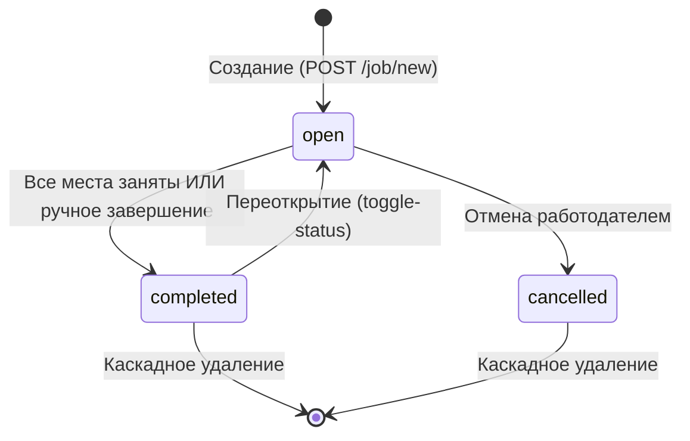
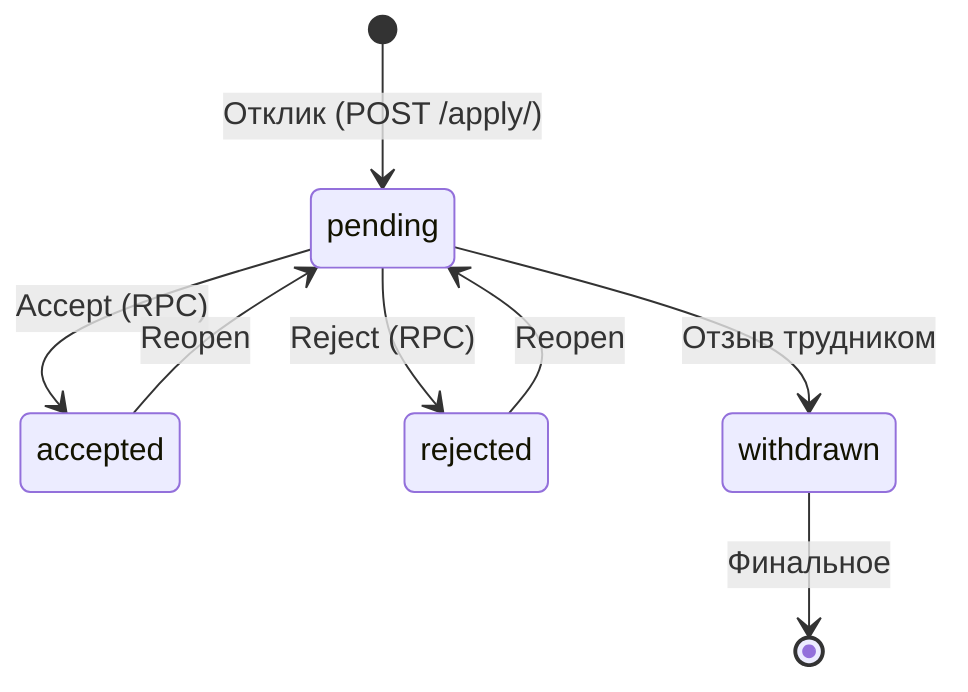

# CODE REVIEW CONTEXT — Сводка проекта «Трудник»

> **Этап 0 комплексного код-ревью**
> **Дата составления:** 2026-06-22
> **Источники:** ARCHITECTURE.md, BUSINESS_LOGIC.md, PROJECT_CONTEXT.md, SECURITY.md, API_REFERENCE.md, MIGRATION_PLAN.md (первые 500 строк)
> **Ветка:** `main` (монетизация отключена, `is_paid=True` всегда)

---

## 1. Общая архитектура

### 1.1. Компоненты системы

| Компонент | Технология | Назначение |
|-----------|-----------|------------|
| **WSGI-приложение** | Flask (Python 3.12+) | Основной backend: роутинг, бизнес-логика, рендеринг шаблонов |
| **ASGI-роутер** | FastAPI + uvicorn (`asgi.py`) | Единая точка входа: HTTP → Flask (WSGIMiddleware), WebSocket → FastAPI |
| **База данных** | Supabase (PostgreSQL 15 + PostgREST + GoTrue Auth) | Данные, аутентификация, REST API к БД, Storage |
| **Фоновые задачи** | Celery (worker + beat) | Отправка email, push-уведомлений, периодические задачи |
| **Брокер/Кэш/Pub-Sub** | Redis 7 | Брокер Celery, кэширование, Pub/Sub для WebSocket-уведомлений |
| **WebSocket-сервер** | FastAPI (в составе `asgi.py`) | Чат и live-уведомления в реальном времени |
| **Push-уведомления** | Web Push API (VAPID) + pywebpush | Браузерные push-уведомления через Service Worker |
| **Email** | SMTP (настраиваемый) | Email-уведомления через Celery-задачи |
| **Карты** | Яндекс.Карты JavaScript API | Геокодирование адресов, отображение карт |
| **Фронтенд** | Jinja2 + Tailwind CSS (CDN) + Vanilla JS | Серверный рендеринг, 30 шаблонов, PWA с Service Worker |
| **In-memory Mock Supabase** | Python dict + кастомная логика | Тестовый режим (`TESTING=True`), эмулирует REST API, Auth, RPC |
| **Контейнеризация** | Docker + docker-compose | Локальная разработка и деплой |
| **Хостинг** | Render.com (Docker) | Продакшн-деплой |

### 1.2. Flow запросов (от пользователя до БД и обратно)

**Основной REST-flow:**
```
Пользователь (браузер) → HTTP → ASGI Router (asgi.py)
  → Flask WSGIMiddleware → create_app()
    → Security Headers (CSP + HSTS + X-Frame-Options...)
    → CSRF-проверка (для мутирующих методов)
    → Blueprint (роутинг)
      → @login_required / @role_required (декораторы)
      → Service Layer (job_service, notification_service и др.)
        → supabase_request() (HTTP к PostgREST API Supabase)
          → Circuit Breaker (защита от каскадных отказов)
          → Supabase PostgREST → PostgreSQL
```

**RPC-flow (атомарные операции):**
```
Пользователь → Flask Blueprint → supabase_request(POST /rpc/function_name)
  → PostgreSQL функция (SECURITY DEFINER) → атомарное обновление
```

**WebSocket-flow (чат, live-уведомления):**
```
Пользователь ↔ WebSocket (FastAPI) ↔ Redis Pub/Sub
  ↑                                    ↑
  JWT-аутентификация                   publish из Flask/Celery
```

**Фоновые задачи:**
```
Flask Blueprint → apply_async(task) → Redis (брокер)
  → Celery Worker → SMTP / Web Push API
```

**Загрузка файлов:**
```
Пользователь → Flask Blueprint → Supabase Storage API → Supabase Storage Bucket
```

### 1.3. Модель данных

#### Активные таблицы (21)

| Таблица | Назначение | Ключевые связи |
|---------|------------|----------------|
| `profiles` | Профили пользователей | `id` (UUID, PK, связь с `auth.users`) |
| `jobs` | Задания | `employer_id` → `profiles.id` |
| `applications` | Отклики на задания | `job_id` → `jobs.id`, `worker_id` → `profiles.id` |
| `messages` | Сообщения в чатах | `application_id` → `applications.id`, `sender_id` → `profiles.id` |
| `notifications` | Уведомления | `user_id` → `profiles.id` |
| `ratings` | Оценки пользователей (UPSERT) | `rater_user_id`, `rated_user_id` → `profiles`, `job_id` → `jobs` |
| `favorites` | Избранное (пользователи) | `user_id`, `favorite_user_id` → `profiles` |
| `job_favorites` | Избранное (задания) | `user_id` → `profiles`, `job_id` → `jobs` |
| `blacklists` | Чёрный список | `user_id`, `blocked_user_id` → `profiles` |
| `invitations` | Приглашения трудников | `job_id` → `jobs`, `employer_id`, `worker_id` → `profiles` |
| `skills` | Справочник навыков | — |
| `religions` | Справочник религий | — |
| `user_skills` | Связь пользователь-навыки | `user_id` → `profiles`, `skill_id` → `skills` |
| `job_skills` | Связь задание-навыки | `job_id` → `jobs`, `skill_id` → `skills` |
| `job_photos` | Фото заданий | `job_id` → `jobs`, `url` (Supabase Storage) |
| `push_subscriptions` | Web Push подписки | `user_id` → `profiles` |
| `email_log` | Лог email-отправки | `user_id` → `profiles` |
| `employer_details` | Детали работодателя | `user_id` → `profiles` |
| `schema_migrations` | Версионирование миграций | — |

#### Таблицы монетизации (отключены, 7)

| Таблица | Назначение |
|---------|------------|
| `monetization_settings` | Настройки монетизации (ключ-значение) |
| `contact_payments` | Платежи за раскрытие контакта |
| `_archive_contact_payments` | Архив платежей |
| `job_payments` | Платежи за публикацию/продление |
| `tariff_settings` | Настройки тарифов |
| `receipts` | Чеки самозанятого |
| `hires` | История наймов |

#### RPC-процедуры (8)

| Процедура | Назначение | Атомарность |
|-----------|------------|-------------|
| `accept_application` | Принять отклик: обновить статус + инкремент `current_workers` | Да |
| `reject_application` | Отклонить отклик | Да |
| `apply_job_atomic` | Атомарный отклик с проверками | Да |
| `delete_job_cascade` | Каскадное удаление задания | Да |
| `delete_user_cascade` | Каскадное удаление пользователя | Да |
| `get_job_stats` | Статистика публикаций (админ) | Нет |
| `nearby_jobs` | Геопоиск заданий (PostGIS) | Нет |
| `exec_sql` | Выполнение SQL (только admin/service_role) | Нет |

#### CHECK-constraints

| Таблица | Ограничение |
|---------|-------------|
| `jobs` | `max_workers >= 1`, `current_workers >= 0`, `status IN ('open','completed','cancelled')` |
| `applications` | `status IN ('pending','accepted','rejected','withdrawn')` |
| `ratings` | `rating BETWEEN 1 AND 5` |
| `invitations` | `status IN ('pending','accepted','rejected')` |

---

## 2. Бизнес-логика

### 2.1. Пользовательские роли

| Роль | Описание | Ключевые возможности |
|------|----------|----------------------|
| **worker** | Трудник | Просмотр заданий, отклики, чат с работодателем, избранное, чёрный список, получение приглашений |
| **employer** | Работодатель | Создание/редактирование заданий, принятие/отклонение откликов, приглашение трудников, чат, верификация |
| **admin** | Администратор | Полный доступ: дашборд, управление пользователями и заданиями, верификация, справочники (навыки/религии) |

### 2.2. Жизненный цикл задания



- **Создание:** `status='open'`, `is_paid=True`, проверка стоп-слов, геокодирование адреса (Яндекс.Карты)
- **Автозавершение:** RPC `accept_application` переводит в `completed` при `current_workers >= max_workers`
- **Ручное переключение:** `POST /job/<id>/toggle-status` (владелец)

### 2.3. Жизненный цикл отклика (заявки)



**Проверки при отклике (последовательно):**
1. Дубликат (нельзя дважды)
2. Не своё задание
3. Чёрный список (не заблокирован работодателем)
4. Статус задания = `open`
5. Свободные места: `current_workers < max_workers`

### 2.4. Процесс подачи заявки и найма

1. Трудник находит задание (поиск с фильтрами: город, оплата, радиус, навыки, религия, FTS)
2. Откликается (`POST /apply/<job_id>`) → создаётся `applications` (status=pending)
3. Работодатель получает уведомление `application_received`
4. Работодатель принимает (`POST /api/applications/<id>/accept`) или отклоняет (reject)
5. При accept: RPC атомарно обновляет статус заявки + `current_workers`
6. При заполнении всех мест → задание автоматически переходит в `completed`
7. После accept открывается чат между работодателем и трудником
8. После завершения — возможность оценить друг друга (1-5 звёзд + комментарий)

### 2.5. Система рейтингов и отзывов

- **UPSERT-модель:** одна оценка от пользователя другому за одно задание (уникальность по `rater_user_id + rated_user_id + job_id`)
- **Процесс:** `POST /api/ratings` → запись в `ratings` → пересчёт среднего через `update_rating()`
- **Ограничения:** нельзя оценить себя, обязательно участие в задании, рейтинг 1-5
- **Отображение:** средний рейтинг в профиле (`profiles.rating`), список отзывов на `/ratings/user/<id>`

### 2.6. Монетизация (ОТКЛЮЧЕНА на main)

- Все задания публикуются с `is_paid=True` без реальной оплаты
- Таблицы монетизации существуют в БД, но не используются в бизнес-логике
- Функционал «раскрытия контакта за плату» неактивен
- В Roadmap (PROJECT_CONTEXT.md) указан Этап 5 — «Монетизация и финальные штрихи»

---

## 3. Ключевые endpoints (API)

### 3.1. Blueprint'ы и основные маршруты

| Blueprint | Файл | Кол-во маршрутов | Ключевые endpoints |
|-----------|------|------------------|-------------------|
| **auth** | [`app/blueprints/auth.py`](app/blueprints/auth.py) | 5 | `GET/POST /login`, `GET/POST /register`, `GET /logout` |
| **jobs** | [`app/blueprints/jobs.py`](app/blueprints/jobs.py) | 11 | `GET /` (лента), `GET /workers`, `GET/POST /job/new`, `GET /jobs/<id>`, `GET/POST /job/<id>/edit`, `GET /my-jobs`, `GET /invitations`, `POST /job/<id>/toggle-status`, `POST /job/<id>/duplicate` |
| **jobs_api** | [`app/blueprints/jobs_api.py`](app/blueprints/jobs_api.py) | 6 | `GET /api/skills`, `GET /api/religions`, `GET /api/search/jobs`, `GET /api/search/workers`, `POST /api/invite`, `GET /api/invitations/<id>` |
| **applications** | [`app/blueprints/applications.py`](app/blueprints/applications.py) | 5 | `POST /apply/<job_id>`, `POST /apply-selected`, `GET /my-applications`, `POST /api/applications/batch`, `POST /cancel-application/<id>` |
| **app (API)** | [`app/__init__.py`](app/__init__.py:273) | 3 | `POST /api/applications/<id>/accept`, `/reject`, `/reopen` |
| **admin** | [`app/blueprints/admin.py`](app/blueprints/admin.py) | 11 | `GET /admin`, `GET/POST /admin/users`, `GET/POST /admin/jobs`, `GET/POST /admin/dictionaries`, `POST /admin/verify-employer/<id>`, `POST /admin/delete-user/<id>`, `GET /api/health` |
| **profile** | [`app/blueprints/profile.py`](app/blueprints/profile.py) | 6 | `GET /profile`, `GET/POST /profile/update`, `POST /verify-employer`, `POST /profile/delete-account` |
| **chat** | [`app/blueprints/chat.py`](app/blueprints/chat.py) | 6 | `GET /chats`, `GET /chat/<application_id>`, `GET /chat/new/<worker_id>`, `POST /api/send_message`, `GET /api/messages/poll`, `POST /api/delete-chats` |
| **employers** | [`app/blueprints/employers.py`](app/blueprints/employers.py) | 4 | `GET /employers`, `GET /employers/<id>`, `POST/DELETE /api/employers/favorite` |
| **favorites** | [`app/blueprints/favorites.py`](app/blueprints/favorites.py) | 4 | `GET /favorites`, `POST /favorite/<type>/<id>`, `POST /unfavorite/<type>/<id>`, `GET /api/favorites/status` |
| **notifications** | [`app/blueprints/notifications.py`](app/blueprints/notifications.py) | 7 | `GET /notifications`, `POST /api/notifications/read`, `/read-all`, `GET/POST /api/notifications/settings`, `POST /api/push/subscribe`, `/unsubscribe` |
| **ratings** | [`app/blueprints/ratings.py`](app/blueprints/ratings.py) | 3 | `POST /api/ratings`, `GET /ratings/user/<id>`, `GET /jobs/<id>/rate-workers` |
| **blacklist** | [`app/blueprints/blacklist.py`](app/blueprints/blacklist.py) | 3 | `GET /blacklist`, `POST /blacklist/<id>`, `POST /unblock/<id>` |
| **seo** | [`app/blueprints/seo.py`](app/blueprints/seo.py) | 2 | `GET /robots.txt`, `GET /sitemap.xml` |

**Прочие маршруты (в [`app/__init__.py`](app/__init__.py)):**
- `GET /sw.js` — Service Worker
- `GET /offline` — офлайн-страница
- `GET /.well-known/assetlinks.json` — TWA верификация
- `GET /health` — health check

**Всего: ~65 маршрутов в 13 blueprint'ах + 3 на объекте app + 4 прочих.**

### 3.2. Middleware и декораторы

| Механизм | Где | Назначение |
|----------|-----|------------|
| `@login_required` | [`app/decorators.py:14`](app/decorators.py) | Проверка наличия JWT в сессии, автообновление через `refresh_access_token()` |
| `@role_required(role)` | [`app/decorators.py:52`](app/decorators.py) | Проверка роли (`worker`/`employer`/`admin`) |
| `@rate_limit` | [`app/utils.py:575`](app/utils.py) | Ограничение: 10 POST/60 сек с IP (in-memory) |
| CSRF-фильтр | [`app/__init__.py:63`](app/__init__.py) (before_request) | Глобальная проверка `X-CSRF-Token` / `_csrf_token` для всех мутаций |
| CSP + Security Headers | [`app/__init__.py:42`](app/__init__.py) (after_request) | Content-Security-Policy с nonce, HSTS, X-Frame-Options, etc. |
| Circuit Breaker | [`app/utils.py:29`](app/utils.py) | 2 экземпляра: `_cb_supabase` + `_cb_admin`, порог 5 ошибок → разрыв 30 сек |
| `sanitize_postgrest()` | [`app/utils.py:619`](app/utils.py) | Очистка параметров PostgREST от инъекций |
| RLS (Supabase) | Миграции 001-002 | Row Level Security на уровне БД |

---

## 4. Инфраструктура

### 4.1. Деплой

**Текущий продакшн — Render.com:**
- Тип: Docker Web Service
- Конфигурация: [`render.yaml`](render.yaml)
- ASGI-сервер: uvicorn через [`asgi.py`](asgi.py)
- Автодеплой: при `git push` в `main`

**Планируемая миграция — Amvera (см. [`docs/MIGRATION_PLAN.md`](docs/MIGRATION_PLAN.md)):**
- Причина: 152-ФЗ, ЦОД в РФ, стоимость (~1 800 ₽/мес)
- Уже есть: `.env.amvera`, домен `trudnik-hyperstls.amvera.io`, Amvera-совместимый Dockerfile
- План «Б»: Яндекс Облако
- План «В»: Beget (только при критичности 152-ФЗ)

**Локальная разработка — Docker Compose:**
- Сервисы: `redis`, `websocket`, `celery_worker`, `celery_beat`
- Основное приложение запускается отдельно через `flask run`

### 4.2. Миграции

- **Формат:** пронумерованные SQL-файлы (`001_setup_rls.sql` — `058_add_native_auth.sql`)
- **Количество:** 58 миграций
- **Применение:** через [`scripts/apply_migrations.py`](scripts/apply_migrations.py) или [`scripts/apply_new_migrations.py`](scripts/apply_new_migrations.py)
- **Сводный файл:** [`migrations/run_all_safe.sql`](migrations/run_all_safe.sql) (~78K символов)
- **Версионирование:** таблица `schema_migrations`
- **Ключевые группы:**
  - 001–002: RLS-политики
  - 003–015: Базовая схема и безопасность
  - 016–021: Исправление предупреждений Supabase linter
  - 022–027: Монетизация, смены, чат
  - 028–038: Синхронизация с кодом, атомарные операции
  - 039–048: RPC-процедуры, каскадное удаление
  - 049–058: Выравнивание с облачной схемой, новые таблицы, типы, RPC

### 4.3. CI/CD

- **GitHub Actions:** директория `.github/` присутствует (детали не раскрыты в документации)
- **Render:** автоматический деплой при push в `main`
- **Amvera (план):** push-to-deploy (`git push amvera master`)
- **Тестирование:** PyTest + Playwright + Selenium, in-memory Mock Supabase

---

## 5. Известные проблемы и технический долг

### 5.1. Проблемы и ограничения, выявленные из документации

| Проблема | Источник | Описание |
|----------|----------|----------|
| **Монетизация отключена** | BUSINESS_LOGIC.md, ARCHITECTURE.md | 7 таблиц монетизации существуют, но не используются. `is_paid=True` всегда. Функционал комиссии и платежей не реализован |
| **Миграция с Supabase на Amvera** | MIGRATION_PLAN.md | Запланирована, но не выполнена. Требует полной замены Auth (GoTrue → Flask-Login), PostgREST → self-hosted, Storage → S3 |
| **API-роуты вынесены на объект `app`** | API_REFERENCE.md, app/__init__.py:273 | Маршруты accept/reject/reopen зарегистрированы напрямую на `app` из-за проблем с blueprint-роутингом на Render |
| **Отсутствие realtime БД** | ARCHITECTURE.md | Realtime-уведомления только через WebSocket/Redis Pub-Sub. Supabase Realtime (подписки на изменения таблиц) не используется |
| **In-memory Rate Limiting** | SECURITY.md | Не подходит для multi-process/multi-instance деплоя. При масштабировании нужен Redis-based лимитер |
| **In-memory Mock Supabase** | ARCHITECTURE.md, BUSINESS_LOGIC.md | Полноценный mock эмулирует REST API, Auth, RPC — значительный объём кода в `utils.py` (~66K символов) |
| **Дублирование в PROJECT_CONTEXT.md** | PROJECT_CONTEXT.md | Упоминается `config.py` в корне (уже удалён), `shifts.py` blueprint (уже удалён), устаревшая структура |
| **Стоп-слова** | BUSINESS_LOGIC.md | Проверка текста заданий на слова трудовых отношений (ст. 15 ТК РФ) — потенциально fragile строковый фильтр |
| **Отсутствие подтверждения email** | SECURITY.md | При регистрации email не верифицируется (нет email verification flow) |
| **Сессионные токены Supabase** | SECURITY.md | JWT-токены хранятся в серверной сессии Flask. При переходе на Amvera потребуется полная замена auth |

### 5.2. Расхождения между документацией и структурой файлов

| Расхождение | Документация | Реальность |
|-------------|-------------|------------|
| **Количество blueprint'ов** | PROJECT_CONTEXT.md: «10 Blueprints» | ARCHITECTURE.md и код: **13 Blueprint'ов** + маршруты на app |
| **Упомянутый `shifts.py`** | PROJECT_CONTEXT.md: `blueprints/shifts.py` | Удалён, заменён на `applications.py` + RPC (миграция 027) |
| **`config.py` в корне** | PROJECT_CONTEXT.md: «будет удалён» | Фактически удалён, конфигурация только в `app/config.py` |
| **Версия Python** | PROJECT_CONTEXT.md: «Python 3.14» | ARCHITECTURE.md: «Python 3» (Dockerfile использует `python:3.12-slim`) |
| **JS-файлы** | API_REFERENCE.md ссылается на `search.js`, `chat.js`, `notifications.js`, `invite.js`, `ratings.js`, `admin.js`, `employers.js` | В `static/js/` только: `applications.js`, `favorites.js`, `notifications-init.js`, `notifications-ws.js`, `push-notifications.js` |
| **Supabase Storage** | Используется для аватаров и фото | Упомянут бакет `job-photos`, но бакет для аватаров не специфицирован |
| **GitHub Actions** | Упомянута директория `.github/` | Не исследована в рамках этого этапа, содержимое неизвестно |

### 5.3. TODO / Roadmap (из PROJECT_CONTEXT.md)

Проект имеет 5 этапов roadmap, из которых Этап 0 (рефакторинг) выполнен. Остаются:

- **Этап 1:** Профили, навыки, верификация (портфолио, список профессий)
- **Этап 2:** Улучшение откликов и карточек трудников (массовые операции, приглашения)
- **Этап 3:** Коммуникация и чаты (обмен файлами, автообновление)
- **Этап 4:** Рейтинг, отзывы и избранное
- **Этап 5:** Монетизация и финальные штрихи (комиссия, уведомления)

---

## 6. Карта файлов для ревью

### 6.1. Конфигурация и точки входа

| Файл | Назначение |
|------|------------|
| [`app.py`](app.py) | Точка входа WSGI: `from app import app` |
| [`asgi.py`](asgi.py) | Unified ASGI: WebSocket (FastAPI) + HTTP (Flask WSGIMiddleware) |
| [`app/__init__.py`](app/__init__.py) | Фабрика `create_app()`: регистрация blueprint'ов, security headers, CSRF, контекст-процессоры, API-роуты accept/reject/reopen |
| [`app/config.py`](app/config.py) | Класс `Config`: все переменные окружения, бизнес-константы, лимиты |
| [`.env.example`](.env.example) | Шаблон переменных окружения |
| [`Dockerfile`](Dockerfile) | Docker-образ (Python 3.12 + uvicorn) |
| [`docker-compose.yml`](docker-compose.yml) | Локальные сервисы: redis, websocket, celery_worker, celery_beat |
| [`render.yaml`](render.yaml) | Деплой на Render.com |
| [`requirements.txt`](requirements.txt) | Продакшн-зависимости |
| [`requirements-dev.txt`](requirements-dev.txt) | Dev-зависимости |
| [`tailwind.config.js`](tailwind.config.js) | Tailwind CSS конфигурация |
| [`twa-config.json`](twa-config.json) | Trusted Web Activity для Google Play |
| [`pytest.ini`](pytest.ini) | PyTest конфигурация |
| [`README.md`](README.md) | Описание проекта |
| [`VERSION`](VERSION) | Версия приложения |

### 6.2. Blueprint'ы (app/blueprints/)

| Файл | Строк | Назначение |
|------|-------|------------|
| [`auth.py`](app/blueprints/auth.py) | ~11K | `/login`, `/register`, `/logout` — аутентификация через Supabase GoTrue |
| [`jobs.py`](app/blueprints/jobs.py) | ~40K | Главная, `/workers`, CRUD заданий, фильтрация, поиск, дублирование, избранное заданий |
| [`jobs_api.py`](app/blueprints/jobs_api.py) | ~9K | AJAX-поиск заданий/трудников, справочники навыков/религий, приглашения |
| [`applications.py`](app/blueprints/applications.py) | ~28K | Отклики, массовые отклики, отмена, массовые действия (batch accept/reject) |
| [`admin.py`](app/blueprints/admin.py) | ~23K | Админ-панель: дашборд, пользователи, задания, верификация, справочники |
| [`profile.py`](app/blueprints/profile.py) | ~9K | Профиль, редактирование, верификация, удаление аккаунта |
| [`chat.py`](app/blueprints/chat.py) | ~10K | Чаты, отправка сообщений, long-polling, удаление чатов |
| [`employers.py`](app/blueprints/employers.py) | ~10K | Список работодателей, детали, избранное |
| [`favorites.py`](app/blueprints/favorites.py) | ~6K | Избранное: задания и работодатели, статусы |
| [`notifications.py`](app/blueprints/notifications.py) | ~9K | Уведомления, настройки, push-подписки/отписки |
| [`ratings.py`](app/blueprints/ratings.py) | ~14K | Оценки (UPSERT), список отзывов, форма оценки |
| [`blacklist.py`](app/blueprints/blacklist.py) | ~3K | Чёрный список: блокировка/разблокировка |
| [`seo.py`](app/blueprints/seo.py) | ~1K | `robots.txt`, `sitemap.xml` |

### 6.3. Сервисы (app/services/)

| Файл | Строк | Назначение |
|------|-------|------------|
| [`job_service.py`](app/services/job_service.py) | ~14K | Поиск заданий/трудников, построение PostgREST-запросов, проверка видимости |
| [`notification_service.py`](app/services/notification_service.py) | ~10K | CRUD уведомлений (14 типов), отметки прочитанным, настройки |
| [`email_service.py`](app/services/email_service.py) | ~10K | Отправка email через SMTP, шаблоны, дневной лимит |
| [`push_service.py`](app/services/push_service.py) | ~14K | Web Push уведомления (VAPID), взаимодействие с `pywebpush` |
| [`redis_publisher.py`](app/services/redis_publisher.py) | ~4K | Публикация сообщений чата и уведомлений в Redis Pub/Sub |

### 6.4. Задачи Celery (app/tasks/)

| Файл | Строк | Назначение |
|------|-------|------------|
| [`celery_app.py`](app/tasks/celery_app.py) | ~3K | Инициализация Celery: `make_celery()`, конфигурация Redis-брокера |
| [`email_tasks.py`](app/tasks/email_tasks.py) | ~12K | Фоновые задачи: `send_email`, `send_batch_emails`, `send_notification_email`, `send_chat_message_email` |
| [`push_tasks.py`](app/tasks/push_tasks.py) | ~3K | Фоновые задачи: `send_push_notification`, `send_batch_push` |

### 6.5. Ядро (app/)

| Файл | Строк | Назначение |
|------|-------|------------|
| [`utils.py`](app/utils.py) | ~66K | `supabase_request()`, `supabase_admin_request()`, `supabase_rpc()`, CircuitBreaker, `rate_limit` декоратор, `sanitize_postgrest()`, `refresh_access_token()`, `upload_to_storage()`, in-memory Mock Supabase, хелперы |
| [`decorators.py`](app/decorators.py) | ~6K | `@login_required`, `@role_required` |

### 6.6. Шаблоны (templates/)

| Файл | Назначение |
|------|------------|
| [`base.html`](templates/base.html) | Базовый layout: навигация, заголовки, скрипты, PWA, CSP nonce |
| [`index.html`](templates/index.html) | Главная страница: список заданий с фильтрами |
| [`workers.html`](templates/workers.html) | Список трудников с фильтрацией |
| [`employers.html`](templates/employers.html) | Список работодателей |
| [`employer_detail.html`](templates/employer_detail.html) | Профиль работодателя |
| [`job_detail.html`](templates/job_detail.html) | Детальная страница задания |
| [`job_new.html`](templates/job_new.html) | Форма создания/редактирования задания |
| [`my_jobs.html`](templates/my_jobs.html) | Мои задания (работодатель) |
| [`my_applications.html`](templates/my_applications.html) | Мои отклики (трудник) |
| [`login.html`](templates/login.html) | Форма входа |
| [`register.html`](templates/register.html) | Форма регистрации |
| [`profile.html`](templates/profile.html) | Профиль (работодатель) |
| [`profile_worker.html`](templates/profile_worker.html) | Профиль (трудник) |
| [`verify_employer.html`](templates/verify_employer.html) | Запрос верификации |
| [`chat.html`](templates/chat.html) | Чат с собеседником |
| [`chats_list.html`](templates/chats_list.html) | Список чатов |
| [`favorites.html`](templates/favorites.html) | Избранное |
| [`notifications.html`](templates/notifications.html) | Список уведомлений |
| [`notification_settings.html`](templates/notification_settings.html) | Настройки уведомлений |
| [`invitations.html`](templates/invitations.html) | Приглашения |
| [`blacklist.html`](templates/blacklist.html) | Чёрный список |
| [`admin.html`](templates/admin.html) | Админ-панель |
| [`rate_workers.html`](templates/rate_workers.html) | Оценка трудников |
| [`user_ratings.html`](templates/user_ratings.html) | Рейтинги пользователя |
| [`error.html`](templates/error.html) | Страница ошибки |
| [`offline.html`](templates/offline.html) | Офлайн-страница (PWA) |
| [`sitemap.xml`](templates/sitemap.xml) | Карта сайта |
| [`_filter_skills.html`](templates/_filter_skills.html) | Include: фильтр навыков |
| [`_icons.html`](templates/_icons.html) | Include: SVG-иконки |
| [`_sort_panel.html`](templates/_sort_panel.html) | Include: панель сортировки |

### 6.7. Email-шаблоны (app/templates/email/)

| Файл | Назначение |
|------|------------|
| [`base_email.html`](app/templates/email/base_email.html) | Базовый HTML-шаблон письма |
| [`base_email.txt`](app/templates/email/base_email.txt) | Базовый текстовый шаблон |
| [`chat_message.html`](app/templates/email/chat_message.html) | Уведомление о новом сообщении |
| [`notification.html`](app/templates/email/notification.html) | HTML-уведомление |
| [`notification.txt`](app/templates/email/notification.txt) | Текстовое уведомление |

### 6.8. JavaScript (static/js/)

| Файл | Назначение |
|------|------------|
| [`applications.js`](static/js/applications.js) | Управление откликами: accept/reject/reopen, batch-операции |
| [`favorites.js`](static/js/favorites.js) | Управление избранным: добавление/удаление, проверка статусов |
| [`notifications-init.js`](static/js/notifications-init.js) | Инициализация WebSocket и push-уведомлений |
| [`notifications-ws.js`](static/js/notifications-ws.js) | WebSocket-клиент для live-уведомлений |
| [`push-notifications.js`](static/js/push-notifications.js) | Подписка/отписка Web Push, обработка push-событий |

### 6.9. PWA и статика (static/)

| Файл | Назначение |
|------|------------|
| [`sw.js`](static/sw.js) | Service Worker: кэширование, офлайн-режим, push-уведомления |
| [`manifest.json`](static/manifest.json) | Web App Manifest |
| [`default-avatar.png`](static/default-avatar.png) | Аватар по умолчанию |
| `icons/icon-*.png` | Иконки PWA (48x48 — 512x512) |
| `css/tailwind.min.css` | Скомпилированный Tailwind CSS |
| `.well-known/` | Digital Asset Links (TWA) |

### 6.10. Миграции (migrations/)

| Группа | Файлы | Назначение |
|--------|-------|------------|
| 001–002 | `setup_rls.sql`, `apply_rls_policies.sql` | Row Level Security |
| 003–015 | `003`–`015` | Базовая схема: max_workers, monetization, skills, religions, search indexes, invitations, contact, RLS все таблицы |
| 016–021 | `016`–`021` | Исправление предупреждений Supabase linter, performance indexes |
| 022–027 | `022`–`027` | Монетизация v2, дроп shifts, миграция чата |
| 028–038 | `028`–`038` | Синхронизация с кодом, schema gaps, упрощение статусов, RLS fixes |
| 039–048 | `039`–`048` | Атомарные операции, schema versioning, FK, push_subscriptions, email_log, RPC |
| 049–058 | `049`–`058` | Выравнивание с облачной схемой: типы, таблицы, структуры, nearby_jobs RPC, native auth |
| — | [`run_all_safe.sql`](migrations/run_all_safe.sql) | Сводный файл всех миграций |

### 6.11. Скрипты (scripts/)

| Файл | Назначение |
|------|------------|
| [`apply_migrations.py`](scripts/apply_migrations.py) | Применение миграций к Supabase |
| [`apply_new_migrations.py`](scripts/apply_new_migrations.py) | Применение новых миграций |
| [`check_schema.py`](scripts/check_schema.py) | Проверка схемы БД |
| [`dump_supabase_schema.py`](scripts/dump_supabase_schema.py) | Экспорт схемы Supabase |
| [`preseed_test_data.py`](scripts/preseed_test_data.py) | Предзаполнение тестовых данных |
| [`cleanup_test_data.py`](scripts/cleanup_test_data.py) | Очистка тестовых данных |
| [`smoke_test_prod.py`](scripts/smoke_test_prod.py) | Дымовое тестирование продакшна |
| [`test_buttons.py`](scripts/test_buttons.py) | Тестирование кнопок UI |
| [`create_admin_user.sql`](scripts/create_admin_user.sql) | SQL для создания админа |
| [`generate_jwt_secret.py`](scripts/generate_jwt_secret.py) | Генерация JWT-секрета |
| [`generate_icons.py`](scripts/generate_icons.py) | Генерация PWA-иконок |
| [`generate_twa_ci.js`](scripts/generate_twa_ci.js) | Генерация TWA конфигурации |
| [`install_hooks.py`](scripts/install_hooks.py) | Установка git-хуков |
| [`update_version.py`](scripts/update_version.py) | Обновление версии |
| `_apply_all_direct.py`, `_create_base_tables.py`, `_create_email_log.py`, `_create_missing_tables.py`, `_init_exec_sql.py` | Вспомогательные скрипты (с префиксом `_`) |

### 6.12. Документация (docs/)

| Файл | Назначение |
|------|------------|
| [`ARCHITECTURE.md`](docs/ARCHITECTURE.md) | Архитектура приложения |
| [`BUSINESS_LOGIC.md`](docs/BUSINESS_LOGIC.md) | Бизнес-логика, модель данных, состояния |
| [`API_REFERENCE.md`](docs/API_REFERENCE.md) | Полный справочник API-эндпоинтов |
| [`SECURITY.md`](docs/SECURITY.md) | Безопасность: auth, CSRF, CSP, Rate Limiting, Circuit Breaker |
| [`PROJECT_CONTEXT.md`](docs/PROJECT_CONTEXT.md) | Контекст проекта, roadmap |
| [`MIGRATION_PLAN.md`](docs/MIGRATION_PLAN.md) | План миграции Supabase → Amvera |
| [`FRONTEND.md`](docs/FRONTEND.md) | Фронтенд: страницы, JS, UI, адаптивность |
| [`BUTTON_REGISTRY.md`](docs/BUTTON_REGISTRY.md) | Реестр всех кнопок и UI-элементов |
| [`TEST_CHECKLIST.md`](docs/TEST_CHECKLIST.md) | Тестовые сценарии и чеклисты |
| [`TESTING_BLUEPRINT.md`](docs/TESTING_BLUEPRINT.md) | Индексный навигационный хаб документации |
| [`E2E_SCENARIOS.md`](docs/E2E_SCENARIOS.md) | End-to-end сценарии по ролям |
| [`UX_PERFORMANCE_AUDIT.md`](docs/UX_PERFORMANCE_AUDIT.md) | Аудит UX/производительности |
| [`notifications-v2.md`](docs/notifications-v2.md) | Спецификация уведомлений v2 |
| [`TRACEABILITY_MATRIX.md`](docs/TRACEABILITY_MATRIX.md) | Матрица трассировки требований |
| [`GITHUB_SECRETS_SETUP.md`](docs/GITHUB_SECRETS_SETUP.md) | Настройка GitHub Secrets |
| [`TEST_BUTTON_REGISTRY.md`](docs/TEST_BUTTON_REGISTRY.md) | Тестовый реестр кнопок |

### 6.13. Планы (plans/)

| Файл | Назначение |
|------|------------|
| [`amvera-migration-step-by-step.md`](plans/amvera-migration-step-by-step.md) | Пошаговый план миграции на Amvera |
| [`cloud-schema-alignment-plan.md`](plans/cloud-schema-alignment-plan.md) | План выравнивания с облачной схемой |
| [`deploy-check-plan.md`](plans/deploy-check-plan.md) | План проверки деплоя |
| [`google-play-plan.md`](plans/google-play-plan.md) | План публикации в Google Play |
| [`pwa-redesign-plan.md`](plans/pwa-redesign-plan.md) | План редизайна PWA |
| [`secrets-remediation-plan.md`](plans/secrets-remediation-plan.md) | План исправления секретов |

### 6.14. Конфигурация Supabase CLI (supabase/)

| Файл | Назначение |
|------|------------|
| [`config.toml`](supabase/config.toml) | Конфигурация локального Supabase |
| `snippets/` | SQL-сниппеты |

---

> **Примечание:** Данный документ является сводкой Этапа 0 код-ревью. Рекомендации по рефакторингу и исправлению проблем будут сформированы на следующих этапах.
