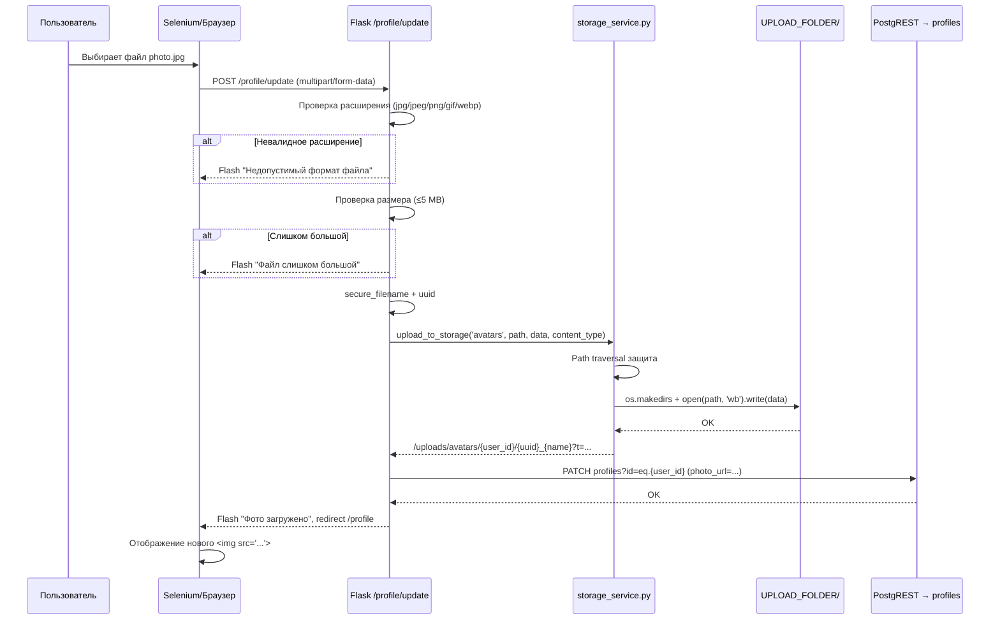

# План тестирования загрузки фото на аватарку — проект Trudnik

> **Дата:** 2026-06-25  
> **Цель:** Составить исчерпывающий план Selenium-тестов для загрузки/удаления аватара пользователя

---

## 1. Роли пользователей

### 1.1. Прикладные роли (хранятся в `profiles.role`)

| Роль | Идентификатор | Описание |
|------|----------------|-----------|
| **Трудник (Worker)** | `worker` | Исполнитель заданий, может откликаться на задания |
| **Работодатель (Employer)** | `employer` | Создаёт задания, нанимает трудников |
| **Администратор (Admin)** | `admin` | Полный доступ: админ-панель, управление пользователями, справочниками |

**Источники:**
- Регистрация: [`app/blueprints/auth.py:151`](app/blueprints/auth.py:151) — `if role not in ('worker', 'employer')`
- Декоратор админа: [`app/decorators.py:112`](app/decorators.py:112) — `if session.get('role') != 'admin'`
- Декоратор работодателя: [`app/decorators.py:127`](app/decorators.py:127)
- Декоратор трудника: [`app/decorators.py:142`](app/decorators.py:142)
- Ролевая проверка (generic): [`app/decorators.py:54-87`](app/decorators.py:54) — `role_required(role: str)` где role = 'worker', 'employer', 'admin'

### 1.2. PostgreSQL-роли (для PostgREST RLS)

| Роль | Назначение |
|------|------------|
| `anon` | Неаутентифицированный доступ (только чтение публичных данных) |
| `authenticated` | Аутентифицированный пользователь (worker/employer через JWT) |
| `service_role` | Служебная роль с BYPASSRLS для админских операций |

**Источник:** [`migrations/067_bootstrap_amvera.sql:46-62`](migrations/067_bootstrap_amvera.sql:46)

### 1.3. Тестовые пользователи (из разных файлов)

| Email | Пароль | Роль | Где используется |
|-------|--------|------|-------------------|
| `admin@test.ru` | `Step@1986` / `test` | admin | [`test_auth_admin.py:38`](test_auth_admin.py:38), [`scripts/set_admin_role.sql`](scripts/set_admin_role.sql), [`migrations/067_bootstrap_amvera.sql:2317`](migrations/067_bootstrap_amvera.sql:2317) |
| `org@test.ru` | `Step@1986` | employer | [`tests/test_selenium_browser.py:28`](tests/test_selenium_browser.py:28), [`tests/conftest_playwright.py:24`](tests/conftest_playwright.py:24) |
| `trud@test.ru` | `Step@1986` | worker | [`tests/conftest_playwright.py:26`](tests/conftest_playwright.py:26), [`tests/setup_test_users.py:15`](tests/setup_test_users.py:15) |
| `trud3@test.ru` | `Step@1986` | worker | [`tests/test_selenium_browser.py:29`](tests/test_selenium_browser.py:29) |

---

## 2. Механизм загрузки аватара

### 2.1. Эндпоинты

| Действие | Метод | URL | Обработчик |
|----------|-------|-----|------------|
| Страница профиля | GET | `/profile` | [`profile_bp.route('/profile')`](app/blueprints/profile.py:19) |
| Обновление профиля (с фото) | POST | `/profile/update` | [`update_profile()`](app/blueprints/profile.py:48) |
| Удаление фото | POST | `/profile/delete-photo` | [`delete_photo()`](app/blueprints/profile.py:127) |
| Отдача загруженных файлов | GET | `/uploads/<path:filename>` | [`uploaded_file()`](app/__init__.py:394) |

### 2.2. Процесс загрузки (детально)

**Файл:** [`app/blueprints/profile.py:93-115`](app/blueprints/profile.py:93)

1. Фото берётся из `request.files.get('photo')` (поле формы `name="photo"`)
2. **Валидация расширения:** только `jpg, jpeg, png, gif, webp` (строка 15-16, 96-99)
3. **Валидация размера:** максимум `5 MB` (строка 16, 102-105) — [`Config.MAX_PHOTO_SIZE_MB`](app/config.py:59)
4. **Безопасное имя файла:** `{user_id}/{uuid4().hex}_{secure_filename}` (строка 108-109)
5. **Сохранение:** [`upload_to_storage('avatars', file_path, photo_data, content_type)`](app/services/storage_service.py:70) — функция в [`app/services/storage_service.py`](app/services/storage_service.py:70-121)
   - Файл сохраняется локально в `UPLOAD_FOLDER/avatars/{user_id}/{uuid}_{filename}`
   - URL: `/uploads/avatars/{user_id}/{uuid}_{filename}?t={timestamp}`
6. **Обновление БД:** PATCH `profiles?id=eq.{user_id}` с полем `photo_url` (строка 112, 117-118)

### 2.3. Дополнительная проверка MIME (storage_service)

**Файл:** [`app/services/storage_service.py`](app/services/storage_service.py)

- [`upload_photo()`](app/services/storage_service.py:124) — отдельная функция с валидацией MIME по сигнатурам (magic bytes): JPEG, PNG, GIF, WebP, BMP (строка 18-24)
- [`_detect_mime()`](app/services/storage_service.py:44) — пробует python-magic, затем fallback на [`_check_mime_by_signature()`](app/services/storage_service.py:36)
- [`upload_to_storage()`](app/services/storage_service.py:70) — основная функция сохранения с path-traversal защитой (строка 60-67)
- Максимальный размер: `MAX_UPLOAD_SIZE = Config.MAX_PHOTO_SIZE_MB * 1024 * 1024` = 5 MB (строка 15)

### 2.4. Процесс удаления фото

**Файл:** [`app/blueprints/profile.py:127-155`](app/blueprints/profile.py:127)

1. Получает старый `photo_url` из БД (строка 132-137)
2. PATCH `profiles?id=eq.{user_id}` → `photo_url = None` (строка 139)
3. Вызывает [`delete_from_storage()`](app/services/storage_service.py:161) для удаления файла с диска (строка 142-153)
4. Извлекает bucket и file_path из URL: `/uploads/avatars/...` → `avatars/...` (строка 145-152)

### 2.5. Хранение файлов

**Файл:** [`app/__init__.py:394-398`](app/__init__.py:394)

- Файлы хранятся локально в `UPLOAD_FOLDER` (по умолчанию `./uploads/`)
- Отдаются через `send_from_directory(upload_folder, filename)` (строка 398)
- Настройки: [`app/config.py:60`](app/config.py:60) — `UPLOAD_FOLDER`

---

## 3. Существующие тесты

### 3.1. Структура тестов

```
tests/                          # pytest + unittest
├── conftest.py                 # Фикстуры (Flask client, сессии, моки)
├── conftest_playwright.py      # Playwright фикстуры (browser, login)
├── test_selenium_browser.py    # Selenium E2E (658 строк)
├── test_selenium_v2.py         # Selenium v2 (кросс-браузерный)
├── test_login_browser.py       # Playwright — тесты логина
├── test_favorites_browser.py   # Playwright — тесты избранного
├── test_buttons_browser.py     # Playwright — тесты кнопок
├── test_e2e_frontend.py        # Playwright — фронтенд E2E
├── test_e2e_multicontext.py    # Playwright — мульти-контекст
├── test_admin_browser.py       # Playwright — админка
├── test_api.py                 # API-тесты (HTTP)
├── test_auth.py                # Тесты аутентификации
├── test_job_lifecycle*.py      # Жизненный цикл заданий
├── test_security.py            # Тесты безопасности
├── test_rls.py                 # RLS-тесты
├── setup_test_users.py         # Скрипт создания тестовых пользователей
└── ...

tests_e2e/                      # Playwright e2e тесты с маркером @pytest.mark.e2e
├── conftest.py
├── test_smoke.py
├── test_e2e_scenarios.py
├── test_button_registry.py
├── test_admin_pages.py
├── test_employer_pages.py
├── test_worker_pages.py
├── test_filters.py
├── test_notifications.py
└── ...
```

### 3.2. Ключевые особенности организации тестов

- **pytest.ini:** [`pytest.ini`](pytest.ini) — `testpaths = tests tests_e2e`, маркеры: `slow`, `integration`, `e2e`, `a11y`
- **conftest.py:** [`tests/conftest.py`](tests/conftest.py) — мокает PostgREST/Redis/Supabase ДО импорта приложения, создаёт `app_client`, сессии для трёх ролей
- **conftest_playwright.py:** [`tests/conftest_playwright.py`](tests/conftest_playwright.py) — Playwright фикстуры: `employer_page`, `worker_page`, `browser_contexts`, `login_as()`, `extract_csrf_token()`
- **TESTS_NEW_ARCH.md:** [`TESTS_NEW_ARCH.md`](TESTS_NEW_ARCH.md) — стратегия 7-слойного тестирования (Backend, Security, Frontend, Infrastructure, E2E, Smoke, Edge Cases)

### 3.3. Есть ли тесты на загрузку аватара?

**НЕТ.** Ни в одном из существующих тестовых файлов нет тестов на загрузку/удаление фото аватара. В Selenium-тестах ([`test_selenium_browser.py`](tests/test_selenium_browser.py)) проверяется только наличие полей профиля (full_name, phone, contact, bio), но не загрузка файлов.

---

## 4. Аутентификация в тестах

### 4.1. Selenium (test_selenium_browser.py)

```python
# Файл: tests/test_selenium_browser.py:27-29
BASE = os.environ.get("TEST_BASE_URL", "https://trudnik.onrender.com")
E_EMAIL, E_PASS = "org@test.ru", "Step@1986"
W_EMAIL, W_PASS = "trud3@test.ru", "Step@1986"
```

**Логин:** [`tests/test_selenium_browser.py:106-115`](tests/test_selenium_browser.py:106)
```python
def login(driver, email, pw, role):
    nav(driver, "%s/login" % BASE)
    find(driver, By.NAME, "email").send_keys(email)
    find(driver, By.NAME, "password").send_keys(pw)
    find(driver, By.CSS_SELECTOR, "button[type='submit']").click()
    # Проверка: если поле email всё ещё видно — логин не удался
```

### 4.2. Playwright (conftest_playwright.py)

```python
# Файл: tests/conftest_playwright.py:23-27
BASE_URL = os.environ.get('BASE_URL', 'http://127.0.0.1:5000')
EMPLOYER_EMAIL = os.environ.get('EMPLOYER_EMAIL', 'org@test.ru')
EMPLOYER_PASSWORD = os.environ.get('EMPLOYER_PASSWORD', 'Step@1986')
WORKER_EMAIL = os.environ.get('WORKER_EMAIL', 'trud@test.ru')
WORKER_PASSWORD = os.environ.get('WORKER_PASSWORD', 'Step@1986')
```

**Логин:** [`tests/conftest_playwright.py:51-84`](tests/conftest_playwright.py:51)
```python
def login_as(page, email, password):
    # POST /login не требует CSRF (явно пропущен в csrf_check)
    # При 429 (rate limit) — ждёт 5 сек и пробует снова (до 3 попыток)
```

### 4.3. Интеграционные (conftest.py)

```python
# Файл: tests/conftest.py:19-25
BASE_URL = os.environ.get('TEST_BASE_URL', 'http://localhost:8000')
EMPLOYER_EMAIL = os.environ.get('TRUDNIK_EMPLOYER_EMAIL', 'employer@test.local')
EMPLOYER_PASSWORD = os.environ.get('TRUDNIK_EMPLOYER_PASS', 'test')
WORKER_EMAIL = os.environ.get('TRUDNIK_WORKER_EMAIL', 'worker@test.local')
WORKER_PASSWORD = os.environ.get('TRUDNIK_WORKER_PASS', 'test')
ADMIN_EMAIL = os.environ.get('TRUDNIK_ADMIN_EMAIL', 'admin@test.local')
ADMIN_PASSWORD = os.environ.get('TRUDNIK_ADMIN_PASS', 'test')
```

**Логин:** [`tests/conftest.py:76-89`](tests/conftest.py:76) — извлекает CSRF-токен из HTML, затем POST с `csrf_token`

### 4.4. HTTP-тесты (test_auth_admin.py)

```python
# Файл: test_auth_admin.py:4,38
BASE = 'http://127.0.0.1:5000'
session = requests.Session()
# login: admin@trudnik.ru / test
```

---

## 5. URL-адреса

| URL | Метод | Назначение | Файл |
|-----|-------|------------|------|
| `/login` | GET/POST | Страница входа | [`app/blueprints/auth.py:69`](app/blueprints/auth.py:69) |
| `/logout` | GET | Выход из системы | [`app/blueprints/auth.py:255`](app/blueprints/auth.py:255) |
| `/register` | GET/POST | Регистрация | [`app/blueprints/auth.py:116`](app/blueprints/auth.py:116) |
| `/profile` | GET | Страница профиля | [`app/blueprints/profile.py:19`](app/blueprints/profile.py:19) |
| `/profile/update` | POST | Обновление профиля (включая фото) | [`app/blueprints/profile.py:48`](app/blueprints/profile.py:48) |
| `/profile/delete-photo` | POST | Удаление фото | [`app/blueprints/profile.py:127`](app/blueprints/profile.py:127) |
| `/profile/change-password` | POST | Смена пароля | [`app/blueprints/profile.py:178`](app/blueprints/profile.py:178) |
| `/profile/delete-account` | POST | Удаление аккаунта | [`app/blueprints/profile.py:158`](app/blueprints/profile.py:158) |
| `/profile/<user_id>` | GET | Публичный профиль | [`app/blueprints/profile.py:264`](app/blueprints/profile.py:264) |
| `/uploads/<path:filename>` | GET | Отдача загруженных файлов | [`app/__init__.py:394`](app/__init__.py:394) |
| `/admin` | GET | Админ-панель | [`app/blueprints/admin.py:17`](app/blueprints/admin.py:17) |
| `/` | GET | Главная (список заданий) | `jobs.index` |

---

## 6. WebDriver настройки

### 6.1. Selenium (test_selenium_browser.py:547-567)

```python
# Файл: tests/test_selenium_browser.py:547-567
def main():
    opts = webdriver.ChromeOptions()
    opts.add_argument("--headless=new")
    opts.add_argument("--no-sandbox")
    opts.add_argument("--disable-dev-shm-usage")
    opts.add_argument("--window-size=1280,800")
    driver = webdriver.Chrome(options=opts)
    driver.implicitly_wait(5)
```

**Параметры:**
- Режим: `headless=new` (безголовый)
- Окно: 1280×800
- Неявное ожидание: 5 секунд
- Явные таймауты: `PAGE_TIMEOUT=90`, `EL_TIMEOUT=45`, `JOB_FORM_TIMEOUT=70`

### 6.2. Selenium v2 (test_selenium_v2.py:33-55)

```python
# Файл: tests/test_selenium_v2.py:33-55
options = webdriver.ChromeOptions()
options.add_argument("--headless=new")
options.add_argument("--window-size=1280,800")
# Пробуем Chrome → Firefox → Edge (кросс-браузерность)
```

### 6.3. Playwright (conftest_playwright.py:114-127)

```python
# Файл: tests/conftest_playwright.py:114-127
@pytest.fixture(scope='session')
def playwright_browser() -> Browser:
    with sync_playwright() as p:
        browser = p.chromium.launch(
            headless=True,
            slow_mo=0,
        )
        yield browser
        browser.close()
```

---

## 7. План Selenium-тестов для загрузки аватара

### 7.1. Предварительные условия

- Тесты следуют паттерну существующего [`test_selenium_browser.py`](tests/test_selenium_browser.py):
  - Chrome headless
  - Вспомогательные функции: `nav()`, `find()`, `login()`, `logout()`, `body_text()`, `has_text()`, `rep()`
  - Тестовые пользователи: `org@test.ru` (employer), `trud3@test.ru` (worker)
- Необходимо подготовить тестовые файлы изображений в директории `tests/fixtures/`:
  - `avatar_valid.jpg` (валидный JPEG, <5MB)
  - `avatar_valid.png` (валидный PNG, <5MB)
  - `avatar_large.jpg` (>5MB)
  - `avatar_invalid.exe` (не-изображение)
  - `avatar_invalid.txt` (не-изображение, переименован в .jpg)
  - `avatar_bmp.bmp` (BMP — разрешён в storage_service но не в profile.py)

### 7.2. Тест-кейсы

#### БЛОК P01: Загрузка аватара — позитивные сценарии

| ID | Название | Роль | Описание | Ожидаемый результат |
|----|----------|------|----------|---------------------|
| **P01_01** | Загрузка JPEG трудником | worker | Логин → `/profile` → выбор JPEG файла → Submit | Flash «Фото загружено», фото отображается на странице |
| **P01_02** | Загрузка PNG трудником | worker | Логин → `/profile` → выбор PNG файла → Submit | Flash «Фото загружено» |
| **P01_03** | Загрузка GIF трудником | worker | Логин → `/profile` → выбор GIF файла → Submit | Flash «Фото загружено» |
| **P01_04** | Загрузка WebP трудником | worker | Логин → `/profile` → выбор WebP файла → Submit | Flash «Фото загружено» |
| **P01_05** | Загрузка JPEG работодателем | employer | Логин → `/profile` → выбор JPEG → Submit | Flash «Фото загружено» |
| **P01_06** | Загрузка админом | admin | Логин → `/profile` → выбор JPEG → Submit | Flash «Фото загружено» |
| **P01_07** | Повторная загрузка (замена аватара) | worker | Загрузить JPEG → загрузить PNG | Старое фото заменено новым, URL изменился |
| **P01_08** | Отображение аватара на странице | worker | Загрузить фото → проверить `` | `src` содержит `/uploads/avatars/`, изображение загружается (200) |
| **P01_09** | Доступность файла через /uploads/ | worker | Загрузить фото → GET `/uploads/avatars/...` | HTTP 200, Content-Type: image/* |
| **P01_10** | Загрузка без фото (только текст) | worker | Обновить профиль без выбора файла | Профиль обновлён, photo_url не изменился |

#### БЛОК P02: Загрузка аватара — негативные сценарии

| ID | Название | Роль | Описание | Ожидаемый результат |
|----|----------|------|----------|---------------------|
| **P02_01** | Невалидное расширение (.exe) | worker | Попытка загрузить `.exe` файл | Flash «Недопустимый формат файла», фото не загружено |
| **P02_02** | Невалидное расширение (.txt) | worker | Попытка загрузить `.txt` файл | Flash «Недопустимый формат файла» |
| **P02_03** | Файл > 5 MB | worker | Попытка загрузить большой файл | Flash «Файл слишком большой» |
| **P02_04** | Пустой файл (0 байт) | worker | Выбрать пустой файл | Не должно быть ошибки 500, либо загружен, либо проигнорирован |
| **P02_05** | Без авторизации | anon | GET `/profile` → редирект на `/login` | 302 Redirect |
| **P02_06** | CSRF-токен отсутствует | worker | POST `/profile/update` без csrf_token | 400 Bad Request (в production-режиме) |
| **P02_07** | Двойная загрузка (race) | worker | Быстро два раза submit форму | Нет дубликатов, нет 500 |

#### БЛОК P03: Удаление аватара

| ID | Название | Роль | Описание | Ожидаемый результат |
|----|----------|------|----------|---------------------|
| **P03_01** | Удаление существующего фото | worker | Загрузить → нажать «Удалить фото» | Flash «Фото удалено», аватар-плейсхолдер (👤) |
| **P03_02** | Удаление без фото | worker | Нажать «Удалить фото» без загруженного | Нет ошибки, photo_url остаётся None |
| **P03_03** | Проверка удаления файла с диска | worker | Загрузить фото → удалить → GET старого URL | HTTP 404 |
| **P03_04** | Повторная загрузка после удаления | worker | Загрузить → удалить → загрузить снова | Новое фото отображается |

#### БЛОК P04: Безопасность

| ID | Название | Роль | Описание | Ожидаемый результат |
|----|----------|------|----------|---------------------|
| **P04_01** | Path traversal в имени файла | worker | Файл с именем `../../../etc/passwd` | Безопасное имя (secure_filename), путь внутри avatars/ |
| **P04_02** | MIME-type подмена (.exe → .jpg) | worker | Переименовать .exe в .jpg и загрузить | Либо отклонено MIME-проверкой, либо загружено но неисполняемо |
| **P04_03** | Доступ к чужому файлу | worker A | Загрузить → worker B пытается GET файл A | Файл доступен (публичный URL), это не баг — так задумано |

#### БЛОК P05: UI/UX

| ID | Название | Роль | Описание | Ожидаемый результат |
|----|----------|------|----------|---------------------|
| **P05_01** | Предпросмотр перед загрузкой | worker | Выбрать файл → проверить превью (если есть JS) | Отображается preview выбранного изображения |
| **P05_02** | Индикатор загрузки | worker | Загрузить большой (но валидный) файл | Есть визуальная обратная связь (spinner/disabled button) |
| **P05_03** | Адаптивность на мобильном | worker | Открыть `/profile` на 375×667 | Форма не ломается, кнопка «Сохранить» доступна |
| **P05_04** | Кнопка «Удалить фото» видна только при наличии фото | worker | Проверить видимость кнопки | Кнопка скрыта/отсутствует когда photo_url = None |

### 7.3. Структура файла тестов

Рекомендуется создать новый файл:

```
tests/test_avatar_upload.py
```

По образцу [`tests/test_selenium_browser.py`](tests/test_selenium_browser.py) со следующей структурой:

```python
"""
Selenium tests for avatar upload/delete in Trudnik.
Covers: upload (valid/invalid formats, size limits), delete, security.

Roles: Employer (org@test.ru), Worker (trud3@test.ru), Admin (admin@test.ru)

Usage: python tests/test_avatar_upload.py
"""

import os, sys, time
from datetime import datetime

# ... импорты selenium ...

BASE = os.environ.get("TEST_BASE_URL", "http://127.0.0.1:5000")
E_EMAIL, E_PASS = "org@test.ru", "Step@1986"
W_EMAIL, W_PASS = "trud3@test.ru", "Step@1986"
A_EMAIL, A_PASS = "admin@test.ru", "Step@1986"

# Путь к тестовым фикстурам
FIXTURES_DIR = os.path.join(os.path.dirname(__file__), "fixtures")

# ... вспомогательные функции (login, logout, nav, find и т.д.) ...

# Затем тестовые функции:
# def test_P01_01_upload_jpeg_worker(driver): ...
# def test_P01_02_upload_png_worker(driver): ...
# ...

def main():
    # Chrome headless setup
    opts = webdriver.ChromeOptions()
    opts.add_argument("--headless=new")
    opts.add_argument("--no-sandbox")
    opts.add_argument("--disable-dev-shm-usage")
    opts.add_argument("--window-size=1280,800")
    driver = webdriver.Chrome(options=opts)
    driver.implicitly_wait(5)

    try:
        test_P01_01_upload_jpeg_worker(driver)
        # ... остальные тесты ...
    finally:
        driver.quit()
        # Вывод результатов

if __name__ == "__main__":
    sys.exit(main())
```

### 7.4. Необходимые файлы-фикстуры

Создать директорию `tests/fixtures/` с файлами:

| Файл | Размер | Описание |
|------|--------|----------|
| `avatar_valid.jpg` | ~50 KB | Валидный JPEG |
| `avatar_valid.png` | ~50 KB | Валидный PNG |
| `avatar_valid.gif` | ~30 KB | Валидный GIF |
| `avatar_valid.webp` | ~20 KB | Валидный WebP |
| `avatar_large.jpg` | >5 MB | Слишком большой файл |
| `avatar_invalid.exe` | ~10 KB | Не-изображение (PE-заголовок) |
| `avatar_invalid.txt` | ~1 KB | Текстовый файл |

### 7.5. Особенности реализации

1. **CSRF:** В тестовом режиме (`TESTING=True`) CSRF отключён ([`app/__init__.py:233`](app/__init__.py:233)). При тестировании на production нужно извлекать CSRF-токен из `<input type="hidden" name="csrf_token">`.

2. **Загрузка файла через Selenium:** Использовать `driver.find_element(By.NAME, "photo").send_keys(absolute_file_path)` — это стандартный способ загрузки файла в Selenium (не требует клика по input[type=file]).

3. **Ожидание flash-сообщений:** После submit формы проверять наличие `.alert-success` или `.alert-danger` в DOM.

4. **Проверка загруженного фото:** 
   - Найти `` с атрибутом `src`, начинающимся с `/uploads/avatars/`
   - Сделать HEAD-запрос по URL изображения для проверки HTTP 200

5. **Удаление фото:** Форма удаления — это отдельная форма с `action="/profile/delete-photo"`. Нужно найти и кликнуть соответствующую кнопку/ссылку.

### 7.6. Интеграция с pytest

Для запуска через pytest нужно добавить маркер `@pytest.mark.selenium` и обернуть тесты в классы, либо использовать существующий подход `conftest_playwright.py` для Playwright-версии тех же тестов:

```python
# tests_e2e/test_avatar_upload.py
import pytest
from playwright.sync_api import Page

@pytest.mark.e2e
class TestAvatarUpload:
    def test_upload_jpeg_worker(self, worker_page: Page):
        """Загрузка JPEG трудником через Playwright"""
        page = worker_page
        page.goto('/profile')
        page.set_input_files('input[name="photo"]', 'tests/fixtures/avatar_valid.jpg')
        page.click('button[type="submit"]')
        page.wait_for_selector('.alert-success')
        assert 'Фото загружено' in page.text_content('.alert-success')
```

---

## 8. Диаграмма процесса загрузки аватара



---

## 9. Резюме

| Аспект | Статус |
|--------|--------|
| Роли пользователей | 3 роли: worker, employer, admin. Чётко определены в коде и БД |
| Механизм загрузки | Полностью описан: profile.py → storage_service.py → локальный диск |
| Существующие тесты | 40+ тестовых файлов, но **НЕТ тестов на загрузку аватара** |
| Аутентификация | 4 разных механизма логина в тестах (requests, Selenium, Playwright, HTTP) |
| WebDriver | Chrome headless, 1280×800, готовая инфраструктура |
| Готовность к написанию | ✅ Все данные собраны, можно приступать к реализации |
