# План выравнивания локальной схемы с облачным Supabase

Дата: 2026-06-21
Контекст: Сравнение дампа облачной схемы Supabase с локальными миграциями (001-052) и скриптами `scripts/_create_*.py`.

---

## Диаграмма текущих расхождений

```mermaid
graph TD
    subgraph Облачная_схема
        EL[email_log: BIGINT id, attempts, last_attempt_at, error]
        NOTIF[notifications: BIGINT id, без title/job_id/shift_id/application_id]
        MSG[messages: BIGINT id, без receiver_id]
        PUSH[push_subscriptions: BIGINT id]
        INV[invitations: employer_id/worker_id без FK на profiles]
        RAT[ratings: с updated_at]
        EB[employer_details: name/description/address/city/lat/lng]
        FAV[favorites: без id, с favorite_type]
        BL[blacklists: без id, составной PK]
        JP[job_photos: photo_url + order_num]
        MON[monetization_settings: key/value]
        REC[receipts: чеки]
        JOB_ORG[jobs.organization_name: text]
        JOB_REL[jobs.preferred_religion: text DEFAULT не важно]
        PROF_RATING[profiles.rating: float8]
        PROF_ROLE[profiles.role: text]
        PROF_INN[profiles.inn: text]
        PROF_SE[profiles.is_self_employed: boolean]
        PROF_EM[profiles.email_public: text]
    end

    subgraph Локальная_схема
        EL2[email_log: UUID id в скрипте, BIGSERIAL в миграции 043]
        NOTIF2[notifications: UUID id + title/job_id/shift_id/application_id]
        MSG2[messages: BIGINT id, OK]
        PUSH2[push_subscriptions: UUID в миграции 030, BIGSERIAL в 043 — конфликт]
        INV2[invitations: FK на auth.users]
        RAT2[ratings: без updated_at в скрипте]
        EB2[employer_details: user_id/company_name/inn — другая структура]
        FAV2[favorites: c id, без favorite_type]
        BL2[blacklists: c id, составной UNIQUE]
        JP2[job_photos: url, без order_num, с created_at]
        MON2[monetization_settings: ОТСУТСТВУЕТ]
        REC2[receipts: ОТСУТСТВУЕТ]
        JOB_ORG2[jobs.organization_name: varchar 255]
        JOB_REL2[jobs.preferred_religion: varchar 255]
        PROF_RATING2[profiles.rating: numeric]
        PROF_ROLE2[profiles.role: varchar 20]
        PROF_INN2[profiles.inn: ОТСУТСТВУЕТ]
        PROF_SE2[profiles.is_self_employed: ОТСУТСТВУЕТ]
        PROF_EM2[profiles.email_public: ОТСУТСТВУЕТ]
    end

    EL -.->|расхождение| EL2
    NOTIF -.->|расхождение| NOTIF2
    PUSH -.->|расхождение| PUSH2
    INV -.->|расхождение| INV2
    RAT -.->|расхождение| RAT2
    EB -.->|расхождение| EB2
    FAV -.->|расхождение| FAV2
    BL -.->|расхождение| BL2
    JP -.->|расхождение| JP2
    MON -.->|отсутствует| MON2
    REC -.->|отсутствует| REC2
    JOB_ORG -.->|расхождение типов| JOB_ORG2
    JOB_REL -.->|расхождение типов| JOB_REL2
    PROF_RATING -.->|расхождение типов| PROF_RATING2
    PROF_ROLE -.->|расхождение типов| PROF_ROLE2
    PROF_INN -.->|отсутствует| PROF_INN2
    PROF_SE -.->|отсутствует| PROF_SE2
    PROF_EM -.->|отсутствует| PROF_EM2
```



---

## План исправлений

### БЛОК 1: Новая миграция 053 — Критические исправления типов и недостающих колонок

- [ ] **1.1** Создать файл `migrations/053_fix_critical_type_mismatches.sql`
  - **1.1.1** `jobs.organization_name`: ALTER TYPE `varchar(255)` → `text` (облачная схема: `text`)
  - **1.1.2** `jobs.preferred_religion`: ALTER TYPE `varchar(255)` → `text` (облачная схема: `text DEFAULT 'не важно'`)
  - **1.1.3** `profiles.role`: ALTER TYPE `varchar(20)` → `text` (облачная схема: `text DEFAULT 'worker'`)
  - **1.1.4** `profiles.rating`: ALTER TYPE `numeric` → `double precision` (облачная схема: `float8`)
  - **1.1.5** `profiles`: добавить колонку `inn text DEFAULT ''` (отсутствует в миграции 050)
  - **1.1.6** `profiles`: добавить колонку `is_self_employed boolean DEFAULT false` (отсутствует в миграции 050)
  - **1.1.7** `profiles`: добавить колонку `email_public text DEFAULT ''` (отсутствует в миграции 050)
  - **Все операции идемпотентны (ADD COLUMN IF NOT EXISTS / ALTER TYPE через USING)**

- [ ] **1.2** Исправить скрипт `scripts/_create_base_tables.py`
  - `role` должен быть `text DEFAULT 'worker'`, а не `varchar(20) DEFAULT 'worker'`

- [ ] **1.3** Исправить миграцию `migrations/050_fix_profiles_cloud_alignment.sql`
  - `rating`: `numeric DEFAULT 0` → `double precision DEFAULT 0`
  - Добавить недостающие колонки: `inn`, `is_self_employed`, `email_public`

- [ ] **1.4** Исправить миграцию `migrations/049_fix_cloud_schema_alignment.sql`
  - `organization_name`: `varchar(255)` → `text`
  - Если миграция уже применена — новая миграция 053 сделает ALTER TYPE

---

### БЛОК 2: Новая миграция 054 — Таблицы, отсутствующие в локальной схеме

- [ ] **2.1** Создать файл `migrations/054_create_missing_cloud_tables.sql`
  - **2.1.1** `monetization_settings`:
    ```sql
    CREATE TABLE IF NOT EXISTS monetization_settings (
        id uuid PRIMARY KEY DEFAULT gen_random_uuid(),
        key text NOT NULL,
        value text NOT NULL DEFAULT '',
        updated_at timestamptz DEFAULT now()
    );
    ```
  - **2.1.2** `receipts`:
    ```sql
    CREATE TABLE IF NOT EXISTS receipts (
        id uuid PRIMARY KEY DEFAULT gen_random_uuid(),
        contact_payment_id uuid,
        church_name text NOT NULL DEFAULT '',
        church_inn text NOT NULL DEFAULT '',
        service_description text NOT NULL DEFAULT '',
        amount integer NOT NULL DEFAULT 0,
        status text NOT NULL DEFAULT 'sent',
        receipt_json jsonb DEFAULT '{}',
        created_at timestamptz DEFAULT now(),
        resent_at timestamptz
    );
    ```
  - **2.1.3** `_archive_contact_payments` (заглушка, если таблица не создана миграцией 022):
    ```sql
    CREATE TABLE IF NOT EXISTS _archive_contact_payments (
        id uuid PRIMARY KEY DEFAULT gen_random_uuid(),
        employer_id uuid NOT NULL,
        worker_id uuid NOT NULL,
        job_id uuid NOT NULL,
        application_id uuid,
        amount integer NOT NULL DEFAULT 290,
        status text NOT NULL DEFAULT 'pending',
        transaction_id text DEFAULT '',
        created_at timestamptz DEFAULT now(),
        paid_at timestamptz
    );
    ```
  - **2.1.4** RLS для всех новых таблиц (включить + базовые политики)
  - **2.1.5** GRANT права для service_role на новые таблицы

---

### БЛОК 3: Новая миграция 055 — Исправление структуры существующих таблиц

- [ ] **3.1** Создать файл `migrations/055_fix_table_structures.sql`

  - **3.1.1** `employer_details`: полная перестройка под облачную схему
    - Удалить FK на `user_id` → `profiles(id)` если есть
    - Переименовать/пересоздать колонки:
      - `user_id` → удалить (в облаке нет)
      - `company_name` → переименовать в `name`
      - `inn` → удалить (в облаке нет)
      - `is_self_employed` → удалить (в облаке нет)
      - `created_at` → удалить (в облаке нет)
      - Добавить: `description text`, `address text`, `city text`, `lat float8`, `lng float8`
    - **Внимание:** если в employer_details есть данные, требуется миграция данных

  - **3.1.2** `favorites`: привести к облачной схеме
    - Удалить колонку `id` (перейти на составной PK `(user_id, target_id)`)
    - Добавить колонку `favorite_type text NOT NULL DEFAULT 'worker'`
    - **Внимание:** операция с удалением PK требует осторожности

  - **3.1.3** `blacklists`: привести к облачной схеме
    - Удалить колонку `id` (перейти на составной PK `(user_id, blocked_user_id)`)
    - **Внимание:** операция с удалением PK требует осторожности

  - **3.1.4** `job_photos`: привести к облачной схеме
    - Переименовать `url` → `photo_url`
    - Добавить колонку `order_num integer DEFAULT 0`
    - Удалить колонку `created_at` (в облаке её нет)

  - **3.1.5** `notifications`:
    - Изменить `id` с UUID на BIGINT (GENERATED BY DEFAULT AS IDENTITY)
    - Удалить колонки: `title`, `job_id`, `shift_id`, `application_id`
    - Изменить тип колонки `type` с `varchar(50)` на `text`
    - **Критично:** изменение PK-типа требует пересоздания таблицы или сложной миграции

  - **3.1.6** `push_subscriptions`:
    - Убедиться, что `id` BIGSERIAL (не UUID)
    - Если таблица создана миграцией 030 с UUID — пересоздать
    - Удалить колонку `updated_at` (в облаке её нет)

  - **3.1.7** `invitations`:
    - Удалить FK `employer_id REFERENCES auth.users(id)`
    - Удалить FK `worker_id REFERENCES auth.users(id)`
    - Оставить колонки как просто UUID без внешних ключей

  - **3.1.8** `ratings`:
    - Убедиться, что `updated_at` существует (добавлен в миграции 017, но скрипт `_create_missing_tables.py` его не добавляет)

  - **3.1.9** `jobs.date_time`:
    - Проверить, что колонка `NOT NULL` (в облаке: `timestamptz NO` = NOT NULL)
    - Если локально nullable — добавить DEFAULT или заполнить значения

---

### БЛОК 4: Исправление скриптов `scripts/_create_*.py`

- [ ] **4.1** Исправить `scripts/_create_email_log.py`
  - `id UUID` → `id BIGSERIAL` (или `BIGINT GENERATED BY DEFAULT AS IDENTITY`)
  - Добавить поля: `attempts INT NOT NULL DEFAULT 0`, `last_attempt_at TIMESTAMPTZ`, `error TEXT`

- [ ] **4.2** Исправить `scripts/_create_missing_tables.py`
  - `notifications.id`: `UUID` → `BIGSERIAL`
  - `notifications`: удалить колонки `title`, `job_id`, `shift_id`, `application_id`
  - `notifications.type`: `VARCHAR(50)` → `TEXT`
  - `ratings`: добавить `updated_at TIMESTAMPTZ DEFAULT NOW()`
  - `ratings`: удалить колонку `shift_id`

- [ ] **4.3** Исправить `scripts/_create_base_tables.py`
  - `role varchar(20)` → `role text`

- [ ] **4.4** Создать скрипт `scripts/_create_monetization_settings.py` (или добавить в `_create_missing_tables.py`)
  - Создание таблицы `monetization_settings`

- [ ] **4.5** Создать скрипт `scripts/_create_receipts.py` (или добавить в `_create_missing_tables.py`)
  - Создание таблицы `receipts`

---

### БЛОК 5: RPC функции

- [ ] **5.1** Проверить и замокать `nearby_jobs` в тестах
  - Найти `_test_mock_rpc` (в `scripts/test_buttons.py` или в тестовых фикстурах)
  - Добавить мок для `nearby_jobs(lat, lng, radius_km)`

- [ ] **5.2** Создать миграцию `migrations/056_add_nearby_jobs_rpc.sql` (если функция отсутствует локально)
  - `nearby_jobs(lat float8, lng float8, radius_km float8)` → `SETOF jobs`
  - Использует PostGIS `ST_DWithin` для геопоиска
  - `SECURITY DEFINER` + `SET search_path = ''`
  - GRANT только для `authenticated`

- [ ] **5.3** Проверить права на RPC функции (миграция 047 уже сделала REVOKE/GRANT)

---

### БЛОК 6: Устаревшие скрипты и миграции (cleanup)

- [ ] **6.1** Обновить скрипт `scripts/_apply_all_direct.py`
  - Убедиться, что он учитывает новые таблицы (`monetization_settings`, `receipts`)
  - Обновить порядок применения скриптов

- [ ] **6.2** Обновить `scripts/check_schema.py`
  - Добавить проверки для новых таблиц (`monetization_settings`, `receipts`)
  - Добавить проверку типа `profiles.rating` (должен быть `double precision`)
  - Добавить проверку наличия `email_log.attempts`, `email_log.last_attempt_at`, `email_log.error`
  - Добавить проверку RPC `nearby_jobs`

- [ ] **6.3** Актуализировать `scripts/preseed_test_data.py`
  - Учесть новую структуру `employer_details` (name вместо company_name)
  - Учесть `favorite_type` в таблице `favorites`
  - Учесть `photo_url` и `order_num` в `job_photos`

---

### БЛОК 7: Валидация и тестирование

- [ ] **7.1** Проверить, что все миграции идемпотентны
  - `CREATE TABLE IF NOT EXISTS`
  - `ADD COLUMN IF NOT EXISTS`
  - `DROP CONSTRAINT IF EXISTS`
  - `ALTER TYPE ... USING` с обработкой существующих данных

- [ ] **7.2** Проверить FK-зависимости перед удалением/изменением колонок
  - `notifications.id` меняется с UUID на BIGINT — это ломает FK из `email_log.notification_id`
  - Решение: либо не менять PK-тип (оставить UUID), либо каскадно перестроить все ссылающиеся таблицы

- [ ] **7.3** Запустить `scripts/check_schema.py` после применения всех миграций
  - Убедиться, что расхождений больше нет

---

## Приоритизация по критичности

### 🔴 Критические (ломают работу приложения)
1. **БЛОК 1**: Несоответствие типов `jobs.organization_name`, `profiles.rating`, `profiles.role`
2. **БЛОК 1**: Отсутствие колонок `inn`, `is_self_employed`, `email_public` в `profiles`
3. **БЛОК 3**: `notifications.id` UUID vs BIGINT (влияет на FK `email_log.notification_id`)
4. **БЛОК 3**: `push_subscriptions.id` — конфликт миграций 030 (UUID) и 043 (BIGSERIAL)

### 🟡 Средние (ломают отдельные функции)
5. **БЛОК 2**: Отсутствие таблиц `monetization_settings` и `receipts`
6. **БЛОК 3**: `employer_details` — полностью разная структура
7. **БЛОК 3**: `job_photos` — `url` vs `photo_url`, отсутствие `order_num`
8. **БЛОК 3**: `favorites` — отсутствие `favorite_type`, лишний `id`
9. **БЛОК 3**: `blacklists` — лишний `id`

### 🟢 Низкие (косметические или не используемые)
10. **БЛОК 3**: `invitations` — FK на `auth.users` вместо простых UUID
11. **БЛОК 2**: `_archive_contact_payments` — архивная таблица
12. **БЛОК 6**: Обновление скриптов и тестов

---

## Примечания

1. **Изменение PK-типа** (`notifications.id` UUID → BIGINT) — самая опасная операция. Предлагаю **НЕ менять** тип `notifications.id` на BIGINT, а оставить UUID, так как:
   - Это требует каскадного изменения `email_log.notification_id`
   - UUID вполне функциональны и не хуже BIGINT
   - Облачная схема могла быть создана с BIGINT исторически, но UUID — допустимая замена

2. **Аналогично для `push_subscriptions.id`**: оставить BIGSERIAL как в миграции 043 (приоритет над миграцией 030).

3. **`blacklists` и `favorites` без суррогатного `id`**: удаление колонки `id` и создание составного PK — сложная операция. Если эти таблицы уже используются с `id`, проще оставить как есть и синхронизировать код приложения с реальной схемой, а не наоборот.

4. Все новые миграции должны быть **идемпотентными** (IF NOT EXISTS / IF EXISTS).
