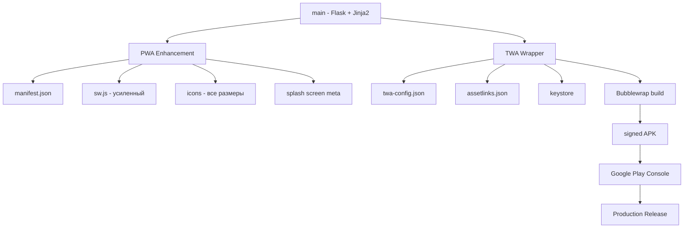

# План: Публикация «Трудник» в Google Play Market

## Текущее состояние PWA

| Файл | Статус | Что есть |
|------|--------|----------|
| [`static/manifest.json`](../static/manifest.json) | Базовый | name, short_name, display: standalone, 2 иконки (192/512), theme_color |
| [`static/sw.js`](../static/sw.js) | Минимальный | cache-first стратегия, без offline-fallback |
| [`static/icons/`](../static/icons/) | 2 иконки | icon-192x192.png, icon-512x512.png |
| [`templates/base.html`](../templates/base.html) | Частично | meta theme-color, apple-mobile-web-app, viewport-fit=cover |

## Выбор технологии: TWA (Trusted Web Activity)

**Решение:** PWA + TWA через **Bubblewrap** (Google-рекомендованный подход).

**Обоснование:**
- Приложение уже является PWA (manifest.json, service worker, standalone)
- TWA не требует переписывания UI — используется существующий веб-интерфейс
- Нативная обёртка через Chrome Custom Tabs на устройстве
- Поддержка Push-уведомлений, Biometric Auth, Payment Request API
- Официально поддерживается Google для Play Market
- Минимальные изменения в кодовой базе

**Альтернативы (отклонены):**
- Capacitor/Cordova: избыточно для Flask/Jinja2, требует полной переработки роутинга
- React Native: требует полного реврайта фронтенда
- PWABuilder: онлайн-инструмент, но Bubblewrap даёт больше контроля

---

## Этап 1: Усиление PWA до production-ready

### 1.1 Обновление [`static/manifest.json`](../static/manifest.json)

Добавить:
- `scope: "/"` — область действия PWA
- `lang: "ru"` — язык
- `categories: ["productivity", "utilities"]` — категории для Play Market
- `orientation: "any"` — ориентация экрана
- `purpose: "maskable"` — для адаптивных иконок Android
- `screenshots` — скриншоты для установки PWA
- `shortcuts` — быстрые действия из лаунчера
- `prefer_related_applications: true` + `related_applications` — связь с Play-версией
- Дополнительные размеры иконок: 48, 72, 96, 144, 168, 192, 512 (все с `purpose: "any maskable"`)

### 1.2 Генерация иконок

Требуемые размеры для Google Play + PWA:

| Размер | Назначение |
|--------|------------|
| 48×48 | Android mdpi |
| 72×72 | Android hdpi |
| 96×96 | Android xhdpi |
| 144×144 | Android xxhdpi |
| 192×192 | Android xxxhdpi / PWA |
| 512×512 | Google Play / PWA maskable |

Генерация: использовать Pillow (Python) для создания PNG из SVG-логотипа «Трудник».

### 1.3 Усиление Service Worker ([`static/sw.js`](../static/sw.js))

- Стратегия: **Network-first с fallback на cache** для HTML, **Cache-first** для статики
- **Offline fallback-страница**: `offline.html`
- Обработка `fetch` с учётом типа контента
- Pre-caching критических ресурсов при `install`
- Cleanup старых кешей при `activate`

### 1.4 Splash Screen

Добавить в [`templates/base.html`](../templates/base.html):
```html
<meta name="apple-mobile-web-app-status-bar-style" content="black-translucent">
<link rel="apple-touch-startup-image" href="/static/icons/splash-2048x2732.png" media="...">
```

Для Android splash screen использует `background_color` и `theme_color` из манифеста + иконку 512×512.

### 1.5 Offline-страница

Создать [`templates/offline.html`](../templates/offline.html) — лёгкая страница, кешируемая service worker'ом, показывается при отсутствии сети.

---

## Этап 2: TWA/Android-обёртка

### 2.1 Digital Asset Links

Создать [`static/.well-known/assetlinks.json`](../static/.well-known/assetlinks.json):
```json
[{
  "relation": ["delegate_permission/common.handle_all_urls"],
  "target": {
    "namespace": "android_app",
    "package_name": "ru.trudnik.app",
    "sha256_cert_fingerprints": ["<FINGERPRINT>"]
  }
}]
```

Маршрут во Flask: `/.well-known/assetlinks.json` → отдавать статический JSON.

### 2.2 Bubblewrap-конфигурация

Создать [`twa-config.json`](../twa-config.json) в корне проекта:
- `host`: домен приложения (trudnik.onrender.com → позже свой домен)
- `packageId`: `ru.trudnik.app`
- `name`: Трудник
- `launcherName`: Трудник
- `display`: standalone
- `backgroundColor`: #ffffff
- `themeColor`: #d97706
- `startUrl`: /
- `icon`: путь к иконке 512×512
- `maskableIcon`: путь к адаптивной иконке
- `signingKey`: путь к keystore

### 2.3 Генерация Keystore

```bash
keytool -genkey -v -keystore trudnik-release.keystore \
  -alias trudnik -keyalg RSA -keysize 2048 -validity 10000 \
  -storepass <password> -keypass <password> \
  -dname "CN=Trudnik, OU=Dev, O=Trudnik, L=Moscow, S=Moscow, C=RU"
```

### 2.4 Сборка APK через Bubblewrap

```bash
npx @bubblewrap/cli init --manifest https://trudnik.onrender.com/static/manifest.json
npx @bubblewrap/cli build
```

---

## Этап 3: Google Play Store

### 3.1 Store Listing Assets

Создать директорию `play-store-assets/`:
- `feature-graphic.png` (1024×500)
- `screenshot-1.png` — главная с заданиями
- `screenshot-2.png` — карточка задания
- `screenshot-3.png` — чаты
- `screenshot-4.png` — профиль
- `app-description-ru.txt` — описание на русском
- `privacy-policy.md` — политика конфиденциальности

### 3.2 Подписание и загрузка

- Подписать APK через `jarsigner` + `zipalign`
- Загрузить в Google Play Console как новый релиз
- Выбрать трек: internal testing → alpha → production

---

## Порядок реализации

| # | Задача | Файлы | Автоматизируемо |
|---|--------|-------|-----------------|
| 1 | Обновить `manifest.json` | `static/manifest.json` | Да |
| 2 | Сгенерировать иконки всех размеров | `static/icons/` | Да (Pillow) |
| 3 | Усилить Service Worker | `static/sw.js` | Да |
| 4 | Создать offline-страницу | `templates/offline.html` + маршрут | Да |
| 5 | Добавить splash-screen meta | `templates/base.html` | Да |
| 6 | Настроить `assetlinks.json` | `static/.well-known/assetlinks.json` + маршрут | Да |
| 7 | Создать `twa-config.json` | `twa-config.json` | Да |
| 8 | Создать store-ассеты | `play-store-assets/` | Частично |
| 9 | Запустить тесты (106 шт.) | `pytest` | Да |
| 10 | Commit + push | git | Да |

---

## Схема архитектуры


