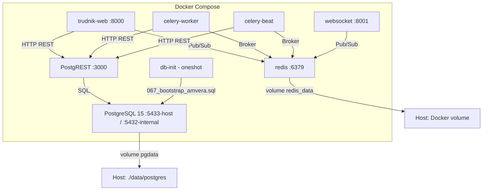
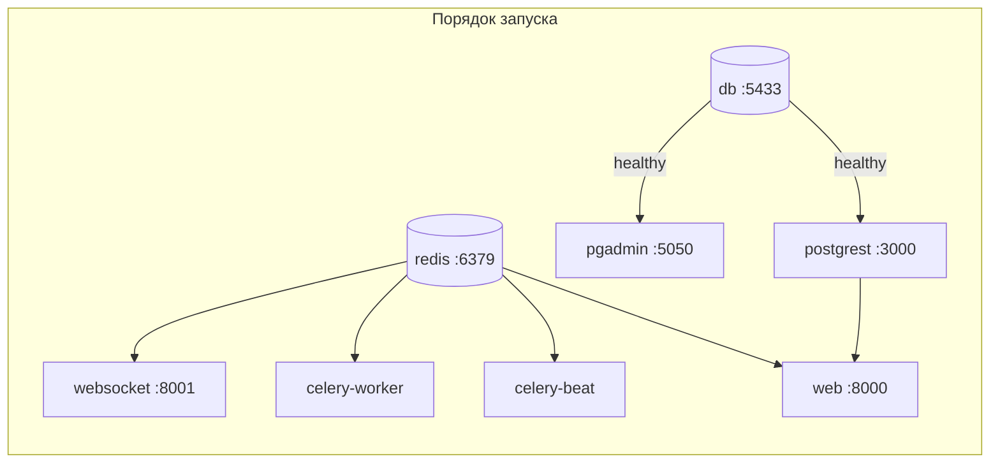

# План: Локальный запуск PostgreSQL + PostgREST для Trudnik

**Дата:** 2026-06-24
**Статус:** Проект (Architect)
**Цель:** Один `docker-compose up` поднимает всё: PostgreSQL 15, PostgREST 12+, Redis, Flask, Celery

---

## 1. Архитектура решения



**Ключевые решения (приняты по умолчанию):**

| Решение | Выбор | Обоснование |
|---|---|---|
| Flask в Docker | Да, всё в compose | Требование «один `docker-compose up` для всего» |
| Порт PostgreSQL | `5433` (хост) → `5432` (контейнер) | Избегаем конфликта с локальным PG |
| Скрипт инициализации | [`067_bootstrap_amvera.sql`](../migrations/067_bootstrap_amvera.sql) | Самый полный, идемпотентный, создан для Amvera/PostgREST |
| pgAdmin | Опционально (профиль `debug`) | Не нужен для базового запуска |
| JWT-секрет (локальный) | Генерируется новый | Не используем продовый секрет в dev-среде |

---

## 2. Сервисы docker-compose.yml

### 2.1 Новые сервисы (добавить)

#### `db` — PostgreSQL 15

```yaml
db:
  image: postgres:15-alpine
  container_name: trudnik-db
  restart: unless-stopped
  ports:
    - "${PGPORT:-5433}:5432"
  environment:
    POSTGRES_USER: ${PGUSER:-trudnikapp}
    POSTGRES_PASSWORD: ${PGPASSWORD:-devpassword}
    POSTGRES_DB: ${PGDATABASE:-trudnik}
  volumes:
    - pgdata:/var/lib/postgresql/data
    - ./migrations/067_bootstrap_amvera.sql:/docker-entrypoint-initdb.d/001_bootstrap.sql
  healthcheck:
    test: ["CMD-SHELL", "pg_isready -U ${PGUSER:-trudnikapp} -d ${PGDATABASE:-trudnik}"]
    interval: 5s
    timeout: 5s
    retries: 10
    start_period: 10s
```

**Важно:** Файл [`067_bootstrap_amvera.sql`](../migrations/067_bootstrap_amvera.sql) монтируется в `/docker-entrypoint-initdb.d/`. PostgreSQL выполнит его **только при первом создании БД** (когда директория данных пуста). Это идемпотентный скрипт — можно пересоздать том для повторной инициализации.

#### `postgrest` — PostgREST 12

```yaml
postgrest:
  image: postgrest/postgrest:v12.2
  container_name: trudnik-postgrest
  restart: unless-stopped
  ports:
    - "3000:3000"
  environment:
    PGRST_DB_URI: postgresql://${PGUSER:-trudnikapp}:${PGPASSWORD:-devpassword}@db:5432/${PGDATABASE:-trudnik}
    PGRST_DB_SCHEMA: public
    PGRST_DB_ANON_ROLE: anon
    PGRST_DB_POOL: 10
    PGRST_DB_EXTRA_SEARCH_PATH: public
    PGRST_JWT_SECRET: ${PGRST_JWT_SECRET}
    PGRST_JWT_AUD: authenticated
    PGRST_JWT_ROLE_CLAIM_KEY: .role
    PGRST_SERVER_PORT: "3000"
    PGRST_SERVER_HOST: 0.0.0.0
  depends_on:
    db:
      condition: service_healthy
```

**Конфигурация PostgREST — полностью через переменные окружения** (файл `postgrest.conf` не нужен). Все параметры взяты из эталонного [`scripts/env_trudnik_pr.env`](../scripts/env_trudnik_pr.env).

### 2.2 Изменения в существующих сервисах

#### `web` — добавить `depends_on: postgrest`

```yaml
web:
  # ... (существующая конфигурация)
  depends_on:
    redis:
      condition: service_started
    postgrest:
      condition: service_started  # ← добавить
  environment:
    - POSTGREST_URL=http://postgrest:3000  # ← изменить с localhost на имя сервиса
    - PGRST_JWT_SECRET=${PGRST_JWT_SECRET}
    - DATABASE_URL=postgresql://${PGUSER:-trudnikapp}:${PGPASSWORD:-devpassword}@db:5432/${PGDATABASE:-trudnik}
    - PGUSER=${PGUSER:-trudnikapp}
    - PGPASSWORD=${PGPASSWORD:-devpassword}
    - PGHOST=db
    - PGPORT=5432
    - PGDATABASE=${PGDATABASE:-trudnik}
```

#### `celery_worker` и `celery_beat` — аналогичные изменения

Заменить `localhost:3000` → `postgrest:3000`, `DATABASE_URL` → хост `db`.

### 2.3 Опциональный сервис: `pgadmin`

```yaml
pgadmin:
  image: dpage/pgadmin4:latest
  container_name: trudnik-pgadmin
  profiles: ["debug"]
  ports:
    - "5050:80"
  environment:
    PGADMIN_DEFAULT_EMAIL: admin@trudnik.local
    PGADMIN_DEFAULT_PASSWORD: admin
  volumes:
    - pgadmin_data:/var/lib/pgadmin
  depends_on:
    db:
      condition: service_healthy
```

Запуск: `docker-compose --profile debug up -d pgadmin`

### 2.4 Полная карта зависимостей



---

## 3. Файлы, которые нужно создать / изменить

### 3.1 Новые файлы

| Файл | Назначение |
|---|---|
| `scripts/generate_jwt_secret.py` | Утилита генерации JWT-секрета (96 бит энтропии, hex) |

### 3.2 Изменяемые файлы

| Файл | Что меняется |
|---|---|
| [`docker-compose.yml`](../docker-compose.yml) | Добавить сервисы `db`, `postgrest`; изменить `web`/`celery_worker`/`celery_beat`; добавить volume `pgdata` |
| [`.env.example`](../.env.example) | Добавить блок переменных для локальной БД |
| [`.gitignore`](../.gitignore) | Добавить `data/` (для локального тома PostgreSQL) |

### 3.3 Файлы, которые НЕ требуют изменений

| Файл | Причина |
|---|---|
| [`Dockerfile`](../Dockerfile) | `libpq-dev` уже установлен, `python app.py` переопределяется в compose |
| [`app/config.py`](../app/config.py) | Все настройки берутся из env-переменных — менять код не нужно |
| [`migrations/067_bootstrap_amvera.sql`](../migrations/067_bootstrap_amvera.sql) | Используется как есть — монтируется в initdb.d |

---

## 4. Стратегия инициализации БД

### 4.1 Механизм

Используется встроенный механизм PostgreSQL: **`/docker-entrypoint-initdb.d/`**

- При первом запуске (пустая директория данных) PostgreSQL выполняет все `.sql`-файлы из этой директории в алфавитном порядке
- Скрипты выполняются от пользователя `POSTGRES_USER` (у нас — `trudnikapp`, но через `postgres` суперпользователя для init-фазы)
- После выполнения в директории данных создаётся файл-маркер, и скрипты больше не запускаются

### 4.2 Что делает `067_bootstrap_amvera.sql`

| Секция | Содержание |
|---|---|
| Расширения | `pgcrypto`, `postgis`, `pg_trgm` |
| Роли | `anon`, `authenticated`, `service_role` + GRANT текущему пользователю |
| Таблицы (24 шт.) | `profiles`, `religions`, `skills`, `jobs`, `user_skills`, `applications`, `messages`, `notifications`, `email_log`, `job_payments`, `tariff_settings`, `monetization_settings`, `invitations`, `ratings`, `favorites`, `employer_favorites`, `push_subscriptions`, `blacklist`, `schema_version`, `spatial_ref_sys` ... |
| Seed-данные | `religions` (6), `skills` (20), `tariff_settings`, `monetization_settings` |
| Индексы | Полнотекстовый поиск (`search_vector`), B-tree для FK, GIN для `skills[]`, GiST для geo |
| Триггеры | `tsvector_update_trigger` для `jobs` и `profiles` |
| RLS-политики | Для всех таблиц (JWT-based через `current_setting('request.jwt.claim.xxx', true)`) |
| RPC-функции | `login_user`, `register_user`, `change_password`, `atomic_apply_job`, `atomic_accept_application`, `atomic_reject_application`, `atomic_delete_job`, `atomic_delete_application`, `get_job_stats`, `nearby_jobs`, `exec_sql` |
| Права доступа | REVOKE ALL + GRANT для `anon`, `authenticated`, `service_role` |
| Администратор | `admin@test.ru` / `Step@1986` |

### 4.3 Сброс и переинициализация

```bash
# Остановить и удалить том с данными:
docker-compose down -v
# Перезапустить — initdb.d выполнится заново:
docker-compose up -d
```

### 4.4 Важный нюанс: пользователь `trudnikapp`

Скрипт [`067_bootstrap_amvera.sql`](../migrations/067_bootstrap_amvera.sql) на строках 65-69 содержит:

```sql
DO $$ BEGIN
    GRANT anon, authenticated, service_role TO trudnikapp;
EXCEPTION WHEN undefined_object THEN
    RAISE NOTICE 'Пользователь trudnikapp ещё не создан ...';
END $$;
```

В Docker-окружении пользователь БД — это `POSTGRES_USER` (мы задаём `trudnikapp`). PostgreSQL создаёт этого пользователя как `LOGIN`-роль **до** выполнения init-скриптов. Поэтому `GRANT ... TO trudnikapp` отработает успешно. **Проблемы нет.**

---

## 5. Переменные окружения

### 5.1 `.env` для локальной разработки

```env
# ============================================================
# Trudnik — локальная разработка (Docker Compose)
# Сгенерировано: 2026-06-24
# ============================================================

# Flask
SECRET_KEY=dev-secret-key-change-in-production-min-32-chars

# База данных (внутри Docker-сети)
PGUSER=trudnikapp
PGPASSWORD=devpassword
PGHOST=db
PGPORT=5432
PGDATABASE=trudnik
DATABASE_URL=postgresql://trudnikapp:devpassword@db:5432/trudnik

# PostgREST
POSTGREST_URL=http://postgrest:3000
PGRST_JWT_SECRET=<сгенерировать через python scripts/generate_jwt_secret.py>

# Redis
REDIS_URL=redis://redis:6379/0

# WebSocket
WEBSOCKET_PORT=8001
WEBSOCKET_URL=ws://localhost:8001/ws

# SMTP (для локальной разработки — обычно не нужен)
SMTP_HOST=localhost
SMTP_PORT=587
SMTP_USER=
SMTP_PASSWORD=
SMTP_USE_TLS=True
SMTP_FROM_EMAIL=notifications@trudnik.ru

# Внешние API
YANDEX_MAPS_API_KEY=
DEEPSEEK_API_KEY=

# VAPID (опционально)
VAPID_PRIVATE_KEY=
VAPID_PUBLIC_KEY=
VAPID_CLAIMS_EMAIL=notifications@trudnik.ru
```

### 5.2 Обновлённый `.env.example`

Добавить блок «Локальная БД» с пояснениями:

```env
# ═══════════════════════════════════════════════════════════
# Локальная БД (Docker Compose)
# ═══════════════════════════════════════════════════════════
# Для локальной разработки используется PostgreSQL в Docker.
# Хост: db (имя сервиса в docker-compose, доступен только внутри Docker-сети)
# Порт: 5433 на хосте → 5432 внутри контейнера
PGUSER=trudnikapp
PGPASSWORD=devpassword
PGHOST=db
PGPORT=5432
PGDATABASE=trudnik
DATABASE_URL=postgresql://trudnikapp:devpassword@db:5432/trudnik
```

### 5.3 Сводка: какие переменные куда

| Переменная | db | postgrest | web | celery_worker | celery_beat | websocket |
|---|---|---|---|---|---|---|
| `POSTGRES_USER`/`PGUSER` | ✓ | | ✓ | ✓ | ✓ | |
| `POSTGRES_PASSWORD`/`PGPASSWORD` | ✓ | | ✓ | ✓ | ✓ | |
| `POSTGRES_DB`/`PGDATABASE` | ✓ | | ✓ | ✓ | ✓ | |
| `PGRST_DB_URI` | | ✓ | | | | |
| `PGRST_JWT_SECRET` | | ✓ | ✓ | ✓ | ✓ | |
| `POSTGREST_URL` | | | ✓ | ✓ | ✓ | |
| `DATABASE_URL` | | | ✓ | ✓ | ✓ | |
| `REDIS_URL` | | | ✓ | ✓ | ✓ | ✓ |
| `SECRET_KEY` | | | ✓ | ✓ | ✓ | ✓ |

---

## 6. Утилита генерации JWT-секрета

Файл: `scripts/generate_jwt_secret.py`

```python
"""Генерация криптостойкого JWT-секрета для локальной разработки."""
import secrets

def generate_jwt_secret(length: int = 64) -> str:
    """Генерирует hex-строку заданной длины (по умолчанию 64 символа = 256 бит)."""
    return secrets.token_hex(length // 2)

if __name__ == '__main__':
    secret = generate_jwt_secret()
    print(f"PGRST_JWT_SECRET={secret}")
    print(f"\nДобавьте эту строку в ваш .env файл.")
    print(f"Длина: {len(secret)} символов ({len(secret) * 4} бит энтропии)")
```

---

## 7. Пошаговый порядок реализации

### Шаг 1: Создать утилиту генерации JWT-секрета

- Файл: [`scripts/generate_jwt_secret.py`](../scripts/generate_jwt_secret.py)
- Проверить: `python scripts/generate_jwt_secret.py`

### Шаг 2: Обновить `.env.example`

- Файл: [`.env.example`](../.env.example)
- Добавить блок «Локальная БД» с переменными `PGUSER`, `PGPASSWORD`, `PGHOST`, `PGPORT`, `PGDATABASE`, `DATABASE_URL`
- Добавить комментарий про генерацию `PGRST_JWT_SECRET`

### Шаг 3: Добавить сервисы в `docker-compose.yml`

- Файл: [`docker-compose.yml`](../docker-compose.yml)
- Добавить сервис `db` (PostgreSQL 15-alpine)
- Добавить сервис `postgrest` (postgrest/postgrest:v12.2)
- Добавить сервис `pgadmin` (опционально, с профилем `debug`)
- Добавить volume `pgdata`
- Добавить volume `pgadmin_data` (если нужен pgadmin)

### Шаг 4: Обновить существующие сервисы в `docker-compose.yml`

- Файл: [`docker-compose.yml`](../docker-compose.yml)
- В `web`: добавить `depends_on: postgrest`, обновить `POSTGREST_URL`, `DATABASE_URL`, `PGHOST`
- В `celery_worker`: обновить `POSTGREST_URL`, `DATABASE_URL`, `PGHOST`
- В `celery_beat`: обновить `POSTGREST_URL`, `DATABASE_URL`, `PGHOST`

### Шаг 5: Обновить `.gitignore`

- Файл: [`.gitignore`](../.gitignore)
- Добавить `data/` — директория с локальными данными PostgreSQL (если том монтируется как bind-mount)

### Шаг 6: Создать `.env` для локальной разработки

- Скопировать `.env.example` → `.env`
- Сгенерировать `PGRST_JWT_SECRET` через `python scripts/generate_jwt_secret.py`
- Указать `SECRET_KEY` (любая строка ≥ 32 символов)

### Шаг 7: Проверить инициализацию

```bash
# Первый запуск (создаст БД и применит миграции):
docker-compose up -d db
docker-compose logs -f db  # дождаться "database system is ready to accept connections"

# Проверить, что PostgREST работает:
docker-compose up -d postgrest
curl http://localhost:3000/

# Проверить, что таблицы созданы:
docker-compose exec db psql -U trudnikapp -d trudnik -c "\dt"

# Проверить seed-данные:
docker-compose exec db psql -U trudnikapp -d trudnik -c "SELECT * FROM religions;"
docker-compose exec db psql -U trudnikapp -d trudnik -c "SELECT * FROM skills;"
```

### Шаг 8: Полный запуск

```bash
docker-compose up -d
docker-compose logs -f  # мониторинг всех сервисов
```

### Шаг 9: Проверить интеграцию Flask → PostgREST

```bash
# Проверить healthcheck Flask:
curl http://localhost:8000/health

# Проверить, что Flask может достучаться до PostgREST:
curl http://localhost:8000/api/jobs  # или другой публичный эндпоинт
```

---

## 8. Возможные проблемы и их решение

| Проблема | Причина | Решение |
|---|---|---|
| «Port 5433 already in use» | Локальный PostgreSQL на 5433 | Сменить `PGPORT` в `.env` на другой порт |
| PostgREST: «Database connection error» | PostgreSQL ещё не готов | Увеличить `start_period` в healthcheck, или перезапустить postgrest |
| Flask: «Connection refused» к PostgREST | PostgREST не запущен | Проверить `docker-compose ps`, убедиться что `postgrest` в `depends_on` |
| Миграции не применились | Том `pgdata` не пуст (старые данные) | `docker-compose down -v && docker-compose up -d` |
| «role "trudnikapp" does not exist» в init-скрипте | Пользователь создаётся PostgreSQL после init-скриптов? | **Нет.** PostgreSQL создаёт пользователя `POSTGRES_USER` **до** выполнения init-скриптов. Проблема неактуальна. |
| Большой bootstrap-скрипт (83KB) выполняется долго | Первый запуск с чистой БД | Нормально, занимает 3-10 секунд. При последующих запусках не выполняется. |

---

## 9. Альтернативные подходы (отклонённые)

### 9.1 Отдельный init-контейнер vs docker-entrypoint-initdb.d

| Подход | Плюсы | Минусы |
|---|---|---|
| **init-контейнер** (выбран) | Простота, встроено в PostgreSQL, не требует доп. образов | Только при первом создании БД; сложнее обновлять миграции |
| Отдельный контейнер миграций | Можно запускать повторно, подходит для инкрементальных миграций | Сложнее: нужен свой Dockerfile, скрипт ожидания, логика повторов |

**Выбрано:** `docker-entrypoint-initdb.d` — для локальной разработки этого достаточно. Если потребуются инкрементальные миграции, можно добавить init-контейнер позже.

### 9.2 postgrest.conf vs переменные окружения

| Подход | Плюсы | Минусы |
|---|---|---|
| **Переменные окружения** (выбран) | Проще в Docker Compose, не нужно монтировать файл, все настройки в `.env` | Менее читаемо для сложных конфигураций |
| `postgrest.conf` | Более структурировано, поддерживает все опции | Нужно монтировать файл, дублирование с `.env` |

**Выбрано:** переменные окружения — конфигурация простая, 10 параметров, полностью покрывается `PGRST_*`.

---

## 10. Итоговая структура файлов (что изменится)

```
trudnik/
├── docker-compose.yml          # ИЗМЕНИТСЯ: +db, +postgrest, +pgadmin
├── .env.example                # ИЗМЕНИТСЯ: +блок локальной БД
├── .gitignore                  # ИЗМЕНИТСЯ: +data/
├── scripts/
│   └── generate_jwt_secret.py  # НОВЫЙ: утилита генерации секрета
├── migrations/
│   └── 067_bootstrap_amvera.sql # БЕЗ ИЗМЕНЕНИЙ (монтируется в initdb.d)
├── data/                       # НОВАЯ (в .gitignore): локальные данные PG
│   └── postgres/               # bind-mount для pgdata (опционально)
└── plans/
    └── local-postgrest-setup.md # НОВЫЙ: этот документ
```
