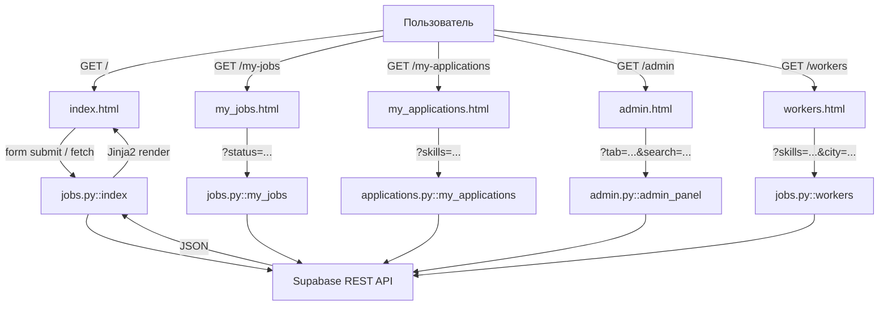
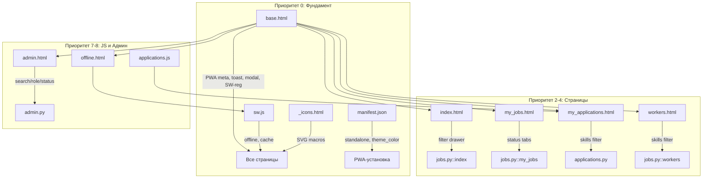

# План: Стратегическое внедрение PWA + Редизайн «Трудник»

**Дата:** 2026-06-08
**Источник требований:** [`От Standalone-режима к редизайну_ Стратегическое внедрение PWA в приложении «Трудник».md`](../От%20Standalone-режима%20к%20редизайну_%20Стратегическое%20внедрение%20PWA%20в%20приложении%20«Трудник».md)
**Целевая ветка:** `main`

---

## Анализ текущего состояния

### Что уже сделано (можно не трогать)

| Файл | Состояние | Оценка |
|------|-----------|--------|
| [`static/manifest.json`](../static/manifest.json) | `display: "standalone"`, `theme_color: "#d97706"`, иконки 48-512px, screenshots, shortcuts, `scope: "/"`, `lang: "ru"` | **95% готов** - нужна только замена `description` и `start_url` |
| [`static/sw.js`](../static/sw.js) | `CACHE_NAME: 'trudnik-v2'`, precache-список, `skipWaiting()`, `clients.claim()`, cache-first стратегия | **90% готов** - нужна offline-заглушка и network-first для API |
| [`templates/base.html`](../templates/base.html) | Tailwind CDN, Inter, дизайн-система, header, мобильное меню | **70% готов** - нет PWA meta-тегов iOS, нет toast-системы, нет кастомной модалки |

### Что требует полного редизайна (по документу)

Документ требует редизайна **всех 27 шаблонов**. Ниже - фокус на файлах, явно указанных пользователем + критически зависимых.

---

## Архитектура потоков фильтрации (сохраняется)



**Критическое правило:** Все URL-параметры фильтрации (`request.args.get(...)`) в Python-файлах **не трогаются**. HTML-формы должны сохранять те же `name`-атрибуты полей.

---

## Пошаговый план имплементации

### Приоритет 0: Фундамент (3 файла)

#### Шаг 1: [`templates/base.html`](../templates/base.html) - КРИТИЧНЫЙ ФАЙЛ

**Что нужно добавить/изменить:**

1. **PWA meta-теги для iOS** (сейчас отсутствуют):
   - `<meta name="apple-mobile-web-app-capable" content="yes">`
   - `<meta name="apple-mobile-web-app-status-bar-style" content="black-translucent">`
   - `<meta name="apple-mobile-web-app-title" content="Трудник">`
   - `<meta name="mobile-web-app-capable" content="yes">`
   - `<meta name="theme-color" content="#d97706">`
   - `<link rel="apple-touch-icon" href="/static/icons/icon-192x192.png">`
   - Локация: в `<head>`, после viewport meta и manifest link
   - Существующий `viewport` нужно дополнить `viewport-fit=cover`

2. **Toast-система** (сейчас `get_flashed_messages` рендерятся как alert):
   - Добавить `<div id="toast-container">` в конец `<body>`
   - Добавить глобальную функцию `window.showToast(message, type)`
   - Конвертировать все `` в JS-вызов

3. **Кастомная модалка подтверждения** (замена `confirm()`):
   - Модалка с `backdrop-blur`, центрированием, кнопками "Отмена"/"Подтвердить"
   - Глобальная функция `window.showConfirm(message, onConfirm)`

4. **Регистрация Service Worker** (проверить наличие):
   ```html
   <script>
   if ('serviceWorker' in navigator) {
     window.addEventListener('load', () => {
       navigator.serviceWorker.register("{{ url_for('static', filename='sw.js') }}");
     });
   }
   </script>
   ```
   - Локация: перед `</body>`, после всех скриптов

5. **Header** - видимый поиск на мобильных:
   - Десктоп: логотип слева, поле поиска по центру, колокольчик + аватар справа
   - Мобильные: логотип + иконка лупы (раскрывает поле на всю ширину) + уведомления

6. **Нижнее мобильное меню (Bottom Nav)**:
   - `fixed bottom-0 ... pb-[env(safe-area-inset-bottom)]`
   - Трудник: Задания / Смены / Чаты / Избранное / Профиль
   - Работодатель: Мои задания / Отклики / Трудники / Избранное / Чаты

7. **CSS-переменные дизайн-системы** (проверить наличие в `<style>`):
   ```css
   :root {
     --color-primary-500: #d97706;
     --color-primary-600: #b45309;
     --color-success: #10b981;
     --color-warning: #f59e0b;
     --color-danger: #ef4444;
   }
   ```

**Совместимость с JS:**
- Сохранить `#toast-container` (используется в `applications.js`)
- Сохранить `window.showToast()` (используется в `applications.js` и `favorites.js`)
- Не удалять `#mass-actions-bar`, `#selected-count`, `#select-all`, `#clear-selection`

---

#### Шаг 2: [`static/manifest.json`](../static/manifest.json)

**Изменения (минимальные):**

| Свойство | Текущее | Новое | Причина |
|----------|---------|-------|---------|
| `name` | "Трудник - подработка в религиозных организациях" | "Трудник" | Нейтральность |
| `description` | "Платформа разовой подработки в религиозных организациях..." | "Платформа разовой подработки. Работодатели публикуют задания, исполнители откликаются и выполняют работу." | Убрать "религиозных" |
| `start_url` | "/?utm_source=pwa" | "/" | Чистый URL без UTM-меток |
| `theme_color` | "#d97706" | "#d97706" | **Без изменений** (уже правильный) |

**Что НЕ трогать:**
- `display: "standalone"`
- `icons` массив
- `screenshots`
- `shortcuts`
- `scope: "/"`

---

#### Шаг 3: [`static/sw.js`](../static/sw.js)

**Текущее состояние:** cache-first стратегия, precache, `skipWaiting()`, `clients.claim()`.

**Что улучшить:**

1. **Offline-заглушка для HTML-страниц:** при navigation-запросе и отсутствии сети - показать `/offline`
2. **Network-first для API-запросов:** для `/api/` сначала сеть, при падении - кэш с кэшированием свежего ответа
3. **Обновить `CACHE_NAME`** до `'trudnik-v3'`
4. **Расширить `PRECACHE_URLS`:** добавить `/offline`

---

### Приоритет 2: Главный поток заданий

#### Шаг 4: [`templates/index.html`](../templates/index.html) - Лента заданий

**Редизайн:**

1. Заголовок "Задания" + кнопка "Фильтры" (иконка filter_icon)
2. Filter drawer (выезжает справа) - поля: город, оплата от/до, сортировка, навыки (чекбоксы из `/api/skills`), геолокация
3. Сетка карточек: `grid-cols-1 sm:grid-cols-2 lg:grid-cols-3`
4. Карточка задания: фото, badge цены, название, город/расстояние/дата, описание, кнопки
5. Массовые действия: `#mass-actions-bar`
6. Empty state

**Совместимость с фильтрацией:**
- Все `name`-атрибуты сохранить: `city`, `payment_min`, `payment_max`, `sort`, `skills`, `lat`, `lng`, `radius`
- JS-функции `resetFilters()`, `useMyLocation()` оставить рабочими
- ID сохранить: `filter-form`, `filter-drawer`, `filter-backdrop`, `open-filters`, `close-filters`

---

### Приоритет 3: Кабинет работодателя

#### Шаг 5: [`templates/my_jobs.html`](../templates/my_jobs.html) - Мои задания

**Редизайн:**

1. Табы: Все / Открытые / В работе / Завершённые / Отозванные - с счётчиками
2. Карточка задания: название, дата, оплата, статус-бейдж, N откликов, M/N мест, кнопки действий
3. Массовые действия: чекбоксы + плавающая панель
4. Empty state

**Совместимость:** Табы = ссылки `href="/my-jobs?status=open"`, параметр `status` обрабатывается в [`jobs.py::my_jobs()`](../app/blueprints/jobs.py:248)

---

#### Шаг 6: [`templates/my_applications.html`](../templates/my_applications.html) - Отклики

**Редизайн:**

1. Фильтр по навыкам (подключает `_filter_skills.html`)
2. Карточка отклика: аватар, имя, рейтинг, навыки (chips), оплата, статус-бейдж, кнопки действий
3. Массовые действия

**КРИТИЧЕСКАЯ СОВМЕСТИМОСТЬ С JS - сохранить все селекторы:**
- Классы: `.app-card`, `.app-checkbox`, `.status-badge`, `.status-text`, `.status-icon`, `.action-buttons`, `.action-icon-btn`, `.mass-action-btn`
- Data-атрибуты: `data-app-id`, `data-status`, `data-action`
- ID: `#mass-actions-bar`, `#selected-count`, `#select-all`, `#clear-selection`, `#toast-container`
- AJAX-эндпоинты: `/api/applications/<id>/<action>`, `/api/applications/batch`

---

### Приоритет 4: Каталог трудников

#### Шаг 7: [`templates/workers.html`](../templates/workers.html) - Трудники

**Редизайн:**

1. Поиск с debounce + фильтры в drawer
2. Сетка карточек: 1-2 (моб), 3-4 (ПК)
3. Карточка: аватар, имя, рейтинг, навыки (chips), желаемая оплата, кнопки "Написать"/"В избранное"

**Совместимость:** параметры `city`, `experience`, `payment_from`, `payment_to`, `rating_min`, `skills`, `religion` -> [`jobs.py::workers()`](../app/blueprints/jobs.py:121)

---

### Приоритет 8: Админ-панель

#### Шаг 8: [`templates/admin.html`](../templates/admin.html) - Админ-панель

**Редизайн:**

1. Sidebar слева (ПК) / табы сверху (моб)
2. Пользователи: таблица с поиском + фильтр по роли (сохранить `name="search"`, `name="role"`, `name="tab" value="users"`)
3. Задания: таблица с поиском + фильтр по статусу (сохранить `name="search"`, `name="status"`, `name="tab" value="jobs"`)
4. Навыки: CRUD через `/admin/skills`
5. Вероисповедания: CRUD через `/admin/religions`
6. Верификация, Монетизация, Платежи

---

### Приоритет 7: JS-адаптация

#### Шаг 9: [`static/js/applications.js`](../static/js/applications.js) - Offline-адаптация

**Доработки:**

1. Offline-детектор: обёртка `fetch` с показом toast при отсутствии сети
2. Замена `confirm()` на `window.showConfirm()`
3. Проверка всех селекторов после редизайна HTML

---

### Шаг 10: [`templates/offline.html`](../templates/offline.html) - Офлайн-страница

**Доработки:**
- Дружелюбное сообщение "Вы не в сети"
- Кнопка "Попробовать снова"
- Индикатор восстановления соединения

---

## Схема зависимостей



---

## План тестирования

### Этап 1: PWA-ядро
1. DevTools -> Application -> Manifest: проверить `display: standalone`, `theme_color: #d97706`
2. Application -> Service Workers: статус "activated and is running"
3. Application -> Cache Storage: `trudnik-v3` с precache-ресурсами
4. Network -> Offline: обновить страницу, должна показаться `/offline`
5. Lighthouse -> PWA audit: target >= 90%

### Этап 2: Фильтрация
1. `index.html` - применить фильтры, проверить URL-параметры
2. `my_jobs.html` - переключить табы статусов, проверить `?status=...`
3. `admin.html` - поиск пользователей, фильтр по роли, поиск заданий по статусу
4. `workers.html` - фильтр по навыкам и городу

### Этап 3: Offline-режим
1. Отключить сеть в DevTools
2. Обновить index.html - загрузиться из кэша или offline-заглушка
3. Откликнуться на задание - toast "Нет соединения"
4. Включить сеть - отклик должен отправиться

### Этап 4: Установка PWA
1. "Установить" в адресной строке Chrome
2. Приложение в standalone-окне без UI браузера
3. Проверить на Android: Chrome -> "Добавить на главный экран"

### Этап 5: Мобильная адаптивность
1. Проверить на 320px, 768px, 1440px
2. Bottom-nav с `safe-area-inset-bottom`
3. Touch-targets >= 44x44px

---

## Резюме: что меняем, что не трогаем

| Категория | Файлы | Действие |
|-----------|-------|----------|
| **PWA-конфигурация** | `manifest.json` | Минимальные правки (name, description, start_url) |
| **Service Worker** | `sw.js` | Offline-заглушка, network-first для API, CACHE_NAME v3 |
| **Фундамент** | `base.html` | PWA meta-теги, toast, модалка, SW-регистрация, header, bottom-nav |
| **Редизайн страниц** | `index.html`, `my_jobs.html`, `my_applications.html`, `workers.html`, `admin.html` | Полный редизайн с сохранением name-атрибутов, JS-селекторов, Jinja2-логики |
| **JS-адаптация** | `applications.js` | Offline-обработка, замена confirm() |
| **Офлайн** | `offline.html` | Улучшить UI |
| **Иконки** | `_icons.html` | Проверить макросы |
| **НЕ ТРОГАТЬ** | `*.py` (все Python-файлы) | Бизнес-логика не меняется |
| **НЕ ТРОГАТЬ** | `favorites.js` | Только проверка совместимости |
