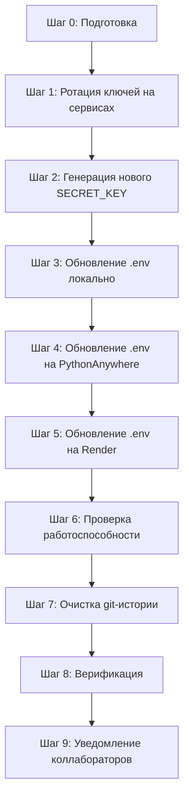

# План устранения утечки секретов — проект «Трудник»

## Обзор проблемы

Файл [`.env`](.env) с реальными секретами был закоммичен в git-репозиторий (ветка `main`), несмотря на наличие `.env` в [`.gitignore`](.gitignore). Сейчас `.env` помечен для удаления из индекса (`git rm --cached`), но **все секреты остаются в истории коммитов** — любой, кто клонировал репозиторий, может восстановить их через `git log -p`.

### Утекшие секреты

| Переменная | Сервис | Влияние |
|---|---|---|
| `SUPABASE_URL` + `SUPABASE_ANON_KEY` + `SUPABASE_SERVICE_ROLE_KEY` | Supabase | Полный доступ к БД |
| `DEEPSEEK_API_KEY` | DeepSeek API | Доступ к AI-API (расход средств) |
| `YANDEX_MAPS_API_KEY` | Яндекс.Карты | Доступ к API карт |
| `PYTHONANYWHERE_API_TOKEN` + `PYTHONANYWHERE_USERNAME` | PythonAnywhere | Доступ к хостинг-аккаунту |
| `SECRET_KEY=***REMOVED***` | Flask | Подпись сессий (слабый ключ, угадываемый) |

### Дополнительная утечка

В файле [`archive/auto_fix_agent.py`](archive/auto_fix_agent.py:14) жёстко зашит ключ `DEEPSEEK_API_KEY = "sk-4192af6e581549b58d35cedb5b8743b5"`. Этот файл находится в репозитории и также будет очищен.

### Файлы, использующие секреты

| Файл | Какие секреты | Тип использования |
|---|---|---|
| [`app/config.py`](app/config.py) | Все переменные | Чтение через `os.environ.get()` |
| [`app/utils.py`](app/utils.py) | `SUPABASE_URL`, `SUPABASE_ANON_KEY`, `SUPABASE_SERVICE_ROLE_KEY` | HTTP-запросы к Supabase REST API |
| [`supabase_agent.py`](supabase_agent.py) | `SUPABASE_URL`, `SUPABASE_SERVICE_ROLE_KEY`, `DEEPSEEK_API_KEY` | DeepSeek API + Supabase RPC |
| [`app/blueprints/jobs.py`](app/blueprints/jobs.py) | `YANDEX_MAPS_API_KEY` | Вставка в шаблоны для Яндекс.Карт |
| [`render.yaml`](render.yaml) | Все (как envVars) | Конфигурация деплоя на Render |
| [`archive/auto_fix_agent.py`](archive/auto_fix_agent.py:14) | `DEEPSEEK_API_KEY` (жёстко) | Инициализация OpenAI-клиента |

---

## Порядок действий (критически важно соблюдать последовательность)



> **⚠️ Важно:** Шаг 1 (ротация) должен выполняться **перед** шагом 7 (очистка истории). Очистка истории удаляет следы из git, но старые ключи к тому моменту уже должны быть недействительными.

---

## Шаг 0: Подготовка

### 0.1. Сохранить резервную копию текущего `.env`

```cmd
copy .env .env.backup
```

### 0.2. Убедиться, что `.env` не отслеживается git

```cmd
git rm --cached .env
```

Уже должно быть выполнено (`.env` staged for deletion). Убедиться:

```cmd
git status
```

Ожидаемый результат: `.env` в секции «Changes to be committed: deleted».

### 0.3. Проверить, что `.gitignore` содержит `.env`

Файл [`.gitignore`](.gitignore) уже содержит `.env` (строка 3). Убедиться:

```cmd
type .gitignore | findstr ".env"
```

---

## Шаг 1: Ротация ключей на сторонних сервисах

### ⚠️ Общее предупреждение

При ротации ключей Supabase приложение **будет временно недоступно**, пока новые ключи не будут развёрнуты на всех средах. Рекомендуется выполнять ротацию в период минимальной активности.

**Порядок для каждого сервиса:** сначала сгенерировать новый ключ в админке сервиса → затем обновить `.env` локально и на серверах → затем отозвать старый ключ → проверить работу приложения.

---

### 1.1. Supabase (самый критичный сервис)

#### Где генерировать новые ключи

1. Войти в [Supabase Dashboard](https://supabase.com/dashboard)
2. Выбрать проект (URL вида `https://***REMOVED***.supabase.co`)
3. Перейти: **Project Settings → API**

#### Какие ключи нужно перегенерировать

- **`SUPABASE_ANON_KEY`** (anon/public key) — на вкладке «Project API keys» нажать «Reveal» → «Generate new anon key»
- **`SUPABASE_SERVICE_ROLE_KEY`** (service_role key) — там же, нажать «Reveal» → «Generate new service role key»

> **⚠️ Критично:** `SUPABASE_SERVICE_ROLE_KEY` даёт **полный bypass Row Level Security**. После перегенерации все бэкенд-вызовы с использованием старого ключа начнут получать `401 Unauthorized`. Нужно **одномоментно** обновить ключ на всех средах.

> **Примечание:** `SUPABASE_URL` не меняется (это URL проекта, а не секрет сам по себе), но он был скомпрометирован в составе `.env` и останется видимым в истории. Это менее критично, чем ключи, но после очистки истории он тоже будет удалён из git-log.

#### Отзыв старых ключей

Старые ключи автоматически перестают работать после генерации новых в Supabase (JWT-подпись меняется). Дополнительных действий по отзыву не требуется.

---

### 1.2. DeepSeek API

#### Где генерировать новый ключ

1. Войти в [DeepSeek Platform](https://platform.deepseek.com)
2. Перейти: **API Keys** (левое меню)
3. Нажать «Create new API key»
4. Скопировать новый ключ (показывается только один раз)

#### Отзыв старого ключа

На той же странице **API Keys** — найти старый ключ (начинается с `sk-`) и нажать «Delete» / «Revoke».

#### Дополнительно: жёстко зашитый ключ

В файле [`archive/auto_fix_agent.py`](archive/auto_fix_agent.py:14) жёстко закодирован `DEEPSEEK_API_KEY = "sk-4192af6e581549b58d35cedb5b8743b5"`. Этот файл находится в архиве и, вероятно, не используется, но ключ из него уже скомпрометирован. Его нужно отозвать вместе с основным ключом (скорее всего, это один и тот же ключ).

---

### 1.3. Яндекс.Карты (Yandex Maps API)

#### Где генерировать новый ключ

1. Войти в [Кабинет разработчика Яндекс](https://developer.tech.yandex.ru/)
2. Перейти: **Мои сервисы → JavaScript API и Геокодер**
3. Найти текущий ключ → нажать «Создать новый ключ» или перевыпустить существующий
4. При создании указать домены, с которых разрешены запросы:
   - `hyperstls.pythonanywhere.com`
   - `trudnik.onrender.com` (если Render используется)
   - `localhost`
   - `127.0.0.1`

#### Отзыв старого ключа

На странице со списком ключей — удалить старый ключ.

---

### 1.4. PythonAnywhere

#### Где генерировать новый API-токен

1. Войти в [PythonAnywhere](https://www.pythonanywhere.com)
2. Перейти: **Account → API token**
3. Нажать «Generate new API token» (старый автоматически отзывается)

#### Отзыв старого токена

Генерация нового токена автоматически отзывает старый.

---

## Шаг 2: Генерация криптографически стойкого SECRET_KEY

Текущий `SECRET_KEY=***REMOVED***` — предсказуемый и угадываемый. Его необходимо заменить на криптографически случайный.

### Команда для генерации

```cmd
python -c "import secrets; print(secrets.token_hex(32))"
```

Пример вывода: `a1b2c3d4e5f6a7b8c9d0e1f2a3b4c5d6e7f8a9b0c1d2e3f4a5b6c7d8e9f0`

### Куда вставить

Новый `SECRET_KEY` нужно прописать в `.env` (локально и на серверах):

```env
SECRET_KEY=<сгенерированное значение>
```

> **Важно:** После смены `SECRET_KEY` все существующие сессии пользователей станут недействительными. Пользователям потребуется перелогиниться. Рекомендуется выполнить смену в период минимальной активности.

---

## Шаг 3: Обновление `.env` локально

Создать новый `.env` файл со всеми новыми ключами. **Скопируйте** [`.env.backup`](.env.backup) (из шага 0.1) и замените значения:

```cmd
copy .env.backup .env
```

Затем отредактировать `.env` в любом редакторе, заменив значения:

```env
SECRET_KEY=<новый из шага 2>
SUPABASE_URL=<без изменений, или новый если проект другой>
SUPABASE_ANON_KEY=<новый из шага 1.1>
SUPABASE_SERVICE_ROLE_KEY=<новый из шага 1.1>
DEEPSEEK_API_KEY=<новый из шага 1.2>
YANDEX_MAPS_API_KEY=<новый из шага 1.3>
PYTHONANYWHERE_API_TOKEN=<новый из шага 1.4>
PYTHONANYWHERE_USERNAME=<без изменений>
```

### Проверить, что `.env` игнорируется git

```cmd
git status
```

`.env` не должен появляться в списке изменённых/новых файлов. Если появляется — проверить `.gitignore`.

### Проверить работу приложения локально

```cmd
python app.py
```

Открыть в браузере `http://127.0.0.1:5000`, проверить:
- Авторизацию (логин/регистрация)
- Загрузку карты на странице создания задания
- Чат (если используется DeepSeek)

---

## Шаг 4: Обновление `.env` на PythonAnywhere

### Способ A: Через веб-интерфейс (рекомендуется)

1. Войти в [PythonAnywhere](https://www.pythonanywhere.com)
2. Перейти: **Files** (или **Consoles**)
3. Открыть файл `.env` в корневой директории проекта (обычно `/home/hyperstls/trudnik/.env` или `/home/hyperstls/.env`)
4. Заменить старые значения новыми
5. Сохранить файл

### Способ B: Через SFTP/SCP (если настроен)

```cmd
scp .env hyperstls@ssh.pythonanywhere.com:/home/hyperstls/trudnik/.env
```

### После обновления

Перезагрузить приложение:

1. Перейти: **Web** (вкладка)
2. Нажать кнопку «Reload» для веб-приложения `hyperstls.pythonanywhere.com`

### Проверить работу

Открыть `https://hyperstls.pythonanywhere.com` и выполнить те же проверки, что и локально (шаг 3).

---

## Шаг 5: Обновление `.env` на Render (если ещё используется)

Судя по наличию [`render.yaml`](render.yaml), проект когда-либо деплоился на Render.

### Обновление переменных окружения

1. Войти в [Render Dashboard](https://dashboard.render.com)
2. Выбрать сервис `trudnik`
3. Перейти: **Environment → Environment Variables**
4. Обновить значения:
   - `SECRET_KEY`
   - `SUPABASE_ANON_KEY`
   - `SUPABASE_SERVICE_ROLE_KEY`
   - `DEEPSEEK_API_KEY`
   - `YANDEX_MAPS_API_KEY`
5. Нажать «Save Changes» — Render автоматически перезапустит сервис

### Проверить работу

Открыть URL Render-приложения, выполнить проверки.

---

## Шаг 6: Проверка работоспособности всех сред

После обновления всех сред выполнить полную проверку:

- [ ] Локально: `python app.py` → авторизация, создание задания с картой, чат
- [ ] PythonAnywhere: `https://hyperstls.pythonanywhere.com` → те же проверки
- [ ] Render: URL приложения → те же проверки (если используется)
- [ ] `supabase_agent.py` (если используется CLI): `python supabase_agent.py "SELECT count(*) FROM profiles" --dry-run`

---

## Шаг 7: Очистка git-истории от секретов

> **⚠️ Критическое предупреждение:** Очистка истории переписывает git-историю. Это означает, что все хеши коммитов изменятся. **Все коллабораторы должны будут сделать fresh clone репозитория после этой операции.** Если кто-то продолжит работу со старой копией и запушит изменения — секреты вернутся в репозиторий.

### Вариант A: `git filter-branch` (встроенный, без дополнительных инструментов)

Этот вариант удаляет только файл `.env` из всей истории, но **не удаляет** жёстко зашитый ключ в [`archive/auto_fix_agent.py`](archive/auto_fix_agent.py:14).

```cmd
git filter-branch --force --index-filter "git rm --cached --ignore-unmatch .env" --prune-empty --tag-name-filter cat -- --all
```

После выполнения:

```cmd
git push origin main --force
```

### Вариант B: Очистка с удалением всех следов секретов (рекомендуется)

Поскольку секреты утекли не только в `.env`, но и в [`archive/auto_fix_agent.py`](archive/auto_fix_agent.py:14) (жёстко зашитый `DEEPSEEK_API_KEY`), а также в `README.md` или других файлах (если есть), рекомендуется использовать `git filter-repo` (современная замена `BFG` и `filter-branch`).

#### Установка git-filter-repo

```cmd
pip install git-filter-repo
```

#### Вариант B1: Удаление только файла `.env` и очистка `auto_fix_agent.py`

```cmd
git filter-repo --path .env --invert-paths --force
```

Это удалит `.env` из всей истории. Затем нужно вручную заменить жёстко зашитый ключ в [`archive/auto_fix_agent.py`](archive/auto_fix_agent.py:14) и закоммитить исправление.

#### Вариант B2: Полная очистка по ключевым словам (наиболее полный)

Создать файл `secrets-patterns.txt` со списком паттернов для замены:

```
sk-4192af6e581549b58d35cedb5b8743b5==>REDACTED_DEEPSEEK_KEY
***REMOVED***==>REDACTED_SECRET_KEY
```

Затем выполнить:

```cmd
git filter-repo --replace-text secrets-patterns.txt --force
```

После этого удалить файл паттернов:

```cmd
del secrets-patterns.txt
```

#### Вариант B3: Самый простой и надёжный для одного файла

Если нужно удалить только `.env` (а жёстко зашитый ключ в архиве исправить отдельным коммитом):

```cmd
git filter-branch --force --index-filter "git rm --cached --ignore-unmatch .env" --prune-empty --tag-name-filter cat -- --all
```

#### Очистка ссылок и мусора после фильтрации

```cmd
git for-each-ref --format="%(refname)" refs/original/ | xargs -n 1 git update-ref -d
git reflog expire --expire=now --all
git gc --prune=now --aggressive
```

> **Примечание для Windows (cmd.exe):** команда `xargs` недоступна. Вместо неё можно использовать PowerShell:

```powershell
git for-each-ref --format="%(refname)" refs/original/ | ForEach-Object { git update-ref -d $_ }
```

### Push после очистки

```cmd
git push origin main --force --tags
```

> **Если push отклонён с ошибкой «non-fast-forward»:** возможно, на GitHub/GitLab включена защита ветки. Временно отключить защиту ветки `main` в настройках репозитория, выполнить force-push, затем включить обратно.

---

## Шаг 8: Верификация — проверка отсутствия секретов в репозитории

### 8.1. Проверка в git-истории

```cmd
git log -p | findstr /i "SUPABASE_URL"
```

Ожидаемый результат: **пусто** (или только `os.environ.get('SUPABASE_URL')` в коде).

```cmd
git log -p | findstr /i "DEEPSEEK_API_KEY"
```

Ожидаемый результат: **пусто** (или только `_require_env("DEEPSEEK_API_KEY")` / `os.getenv("DEEPSEEK_API_KEY")` в коде).

```cmd
git log -p | findstr /i "YANDEX_MAPS_API_KEY"
```

Ожидаемый результат: **пусто** (или только обращения через `os.environ.get` / `current_app.config` в коде).

```cmd
git log -p | findstr /i "PYTHONANYWHERE_API_TOKEN"
```

Ожидаемый результат: **пусто**.

```cmd
git log -p | findstr /i "SECRET_KEY"
```

Ожидаемый результат: **пусто** (или только `os.environ.get('SECRET_KEY', ...)` в коде с фолбэком, но **не** `***REMOVED***` или `trudnik-super-secret-key-123`).

### 8.2. Проверка наличия `.env` в индексе

```cmd
git ls-files .env
```

Ожидаемый результат: **пусто**.

### 8.3. Проверка файла `archive/auto_fix_agent.py`

```cmd
findstr /i "sk-" archive\auto_fix_agent.py
```

Ожидаемый результат: не должно быть строки `sk-4192af6e581549b58d35cedb5b8743b5`.

### 8.4. Проверка на GitHub/GitLab

После force-push проверить веб-интерфейс репозитория: перейти в историю коммитов и убедиться, что старых хешей больше нет, а в содержимом коммитов нет секретов.

---

## Шаг 9: Уведомление коллабораторов

После очистки истории и force-push все коллабораторы должны:

1. **Сохранить свои незакоммиченные изменения** в отдельную ветку или stash
2. **Удалить локальную копию репозитория**
3. **Сделать fresh clone:**

```cmd
git clone <url-репозитория>
cd trudnik
```

4. **Создать новый `.env`** из `.env.example` (если есть) или запросить новые ключи
5. **Перенести свои незакоммиченные изменения** в свежий клон

> Если коллабораторы продолжат работу со старой копией и сделают push — секреты могут вернуться в репозиторий. Необходимо убедиться, что **все** переключились на свежий клон.

---

## Меры предотвращения повторения

### 1. Проверить `.gitignore`

Убедиться, что [`.gitignore`](.gitignore) содержит:

```
.env
*.env
.env.*
```

### 2. Создать `.env.example`

Создать файл [`.env.example`](.env.example) с шаблоном (без реальных ключей):

```env
SECRET_KEY=сгенерируйте через python -c "import secrets; print(secrets.token_hex(32))"
SUPABASE_URL=https://xxxxxxxxxxxx.supabase.co
SUPABASE_ANON_KEY=eyJhbGciOi...
SUPABASE_SERVICE_ROLE_KEY=eyJhbGciOi...
DEEPSEEK_API_KEY=sk-...
YANDEX_MAPS_API_KEY=...
PYTHONANYWHERE_API_TOKEN=...
PYTHONANYWHERE_USERNAME=...
```

### 3. Настроить pre-commit хук (рекомендуется)

Создать файл [`.git/hooks/pre-commit`](.git/hooks/pre-commit):

```bash
#!/bin/bash
if git ls-files --error-unmatch .env >/dev/null 2>&1; then
    echo "ОШИБКА: .env обнаружен в индексе. Удалите его: git rm --cached .env"
    exit 1
fi
```

Активировать:

```bash
chmod +x .git/hooks/pre-commit
```

### 4. Регулярный аудит

Рекомендуется периодически проверять:

```cmd
git log -p | findstr /i "sk- eyJ SUPABASE_URL"
```

---

## Краткая шпаргалка команд

```cmd
# 1. Сгенерировать новый SECRET_KEY
python -c "import secrets; print(secrets.token_hex(32))"

# 2. Очистить git-историю от .env
git filter-branch --force --index-filter "git rm --cached --ignore-unmatch .env" --prune-empty --tag-name-filter cat -- --all

# 3. Очистить мусор
git reflog expire --expire=now --all
git gc --prune=now --aggressive

# 4. Force-push
git push origin main --force --tags

# 5. Проверить отсутствие секретов
git log -p | findstr /i "SUPABASE_URL"
git log -p | findstr /i "DEEPSEEK_API_KEY"
git log -p | findstr /i "YANDEX_MAPS_API_KEY"
git log -p | findstr /i "PYTHONANYWHERE_API_TOKEN"
git ls-files .env
```
