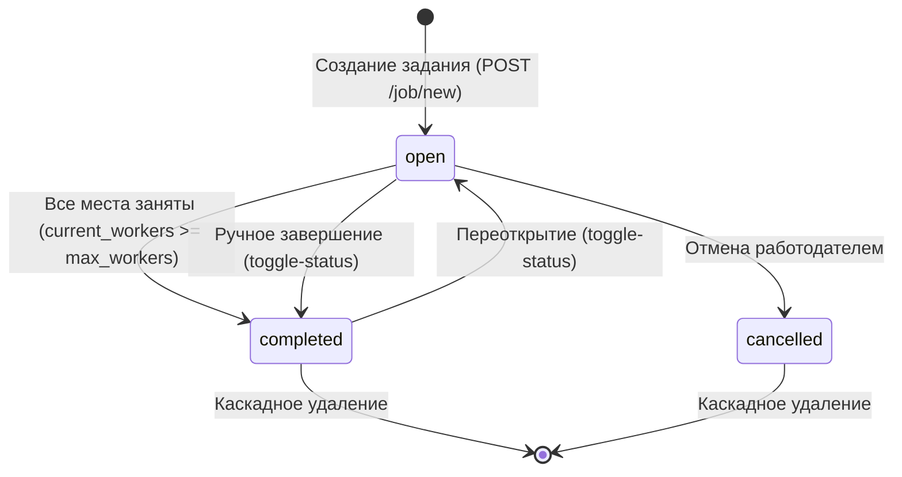
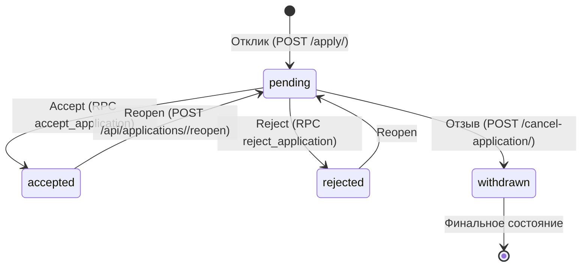
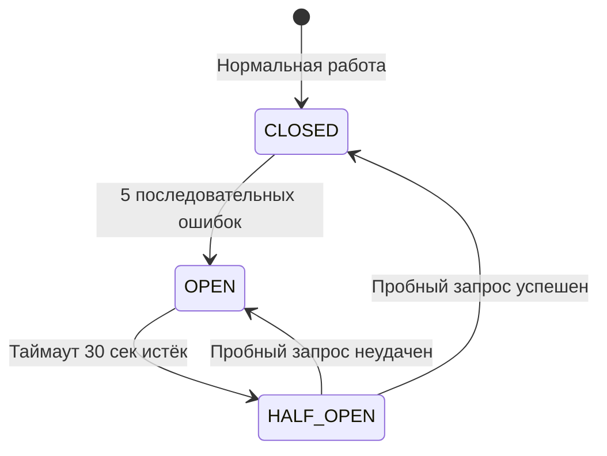

# Бизнес-логика — Трудник (Trudnik)

> Модель данных, бизнес-процессы, состояния и жизненные циклы.
> **Актуализировано:** 2026-06-17 | **Ветка:** `main` (монетизация отключена, все задания `is_paid=True`)

---

## Бизнес-процессы

### Регистрация и аутентификация

Используется **Supabase Auth** (GoTrue). При регистрации (`/auth/v1/signup`) создаётся пользователь в `auth.users`, затем заполняется профиль в публичной таблице `profiles`. При логине (`/auth/v1/token?grant_type=password`) выдаётся JWT-пара: `access_token` (короткоживущий) и `refresh_token` (долгоживущий).

JWT-токены хранятся в серверной сессии Flask (`session['access_token']`, `session['refresh_token']`). При истечении `access_token` декоратор [`login_required`](../app/decorators.py:14) автоматически обновляет его через `refresh_access_token()` ([`app/utils.py:277`](../app/utils.py:277)), используя эндпоинт `/auth/v1/token?grant_type=refresh_token`.

**Ключевые проверки при регистрации:**
- Обязательные поля: `full_name`, `email`, `password`, `role`
- Роль только `worker` или `employer`
- Для трудника: ИНН (12 цифр), желаемая оплата, опыт, контакты
- Навыки сохраняются через связующую таблицу `user_skills` (с валидацией UUID)

**Источники:**
- [`app/blueprints/auth.py`](../app/blueprints/auth.py:1) — маршруты `/login`, `/register`, `/logout`
- [`app/decorators.py`](../app/decorators.py:14) — `login_required`
- [`app/utils.py:277`](../app/utils.py:277) — `refresh_access_token()`

---

### Создание задания

Работодатель создаёт задание через форму `/job/new`. Бизнес-правила:

1. **Стоп-слова** — проверка текста на наличие слов, указывающих на трудовые отношения (ст. 15 ТК РФ): «ставка», «зарплата», «штат», «трудовая», «график», «постоянная работа», «вахта». При обнаружении — ошибка валидации.
2. **Геокодирование** — адрес преобразуется в координаты (lat/lng) через Яндекс.Карты API.
3. **`is_paid=True`** — на ветке `main` монетизация отключена, все задания публикуются как оплаченные.
4. **`status='open'`** — новое задание всегда создаётся в статусе «открыто».
5. **`max_workers`** — максимальное количество трудников (по умолчанию 1).
6. **Фото** — загружаются через Supabase Storage в бакет `job-photos`.

**Источник:** [`app/blueprints/jobs.py:23`](../app/blueprints/jobs.py:23) — стоп-слова, [`app/blueprints/jobs.py:61`](../app/blueprints/jobs.py:61) — форма создания

---

### Поиск заданий

Поиск построен на **PostgREST-фильтрах** с серверной фильтрацией. Поддерживаемые параметры:

| Параметр | Тип фильтра | Описание |
|----------|-------------|----------|
| `city` | `ilike.*city*` | Поиск по городу (нечёткий) |
| `payment_min` / `payment_max` | `gte` / `lte` | Диапазон оплаты |
| `religion` | `eq.{religion}` | Фильтр по религии |
| `q` (FTS) | `search_vector=fts.russian.{q}` | Полнотекстовый поиск (русский) |
| `skills` | Серверная фильтрация | Фильтрация по навыкам (post-query) |
| `lat` / `lng` / `radius` | Серверная фильтрация | Гео-фильтрация через `calculate_distance()` ([`app/utils.py:262`](../app/utils.py:262)) |

**Сортировка:** `newest` (по дате создания), `date_desc` (по дате задания), `payment_asc` / `payment_desc` (по оплате).

**Дополнительные фильтры:**
- Только открытые и не истёкшие задания (`status IN ('open','completed')`, `expires_at > now`)
- Исключаются задания от работодателей, заблокировавших текущего трудника (проверка через `blacklists`)

**Источники:**
- [`app/blueprints/jobs.py:61`](../app/blueprints/jobs.py:61) — `index()`
- [`app/services/job_service.py:72`](../app/services/job_service.py:72) — `build_job_query()`

---

### Отклик на задание

Трудник откликается на задание (`POST /apply/<job_id>`). **Проверки выполняются последовательно:**

1. **Дубликат** — нельзя откликнуться дважды на одно задание
2. **Своё задание** — работодатель не может откликнуться на собственное задание
3. **Чёрный список** — если работодатель заблокировал трудника → ошибка 403
4. **Статус задания** — разрешён только `status='open'`
5. **Свободные места** — `current_workers < max_workers`

При успехе: создаётся запись в `applications` (status=pending), работодателю отправляется уведомление `application_received`.

**Источник:** [`app/blueprints/applications.py:13`](../app/blueprints/applications.py:13) — `apply_job()`

---

### Accept / Reject через RPC

Принятие и отклонение заявок выполняется **атомарно** через хранимые процедуры PostgreSQL (RPC):

- **`accept_application(app_id)`** — обновляет статус заявки на `accepted`, инкрементирует `current_workers` в задании. Если `current_workers` достигает `max_workers`, задание переводится в `completed`.
- **`reject_application(app_id)`** — обновляет статус заявки на `rejected`.

Обе процедуры используют `SECURITY DEFINER` для атомарного обновления двух таблиц в одной транзакции, минуя RLS.

**API-эндпоинты** (вынесены на объект `app` для надёжности роутинга):
- `POST /api/applications/<app_id>/accept` → `accept_application`
- `POST /api/applications/<app_id>/reject` → `reject_application`
- `POST /api/applications/<app_id>/reopen` → сброс статуса на `pending`

**Источники:**
- [`app/__init__.py:273`](../app/__init__.py:273) — API-роуты accept/reject/reopen
- [`app/blueprints/applications.py`](../app/blueprints/applications.py:1) — `api_handle_application()`

---

### Бронирование мест

Модель «мест» в задании:
- **`max_workers`** — максимальное количество трудников (задаётся работодателем, ≥1)
- **`current_workers`** — текущее количество принятых трудников

При каждом `accept` RPC `accept_application` атомарно увеличивает `current_workers`. Когда `current_workers >= max_workers`, задание автоматически переводится в статус `completed`.

Проверка при отклике: `current_workers < max_workers` — иначе «Места заполнены».

---

### Приглашение трудника

Работодатель может пригласить трудника на задание (`POST /api/invite`).

**Проверки:**
- Владелец задания (только автор может приглашать)
- Статус задания — только `open`
- Дубликат приглашения (тот же работник на то же задание)

**Процесс:**
1. Создаётся запись в `invitations` (status=pending)
2. Трудник получает уведомление `invitation`
3. Трудник может принять/отклонить приглашение

**Источник:** [`app/blueprints/jobs_api.py`](../app/blueprints/jobs_api.py:1) — `POST /api/invite`

---

### Каскадное удаление задания

RPC **`delete_job_cascade(job_id)`** — удаляет задание и все связанные данные:
- `job_photos`
- `job_skills`
- `applications`
- `messages` (через application_id)
- `invitations`
- `favorites` / `job_favorites`

Вызывается администратором или владельцем задания.

**Источник:** [`app/blueprints/admin.py`](../app/blueprints/admin.py:1)

---

### Каскадное удаление пользователя

RPC **`delete_user_cascade(user_id)`** — удаляет пользователя (из `auth.users` и `profiles`) и все связанные данные:
- Задания пользователя (через `delete_job_cascade` для каждого)
- Отклики
- Сообщения
- Уведомления
- Избранное
- Чёрный список
- Оценки
- Push-подписки
- Email-лог

Вызывается администратором (`/admin/delete-user/<id>`) или самим пользователем (`/profile/delete-account`).

---

### Чат

Чат доступен только между участниками **accepted-заявки** (работодатель ↔ трудник).

**Ключевые правила:**
1. Доступ к чату — только участники заявки (проверка `worker_id` или `employer_id` через join с `jobs`)
2. **XSS-санитизация** — все сообщения экранируются через `html.escape()` перед сохранением
3. Максимальная длина сообщения — 2000 символов
4. **Доставка в реальном времени** — через Redis Pub/Sub + WebSocket
5. **Polling** — `GET /api/messages/poll?after=<timestamp>` для fallback-доставки
6. При отправке сообщения собеседник получает уведомление `new_message`

**Источники:**
- [`app/blueprints/chat.py`](../app/blueprints/chat.py:1)
- [`app/services/redis_publisher.py`](../app/services/redis_publisher.py:1)

---

### Рейтинговая система

**UPSERT-модель:** одна оценка от одного пользователя другому за одно задание. Повторная оценка перезаписывает предыдущую.

**Процесс:**
1. `POST /api/ratings` — создаёт/обновляет запись в `ratings` (UPSERT по `rater_user_id + rated_user_id + job_id`)
2. `update_rating()` ([`app/utils.py:546`](../app/utils.py:546)) — пересчитывает средний рейтинг пользователя:
   - Запрашивает все оценки пользователя через `supabase_admin_request`
   - Вычисляет среднее арифметическое, округляет до 1 знака
   - Обновляет поле `rating` в профиле через `supabase_admin_request`

**Проверки:**
- Нельзя оценить себя
- Необходимо участие в задании (через `applications`)
- Рейтинг от 1 до 5

**Источник:** [`app/blueprints/ratings.py`](../app/blueprints/ratings.py:1)

---

### Избранное

Два типа избранного:
- **Задания** (`job_favorites`) — трудник сохраняет интересные задания
- **Пользователи/работодатели** (`favorites`) — пользователь сохраняет других пользователей

**API:**
- `POST /favorite/<type>/<id>` — добавить (`type`: `job` или `employer`)
- `POST /unfavorite/<type>/<id>` — убрать
- `GET /api/favorites/status?ids=...&type=...` — массовая проверка статусов

**Источник:** [`app/blueprints/favorites.py`](../app/blueprints/favorites.py:1)

---

### Чёрный список

Любой пользователь может заблокировать другого. При блокировке:
- Заблокированный трудник не видит задания заблокировавшего работодателя
- Заблокированный не может откликаться на задания
- Проверка происходит при каждом отклике (`/apply/<job_id>`) и при фильтрации списка заданий

**API:** `POST /blacklist/<id>`, `POST /unblock/<id>`

**Источник:** [`app/blueprints/blacklist.py`](../app/blueprints/blacklist.py:1)

---

### Система уведомлений

**14 типов уведомлений** (определены в [`app/services/notification_service.py:22`](../app/services/notification_service.py:22)):

| Ключ | Описание |
|------|----------|
| `status_change` | Изменение статуса задания |
| `application_received` | Новый отклик (→ работодателю) |
| `application_accepted` | Отклик принят (→ труднику) |
| `application_rejected` | Отклик отклонён (→ труднику) |
| `worker_accepted` | Работник принят (→ работодателю) |
| `worker_rejected` | Работник отклонён (→ работодателю) |
| `worker_applied` | Отклик работника |
| `new_application` | Новая заявка |
| `force_complete` | Завершение задания |
| `withdraw` | Отзыв отклика |
| `job_cancelled` | Задание отменено |
| `invitation` | Приглашение (→ труднику) |
| `new_message` | Новое сообщение в чате |
| `cheque_reminder` | Напоминание о чеке |

**Каналы доставки (три уровня):**
1. **WebSocket** (мгновенно) — через Redis Pub/Sub → [`redis_publisher.publish_notification()`](../app/services/redis_publisher.py:1)
2. **Push-уведомления** (с задержкой) — через Celery-задачу [`send_push_notification`](../app/tasks/push_tasks.py:1) (Web Push API, VAPID)
3. **Email** (с задержкой) — через Celery-задачу [`send_email_notification`](../app/tasks/email_tasks.py:1) (SMTP)

**Настройки:** каждый пользователь может отключить отдельные типы уведомлений и каналы доставки (`email_enabled`, `push_enabled`) через `POST /api/notifications/settings`.

**Источники:**
- [`app/services/notification_service.py`](../app/services/notification_service.py:1)
- [`docs/notifications-v2.md`](docs/notifications-v2.md)

---

### Email-уведомления

Отправка email через **SMTP** (настраивается в [`app/config.py:35`](../app/config.py:35)):
- Хост, порт, TLS/SSL, учётные данные
- Дневной лимит: `SMTP_DAILY_LIMIT` (по умолчанию 1000)
- Пауза между отправками: `SMTP_RATE_LIMIT_PAUSE` (по умолчанию 1 сек)
- Адрес отправителя: `SMTP_FROM_EMAIL`

**Шаблоны писем:**
- [`app/templates/email/notification.html`](../app/templates/email/notification.html) — HTML-версия
- [`app/templates/email/notification.txt`](../app/templates/email/notification.txt) — текстовая версия
- [`app/templates/email/chat_message.html`](../app/templates/email/chat_message.html) — уведомление о сообщении

**Логирование:** Все отправки записываются в таблицу `email_log` с полями: `id`, `user_id`, `email_to`, `subject`, `status` (sent/failed), `error_message`, `created_at`.

**Celery-задачи:** [`app/tasks/email_tasks.py`](../app/tasks/email_tasks.py:1)

---

### Push-уведомления

**Web Push API** с VAPID-ключами (RFC 8292). Настраивается в [`app/config.py:62`](../app/config.py:62):
- `VAPID_PRIVATE_KEY`
- `VAPID_PUBLIC_KEY`
- `VAPID_CLAIMS_EMAIL` / `VAPID_CLAIMS_SUBJECT`

**Процесс:**
1. Клиент подписывается через Service Worker → `POST /api/push/subscribe` (сохраняет endpoint + keys в `push_subscriptions`)
2. При создании уведомления → Celery-задача `send_push_notification` отправляет push через [`pywebpush`](../app/services/push_service.py:1)
3. Отписка: `POST /api/push/unsubscribe` — удаляет запись подписки

**Источники:**
- [`app/services/push_service.py`](../app/services/push_service.py:1)
- [`app/tasks/push_tasks.py`](../app/tasks/push_tasks.py:1)
- [`migrations/043_add_push_subscriptions.sql`](../migrations/043_add_push_subscriptions.sql:1)

---

### WebSocket / Реальное время

**Два канала реального времени:**

1. **Чат** — сообщения доставляются мгновенно через WebSocket. Архитектура:
   - FastAPI WebSocket-сервер (запускается вместе с Flask через [`asgi.py`](asgi.py:1))
   - Redis Pub/Sub как message broker между HTTP-обработчиками и WebSocket-клиентами
   - [`redis_publisher.publish_message()`](../app/services/redis_publisher.py:1) — публикация сообщения при отправке

2. **Live-уведомления** — уведомления доставляются мгновенно:
   - При создании уведомления → [`redis_publisher.publish_notification()`](../app/services/redis_publisher.py:1)
   - WebSocket-сервер подписан на канал `user:<user_id>:notifications`

**Конфигурация:**
- `REDIS_URL` — Redis для Pub/Sub и Celery-брокера
- `WEBSOCKET_PORT` / `WEBSOCKET_URL` — настройки WebSocket-сервера
- JWT-токен для аутентификации WebSocket-соединений генерируется через [`inject_ws_config`](../app/__init__.py:98)

---

### Монетизация (ОТКЛЮЧЕНА)

На ветке `main` монетизация **полностью отключена**:
- Все задания публикуются с `is_paid=True` (без оплаты)
- Таблицы монетизации (`monetization_settings`, `contact_payments`, `job_payments`, `tariff_settings`) существуют, но не используются
- Функционал «раскрытия контакта за плату» неактивен
- Чеки самозанятого (`receipts`) и история наймов (`hires`) не используются в основной бизнес-логике

---

### Административные функции

Админ-панель (`/admin`, только для роли `admin`):

| Вкладка | Функции |
|---------|---------|
| **Дашборд** | Статистика: всего пользователей (по ролям), всего заданий (по статусам), ожидающие верификации |
| **Пользователи** | Поиск, фильтрация по роли, просмотр профилей |
| **Задания** | Поиск, фильтрация по статусу, просмотр |
| **Верификация** | Подтверждение/отклонение верификации работодателей |
| **Справочники** | Управление навыками (`skills`) и религиями (`religions`) |

**Привилегированные операции:**
- `POST /admin/verify-employer/<id>` — установка `verification_status='verified'`
- `POST /admin/delete-user/<id>` — каскадное удаление через RPC `delete_user_cascade`
- `POST /admin/dictionaries` — управление справочниками

**Источник:** [`app/blueprints/admin.py`](../app/blueprints/admin.py:1)

---

## Модель данных

### Таблицы БД

Активные таблицы (18):

| Таблица | Назначение | Ключевые поля |
|---------|------------|---------------|
| `profiles` | Профили пользователей (создаются Supabase Auth) | `id` (UUID), `role`, `full_name`, `city`, `religion`, `skills`, `rating`, `verification_status`, `notification_prefs`, `inn`, `is_self_employed`, `desired_payment`, `experience`, `contact` |
| `jobs` | Задания | `id`, `employer_id` → `profiles`, `status` (open/completed/cancelled), `max_workers`, `current_workers`, `is_paid`, `payment_amount`, `address`, `city`, `lat`, `lng`, `work_type`, `preferred_religion`, `expires_at`, `tariff`, `search_vector` (GIN-index для FTS) |
| `applications` | Отклики на задания | `id`, `job_id` → `jobs`, `worker_id` → `profiles`, `status` (pending/accepted/rejected/withdrawn), `created_at` |
| `messages` | Сообщения в чатах | `id` (BIGSERIAL), `application_id` → `applications`, `sender_id` → `profiles`, `content`, `created_at` |
| `notifications` | Уведомления | `id`, `user_id` → `profiles`, `type`, `message`, `is_read`, `data` (JSONB), `created_at` |
| `ratings` | Оценки пользователей | `id`, `rater_user_id`, `rated_user_id`, `job_id`, `rating` (1-5), `comment` |
| `favorites` | Избранное (пользователи) | `id`, `user_id`, `favorite_user_id` |
| `job_favorites` | Избранное (задания) | `id`, `user_id`, `job_id` |
| `blacklists` | Чёрный список | `id`, `user_id` (кто заблокировал), `blocked_user_id` (кого) |
| `invitations` | Приглашения | `id`, `job_id`, `employer_id`, `worker_id`, `status` (pending/accepted/rejected) |
| `skills` | Справочник навыков | `id`, `name` |
| `religions` | Справочник религий | `id`, `name` |
| `user_skills` | Связь пользователь-навыки | `user_id` → `profiles`, `skill_id` → `skills` |
| `job_skills` | Связь задание-навыки | `job_id` → `jobs`, `skill_id` → `skills` |
| `job_photos` | Фото заданий | `id`, `job_id` → `jobs`, `url` (Supabase Storage) |
| `push_subscriptions` | Web Push подписки | `id`, `user_id`, `endpoint`, `p256dh`, `auth`, `created_at` |
| `email_log` | Лог email-отправки | `id`, `user_id`, `email_to`, `subject`, `status`, `error_message`, `created_at` |
| `employer_details` | Детали работодателя | `id`, `user_id`, `organization_name`, `description` |

Таблицы монетизации (отключены, 6):

| Таблица | Назначение |
|---------|------------|
| `monetization_settings` | Настройки монетизации (ключ-значение) |
| `contact_payments` | Платежи за раскрытие контакта |
| `job_payments` | Платежи за публикацию/продление |
| `tariff_settings` | Настройки тарифов |
| `receipts` | Чеки самозанятого |
| `hires` | История наймов |

Служебные (1): `schema_migrations` — версионирование миграций.

---

### RPC-процедуры

| Процедура | Назначение | Атомарность |
|-----------|------------|-------------|
| `accept_application(app_id UUID)` | Принять отклик: обновить статус заявки + инкремент `current_workers` | Да (SECURITY DEFINER, одна транзакция) |
| `reject_application(app_id UUID)` | Отклонить отклик: обновить статус заявки | Да |
| `delete_job_cascade(job_id UUID)` | Каскадное удаление задания и всех связанных данных | Да |
| `delete_user_cascade(user_id UUID)` | Каскадное удаление пользователя и всех связанных данных | Да |
| `exec_sql(query TEXT)` | Выполнение произвольного SQL (только для admin, service_role) | Нет |

**Источник:** [`app/utils.py:466`](../app/utils.py:466) — `supabase_rpc()`

---

### RLS-политики (принципы)

Row Level Security включён на всех публичных таблицах. Основные принципы:

- **`profiles`** — SELECT доступен всем аутентифицированным; UPDATE только владельцу; INSERT через service_role при регистрации
- **`jobs`** — SELECT всем; INSERT только employer; UPDATE только владельцу; DELETE владельцу или admin
- **`applications`** — SELECT участникам (работник или работодатель задания); INSERT только worker; UPDATE статуса — владельцу задания
- **`notifications`** — SELECT только получателю; INSERT только service_role (системное)
- **`messages`** — SELECT только участникам accepted-заявки; INSERT только участнику
- **`ratings`** — SELECT всем; INSERT/UPDATE только участнику задания
- **`blacklists`** — SELECT/INSERT/DELETE только владельцу

**Источник:** [`migrations/001_setup_rls.sql`](../migrations/001_setup_rls.sql:1), [`migrations/002_apply_rls_policies.sql`](../migrations/002_apply_rls_policies.sql:1)

---

### CHECK-constraints

| Таблица | Ограничение | Описание |
|---------|-------------|----------|
| `jobs` | `max_workers >= 1` | Минимум 1 место |
| `jobs` | `current_workers >= 0` | Неотрицательное число |
| `jobs` | `status IN ('open','completed','cancelled')` | Допустимые статусы |
| `applications` | `status IN ('pending','accepted','rejected','withdrawn')` | Допустимые статусы |
| `ratings` | `rating BETWEEN 1 AND 5` | Оценка от 1 до 5 |
| `invitations` | `status IN ('pending','accepted','rejected')` | Допустимые статусы |

---

## Состояния и переходы

### Жизненный цикл задания

**Условия перехода `open → completed`:**
- Автоматически: когда RPC `accept_application` обнаруживает `current_workers >= max_workers`
- Вручную: `POST /job/<id>/toggle-status` (только владелец)

**Условия перехода `completed → open`:**
- `POST /job/<id>/toggle-status` (только владелец)

---

### Жизненный цикл заявки

**Проверки при withdrawn:**
- Окно отзыва: не позднее 12 часов до начала задания ([`check_withdraw_window()`](../app/utils.py:661))
- Только владелец отклика

---

### Circuit Breaker

**Два экземпляра:**
- `_cb_supabase` — для пользовательских запросов (`supabase_request`)
- `_cb_admin` — для административных запросов (`supabase_admin_request`)

При разомкнутой цепи возвращается `SupabaseResponse(ok=False, status_code=503, text='Circuit breaker open')`.

**Источник:** [`app/utils.py:29`](../app/utils.py:29) — класс `CircuitBreaker`
