# Фронтенд — Трудник (Trudnik)

> Страницы, UI-компоненты, JavaScript-функциональность, навигация, адаптивность и accessibility.
> **Актуализировано:** 2026-06-17 | **Ветка:** `main`
> **Связанные документы:** [`ARCHITECTURE.md`](ARCHITECTURE.md), [`API_REFERENCE.md`](API_REFERENCE.md), [`TEST_CHECKLIST.md`](TEST_CHECKLIST.md)

---

## Оглавление

1. [Список страниц и UI-элементов](#1-список-страниц-и-ui-элементов)
2. [Общие UI-компоненты (base.html)](#2-общие-ui-компоненты-basehtml)
3. [JavaScript-функциональность](#3-javascript-функциональность)
4. [Сообщения и обратная связь](#4-сообщения-и-обратная-связь)
5. [Карта навигации и ролевые представления](#5-карта-навигации-и-ролевые-представления)
6. [Адаптивность и мобильная версия](#6-адаптивность-и-мобильная-версия)
7. [Доступность (Accessibility)](#7-доступность-accessibility)

---

## 1. Список страниц и UI-элементов

| # | Шаблон | Маршрут | Уровень доступа | Ключевые UI-элементы |
|---|--------|---------|-----------------|----------------------|
| 1 | [`index.html`](../templates/index.html) | `/` | 🔓 public | Поиск заданий, карточки заданий, фильтры (город, оплата, навыки, радиус, сортировка), CTA-панель (для гостей), карта (Яндекс) |
| 2 | [`workers.html`](../templates/workers.html) | `/workers` | 🔓 public | Поиск трудников, карточки трудников, фильтр навыков, сортировка, кнопка «Пригласить» (для employer) |
| 3 | [`job_detail.html`](../templates/job_detail.html) | `/jobs/<id>` | 🔓 public | Описание, фото, карта (Яндекс), кнопки действий (отклик/accept/reject), таймер обратного отсчёта, список откликов (для владельца) |
| 4 | [`job_new.html`](../templates/job_new.html) | `/job/new` | 🏢 employer | Форма: название, описание, адрес, оплата, дата, max_workers, фото, навыки, религия |
| 5 | — (edit — тот же шаблон) | `/job/<id>/edit` | 🏢 employer | Предзаполненная форма создания, кнопка «Сохранить» |
| 6 | [`my_jobs.html`](../templates/my_jobs.html) | `/my-jobs` | 🏢 employer | Список заданий работодателя, фильтрация по статусу, чекбоксы для массовых действий (delete, cancel), счётчик откликов |
| 7 | [`my_applications.html`](../templates/my_applications.html) | `/my-applications` | 👤 worker | Список откликов трудника, фильтрация по статусу (pending/accepted/rejected/withdrawn) |
| 8 | [`invitations.html`](../templates/invitations.html) | `/invitations` | 🔒 auth | Табы «Полученные» / «Отправленные», списки приглашений с кнопками принять/отклонить |
| 9 | [`favorites.html`](../templates/favorites.html) | `/favorites` | 🔒 auth | Два раздела: избранные задания и избранные работодатели, кнопка «Убрать» |
| 10 | [`chat.html`](../templates/chat.html) | `/chat/<application_id>` | 🔒 auth | История сообщений, поле ввода (≤2000 симв), WebSocket live-обновление, статус соединения |
| 11 | [`chats_list.html`](../templates/chats_list.html) | `/chats` | 🔒 auth | Список активных чатов, последнее сообщение, собеседник |
| 12 | [`profile.html`](../templates/profile.html) | `/profile` | 🔒 auth | Информация профиля (employer), статистика заданий, статус верификации, кнопка «Редактировать» |
| 13 | [`profile_worker.html`](../templates/profile_worker.html) | `/profile` | 🔒 auth | Информация профиля (worker), навыки, рейтинг, кнопка «Редактировать» |
| 14 | — (profile editor) | `/profile/update` | 🔒 auth | Форма: имя, город, навыки, контакты, фото, ИНН, самозанятость |
| 15 | [`verify_employer.html`](../templates/verify_employer.html) | `/verify-employer` | 🏢 employer | Загрузка документа, статус верификации |
| 16 | [`employers.html`](../templates/employers.html) | `/employers` | 🔓 public | Список работодателей, фильтры (город, радиус, поиск, верификация), кнопка «В избранное» |
| 17 | [`employer_detail.html`](../templates/employer_detail.html) | `/employers/<id>` | 🔓 public | Профиль работодателя, статистика, активные задания, отзывы |
| 18 | [`notifications.html`](../templates/notifications.html) | `/notifications` | 🔒 auth | Список уведомлений с пагинацией, кнопки «Прочитано» / «Отметить все» / «Удалить все» |
| 19 | [`notification_settings.html`](../templates/notification_settings.html) | `/notifications/settings` | 🔒 auth | Переключатели типов уведомлений, email/push-настройки |
| 20 | [`blacklist.html`](../templates/blacklist.html) | `/blacklist` | 🔒 auth | Список заблокированных, кнопка «Разблокировать» |
| 21 | [`admin.html`](../templates/admin.html) | `/admin` | 👑 admin | Дашборд, вкладки: dashboard/users/jobs/verification/dictionaries, таблицы, кнопки действий |
| 22 | — (admin users) | `/admin?tab=users` | 👑 admin | Таблица пользователей, поиск, фильтр по роли, кнопки удалить/верифицировать |
| 23 | — (admin jobs) | `/admin?tab=jobs` | 👑 admin | Таблица заданий, поиск, фильтр по статусу |
| 24 | — (admin dictionaries) | `/admin?tab=dictionaries` | 👑 admin | CRUD навыков и религий, drag-and-drop reorder |
| 25 | [`login.html`](../templates/login.html) | `/login` | 🔓 public | Форма email + password, ссылка на регистрацию |
| 26 | [`register.html`](../templates/register.html) | `/register` | 🔓 public | Форма: role (radio), full_name, email, password, навыки (для worker), ИНН, город, контакты |
| 27 | [`rate_workers.html`](../templates/rate_workers.html) | `/jobs/<id>/rate-workers` | 🏢 employer | Список accepted трудников, форма оценки (звёзды + комментарий) |
| 28 | [`user_ratings.html`](../templates/user_ratings.html) | `/ratings/user/<id>` | 🔓 public | Список отзывов о пользователе, средний рейтинг |
| 29 | [`error.html`](../templates/error.html) | — (ошибка) | 🔓 public | Код ошибки, сообщение, кнопка «На главную» |
| 30 | [`offline.html`](../templates/offline.html) | `/offline` | 🔓 public | Сообщение «Нет соединения», кнопка «Попробовать снова» |

---

## 2. Общие UI-компоненты (base.html)

Все страницы наследуют [`base.html`](../templates/base.html), который формирует общий layout.

### 2.1 Header

- **Логотип «Трудник»** — кликабелен, ведёт на `/`; клик на главной странице показывает toast с `git_version`
- **Строка поиска** — десктоп: поле ввода с иконкой поиска, отправка через `handleSearchSubmit()`; мобильный: скрыто, показывается по клику на иконку лупы (`toggleMobileSearch()`)
- **Меню навигации (десктоп)** — ссылки зависят от роли:
  - Гость: «Войти», «Регистрация»
  - Worker: «Главная», «Трудники», «Приглашения» (с бейджем), «Избранное», «Профиль»
  - Employer: «Мои задания» (с бейджем откликов), «Трудники», «Приглашения», «Избранное», «Профиль»
  - Admin: дополнительная ссылка «Админ-панель»
- **Иконки уведомлений** — колокольчик (🔔) с бейджем `unread_notifications`
- **Мобильная навигация** — гамбургер-меню (`menu_icon`), раскрывающееся по клику

### 2.2 Bottom Nav (мобильная панель)

Фиксированная нижняя панель, видна только на мобильных (`class="bottom-nav"`):

| Иконка | Ссылка | Кому видна |
|--------|--------|------------|
| 🏠 Главная | `/` | Всем |
| 👷 Трудники | `/workers` | Всем |
| 💬 Чаты | `/chats` | 🔒 auth |
| ❤️ Избранное | `/favorites` | 🔒 auth |
| 👤 Профиль | `/profile` | 🔒 auth |

Активная ссылка подсвечена оранжевым (`#d87706`). Учитывает `safe-area-inset-bottom`.

### 2.3 Toast-уведомления

Глобальный контейнер `#toast-container` (фиксированный, `top-4 right-4`, z-index 9999). Toast-сообщения создаются через JavaScript-функцию `showToast(message, type)`.

### 2.4 Confirm Modal

Модальное окно подтверждения действия:
- `id="confirm-modal"`, скрыто по умолчанию
- Заголовок, текст, кнопки «Подтвердить» / «Отмена»
- Вызывается через `showConfirm(title, message, onConfirm)`
- `role="dialog"`, `aria-modal="true"`, закрытие по Escape

### 2.5 Loading Overlay

Полноэкранный оверлей со спиннером:
- `id="loading-overlay"`, скрыт по умолчанию
- Показывается при AJAX-запросах, блокирует UI
- Автоматически скрывается при получении ответа или по таймауту (30 сек)

### 2.6 Offline Bar

Жёлтая полоса вверху страницы:
- `id="offline-bar"`, скрыта по умолчанию
- Показывается при детектировании `navigator.onLine === false`
- Текст: «Нет соединения с интернетом»

### 2.7 PWA Banner (установка)

Баннер для установки PWA:
- `id="install-banner"`, скрыт по умолчанию
- Показывается при событии `beforeinstallprompt`
- Кнопка «Установить приложение»
- Скрывается, если `display-mode: standalone`

### 2.8 CTA-панель (для гостей)

На главной странице для неавторизованных пользователей:
- Призыв зарегистрироваться
- Кнопки «Я работодатель» и «Я трудник» (ведут на `/register`)

### 2.9 Панель фильтра навыков (\_filter_skills.html)

Include-шаблон [`_filter_skills.html`](../templates/_filter_skills.html):
- Загружает список навыков через `/api/skills`
- Чекбоксы для каждого навыка с локальным поиском
- Мобильный: Bottom Sheet (закрывается свайпом вниз)
- Десктоп: боковая панель или модальное окно

---

## 3. JavaScript-функциональность

### 3.1 Глобальные функции

Определены в `<script nonce>` блоках [`base.html`](../templates/base.html) и доступны на всех страницах:

| Функция | Назначение |
|---------|-----------|
| `handleSearchSubmit(event)` | Обработка отправки поискового запроса: редирект на `/?q=...` или `/workers?q=...` |
| `toggleMobileSearch()` | Показать/скрыть строку поиска на мобильных устройствах |
| `showToast(message, type)` | Показать toast-уведомление (success/error/warning/info) |
| `showConfirm(title, message, onConfirm)` | Показать модальное окно подтверждения; fallback — нативный `confirm()` если DOM не найден |
| `formatDate(dateString)` | Форматирование даты на клиенте |
| `initFloatingLabels()` | Инициализация «плавающих» label для `<select>`, MutationObserver для динамических элементов |

### 3.2 CSRF-автоматизация

- `<meta name="csrf-token" content="{{ csrf_token }}">` в `<head>`
- Все `<form>` автоматически получают скрытое поле `<input type="hidden" name="_csrf_token">`
- Все `fetch()` запросы автоматически получают заголовок `X-CSRF-Token` через глобальный обработчик

### 3.3 Защита от двойной отправки

- Все `<form>` при submit блокируются на 3 секунды (кнопка `disabled`, повторный submit предотвращён)
- AJAX-кнопки (accept/reject/favorite) блокируются до получения ответа
- Кнопка разблокируется после успеха/ошибки

### 3.4 Loading Overlay

Триггеры показа:
- Перед любым `fetch()` с методом POST/PUT/DELETE
- Перед отправкой формы
- Ручной вызов: `showLoadingOverlay()`, `hideLoadingOverlay()`

Автоматическое скрытие:
- После получения ответа (успех или ошибка)
- По таймауту 30 секунд с показом ошибки

### 3.5 PWA-функциональность

| Событие/Функция | Назначение |
|-----------------|-----------|
| `beforeinstallprompt` | Сохранение события, показ `#install-banner` |
| Кнопка «Установить» | Вызов `deferredPrompt.prompt()`, скрытие баннера |
| `appinstalled` | Скрытие баннера, toast «Приложение установлено» |
| `display-mode: standalone` | Скрытие баннера при запуске как PWA |
| Service Worker `sw.js` | Кеширование статики, офлайн-страница, фоновое обновление |
| Обновление SW | При обнаружении новой версии → toast «Доступно обновление. Перезагрузите страницу» |

### 3.6 Офлайн-детектирование

- `window.addEventListener('online')` → скрыть `#offline-bar`, toast «Соединение восстановлено», отправить offline-очередь
- `window.addEventListener('offline')` → показать `#offline-bar`
- Service Worker перехватывает запросы, отдаёт `/offline` при отсутствии сети

### 3.7 Floating Label

- Инициализация всех `<select>` с классом `floating-label`
- `MutationObserver` следит за динамически добавленными select (например, в модальных окнах)
- При изменении значения select — label перемещается вверх

### 3.8 Версия приложения

- `git_version` рендерится в `<meta name="git-version">`
- Клик по логотипу на главной странице → toast с хешем коммита
- Кешируется при старте приложения (контекстный процессор)

### 3.9 AJAX — Отклики

Файл: `static/js/applications.js`

| Функция | Назначение |
|---------|-----------|
| `acceptApplication(id)` | POST `/api/applications/<id>/accept` → обновление UI |
| `rejectApplication(id)` | POST `/api/applications/<id>/reject` → обновление UI |
| `reopenApplication(id)` | POST `/api/applications/<id>/reopen` → обновление UI |
| `batchAction(action)` | POST `/api/applications/batch` → массовое accept/reject |

**Offline Queue:**
- При ошибке сети запрос сохраняется в `localStorage` (ключ `trudnik_offline_queue`)
- При восстановлении сети очередь отправляется в порядке FIFO
- Обработка ошибок: 404 (задание удалено), 409 (места заполнены)
- Предотвращение `QuotaExceededError` при переполнении localStorage (5MB)
- Очистка очереди после успешной отправки всех запросов

### 3.10 AJAX — Избранное

Файл: `static/js/favorites.js`

| Функция | Назначение |
|---------|-----------|
| `toggleFavorite(type, id)` | Добавить/убрать из избранного (оптимистичное обновление UI) |
| `loadFavoriteStatuses(ids, type)` | GET `/api/favorites/status` — загрузка статусов для списка |
| `updateFavoriteIcon(element, isFavorite)` | Смена иконки ★/☆ и стилей |

**Оптимистичное обновление:** иконка меняется мгновенно, при ошибке сервера — откатывается с toast «Ошибка».

### 3.11 AJAX — Детали задания

Файл: `static/js/job_detail.js`

| Функция | Назначение |
|---------|-----------|
| `cancelJob(id)` | Отмена задания |
| `restoreJob(id)` | Восстановление отменённого задания |
| `forceCompleteJob(id)` | Принудительное завершение (admin/employer) |
| `initCountdownTimer(expiresAt)` | Таймер обратного отсчёта до `expires_at` |

### 3.12 AJAX — Трудники

Файл: `static/js/workers.js`

| Функция | Назначение |
|---------|-----------|
| `inviteWorker(workerId, jobId)` | POST `/api/invite` — пригласить трудника |
| `toggleBlock(userId)` | Заблокировать/разблокировать пользователя |

**Event delegation:** обработчики навешиваются на родительский контейнер, работают для динамически добавленных карточек.

### 3.13 Чат — Polling + WebSocket

Файл: `static/js/chat.js`

| Функция | Назначение |
|---------|-----------|
| `sendMessage(content)` | POST `/api/send_message` → очистка поля ввода |
| `pollMessages(after)` | GET `/api/messages/poll?after=` → Long-polling |
| `connectWebSocket()` | Подключение к WebSocket (FastAPI) через `trudnik_ws_config` |
| `handleWebSocketMessage(event)` | Обработка входящего сообщения → добавление в DOM |

**Гибридный подход:**
- **Primary:** WebSocket (FastAPI) — мгновенная доставка
- **Fallback:** Polling каждые 3 секунды, если WebSocket недоступен
- **Автопереподключение:** WebSocket переподключается с экспоненциальной задержкой при разрыве
- **Очистка:** `clearInterval(pollTimer)` при уходе со страницы (Memory Leak prevention)

### 3.14 Filter Drawer

Файл: `static/js/filter_skills.js`

| Функция | Назначение |
|---------|-----------|
| `loadSkills()` | GET `/api/skills` → отрисовка чекбоксов |
| `filterSkillsLocally(query)` | Фильтрация чекбоксов по тексту (без запроса к серверу) |
| `openFilterDrawer()` | Открыть панель фильтра |
| `closeFilterDrawer()` | Закрыть панель фильтра |

**Режимы:**
- **Мобильный:** Bottom Sheet, закрывается свайпом вниз (touch event) или крестиком
- **Десктоп:** Боковая панель/модальное окно

---

## 4. Сообщения и обратная связь

### 4.1 Flash-сообщения

Серверные flash-сообщения (Flask `flash()`):

| Категория | Цвет | Иконка | Пример |
|-----------|------|--------|--------|
| `success` | Зелёный (`#10b981`) | ✓ | «Задание создано» |
| `error` | Красный (`#ef4444`) | ✗ | «Неверный email или пароль» |
| `warning` | Жёлтый (`#f59e0b`) | ⚠ | «Заполните обязательные поля» |
| `info` | Синий (`#3b82f6`) | ℹ | «Вы уже откликались» |

**Поток:** серверный `flash()` → рендеринг в Jinja2 → перенос в `window._toastQueue` → `showToast()` на клиенте. После рендеринга flash-сообщения удаляются из DOM (одноразовый показ).

### 4.2 Toast-уведомления

Клиентские toast через `showToast(message, type)`:

| Тип | CSS-класс | Цвет фона | Иконка | Жизненный цикл |
|-----|-----------|-----------|--------|----------------|
| `success` | `.toast-success` | `#f0fdf4` / `#10b981` | ✓ | Показ 5 сек → fade out → удаление |
| `error` | `.toast-error` | `#fef2f2` / `#ef4444` | ✗ | Показ 7 сек → fade out → удаление |
| `warning` | `.toast-warning` | `#fffbeb` / `#f59e0b` | ⚠ | Показ 5 сек → fade out → удаление |
| `info` | `.toast-info` | `#eff6ff` / `#3b82f6` | ℹ | Показ 5 сек → fade out → удаление |

Анимация: slide-in справа + fade-in. Контейнер вмещает до 5 toast одновременно.

### 4.3 Валидация форм

**Серверная валидация (12 правил):**

| Правило | Где применяется |
|---------|----------------|
| Обязательные поля (title, email, password, role) | Регистрация, создание задания |
| Email-формат | Регистрация, логин |
| Длина пароля (≥6 символов) | Регистрация |
| ИНН (12 цифр для worker) | Регистрация, профиль |
| Стоп-слова (ТК РФ ст. 15) | Создание/редактирование задания |
| `max_workers` ≥ 1 | Создание задания |
| Размер файла ≤ 5MB | Аватар, документы верификации |
| MIME-тип (jpg/png/gif/webp/pdf) | Загрузка файлов |
| UUID-валидация | Все ID-параметры |
| Длина сообщения ≤ 2000 симв | Чат |
| Диапазон рейтинга 1-5 | Оценки |
| Дата задания не в прошлом | Создание задания |

**Клиентская валидация:**
- CSS-классы `.is-invalid` / `.is-valid` на полях
- Сообщения об ошибках под полями (`.invalid-feedback`)
- `aria-describedby` связывает поле с ошибкой
- `novalidate` на формах (валидация через JS, не браузерную)

### 4.4 Состояния загрузки

| Тип | Реализация | Когда показывается |
|-----|-----------|-------------------|
| **Loading Overlay** | Полноэкранный `#loading-overlay` со спиннером | AJAX-запросы, отправка форм |
| **Skeleton Loader** | Серые прямоугольники-скелетоны (`.skeleton` CSS-класс) | AJAX-загрузка списков (задания, трудники) |
| **Блокировка кнопок** | `disabled` + спиннер в кнопке | Отправка формы, AJAX-действия |
| **Индикатор в чате** | «Печатает...» (опционально) | — (не реализован) |

### 4.5 Пустые состояния

| Страница | Сообщение | Действие |
|----------|-----------|----------|
| Главная (гость, нет заданий) | «Пока нет заданий» | CTA-панель |
| Главная (worker) | «Задания не найдены» | «Изменить фильтры» |
| Мои задания (employer) | «У вас пока нет заданий» | Кнопка «Создать задание» |
| Мои отклики | «Вы ещё не откликались» | Ссылка «Найти задания» |
| Избранное | «Вы ещё ничего не добавили в избранное» | Ссылки на поиск |
| Чаты | «Нет активных чатов» | — |
| Уведомления | «Нет уведомлений» | — |
| Приглашения | «Нет приглашений» | — |
| Чёрный список | «Чёрный список пуст» | — |
| Поиск трудников | «Ничего не найдено» | «Изменить фильтры» |
| Поиск работодателей | «Работодатели не найдены» | «Изменить фильтры» |

---

## 5. Карта навигации и ролевые представления

### 5.1 Mermaid: Карта навигации

```mermaid
flowchart TD
    Login[Страница входа /login]
    Register[Регистрация /register]

    subgraph Guest[Гость]
        G_Index[Главная /]
        G_Workers[Список трудников /workers]
        G_Employers[Работодатели /employers]
        G_JobDetail[Детали задания /jobs/id]
        G_EmployerDetail[Детали работодателя /employers/id]
        G_UserRatings[Рейтинги /ratings/user/id]
    end

    subgraph Worker[Трудник]
        W_Index[Главная /]
        W_Workers[Список трудников /workers]
        W_JobDetail[Детали задания /jobs/id]
        W_MyApps[Мои отклики /my-applications]
        W_Invitations[Приглашения /invitations]
        W_Chats[Чаты /chats]
        W_Chat[Чат /chat/app_id]
        W_Favorites[Избранное /favorites]
        W_Profile[Профиль /profile]
        W_ProfileEdit[Редактировать профиль /profile/update]
        W_Notifications[Уведомления /notifications]
        W_NotifSettings[Настройки уведомлений /notifications/settings]
        W_Blacklist[Чёрный список /blacklist]
        W_Employers[Работодатели /employers]
        W_EmployerDetail[Детали работодателя /employers/id]
        W_UserRatings[Рейтинги /ratings/user/id]
    end

    subgraph Employer[Работодатель]
        E_Index[Главная /]
        E_Workers[Список трудников /workers]
        E_JobDetail[Детали задания /jobs/id]
        E_JobNew[Создать задание /job/new]
        E_JobEdit[Редактировать задание /job/id/edit]
        E_MyJobs[Мои задания /my-jobs]
        E_Invitations[Приглашения /invitations]
        E_Chats[Чаты /chats]
        E_Chat[Чат /chat/app_id]
        E_Favorites[Избранное /favorites]
        E_Profile[Профиль /profile]
        E_ProfileEdit[Редактировать профиль /profile/update]
        E_Verify[Верификация /verify-employer]
        E_RateWorkers[Оценить трудников /jobs/id/rate-workers]
        E_Notifications[Уведомления /notifications]
        E_NotifSettings[Настройки уведомлений /notifications/settings]
        E_Blacklist[Чёрный список /blacklist]
        E_Employers[Работодатели /employers]
        E_EmployerDetail[Детали работодателя /employers/id]
        E_UserRatings[Рейтинги /ratings/user/id]
    end

    subgraph Admin[Администратор]
        A_Dashboard[Админ-дашборд /admin]
        A_Users[Управление пользователями /admin?tab=users]
        A_Jobs[Управление заданиями /admin?tab=jobs]
        A_Verification[Верификация /admin?tab=verification]
        A_Dictionaries[Справочники /admin?tab=dictionaries]
    end

    Login -->|worker| W_Index
    Login -->|employer| E_MyJobs
    Login -->|admin| A_Dashboard
    Register -->|worker| W_ProfileEdit
    Register -->|employer| E_ProfileEdit
```

### 5.2 Ролевые различия в UI

| Элемент | Guest | Worker | Employer | Admin |
|---------|-------|--------|----------|-------|
| CTA-панель на главной | ✅ Видна | ❌ | ❌ | ❌ |
| Кнопка «Откликнуться» | ❌ | ✅ | ❌ (на своих) | ❌ |
| Кнопки Accept/Reject | ❌ | ❌ | ✅ (на своих) | ❌ |
| Bottom Nav | ✅ (без чатов/избранного/профиля) | ✅ | ✅ | ✅ |
| Бейдж 🔔 уведомлений | ❌ | ✅ | ✅ | ✅ |
| Бейдж приглашений | ❌ | ✅ | ✅ | ❌ |
| Бейдж откликов (на «Мои задания») | ❌ | ❌ | ✅ | ❌ |
| Ссылка «Админ-панель» | ❌ | ❌ | ❌ | ✅ |
| Кнопка «Пригласить» (на трудниках) | ❌ | ❌ | ✅ | ❌ |
| Кнопка «Создать задание» | ❌ | ❌ | ✅ | ✅ |
| Массовые действия с заданиями | ❌ | ❌ | ✅ | ✅ |
| Верификация работодателя | ❌ | ❌ | ✅ | ❌ |
| Оценка трудников | ❌ | ❌ | ✅ | ❌ |

### 5.3 Навигационные переходы

| Со страницы | Куда можно перейти |
|-------------|-------------------|
| Главная `/` | `/jobs/<id>`, `/workers`, `/employers` |
| Детали задания `/jobs/<id>` | Чат (если accepted), `/profile/<employer_id>`, назад |
| Мои задания `/my-jobs` | `/job/<id>/edit`, `/jobs/<id>`, `/job/new` |
| Мои отклики `/my-applications` | `/jobs/<id>`, чат (если accepted) |
| Профиль `/profile` | `/profile/update`, `/verify-employer` (employer), `/ratings/user/<id>` |
| Чат `/chat/<app_id>` | `/chats`, `/jobs/<id>` |
| Админ `/admin` | Вкладки: users, jobs, verification, dictionaries |
| Ошибка 404/500 | Главная `/` |

---

## 6. Адаптивность и мобильная версия

### 6.1 Breakpoints

TailwindCSS-брейкпоинты:

| Префикс | Min-width | Целевые устройства |
|---------|-----------|-------------------|
| (default) | 0px | Мобильные телефоны (портрет) |
| `sm` | 640px | Мобильные телефоны (ландшафт), маленькие планшеты |
| `md` | 768px | Планшеты |
| `lg` | 1024px | Десктопы |
| `xl` | 1280px | Широкие десктопы |

### 6.2 Адаптивные компоненты

| Компонент | Mobile (< 768px) | Desktop (≥ 768px) |
|-----------|-----------------|-------------------|
| **Навигация** | Bottom Nav (фиксированная), гамбургер-меню | Header-меню (горизонтальное) |
| **Поиск** | Скрыт, раскрывается по иконке | Всегда виден в header |
| **Фильтр навыков** | Bottom Sheet, свайп вниз для закрытия | Боковая панель / модальное окно |
| **Карточки заданий** | 1 колонка | 2-3 колонки |
| **Карточки трудников** | 1 колонка | 2-3 колонки |
| **Формы** | На всю ширину | Ограниченная ширина (max-w-lg), по центру |
| **Таблицы (админ)** | Горизонтальный скролл | Полная ширина |
| **Чат** | На всю ширину | Боковая панель со списком чатов + область сообщений |

### 6.3 Мобильные особенности

| Особенность | Реализация |
|-------------|-----------|
| **Touch targets** | Минимальный размер интерактивных элементов 44×44px (`.action-icon-btn`) |
| **Safe Areas** | `padding-bottom: max(env(safe-area-inset-bottom), 16px)` для Bottom Nav; `viewport-fit=cover` |
| **Viewport** | `<meta name="viewport" content="width=device-width, initial-scale=1.0, viewport-fit=cover">` |
| **iOS Status Bar** | `<meta name="apple-mobile-web-app-status-bar-style" content="black-translucent">` |
| **Splash Screen** | `<link rel="apple-touch-startup-image">` для iPhone 14/15 Pro (430×932 @3x) |
| **PWA на iOS** | `apple-mobile-web-app-capable`, иконки 192×192 и 512×512 |
| **TWA (Android)** | `assetlinks.json` для верификации, `twa-config.json` |

---

## 7. Доступность (Accessibility)

### 7.1 ARIA-атрибуты

| Атрибут | Где применяется | Значение / Назначение |
|---------|----------------|----------------------|
| `role="navigation"` | `<nav>` header, bottom-nav | Обозначение навигационных областей |
| `aria-label` | Навигационные `<nav>`, кнопки действий | «Главная навигация», «Принять отклик от Ивана И.» |
| `aria-current="page"` | Активная ссылка в навигации | Текущая страница |
| `role="dialog"` | `#confirm-modal` | Модальное окно |
| `aria-modal="true"` | `#confirm-modal` | Блокировка фона |
| `aria-labelledby` | `#confirm-modal` | Заголовок модального окна |
| `role="alert"` | Toast-уведомления | Немедленное озвучивание screen reader'ом |
| `aria-live="polite"` | Toast-контейнер | Озвучивание при завершении текущей речи |
| `aria-required="true"` | Обязательные поля форм | Индикация обязательности |
| `aria-describedby` | Поля с ошибками валидации | Связь поля и текста ошибки |
| `aria-expanded` | Гамбургер-меню, filter drawer | Состояние раскрытия |
| `aria-hidden="true"` | Декоративные иконки SVG | Скрытие от screen reader |
| `role="status"` | `#offline-bar` | Индикатор состояния |
| `aria-busy="true"` | `#loading-overlay`, skeleton loader | Состояние загрузки |
| `tabindex="0"` | Интерактивные элементы без нативного фокуса | Доступность с клавиатуры |
| `role="button"` | `
` / `` с обработчиками клика | Семантика кнопки |
| `aria-label` на `<form>` | Формы поиска, фильтрации | «Поиск заданий», «Фильтр навыков» |
| `role="tablist"`, `role="tab"` | Табы (приглашения, админка) | Семантика вкладок |
| `aria-selected` | Активная вкладка | Выбранная вкладка |
| `aria-sort` | Заголовки сортируемых таблиц (админ) | Направление сортировки |

### 7.2 Семантическая структура

| Элемент | Тег | Назначение |
|---------|-----|-----------|
| **Header** | `<header>` | Логотип, строка поиска, десктоп-навигация |
| **Основной контент** | `<main>` | Уникальный контент страницы |
| **Навигация** | `<nav>` | Header-меню, Bottom Nav |
| **Заголовки** | `<h1>` – `<h3>` | Иерархия не нарушена; `<h1>` — название страницы, `<h2>` — разделы, `<h3>` — подразделы |
| **Формы** | `<form>` с `<label>` | Все поля имеют связанный `<label>`, `for` соответствует `id` |
| **Кнопки** | `<button>` (не `
`) | Все интерактивные элементы — семантические кнопки |
| **Изображения** | `` с `alt` | Содержательные — описание, декоративные — `alt=""` |

---

> **Статус документа:** полное описание фронтенда, готов к использованию разработчиками и QA.
> **Следующий шаг:** см. [`E2E_SCENARIOS.md`](E2E_SCENARIOS.md) для сквозных пользовательских сценариев, [`TEST_CHECKLIST.md`](TEST_CHECKLIST.md) для тестовых сценариев.
