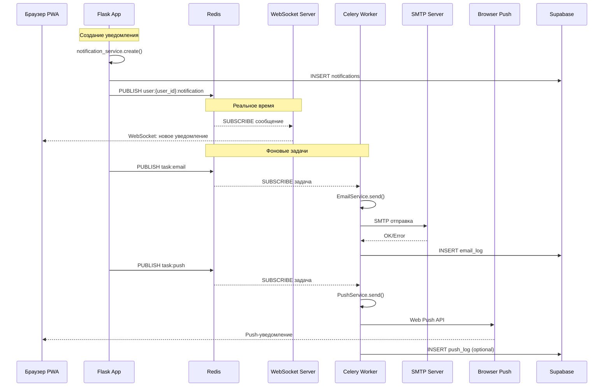

# Система уведомлений v2 — Технический план

**Дата:** 17.06.2026  
**Статус:** Проект  
**Версия документа:** 1.0  

---

## Оглавление

1. [Сводка текущей архитектуры](#1-сводка-текущей-архитектуры)
2. [Архитектура новой системы](#2-архитектура-новой-системы)
3. [План реализации](#3-план-реализации)
4. [Структура новых файлов](#4-структура-новых-файлов)
5. [Схема БД — новые таблицы](#5-схема-бд--новые-таблицы)
6. [API эндпоинты](#6-api-эндпоинты)
7. [Потоки данных](#7-потоки-данных)
8. [Конфигурация](#8-конфигурация)
9. [Критические замечания и риски](#9-критические-замечания-и-риски)
10. [Примеры кода ключевых компонентов](#10-примеры-кода-ключевых-компонентов)

---

## 1. Сводка текущей архитектуры

### 1.1 Общая структура приложения

Приложение «Трудник» — **монолитное Flask-приложение** (Python 3.14), разбитое на 11 модульных Blueprint'ов. База данных — **Supabase (PostgreSQL 15)**, взаимодействие через REST API (библиотеки `supabase` и `postgrest`). WSGI-сервер — Gunicorn, хостинг — Render.

**Application Factory** [`create_app()`](../app/__init__.py:10) собирает приложение:

- Flask-приложение с настройками из [`Config`](../app/config.py:8)
- 11 Blueprint'ов (auth, profile, jobs, jobs_api, applications, chat, favorites, blacklist, notifications, admin, ratings, employers, seo, monetization)
- 5 контекст-процессоров (глобальные переменные шаблонов)
- Глобальный CSRF-фильтр
- Обработчики ошибок (404, 500) и PWA-маршруты

**Ключевое ограничение:** приложение работает в **синхронном режиме** — нет asyncio, нет фоновых задач, нет WebSocket. Все операции — блокирующие HTTP-запросы к Supabase REST API.

### 1.2 Текущая система уведомлений (v1)

#### Модель данных

Уведомления хранятся в таблице `notifications`:

| Поле | Тип | Назначение |
|------|-----|------------|
| `id` | UUID | Первичный ключ |
| `user_id` | UUID → profiles | Получатель |
| `type` | text | Ключ типа (14 значений) |
| `message` | text | Текст уведомления |
| `is_read` | boolean | Прочитано? |
| `data` | JSONB | Доп. данные (job_id, application_id) |
| `created_at` | timestamptz | Дата создания |

Настройки хранятся в `profiles.notification_prefs` (JSONB) — миграция [012_notification_prefs.sql](../migrations/012_notification_prefs.sql:8):

```sql
ALTER TABLE profiles ADD COLUMN IF NOT EXISTS notification_prefs JSONB DEFAULT '{}'::jsonb;
```

#### Сервис NotificationService

Файл: [`app/services/notification_service.py`](../app/services/notification_service.py)

**Типы уведомлений** (14 типов):

```
status_change, application_received, application_accepted, application_rejected,
worker_accepted, worker_rejected, worker_applied, new_application,
force_complete, withdraw, job_cancelled, invitation, new_message, cheque_reminder
```

**Ключевой метод — `create()`** (строка 54):

```python
def create(user_id, notification_type, title, message, data=None):
    # 1. Проверяет валидность типа
    # 2. Загружает notification_prefs пользователя через supabase_admin_request
    # 3. Если тип отключён — возвращает False
    # 4. Формирует payload и отправляет POST в Supabase REST API
    # 5. Использует supabase_admin_request (service_role) для обхода RLS
```

**Поток создания уведомления сегодня:**

```
Код приложения
    → notification_service.create()
        → supabase_admin_request('POST', 'notifications', ...)
            → HTTP POST к Supabase REST API
                → INSERT в таблицу notifications
```

Уведомление **только сохраняется в БД** — нет реального времени (WebSocket), нет email, нет push. Пользователь видит уведомление только при обновлении страницы или переходе на `/notifications`.

#### Blueprint уведомлений

Файл: [`app/blueprints/notifications.py`](../app/blueprints/notifications.py)

Эндпоинты:

| Метод | Путь | Назначение |
|-------|------|------------|
| GET | `/notifications` | Страница со списком, авто-пометка прочитанными |
| GET | `/api/notifications/unread-count` | Счётчик непрочитанных |
| GET | `/api/notifications` | JSON с пагинацией |
| POST | `/api/notifications/read-all` | Пометить все прочитанными |
| POST | `/api/notifications/<id>/delete` | Удалить одно |
| POST | `/api/notifications/delete-all` | Удалить все |
| POST | `/notification/<id>/read` | Пометить прочитанным + редирект |
| GET | `/notifications/settings` | Страница настроек |
| GET | `/api/notifications/preferences` | JSON настроек |
| POST | `/api/notifications/preferences` | Сохранить одну настройку |

#### Контекст-процессоры для бейджей

В [`app/__init__.py`](../app/__init__.py:97) два контекст-процессора:

- `inject_unread_notifications()` — счётчик 🔔, кэш в сессии 30 сек, исключает приглашения
- `inject_pending_invitations()` — счётчик 👤+ для трудника, кэш 30 сек

Оба делают прямые HTTP-запросы к Supabase на каждый запрос (если кэш истёк), что создаёт нагрузку.

#### Чат и интеграция с уведомлениями

Файл: [`app/blueprints/chat.py`](../app/blueprints/chat.py)

Отправка сообщения (`/api/send_message`, строка 87):

```python
# После вставки в messages
create_notification(recipient, 'new_message', 'Новое сообщение',
                   sanitized_content[:100], data={'application_id': application_id})
```

**Получение новых сообщений** — polling: `/api/messages/<application_id>/poll` (строка 146). Клиент периодически опрашивает сервер. Нет реального времени.

### 1.3 Зависимости (requirements.txt)

```
flask>=3.1.0,<3.2
pyjwt>=2.8.0
python-dotenv>=1.0.0,<2
requests>=2.32.0,<3
gunicorn>=23.0.0,<27
supabase>=2.30.0,<3
postgrest>=2.30.0,<3
fpdf2>=2.8.0,<3
openai>=2.41.0,<3
```

**Отсутствуют:** Redis, Celery, aiosmtplib, pywebpush, fastapi, uvicorn, websockets, jinja2 (уже есть в Flask), httpx/aiohttp.

### 1.4 Ключевые проблемы текущей системы

| Проблема | Описание |
|----------|----------|
| **Нет реального времени** | Пользователь не видит уведомления мгновенно — только при обновлении страницы |
| **Polling вместо WebSocket** | Чат опрашивает сервер, создавая лишнюю нагрузку |
| **Нет email-уведомлений** | Пользователи не получают оповещения вне приложения |
| **Нет push-уведомлений** | PWA не использует Push API, хотя Service Worker уже есть |
| **Блокирующие операции** | Каждое уведомление — синхронный HTTP-запрос к Supabase |
| **Нет очереди задач** | Отказ SMTP или push-сервера = потеря уведомления |
| **Нагрузка контекст-процессоров** | Каждый запрос к любой странице потенциально тянет запрос к БД для бейджей |

---

## 2. Архитектура новой системы

### 2.1 Обзор компонентов

Новая система уведомлений v2 добавляет четыре новых компонента, работающих параллельно с существующим Flask-приложением:

```
┌────────────────────────────────────────────────────────────────────┐
│                      Trudnik v2 Architecture                       │
├────────────────────────────────────────────────────────────────────┤
│                                                                    │
│  ┌──────────────┐     ┌──────────────────┐    ┌────────────────┐  │
│  │   Browser     │     │  Flask App        │    │  WebSocket     │  │
│  │  (PWA + SW)   │     │  (Gunicorn)       │    │  Server        │  │
│  │               │     │                    │    │  (FastAPI +    │  │
│  │  sw.js ───────┼────►│  POST /api/        │    │   Uvicorn)     │  │
│  │  (push)       │     │    notifications   │    │                │  │
│  │               │     │                    │    │  ws://host/ws  │  │
│  │  notifications│     │  notification_     │    │  JWT auth      │  │
│  │  -ws.js ──────┼──WS─│  service.create()  │    │  Redis Sub     │  │
│  │               │     │         │          │    │                │  │
│  └───────────────┘     │         │          │    └───────┬────────┘  │
│                        │         ▼          │            │           │
│                        │  ┌──────────────┐  │            │           │
│                        │  │  Redis Pub   │  │            │           │
│                        │  │  (publish)   │  │            │           │
│                        │  └──────┬───────┘  │            │           │
│                        │         │          │            │           │
│                        └─────────┼──────────┘            │           │
│                                  │                       │           │
│                           ┌──────▼───────────────────────▼──┐        │
│                           │         Redis Server             │        │
│                           │   Pub/Sub + Task Broker          │        │
│                           └──────┬──────────────────┬────────┘        │
│                                  │                  │                 │
│                    ┌─────────────▼─────┐   ┌────────▼──────────┐      │
│                    │  Celery Worker    │   │  Celery Worker    │      │
│                    │  (email_tasks)    │   │  (push_tasks)     │      │
│                    │                   │   │                   │      │
│                    │  EmailService     │   │  PushService      │      │
│                    │  aiosmtplib       │   │  pywebpush        │      │
│                    │  Jinja2 templates │   │  VAPID keys       │      │
│                    └────────┬──────────┘   └───────┬───────────┘      │
│                             │                      │                  │
│                    ┌────────▼──────────┐   ┌───────▼───────────┐      │
│                    │  SMTP Server      │   │  Push Service     │      │
│                    │  (external)       │   │  (browser vendor) │      │
│                    └───────────────────┘   └───────────────────┘      │
│                                                                      │
│  ┌──────────────────────────────────────────────────────────────┐    │
│  │                     Supabase (PostgreSQL)                     │    │
│  │  notifications | push_subscriptions | email_log | profiles   │    │
│  └──────────────────────────────────────────────────────────────┘    │
└────────────────────────────────────────────────────────────────────┘
```

### 2.2 Диаграмма взаимодействия (Mermaid)



### 2.3 Компоненты подробно

#### 2.3.1 WebSocket-сервер (FastAPI + Redis Pub/Sub)

- **Отдельный процесс** на Uvicorn, порт 8001 (конфигурируемый)
- **Аутентификация:** JWT-токен передаётся при подключении `ws://host:8001/ws?token=<jwt>`
- **Redis Pub/Sub:** подписывается на канал `user:{user_id}:notification`
- **Доставка:** при получении сообщения из Redis отправляет JSON через WebSocket клиенту
- **Преимущество разделения:** WebSocket-сервер не блокирует Flask, Flask не нужно быть асинхронным

#### 2.3.2 Email-рассылка (SMTP + Jinja2)

- **SMTP-клиент:** `aiosmtplib` (асинхронный, совместим с Celery)
- **Шаблоны:** Jinja2 (отдельные HTML и plain-text версии)
- **Очередь:** через Celery задачу `send_email_notification`
- **Логирование:** таблица `email_log` для отслеживания статуса доставки
- **Rate limiting:** настройки `SMTP_MAX_PER_HOUR`, `SMTP_MAX_PER_DAY`

#### 2.3.3 Push-уведомления (Web Push API)

- **Стандарт:** Web Push API (RFC 8030) через `pywebpush`
- **Ключи:** VAPID (Voluntary Application Server Identification) — генерируются один раз
- **Service Worker:** расширение существующего [`sw.js`](../static/sw.js) — добавление обработчика `push` события
- **Подписки:** хранятся в таблице `push_subscriptions`
- **Срок действия:** подписки могут истекать — нужна обработка ошибок 410 Gone

#### 2.3.4 Celery очередь задач

- **Брокер:** Redis (тот же инстанс, что и Pub/Sub, разные БД: `/0` для Pub/Sub, `/1` для Celery)
- **Задачи:** `send_email_notification`, `send_push_notification`
- **Retry:** автоматический повтор при ошибках (exponential backoff)
- **Мониторинг:** опционально — Flower (веб-интерфейс для Celery)

#### 2.3.5 Redis Pub/Sub (межпроцессное взаимодействие)

- **Каналы:**
  - `user:{user_id}:notification` — новые уведомления (WebSocket доставка)
  - `task:email` — очередь email-уведомлений (bridge к Celery — или прямой вызов `send_email_notification.delay()`)
  - `task:push` — очередь push-уведомлений

**Примечание:** Альтернативно, можно не использовать Pub/Sub для Celery-задач, а вызывать `.delay()` напрямую из Flask. Pub/Sub используется только для WebSocket-доставки. Это упрощает архитектуру:

```
Flask → notification_service.create()
    → INSERT в Supabase
    → redis.publish(f'user:{user_id}:notification', json_message)
    → send_email_notification.delay(user_id, notification_data)  # Celery
    → send_push_notification.delay(user_id, notification_data)   # Celery
```

---

## 3. План реализации

### Этап 1: WebSocket-сервер (основа)

**Приоритет:** Высокий  
**Зависимости:** Redis  

| # | Задача | Описание |
|---|--------|----------|
| 1.1 | Установка Redis | Локально или Docker-контейнер, настройка подключения |
| 1.2 | Пакет `websocket_server/` | FastAPI приложение, аутентификация по JWT, слушатель Redis |
| 1.3 | Redis Pub/Sub в notification_service | После `create()` публиковать событие в Redis |
| 1.4 | Клиент `notifications-ws.js` | Подключение к WebSocket, обновление бейджа, toast-уведомления |
| 1.5 | Интеграция с `base.html` | Подключение скрипта, инициализация при загрузке страницы |
| 1.6 | Замена polling в чате | `chat.html` использует WebSocket вместо `/api/messages/<id>/poll` |

### Этап 2: Фоновые задачи (Celery)

**Приоритет:** Высокий  
**Зависимости:** Redis (из этапа 1)  

| # | Задача | Описание |
|---|--------|----------|
| 2.1 | Установка Celery | `pip install celery[redis]` |
| 2.2 | `celery_app.py` | Конфигурация Celery (брокер Redis `/1`, result backend) |
| 2.3 | Базовая задача-заглушка | Проверка цепочки Flask → Celery → выполнение |
| 2.4 | Интеграция с `create_app()` | Инициализация Celery при старте Flask |

### Этап 3: Email-рассылка

**Приоритет:** Средний  
**Зависимости:** Celery (этап 2), SMTP-сервер  

| # | Задача | Описание |
|---|--------|----------|
| 3.1 | `pip install aiosmtplib` | Асинхронный SMTP-клиент |
| 3.2 | `email_service.py` | Класс EmailService: send(), render_template() |
| 3.3 | Jinja2 шаблоны | `templates/email/` — HTML и plain-text версии |
| 3.4 | `email_tasks.py` | Celery-задача `send_email_notification` |
| 3.5 | Таблица `email_log` | Миграция для логирования отправки |
| 3.6 | Интеграция с notification_service | При `create()` — проверка `notification_prefs.email_enabled` → вызов задачи |
| 3.7 | Rate limiting | SMTP_MAX_PER_HOUR в конфигурации, счётчик в Redis |

### Этап 4: Push-уведомления

**Приоритет:** Средний  
**Зависимости:** Celery (этап 2), Service Worker  

| # | Задача | Описание |
|---|--------|----------|
| 4.1 | `pip install pywebpush` | Библиотека Web Push |
| 4.2 | Генерация VAPID-ключей | Одноразовая операция, ключи в `.env` |
| 4.3 | `push_service.py` | Класс PushService: send(), subscribe(), unsubscribe() |
| 4.4 | `push_tasks.py` | Celery-задача `send_push_notification` |
| 4.5 | Таблица `push_subscriptions` | Миграция для хранения подписок |
| 4.6 | API `POST/GET/DELETE /api/push/subscription` | Управление подписками |
| 4.7 | API `GET /api/push/vapid-public-key` | Получение публичного ключа |
| 4.8 | Расширение `sw.js` | Обработчик `push` события, `notificationclick` |
| 4.9 | Клиентский JS для подписки | `notifications-ws.js` дополняется логикой подписки на push |
| 4.10 | Интеграция с notification_service | При `create()` — проверка `notification_prefs.push_enabled` → вызов задачи |

### Этап 5: Интеграция с существующими модулями

**Приоритет:** Средний  
**Зависимости:** Этапы 1-4  

| # | Задача | Описание |
|---|--------|----------|
| 5.1 | Обновление `notification_service.create()` | Добавление Redis publish + вызов Celery задач |
| 5.2 | Обновление `chat.py` | Замена polling на WebSocket, уведомления о новых сообщениях через WS |
| 5.3 | Обновление `notifications.py` | Новые API для push-подписок |
| 5.4 | Обновление `notification_prefs` | Новые поля: `email_enabled`, `push_enabled`, `email_digest` |
| 5.5 | Обновление контекст-процессоров | Использовать WebSocket вместо запросов к БД для бейджей (или сохранить как fallback) |

### Этап 6: Docker-инфраструктура

**Приоритет:** Низкий (опционально)  
**Зависимости:** Этапы 1-5  

| # | Задача | Описание |
|---|--------|----------|
| 6.1 | `Dockerfile` для Flask | Мультистейдж-сборка, Gunicorn |
| 6.2 | `Dockerfile` для WebSocket | Отдельный образ с FastAPI + Uvicorn |
| 6.3 | `docker-compose.yml` | Flask, WebSocket, Redis, Celery Worker, Celery Beat (опционально) |
| 6.4 | Health checks | Проверка работоспособности всех сервисов |

### Этап 7: Тестирование

**Приоритет:** Высокий  
**Зависимости:** Каждый этап тестируется после реализации  

| # | Задача | Описание |
|---|--------|----------|
| 7.1 | Юнит-тесты `EmailService` | Mock SMTP, проверка шаблонов |
| 7.2 | Юнит-тесты `PushService` | Mock pywebpush |
| 7.3 | Интеграционные тесты WebSocket | `pytest-asyncio` + test client |
| 7.4 | Интеграционные тесты Celery | `celery.contrib.testing` |
| 7.5 | E2E тесты | Selenium/Playwright для проверки полного цикла |

---

## 4. Структура новых файлов

```
trudnik/
├── websocket_server/                  # Новый пакет WebSocket-сервера
│   ├── __init__.py                    # Инициализация пакета
│   ├── main.py                        # FastAPI приложение + WS endpoint
│   ├── auth.py                        # JWT/сессионная аутентификация для WS
│   └── redis_listener.py              # Слушатель Redis Pub/Sub каналов
│
├── app/
│   ├── services/
│   │   ├── email_service.py           # SMTP клиент + шаблоны (aiosmtplib)
│   │   ├── push_service.py            # Web Push клиент (pywebpush)
│   │   └── celery_app.py              # Конфигурация Celery
│   │
│   ├── tasks/                         # Новый пакет Celery-задач
│   │   ├── __init__.py
│   │   ├── email_tasks.py             # Задачи отправки email
│   │   └── push_tasks.py              # Задачи отправки push
│   │
│   └── blueprints/
│       └── notifications.py           # Дополнение: push subscription API
│
├── templates/
│   └── email/                         # Jinja2 шаблоны писем
│       ├── base_email.html            # Базовый шаблон (header/footer)
│       ├── notification.html          # HTML-версия уведомления
│       ├── notification.txt           # Plain-text версия уведомления
│       ├── message_notification.html  # Уведомление о новом сообщении
│       └── message_notification.txt
│
├── static/
│   └── js/
│       ├── notifications-ws.js        # WebSocket клиент + push-подписка
│       └── sw.js                      # Обновление: push-обработчик
│
├── migrations/
│   └── 043_add_push_subscriptions.sql # Новая миграция
│
├── docker-compose.yml                 # Docker-инфраструктура
├── Dockerfile.flask                   # Dockerfile для Flask
├── Dockerfile.ws                      # Dockerfile для WebSocket
└── .env.example                       # Обновление: новые переменные
```

---

## 5. Схема БД — новые таблицы

### 5.1 `push_subscriptions`

Хранит подписки браузеров на Web Push.

```sql
-- Миграция: 043_add_push_subscriptions.sql

CREATE TABLE IF NOT EXISTS push_subscriptions (
    id          UUID PRIMARY KEY DEFAULT gen_random_uuid(),
    user_id     UUID NOT NULL REFERENCES profiles(id) ON DELETE CASCADE,
    endpoint    TEXT NOT NULL,
    p256dh      TEXT NOT NULL,
    auth        TEXT NOT NULL,
    user_agent  TEXT,                    -- User-Agent браузера для отладки
    created_at  TIMESTAMPTZ NOT NULL DEFAULT now(),
    updated_at  TIMESTAMPTZ NOT NULL DEFAULT now(),

    -- Один пользователь может иметь несколько подписок (разные устройства/браузеры)
    UNIQUE(user_id, endpoint)
);

-- Индекс для поиска подписок пользователя
CREATE INDEX idx_push_subscriptions_user_id ON push_subscriptions(user_id);

-- Автообновление updated_at
CREATE OR REPLACE FUNCTION update_push_subscriptions_updated_at()
RETURNS TRIGGER AS $$
BEGIN
    NEW.updated_at = now();
    RETURN NEW;
END;
$$ LANGUAGE plpgsql;

CREATE TRIGGER trg_push_subscriptions_updated_at
    BEFORE UPDATE ON push_subscriptions
    FOR EACH ROW EXECUTE FUNCTION update_push_subscriptions_updated_at();

-- RLS: пользователь управляет только своими подписками
ALTER TABLE push_subscriptions ENABLE ROW LEVEL SECURITY;

CREATE POLICY "Users can manage own push subscriptions" ON push_subscriptions
    FOR ALL USING ((SELECT auth.uid()) = user_id)
    WITH CHECK ((SELECT auth.uid()) = user_id);
```

### 5.2 `email_log`

Логирует отправку email-уведомлений для отслеживания доставки.

```sql
CREATE TABLE IF NOT EXISTS email_log (
    id                UUID PRIMARY KEY DEFAULT gen_random_uuid(),
    notification_id   UUID,              -- Ссылка на notifications.id (может быть NULL)
    user_id           UUID NOT NULL REFERENCES profiles(id) ON DELETE CASCADE,
    recipient_email   TEXT NOT NULL,
    subject           TEXT NOT NULL,
    status            TEXT NOT NULL DEFAULT 'pending'
                      CHECK (status IN ('pending', 'sent', 'failed', 'bounced')),
    attempts          INTEGER NOT NULL DEFAULT 0,
    max_attempts      INTEGER NOT NULL DEFAULT 3,
    last_attempt_at   TIMESTAMPTZ,
    error_message     TEXT,
    created_at        TIMESTAMPTZ NOT NULL DEFAULT now()
);

-- Индекс для мониторинга неудачных отправок
CREATE INDEX idx_email_log_status ON email_log(status, last_attempt_at);

-- Индекс для поиска по пользователю
CREATE INDEX idx_email_log_user_id ON email_log(user_id);

-- RLS: пользователь видит только свои email-логи
ALTER TABLE email_log ENABLE ROW LEVEL SECURITY;

CREATE POLICY "Users can view own email logs" ON email_log
    FOR SELECT USING ((SELECT auth.uid()) = user_id);
```

### 5.3 Расширение `profiles.notification_prefs`

Текущая структура — плоский JSON с ключами типов уведомлений:

```json
{
  "status_change": true,
  "new_message": true,
  "invitation": false
}
```

Предлагается расширить до вложенной структуры:

```json
{
  "in_app": {
    "status_change": true,
    "new_message": true,
    "invitation": true,
    "cheque_reminder": true
  },
  "email_enabled": false,
  "email_digest": "daily",
  "push_enabled": false
}
```

**Миграция существующих данных:** читаем текущий `notification_prefs`, оборачиваем в `{"in_app": <текущие_значения>, "email_enabled": false, "push_enabled": false}`.

---

## 6. API эндпоинты

### 6.1 WebSocket

| Протокол | Путь | Аутентификация | Описание |
|----------|------|----------------|----------|
| WS | `ws://host:8001/ws?token=<jwt>` | JWT в query-параметре | Основной канал уведомлений |

**Формат сообщений (сервер → клиент):**

```json
{
  "type": "notification",
  "payload": {
    "id": "uuid",
    "notification_type": "new_message",
    "message": "Новое сообщение: Привет, как дела?",
    "data": {"application_id": "uuid", "job_id": "uuid"},
    "created_at": "2026-06-17T12:00:00Z"
  }
}
```

```json
{
  "type": "unread_count",
  "payload": {"count": 5}
}
```

```json
{
  "type": "chat_message",
  "payload": {
    "id": "uuid",
    "application_id": "uuid",
    "sender_id": "uuid",
    "content": "Привет!",
    "created_at": "2026-06-17T12:00:00Z"
  }
}
```

**Формат сообщений (клиент → сервер):**

```json
{"type": "ping"}
```

```json
{"type": "subscribe_chat", "application_id": "uuid"}
```

### 6.2 REST API (дополнения к существующим)

| Метод | Путь | Аутентификация | Описание |
|-------|------|----------------|----------|
| GET | `/api/push/vapid-public-key` | @login_required | Получить VAPID public key |
| POST | `/api/push/subscription` | @login_required | Сохранить push-подписку |
| GET | `/api/push/subscription` | @login_required | Получить свои подписки |
| DELETE | `/api/push/subscription` | @login_required | Удалить push-подписку |
| GET | `/api/notifications/preferences` | @login_required | Расширенные настройки (email/push/in_app) |
| POST | `/api/notifications/preferences` | @login_required | Сохранить расширенные настройки |

**POST `/api/push/subscription` — тело запроса:**

```json
{
  "endpoint": "https://fcm.googleapis.com/fcm/send/...",
  "keys": {
    "p256dh": "BNl...base64...",
    "auth": "abc...base64..."
  }
}
```

**POST `/api/push/subscription` — тело ответа:**

```json
{
  "success": true,
  "subscription_id": "uuid"
}
```

---

## 7. Потоки данных

### 7.1 Создание уведомления → все каналы доставки

```
Код приложения (chat.py, jobs.py, applications.py)
    │
    ▼
notification_service.create(user_id, type, title, message, data)
    │
    ├─ 1. Проверить notification_prefs
    │     ├─ type отключён в in_app → return False
    │     └─ type включён → продолжить
    │
    ├─ 2. INSERT в таблицу notifications (Supabase)
    │
    ├─ 3. Redis PUBLISH user:{user_id}:notification
    │     └─ WebSocket-сервер получает → доставляет клиенту
    │
    ├─ 4. Если email_enabled в prefs:
    │     └─ send_email_notification.delay(user_id, notification_data)
    │         └─ Celery Worker → EmailService.send()
    │             ├─ Загрузить профиль пользователя (email)
    │             ├─ Рендерить Jinja2 шаблон
    │             ├─ Отправить через aiosmtplib
    │             └─ Записать результат в email_log
    │
    └─ 5. Если push_enabled в prefs:
          └─ send_push_notification.delay(user_id, notification_data)
              └─ Celery Worker → PushService.send()
                  ├─ Загрузить push_subscriptions пользователя
                  ├─ Для каждой подписки: pywebpush.send()
                  ├─ При 410 Gone: удалить подписку
                  └─ При других ошибках: retry с backoff
```

### 7.2 Сообщение чата → уведомление + WebSocket

```
chat.py: send_message()
    │
    ├─ 1. Валидация и санитизация
    │
    ├─ 2. INSERT в таблицу messages (Supabase)
    │
    ├─ 3. Redis PUBLISH chat:{application_id}:message
    │     └─ WebSocket-сервер доставляет участникам чата
    │
    └─ 4. notification_service.create(recipient, 'new_message', ...)
          └─ Дальше по потоку 7.1
```

### 7.3 Push-подписка: жизненный цикл

```
1. Браузер запрашивает разрешение: Notification.requestPermission()
2. Браузер получает push-подписку: swRegistration.pushManager.subscribe()
3. Клиент отправляет POST /api/push/subscription с объектом подписки
4. Сервер сохраняет в push_subscriptions

При отправке:
5. Celery Worker загружает подписки пользователя
6. Для каждой: pywebpush.send(subscription, payload, vapid_private_key, vapid_claims)
7. Если 410 Gone → DELETE подписка из БД
8. Если 201 Created → OK

Обновление подписки (браузер может обновить ключи):
9. Браузер получает событие pushsubscriptionchange в SW
10. SW отправляет новую подписку через fetch POST /api/push/subscription
```

---

## 8. Конфигурация

### 8.1 Переменные окружения (`.env`)

```env
# ============================================================
# Существующие
# ============================================================
SUPABASE_URL=https://xxxxxxxxxxxx.supabase.co
SUPABASE_ANON_KEY=eyJh...
SUPABASE_SERVICE_ROLE_KEY=eyJh...
SECRET_KEY=your-secret-key
YANDEX_MAPS_API_KEY=...
DEEPSEEK_API_KEY=...

# ============================================================
# Redis
# ============================================================
# Используется для Pub/Sub (межпроцессное взаимодействие)
# и как брокер задач Celery.
# На production — отдельный инстанс (Redis Cloud / AWS ElastiCache).
# На локальной разработке — localhost.
REDIS_URL=redis://localhost:6379/0

# Номер БД для Celery (чтобы не пересекаться с Pub/Sub)
CELERY_REDIS_DB=1

# ============================================================
# SMTP (Email-рассылка)
# ============================================================
SMTP_HOST=smtp.example.com
SMTP_PORT=587
SMTP_USER=notifications@trudnik.ru
SMTP_PASSWORD=your-smtp-password
SMTP_USE_TLS=true
SMTP_FROM_NAME=Трудник
SMTP_MAX_PER_HOUR=50
SMTP_MAX_PER_DAY=500

# ============================================================
# VAPID (Web Push)
# ============================================================
# Генерация ключей:
#   python -c "from pywebpush import vapid; print(vapid.generate_keys())"
# Или:
#   openssl ecparam -genkey -name prime256v1 -out vapid_private.pem
#   openssl ec -in vapid_private.pem -noout -text
VAPID_PRIVATE_KEY=base64_encoded_private_key
VAPID_PUBLIC_KEY=base64_encoded_public_key
VAPID_CLAIMS_EMAIL=notifications@trudnik.ru

# ============================================================
# WebSocket Server
# ============================================================
# Порт для отдельного процесса FastAPI+Uvicorn
WEBSOCKET_HOST=0.0.0.0
WEBSOCKET_PORT=8001

# JWT секрет (можно использовать тот же SECRET_KEY или отдельный)
WEBSOCKET_JWT_SECRET=your-jwt-secret

# ============================================================
# Celery
# ============================================================
# Concurrency для воркеров
CELERY_WORKER_CONCURRENCY=4

# Максимальное количество retry для задач
CELERY_TASK_MAX_RETRIES=5
CELERY_TASK_RETRY_DELAY=60
```

### 8.2 Дополнение `app/config.py`

```python
import os
from dotenv import load_dotenv
load_dotenv()


class Config:
    # --- Существующие ---
    SECRET_KEY = os.environ.get('SECRET_KEY')
    SUPABASE_URL = os.environ.get('SUPABASE_URL')
    SUPABASE_ANON_KEY = os.environ.get('SUPABASE_ANON_KEY')
    SUPABASE_SERVICE_ROLE_KEY = os.environ.get('SUPABASE_SERVICE_ROLE_KEY', '')
    YANDEX_MAPS_API_KEY = os.environ.get('YANDEX_MAPS_API_KEY', '')

    # Cookie Security
    SESSION_COOKIE_HTTPONLY = True
    SESSION_COOKIE_SECURE = os.environ.get('FLASK_ENV', '') == 'production'
    SESSION_COOKIE_SAMESITE = 'Lax'

    # Бизнес-константы
    DEFAULT_LAT = 55.75
    DEFAULT_LNG = 37.61
    MAX_BATCH_SIZE = 50
    MAX_PHOTO_SIZE_MB = 5
    RATE_LIMIT_MAX = 10
    RATE_LIMIT_WINDOW = 60
    CACHE_MAX_SIZE = 256
    PAGINATION_DEFAULT_PER_PAGE = 20

    # --- Новые: Notifications v2 ---

    # Redis
    REDIS_URL = os.environ.get('REDIS_URL', 'redis://localhost:6379/0')
    CELERY_REDIS_DB = int(os.environ.get('CELERY_REDIS_DB', '1'))

    # SMTP
    SMTP_HOST = os.environ.get('SMTP_HOST', '')
    SMTP_PORT = int(os.environ.get('SMTP_PORT', '587'))
    SMTP_USER = os.environ.get('SMTP_USER', '')
    SMTP_PASSWORD = os.environ.get('SMTP_PASSWORD', '')
    SMTP_USE_TLS = os.environ.get('SMTP_USE_TLS', 'true').lower() == 'true'
    SMTP_FROM_NAME = os.environ.get('SMTP_FROM_NAME', 'Трудник')
    SMTP_MAX_PER_HOUR = int(os.environ.get('SMTP_MAX_PER_HOUR', '50'))
    SMTP_MAX_PER_DAY = int(os.environ.get('SMTP_MAX_PER_DAY', '500'))

    # VAPID
    VAPID_PRIVATE_KEY = os.environ.get('VAPID_PRIVATE_KEY', '')
    VAPID_PUBLIC_KEY = os.environ.get('VAPID_PUBLIC_KEY', '')
    VAPID_CLAIMS_EMAIL = os.environ.get('VAPID_CLAIMS_EMAIL', '')

    # WebSocket
    WEBSOCKET_HOST = os.environ.get('WEBSOCKET_HOST', '0.0.0.0')
    WEBSOCKET_PORT = int(os.environ.get('WEBSOCKET_PORT', '8001'))
    WEBSOCKET_JWT_SECRET = os.environ.get('WEBSOCKET_JWT_SECRET', os.environ.get('SECRET_KEY', ''))

    # Celery
    CELERY_WORKER_CONCURRENCY = int(os.environ.get('CELERY_WORKER_CONCURRENCY', '4'))
    CELERY_TASK_MAX_RETRIES = int(os.environ.get('CELERY_TASK_MAX_RETRIES', '5'))
    CELERY_TASK_RETRY_DELAY = int(os.environ.get('CELERY_TASK_RETRY_DELAY', '60'))
```

### 8.3 Новые зависимости (`requirements.txt` — дополнение)

```
# Существующие
flask>=3.1.0,<3.2
pyjwt>=2.8.0
python-dotenv>=1.0.0,<2
requests>=2.32.0,<3
gunicorn>=23.0.0,<27
supabase>=2.30.0,<3
postgrest>=2.30.0,<3
fpdf2>=2.8.0,<3
openai>=2.41.0,<3

# --- Новые: Notifications v2 ---

# WebSocket Server
fastapi>=0.115.0,<1
uvicorn[standard]>=0.30.0,<1
redis[hiredis]>=5.0.0,<6

# Фоновые задачи
celery[redis]>=5.4.0,<6

# Email
aiosmtplib>=3.0.0,<4
jinja2>=3.1.0,<4  # Уже есть в Flask, но явно для email-шаблонов

# Push
pywebpush>=2.0.0,<3
http-ece>=1.1.0,<2   # Зависимость pywebpush для шифрования

# Деплой (опционально, для docker-compose)
# flower>=2.0.0,<3    # Мониторинг Celery
```

---

## 9. Критические замечания и риски

### 9.1 Redis как новая зависимость

**Риск:** Redis становится критической точкой отказа. Без Redis:
- Не работает WebSocket-доставка
- Не работают Celery-задачи (email, push)
- Не работает кэширование бейджей (если будет перенесено)

**Митigation:**
- Redis должен быть развёрнут с persistence (AOF + RDB)
- На Render можно использовать Redis Cloud (add-on) или собственный Docker-контейнер
- Предусмотреть graceful degradation: если Redis недоступен, `notification_service.create()` всё равно сохраняет в БД, просто без реального времени
- Добавить health check для Redis в `/health` эндпоинт

### 9.2 Совместимость синхронного Flask с асинхронным WebSocket-сервером

**Проблема:** Flask — синхронный, WebSocket — асинхронный. Их нельзя запустить в одном процессе.

**Решение:**
- WebSocket-сервер (FastAPI + Uvicorn) — **отдельный процесс**, отдельный порт
- Взаимодействие через Redis Pub/Sub — общий знаменатель для синхронного и асинхронного кода
- Flask публикует в Redis (синхронный клиент `redis-py`)
- FastAPI подписывается на Redis (асинхронный клиент `redis-py` с asyncio)
- На одном хосте — разные порты (Flask:5000, WS:8001)
- За reverse proxy (nginx) — можно на одном домене: `/ws` → порт 8001

### 9.3 Управление VAPID ключами

**Риски:**
- Компрометация приватного ключа позволяет отправлять push от имени приложения
- При смене ключей все существующие подписки становятся недействительными

**Рекомендации:**
- Хранить VAPID_PRIVATE_KEY ТОЛЬКО в переменных окружения (`.env`), НИКОГДА в коде
- Добавить в `.gitignore` проверку, что `.env` не коммитится
- Реализовать ротацию ключей с периодом 6-12 месяцев
- При ротации — массово уведомить клиентов о необходимости переподписки
- Генерация: `openssl ecparam -genkey -name prime256v1 -out vapid_private.pem`

### 9.4 Rate limiting для SMTP

**Риски:**
- Почтовые провайдеры (Yandex, Mail.ru, Gmail) имеют дневные лимиты:
  - Яндекс 360: ~500 писем/день с ящика
  - Mail.ru: ~300 писем/день
  - Gmail: ~500 писем/день (рабочие аккаунты), ~100 (личные)
- Превышение лимита → блокировка аккаунта

**Митigation:**
- Настройка `SMTP_MAX_PER_HOUR` и `SMTP_MAX_PER_DAY`
- Счётчик в Redis с TTL (скользящее окно)
- При превышении — очередь в Celery с отложенным выполнением (ETA)
- Для production-нагрузок — использовать транзакционные email-сервисы (SendGrid, Mailgun, Yandex 360 API)

### 9.5 Обработка истекающих push-подписок

**Проблема:** Push-подписки имеют ограниченный срок жизни. Браузер может:
- Сгенерировать новую подписку (событие `pushsubscriptionchange` в SW)
- Аннулировать старую (сервер получает 410 Gone при отправке)

**Митigation:**
- При получении 410 Gone от push-сервиса — удалять подписку из БД
- При ошибках 4xx/5xx — retry с exponential backoff (до `CELERY_TASK_MAX_RETRIES`)
- Service Worker должен обрабатывать `pushsubscriptionchange` и отправлять новую подписку на сервер
- Периодическая чистка (Celery Beat): удалять подписки старше 90 дней без обновления

### 9.6 Нагрузка на Supabase REST API

**Проблема:** Каждое уведомление — HTTP-запрос к Supabase. При высокой активности это создаёт нагрузку.

**Митigation:**
- Email и push уходят в Celery — не блокируют основной поток
- WebSocket доставка через Redis — без дополнительных запросов к Supabase
- В перспективе — batch-вставка уведомлений (накапливать и отправлять пачками)
- Кэширование `get_user_prefs()` в Redis (TTL 60 секунд)

### 9.7 Обратная совместимость

**Риск:** Изменение структуры `notification_prefs` сломает существующие настройки пользователей.

**Митigation:**
- Функция `get_user_prefs()` должна поддерживать оба формата:
  ```python
  def get_user_prefs(user_id):
      prefs = load_from_db(user_id)
      if 'in_app' not in prefs:
          # Старый формат: мигрируем на лету
          prefs = {'in_app': prefs, 'email_enabled': False, 'push_enabled': False}
      return prefs
  ```
- Добавить фоновую миграцию (скрипт) для обновления всех записей

### 9.8 CSP и WebSocket

**Проблема:** Текущий Content-Security-Policy не разрешает WebSocket-подключения.

**Решение:** Добавить в CSP заголовок (в [`app/__init__.py`](../app/__init__.py:42)):

```python
f"connect-src 'self' https://*.supabase.co https://*.maps.yandex.net "
f"https://yastatic.net https://geocode-maps.yandex.ru "
f"ws://{websocket_host}:{websocket_port} wss://{websocket_host};"
```

---

## 10. Примеры кода ключевых компонентов

### 10.1 Обновлённый `notification_service.create()`

```python
# app/services/notification_service.py (дополнение)

import json
import redis
from flask import current_app
from app.services.celery_app import celery_app

_redis_client = None


def _get_redis():
    """Ленивая инициализация Redis-клиента."""
    global _redis_client
    if _redis_client is None:
        _redis_client = redis.Redis.from_url(
            current_app.config['REDIS_URL'],
            decode_responses=True
        )
    return _redis_client


def create(user_id, notification_type, title, message, data=None):
    """Создать уведомление с проверкой настроек, публикацией в Redis
    и постановкой задач Celery для email/push."""

    if notification_type not in NOTIFICATION_TYPES:
        logger.warning('Unknown notification type: %s', notification_type)
        return False

    prefs = get_user_prefs(user_id)

    # Проверка in-app настроек (существующая логика)
    in_app = prefs.get('in_app', prefs)  # поддержка старого формата
    if not in_app.get(notification_type, True):
        return False

    # 1. Сохранить в БД
    base_payload = {
        'user_id': user_id,
        'type': notification_type,
        'message': f'{title}: {message}' if title else message,
        'is_read': False,
        'data': data if data else {},
    }
    resp = supabase_admin_request('POST', 'notifications', json=base_payload)
    if not resp.ok:
        logger.error('Failed to create notification: user=%s type=%s status=%s',
                     user_id, notification_type, resp.status_code)
        return False

    notification_id = resp.json()[0]['id'] if resp.json() else None

    # 2. Публикация в Redis для WebSocket-доставки
    try:
        ws_payload = {
            'type': 'notification',
            'payload': {
                'id': notification_id,
                'notification_type': notification_type,
                'message': base_payload['message'],
                'data': data,
                'created_at': resp.json()[0].get('created_at') if resp.json() else None
            }
        }
        _get_redis().publish(f'user:{user_id}:notification', json.dumps(ws_payload))
    except redis.RedisError as e:
        logger.error('Redis publish failed (non-critical): %s', e)

    # 3. Email-уведомление (если включено)
    if prefs.get('email_enabled'):
        from app.tasks.email_tasks import send_email_notification
        send_email_notification.delay(user_id, notification_type, title, message, data)

    # 4. Push-уведомление (если включено)
    if prefs.get('push_enabled'):
        from app.tasks.push_tasks import send_push_notification
        send_push_notification.delay(user_id, notification_type, title, message, data)

    return True
```

### 10.2 WebSocket-сервер (`websocket_server/main.py`)

```python
"""WebSocket-сервер для реального времени на FastAPI + Redis Pub/Sub."""
import json
import logging
from fastapi import FastAPI, WebSocket, WebSocketDisconnect, Query, HTTPException
import redis.asyncio as aioredis
import jwt
from app.config import Config

logger = logging.getLogger(__name__)
app = FastAPI(title="Trudnik WebSocket Server")


class ConnectionManager:
    """Управление WebSocket-подключениями."""

    def __init__(self):
        self._connections: dict[str, list[WebSocket]] = {}

    async def connect(self, user_id: str, ws: WebSocket):
        await ws.accept()
        self._connections.setdefault(user_id, []).append(ws)
        logger.info('WS connected: user=%s (total connections: %d)',
                    user_id[:8], len(self._connections.get(user_id, [])))

    async def disconnect(self, user_id: str, ws: WebSocket):
        if user_id in self._connections:
            self._connections[user_id].remove(ws)
            if not self._connections[user_id]:
                del self._connections[user_id]
        logger.info('WS disconnected: user=%s', user_id[:8])

    async def send_to_user(self, user_id: str, message: str):
        for ws in self._connections.get(user_id, []):
            try:
                await ws.send_text(message)
            except Exception:
                await self.disconnect(user_id, ws)


manager = ConnectionManager()


async def authenticate_ws(token: str) -> str:
    """Проверка JWT-токена, возвращает user_id."""
    try:
        payload = jwt.decode(token, Config.WEBSOCKET_JWT_SECRET, algorithms=['HS256'])
        return payload.get('user_id') or payload.get('sub')
    except jwt.ExpiredSignatureError:
        raise HTTPException(status_code=401, detail='Token expired')
    except jwt.InvalidTokenError:
        raise HTTPException(status_code=401, detail='Invalid token')


@app.websocket('/ws')
async def websocket_endpoint(ws: WebSocket, token: str = Query(...)):
    user_id = await authenticate_ws(token)

    await manager.connect(user_id, ws)

    # Подписка на Redis-канал пользователя
    redis_client = aioredis.Redis.from_url(Config.REDIS_URL, decode_responses=True)
    pubsub = redis_client.pubsub()
    await pubsub.subscribe(f'user:{user_id}:notification')

    try:
        # Читаем сообщения из Redis и пересылаем в WebSocket
        async for message in pubsub.listen():
            if message['type'] == 'message':
                await ws.send_text(message['data'])
    except WebSocketDisconnect:
        pass
    finally:
        await manager.disconnect(user_id, ws)
        await pubsub.unsubscribe(f'user:{user_id}:notification')
        await redis_client.close()
```

### 10.3 EmailService (`app/services/email_service.py`)

```python
"""SMTP-клиент для отправки email-уведомлений."""
import logging
from email.mime.text import MIMEText
from email.mime.multipart import MIMEMultipart
import aiosmtplib
from jinja2 import Environment, FileSystemLoader, select_autoescape
from flask import current_app

logger = logging.getLogger(__name__)

# Jinja2 окружение для email-шаблонов
_jinja_env = None


def _get_jinja_env():
    global _jinja_env
    if _jinja_env is None:
        import os
        template_dir = os.path.join(
            os.path.dirname(__file__), '..', '..', 'templates', 'email'
        )
        _jinja_env = Environment(
            loader=FileSystemLoader(template_dir),
            autoescape=select_autoescape(['html'])
        )
    return _jinja_env


class EmailService:
    """Асинхронный сервис отправки email через SMTP."""

    def __init__(self, app_config: dict):
        self.host = app_config['SMTP_HOST']
        self.port = app_config['SMTP_PORT']
        self.user = app_config['SMTP_USER']
        self.password = app_config['SMTP_PASSWORD']
        self.use_tls = app_config['SMTP_USE_TLS']
        self.from_name = app_config.get('SMTP_FROM_NAME', 'Трудник')

    async def send(
        self,
        to_email: str,
        subject: str,
        template_name: str,
        context: dict
    ) -> tuple[bool, str | None]:
        """Отправить email с HTML и plain-text версиями.

        Returns:
            (success, error_message)
        """
        if not self.host:
            return False, 'SMTP not configured'

        env = _get_jinja_env()

        # Рендеринг шаблонов
        html_body = env.get_template(f'{template_name}.html').render(**context)
        text_body = env.get_template(f'{template_name}.txt').render(**context)

        # Формирование письма
        msg = MIMEMultipart('alternative')
        msg['From'] = f'{self.from_name} <{self.user}>'
        msg['To'] = to_email
        msg['Subject'] = subject
        msg.attach(MIMEText(text_body, 'plain', 'utf-8'))
        msg.attach(MIMEText(html_body, 'html', 'utf-8'))

        try:
            await aiosmtplib.send(
                msg,
                hostname=self.host,
                port=self.port,
                username=self.user,
                password=self.password,
                use_tls=self.use_tls
            )
            logger.info('Email sent to %s: %s', to_email, subject)
            return True, None
        except Exception as e:
            logger.error('Failed to send email to %s: %s', to_email, e)
            return False, str(e)
```

### 10.4 PushService (`app/services/push_service.py`)

```python
"""Web Push клиент для отправки push-уведомлений."""
import json
import logging
from pywebpush import webpush, WebPushException
from app.utils import supabase_admin_request

logger = logging.getLogger(__name__)


class PushService:
    """Сервис отправки Web Push уведомлений."""

    def __init__(self, app_config: dict):
        self.vapid_private_key = app_config.get('VAPID_PRIVATE_KEY', '')
        self.vapid_claims = {
            'sub': f'mailto:{app_config.get("VAPID_CLAIMS_EMAIL", "")}'
        }

    def get_subscriptions(self, user_id: str) -> list[dict]:
        """Получить все push-подписки пользователя."""
        resp = supabase_admin_request(
            'GET',
            f'push_subscriptions?user_id=eq.{user_id}&select=*'
        )
        return resp.json() if resp.ok else []

    def send(
        self,
        subscription: dict,
        title: str,
        message: str,
        data: dict | None = None
    ) -> tuple[bool, str | None]:
        """Отправить push-уведомление на одну подписку.

        Returns:
            (success, error_message)
        """
        if not self.vapid_private_key:
            return False, 'VAPID not configured'

        payload = json.dumps({
            'title': title,
            'body': message,
            'data': data or {},
            'icon': '/static/icons/icon-192x192.png',
            'badge': '/static/icons/icon-72x72.png',
        })

        try:
            webpush(
                subscription_info={
                    'endpoint': subscription['endpoint'],
                    'keys': {
                        'p256dh': subscription['p256dh'],
                        'auth': subscription['auth']
                    }
                },
                data=payload,
                vapid_private_key=self.vapid_private_key,
                vapid_claims=self.vapid_claims
            )
            return True, None

        except WebPushException as e:
            if e.response and e.response.status_code == 410:
                # Подписка истекла — удаляем
                logger.info('Push subscription expired: %s', subscription.get('id'))
                supabase_admin_request(
                    'DELETE',
                    f'push_subscriptions?id=eq.{subscription["id"]}'
                )
                return False, 'expired'
            logger.error('Push failed for sub %s: %s', subscription.get('id'), e)
            return False, str(e)
        except Exception as e:
            logger.error('Push failed: %s', e)
            return False, str(e)
```

### 10.5 Celery-задача отправки email (`app/tasks/email_tasks.py`)

```python
"""Celery-задачи для отправки email-уведомлений."""
import logging
from celery import shared_task
from app.utils import supabase_admin_request

logger = logging.getLogger(__name__)


@shared_task(
    bind=True,
    max_retries=5,
    default_retry_delay=60,
    autoretry_for=(Exception,),
    acks_late=True,
)
async def send_email_notification(
    self,
    user_id: str,
    notification_type: str,
    title: str,
    message: str,
    data: dict | None = None
):
    """Отправить email-уведомление пользователю."""
    from flask import current_app
    from app.services.email_service import EmailService

    # Загрузить email пользователя
    resp = supabase_admin_request(
        'GET',
        f'profiles?id=eq.{user_id}&select=email:auth.users(email)'
    )
    if not resp.ok or not resp.json():
        logger.warning('User not found for email: %s', user_id)
        return

    user_email = resp.json()[0].get('email')
    if not user_email:
        return

    email_service = EmailService(current_app.config)
    success, error = await email_service.send(
        to_email=user_email,
        subject=f'Трудник: {title}',
        template_name='notification',
        context={
            'user_id': user_id,
            'title': title,
            'message': message,
            'notification_type': notification_type,
            'data': data,
        }
    )

    # Логирование
    log_entry = {
        'user_id': user_id,
        'recipient_email': user_email,
        'subject': title,
        'status': 'sent' if success else 'failed',
        'attempts': self.request.retries + 1,
        'last_attempt_at': 'now()',
        'error_message': error,
    }
    if success:
        supabase_admin_request('POST', 'email_log', json=log_entry)

    if not success:
        raise self.retry(exc=Exception(error))
```

### 10.6 Клиент WebSocket (`static/js/notifications-ws.js`)

```javascript
/**
 * WebSocket клиент для уведомлений в реальном времени.
 * Подключается к WebSocket-серверу, обновляет бейджи и показывает toast.
 */
class NotificationWS {
    constructor(jwtToken, wsUrl) {
        this.token = jwtToken;
        this.wsUrl = wsUrl;
        this.ws = null;
        this.reconnectDelay = 1000;
        this.maxReconnectDelay = 30000;
        this.unreadCount = 0;
        this.listeners = [];
    }

    connect() {
        const url = `${this.wsUrl}?token=${encodeURIComponent(this.token)}`;
        this.ws = new WebSocket(url);

        this.ws.onopen = () => {
            console.log('[WS] Connected');
            this.reconnectDelay = 1000;
        };

        this.ws.onmessage = (event) => {
            const data = JSON.parse(event.data);
            this._handleMessage(data);
        };

        this.ws.onclose = () => {
            console.log('[WS] Disconnected, reconnecting in', this.reconnectDelay);
            setTimeout(() => this.connect(), this.reconnectDelay);
            this.reconnectDelay = Math.min(
                this.reconnectDelay * 2,
                this.maxReconnectDelay
            );
        };

        this.ws.onerror = (err) => {
            console.error('[WS] Error:', err);
        };
    }

    _handleMessage(data) {
        if (data.type === 'notification') {
            this.unreadCount++;
            this._updateBadge();
            this._showToast(data.payload.message);
            this._notifyListeners('notification', data.payload);
        } else if (data.type === 'unread_count') {
            this.unreadCount = data.payload.count;
            this._updateBadge();
        } else if (data.type === 'chat_message') {
            this._notifyListeners('chat_message', data.payload);
        }
    }

    _updateBadge() {
        const badge = document.getElementById('notification-badge');
        if (badge) {
            badge.textContent = this.unreadCount;
            badge.style.display = this.unreadCount > 0 ? 'flex' : 'none';
        }
    }

    _showToast(message) {
        if (typeof window.showToast === 'function') {
            window.showToast(message, 'info');
        }
    }

    on(event, callback) {
        this.listeners.push({ event, callback });
    }

    _notifyListeners(event, payload) {
        this.listeners
            .filter(l => l.event === event)
            .forEach(l => l.callback(payload));
    }

    send(data) {
        if (this.ws && this.ws.readyState === WebSocket.OPEN) {
            this.ws.send(JSON.stringify(data));
        }
    }
}

// Инициализация при загрузке страницы
document.addEventListener('DOMContentLoaded', () => {
    const jwtToken = document.querySelector('meta[name="ws-token"]')?.content;
    const wsUrl = document.querySelector('meta[name="ws-url"]')?.content;
    if (jwtToken && wsUrl) {
        window.notifWS = new NotificationWS(jwtToken, wsUrl);
        window.notifWS.connect();
    }
});
```

### 10.7 Обработчик push в Service Worker (`static/sw.js` — дополнение)

```javascript
// Добавить в конец существующего sw.js

// ============================================================
// Push Notifications
// ============================================================
self.addEventListener('push', event => {
    if (!event.data) {
        console.warn('SW: Push event has no data');
        return;
    }

    const payload = event.data.json();
    const { title, body, data, icon, badge } = payload;

    const options = {
        body: body || '',
        icon: icon || '/static/icons/icon-192x192.png',
        badge: badge || '/static/icons/icon-72x72.png',
        data: data || {},
        vibrate: [200, 100, 200],
        tag: data?.notification_type || 'general',
        renotify: true,
    };

    event.waitUntil(
        self.registration.showNotification(title, options)
    );
});

self.addEventListener('notificationclick', event => {
    event.notification.close();

    const data = event.notification.data || {};
    let url = '/notifications';

    // Навигация в зависимости от типа уведомления
    if (data.job_id) {
        url = `/job/${data.job_id}`;
    } else if (data.application_id) {
        url = `/chat/${data.application_id}`;
    }

    event.waitUntil(
        clients.matchAll({ type: 'window', includeUncontrolled: true })
            .then(windowClients => {
                // Если уже есть открытое окно — фокусируем и навигируем
                for (const client of windowClients) {
                    if (client.url.includes(self.location.origin)) {
                        client.navigate(url);
                        return client.focus();
                    }
                }
                // Иначе открываем новое
                return clients.openWindow(url);
            })
    );
});

// Обработка изменения подписки (ротация ключей браузером)
self.addEventListener('pushsubscriptionchange', event => {
    event.waitUntil(
        self.registration.pushManager.subscribe(
            event.oldSubscription.options
        ).then(newSubscription => {
            // Отправить новую подписку на сервер
            return fetch('/api/push/subscription', {
                method: 'POST',
                headers: {
                    'Content-Type': 'application/json',
                    'X-CSRF-Token': getCsrfToken()  // нужно реализовать получение CSRF
                },
                body: JSON.stringify(newSubscription.toJSON())
            });
        })
    );
});
```

---

## Заключение

Данный технический план описывает полный переход от базовой системы уведомлений (только хранение в БД + polling) к полноценной многоканальной системе с реальным временем (WebSocket), email-рассылкой и push-уведомлениями. Архитектура спроектирована с учётом существующих ограничений синхронного Flask-приложения: асинхронные компоненты вынесены в отдельные процессы, а взаимодействие между ними организовано через Redis Pub/Sub и Celery.

**Ключевые архитектурные решения:**
1. WebSocket-сервер — отдельный процесс (FastAPI + Uvicorn), не затрагивает Flask
2. Redis Pub/Sub — связующее звено между синхронным Flask и асинхронным WebSocket
3. Celery на Redis — очередь для email/push задач, не блокирует основной поток
4. Постепенное внедрение — каждый этап можно деплоить независимо
5. Поддержка старого формата `notification_prefs` с миграцией на лету
