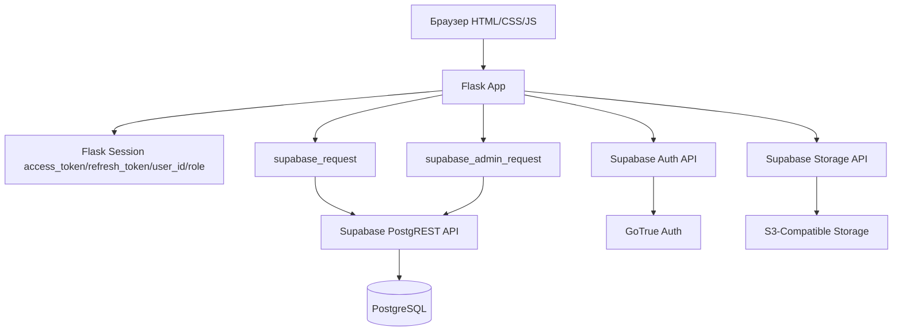
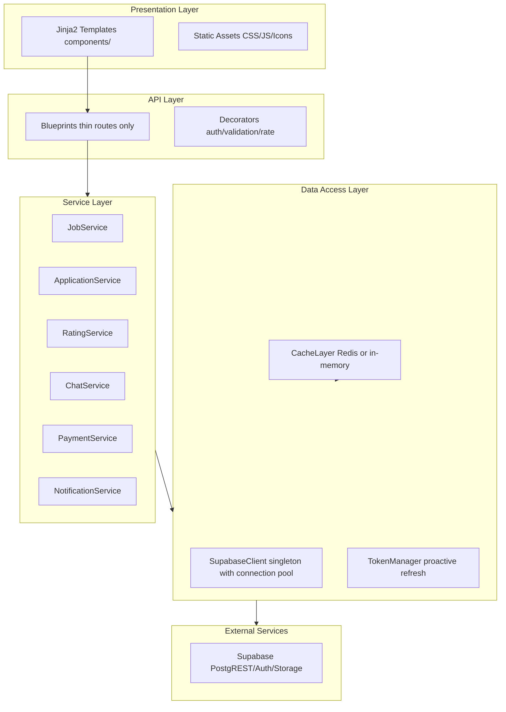

# Архитектурный анализ приложения «Трудник»: полный отчёт

> **Дата:** 2026-06-13  
> **Версия:** 1.0  
> **Статус:** Финальный  

---

## Содержание

1. [Обзор архитектуры](#1-обзор-архитектуры)
2. [Стабильность](#2-стабильность)
3. [Удобство (UX)](#3-удобство-ux)
4. [Производительность](#4-производительность)
5. [Сводная матрица рекомендаций](#5-сводная-матрица-рекомендаций)
6. [Целевая архитектура](#6-целевая-архитектура)

---

## 1. Обзор архитектуры

### 1.1 Текущий стек

| Слой | Технология |
|------|-----------|
| Backend | Python 3, Flask (factory pattern) |
| Database | Supabase (PostgreSQL + PostgREST) |
| Auth | Supabase Auth (GoTrue) |
| Frontend | Jinja2 + Tailwind CSS (CDN + локальный минифицированный) |
| PWA | Service Worker, Web Manifest, Trusted Web Activity (Google Play) |
| Maps | Yandex Maps API |
| PDF | fpdf2 |
| Deploy | Render / PythonAnywhere (Gunicorn WSGI) |

### 1.2 Структура модулей

```
app/
  __init__.py          — create_app(), context processors, CSRF, error handlers, health check
  config.py            — Config (SUPABASE_URL, SUPABASE_ANON_KEY, etc.)
  decorators.py        — login_required, role_required
  utils.py             — supabase_request, supabase_admin_request, cache_for, rate_limit, sanitize_postgrest
  blueprints/
    auth.py            — Login, Register, Logout (7.6 KB)
    jobs.py            — Jobs CRUD, Search, Workers, Invitations (48.6 KB) ← МОНОЛИТ
    applications.py    — Apply, Withdraw, Accept/Reject, My Applications (23 KB)
    ratings.py         — Ratings CRUD (10.5 KB)
    chat.py            — Chat list, Messages, Polling (8.6 KB)
    monetization.py    — Payments, Receipts, GPH Act, Settings (17 KB)
    profile.py         — Profile, Account deletion, Verification (8.5 KB)
    admin.py           — Admin panel, User/Job management, Skills/Religions (17 KB)
    favorites.py       — Favorites CRUD (5.5 KB)
    blacklist.py       — Blacklist management (2.4 KB)
    notifications.py   — Notifications list, Settings (6.4 KB)
    seo.py             — SEO routes (0.6 KB)
  services/
    notification_service.py — Notification creation, preferences (4.5 KB)
    payment_service.py      — Payment processing, tariffs (4.9 KB)
    receipt_service.py      — Receipt generation (6.6 KB)
```

### 1.3 Поток данных (упрощённо)



---

## 2. Стабильность

### 🔴 2.1 Отсутствие пула HTTP-соединений

**Проблема:** Каждый вызов [`supabase_request`](app/utils.py:87-112) и [`supabase_admin_request`](app/utils.py:115-136), а также прямые вызовы `requests.post` в [`auth.py`](app/blueprints/auth.py:24), [`profile.py`](app/blueprints/profile.py:125) и [`upload_to_storage`](app/utils.py:152) создают новый `requests.request` без переиспользования TCP-соединений. Это приводит к:

- Избыточному TCP-рукопожатию на каждый запрос
- Медленной работе под нагрузкой
- Исчерпанию клиентских портов при высокой конкуренции

**Конкретные места:**

| Файл | Строки | Что делает |
|------|--------|-----------|
| [`app/utils.py`](app/utils.py:99) | 99 | `requests.request(method, url, ...)` — каждый вызов supabase_request |
| [`app/utils.py`](app/utils.py:129) | 129 | `requests.request(method, url, ...)` — supabase_admin_request |
| [`app/utils.py`](app/utils.py:71) | 71 | `requests.post(url, ...)` — refresh_access_token |
| [`app/utils.py`](app/utils.py:152) | 152 | `requests.post(url, ..., files=...)` — upload_to_storage |
| [`app/blueprints/auth.py`](app/blueprints/auth.py:24) | 24 | `requests.post(auth_url, ...)` — login |
| [`app/blueprints/auth.py`](app/blueprints/auth.py:103) | 103 | `requests.post(signup_url, ...)` — register |
| [`app/blueprints/auth.py`](app/blueprints/auth.py:131) | 131 | `requests.patch(patch_url, ...)` — profile update after signup |
| [`app/blueprints/profile.py`](app/blueprints/profile.py:125) | 125 | `requests.delete(delete_url, ...)` — account deletion |
| [`app/blueprints/profile.py`](app/blueprints/profile.py:159) | 159 | `requests.put(auth_update_url, ...)` — change password |
| [`app/blueprints/admin.py`](app/blueprints/admin.py:171) | 171 | `requests.delete(auth_url, ...)` — admin user deletion |

**Рекомендация:** Ввести модуль-синглтон с [`requests.Session`](https://docs.python-requests.org/) и connection pooling. Все HTTP-вызовы должны проходить через этот сессионный объект.

---

### 🔴 2.2 Непредсказуемый тип возврата supabase_request

**Проблема:** Функция [`supabase_request`](app/utils.py:87-112) возвращает **разные типы** в зависимости от пути исполнения:

| Ситуация | Тип возврата |
|----------|-------------|
| Успешный запрос | `requests.Response` |
| Ошибка `requests.RequestException` | [`SupabaseResponse`](app/utils.py:41-51) (кастомный) |
| Ошибка `Exception` | [`SupabaseResponse`](app/utils.py:41-51) |
| 401 → refresh → повтор | `requests.Response` (если повтор успешен) |

Это вынуждает вызывающий код проверять и `resp.ok`, и `resp.json()`, и `resp.status_code` — по-разному в каждом blueprint'е.

**Пример inconsistent проверок:**

```python
# [app/blueprints/jobs.py:89](app/blueprints/jobs.py:89)
jobs = resp.json() if resp.ok else []

# [app/blueprints/jobs.py:246](app/blueprints/jobs.py:246)
if not job_resp.ok or not job_resp.json():

# [app/blueprints/applications.py:25](app/blueprints/applications.py:25)
if not job_resp.ok or not job_resp.json():

# [app/blueprints/ratings.py:44](app/blueprints/ratings.py:44)
if not resp.ok or not resp.json():

# [app/blueprints/profile.py:19](app/blueprints/profile.py:19)
profile_user = resp.json()[0] if resp.ok and resp.json() else None
```

**Рекомендация:** Унифицировать `supabase_request` так, чтобы он ВСЕГДА возвращал `SupabaseResponse` (или всегда `requests.Response`). `SupabaseResponse` уже определён в [`app/utils.py:41-51`](app/utils.py:41-51), но он используется только в catch-блоках.

---

### 🔴 2.3 login_required не проверяет валидность токена

**Проблема:** Декоратор [`login_required`](app/decorators.py:9-15) проверяет только **наличие** `access_token` в сессии, но не его срок действия и не валидность:

```python
def login_required(f):
    @wraps(f)
    def decorated(*args, **kwargs):
        token = session.get('access_token')
        if not token:
            return redirect(url_for('auth.login'))
        return f(*args, **kwargs)
    return decorated
```

Просроченный токен обнаруживается только при фактическом обращении к Supabase API (код 401), после чего срабатывает реактивный `refresh_access_token` в [`supabase_request`](app/utils.py:103-105). Но если запрос не идёт к Supabase (например, рендер шаблона без данных), пользователь может оставаться с истёкшим токеном неопределённо долго.

**Рекомендация:** Добавить проактивную проверку `exp` claim JWT-токена в `login_required`. Если токен истекает в ближайшие 5 минут — превентивно обновить.

---

### 🔴 2.4 Рассогласование статусов между blueprint'ами

**Проблема:** Разные blueprint'ы используют разные наборы статусов для заданий:

| Blueprint | Допустимые статусы |
|-----------|-------------------|
| [`jobs.py`](app/blueprints/jobs.py) | `open`, `completed`, `cancelled` |
| [`admin.py`](app/blueprints/admin.py:191) | `open`, `in_progress`, `cancelled`, `completed`, `active` |
| Миграция [`032`](migrations/032_simplify_job_statuses.sql) | Упрощает до `open`, `completed`, `cancelled` |

[`admin.py:191`](app/blueprints/admin.py:191) до сих пор разрешает статусы `in_progress` и `active`, которых уже нет в схеме после миграции 032:

```python
if new_status in ('open', 'in_progress', 'cancelled', 'completed', 'active'):
```

Это симптом того, что бизнес-логика статусов не вынесена в единый модуль/константы.

**Рекомендация:** Вынести допустимые статусы и переходы в единый модуль (например, [`app/state_machine.py`](app/state_machine.py)) и импортировать константы во всех blueprint'ах.

---

### 🟡 2.5 Отсутствие валидации входных данных

**Проблема:** Валидация разбросана по маршрутам и непоследовательна:

- [`auth.py:72-80`](app/blueprints/auth.py:72-80) — ручная проверка полей
- [`auth.py:97-98`](app/blueprints/auth.py:97-98) — проверка ИНН (12 цифр)
- [`jobs.py:431-439`](app/blueprints/jobs.py:431-439) — проверка длины полей
- [`ratings.py:77-89`](app/blueprints/ratings.py:77-89) — проверка rating, target_type
- [`chat.py:96-97`](app/blueprints/chat.py:96-97) — проверка длины сообщения

Нет:
- Валидации email на серверной стороне (только `strip()`)
- Проверки формата UUID во входных параметрах маршрутов
- Валидации типов полей (даты, числа) — используется `try/except ValueError`
- Защиты от XSS в пользовательском вводе (кроме PostgREST-экранирования в [`sanitize_postgrest`](app/utils.py:226-237))

**Рекомендация:** Внедрить легковесную библиотеку валидации (например, `marshmallow` или `pydantic`) и определить схемы для всех входных данных.

---

### 🟡 2.6 Дублирование каскадного удаления

**Проблема:** Список таблиц для каскадного удаления продублирован в трёх местах:

| Файл | Строки | Контекст |
|------|--------|---------|
| [`admin.py:131-149`](app/blueprints/admin.py:131-149) | 131-149 | `delete_user` |
| [`admin.py:208-222`](app/blueprints/admin.py:208-222) | 208-222 | `_delete_job_cascade` |
| [`profile.py:107-122`](app/blueprints/profile.py:107-122) | 107-122 | `delete_account` (самоудаление) |
| [`jobs.py:751-763`](app/blueprints/jobs.py:751-763) | 751-763 | `delete_job` (работодатель) |

При добавлении новой таблицы в схему нужно не забыть обновить все четыре места — высокий риск рассогласования.

**Рекомендация:** Вынести каскадное удаление в [`app/services/`](app/services/) как `CascadeDeleteService` с единым списком таблиц.

---

### 🟡 2.7 session.get() как хранилище данных

**Проблема:** В сессию Flask помещаются не только токены, но и кешированные данные:

- [`app/__init__.py:76-91`](app/__init__.py:76-91) — `_notif_cache_{user_id}` (счётчик уведомлений)
- [`app/__init__.py:107-123`](app/__init__.py:107-123) — `_inv_cache_{user_id}` (счётчик приглашений)

Flask использует signed cookies для сессии, что означает:
- Данные передаются в каждом запросе/ответе (раздувает заголовки)
- Размер cookie ограничен ~4KB
- Чувствительные данные (user_id, role) хранятся в cookie, хоть и подписанном

**Рекомендация:** Использовать серверное хранилище сессий (Redis, файловая БД) или перенести кеширование в memory-store вне сессии.

---

### 🟢 2.8 Отсутствие structured logging

**Проблема:** Логирование ведётся через `current_app.logger` с форматными строками. Нет:
- Correlation ID для отслеживания цепочки запросов
- Структурированных логов (JSON)
- Централизованного сбора ошибок (Sentry и т.п.)

**Рекомендация:** Внедрить `structlog` или хотя бы единый формат логов с request_id.

---

## 3. Удобство (UX)

### 🔴 3.1 Отсутствие индикаторов загрузки

**Проблема:** Все действия с формой (создание задания, отклик, принятие/отклонение) выполняются синхронно через POST-редирект. Пользователь не видит:

- Индикатора загрузки (spinner/skeleton)
- Disabled-состояния кнопки во время отправки
- Предотвращения двойной отправки

AJAX-эндпоинты (`accept`, `reject`, `reopen`, `withdraw`) определены, но не все формы их используют. Например, [`apply_job`](app/blueprints/applications.py:13-67) — чистый POST/Redirect/GET.

**Рекомендация:** Все мутирующие действия перевести на AJAX с визуальной обратной связью (loading state, disable button, optimistic UI).

---

### 🟡 3.2 Монолитные HTML-шаблоны

**Проблема:** Шаблоны огромны и не разбиты на компоненты:

| Шаблон | Размер | Содержит |
|--------|--------|---------|
| [`base.html`](templates/base.html) | 56 KB | CSS, JS, layout, навигация — всё в одном файле |
| [`admin.html`](templates/admin.html) | 38 KB | Дашборд, пользователи, задания, верификация — все табы в одном файле |
| [`job_detail.html`](templates/job_detail.html) | 38 KB | Детали задания + карта + отклики + чат + рейтинг |
| [`my_applications.html`](templates/my_applications.html) | 26 KB | Список откликов + фильтры + массовые действия |
| [`register.html`](templates/register.html) | 23 KB | Форма регистрации с инлайн-JS |

Нет частичных шаблонов (``) для карточек заданий, карточек работников, модальных окон и т.д.

**Рекомендация:** Разбить шаблоны на компоненты (includes/macros): `_job_card.html`, `_worker_card.html`, `_rating_stars.html`, `_pagination.html`.

---

### 🟡 3.3 Обработка ошибок на клиенте

**Проблема:** При ошибках (403, 404, 500) клиент получает HTML-страницу [`error.html`](templates/error.html). Но AJAX-запросы возвращают JSON с полем `error`. Единого подхода к показу ошибок пользователю нет:

- Иногда [`flash()`](https://flask.palletsprojects.com/en/stable/api/#flask.flash)
- Иногда `alert()` в JavaScript
- Иногда тост-уведомления

**Рекомендация:** Создать единую систему тост-уведомлений на клиенте (JS-компонент), которая перехватывает как flash-сообщения из шаблона, так и JSON-ошибки из AJAX.

---

### 🟡 3.4 Смешение серверного и клиентского состояния

**Проблема:** В шаблонах одновременно используется:

- Серверный рендеринг (Jinja2) — ``, `{{ variable }}`
- Клиентский JavaScript с `fetch()` для динамических действий

Например, в [`job_detail.html`](templates/job_detail.html) рейтинг и избранное обновляются через AJAX, а отклик — через обычный POST. Состояние кнопки «избранное» загружается при рендере страницы, но не обновляется при переключении.

**Рекомендация:** Выбрать единую стратегию: либо полный SSR с htmx/Hotwire, либо SPA с JSON API.

---

### 🟢 3.5 Отсутствие анимаций переходов

**Проблема:** Несмотря на то, что CSS-классы анимаций определены в [`base.html`](templates/base.html:57-66) (`.fade-in`, `.hover-lift`, `transition-all`), они используются непоследовательно. Нет:

- Переходов между страницами
- Skeleton-экранов при загрузке списков
- Анимированного появления/исчезновения карточек при фильтрации

**Рекомендация:** Добавить CSS-анимации появления для динамически загружаемых списков (задания, работники).

---

### 🟢 3.6 Неполная accessibility (a11y)

**Проблема:** В шаблонах не всегда соблюдаются:

- `aria-label` на кнопках (где-то есть, где-то нет)
- Семантическая иерархия заголовков
- Фокус-стили для клавиатурной навигации
- `alt`-тексты для изображений

**Рекомендация:** Внедрить a11y-линтер в процесс сборки и добавить недостающие атрибуты.

---

## 4. Производительность

### 🔴 4.1 N+1 запросов в контекстных процессорах

**Проблема:** Глобальные контекстные процессоры выполняются на **каждый** запрос и делают запросы к Supabase:

| Контекстный процессор | Файл | Запрос |
|----------------------|------|--------|
| [`inject_unread_notifications`](app/__init__.py:66-93) | `__init__.py:80` | `notifications?user_id=eq.{id}&is_read=eq.false` |
| [`inject_pending_invitations`](app/__init__.py:95-126) | `__init__.py:113` | `invitations?worker_id=eq.{id}&status=eq.pending` |
| [`inject_application_count`](app/blueprints/jobs.py:29-37) | `jobs.py:33` | `applications?job.employer_id=eq.{id}&status=eq.pending` |

На каждый HTTP-запрос к любой странице (включая статические, но там сессия обычно пустая) выполняется до 3 запросов к Supabase API. Для страницы с N элементами это может быть N+3 запросов.

Контекстный процессор `inject_application_count` определён в `jobs_bp.app_context_processor`, но регистрируется глобально на всё приложение Flask — т.е. он вызывается даже для страниц, не связанных с заданиями (профиль, админка).

**Рекомендация:**
1. Заменить `app_context_processor` на вызов в конкретных шаблонах (lazy loading)
2. Объединить запросы (notifications + invitations) в один batch-запрос
3. Увеличить TTL кеша сессии с 30 до 120 секунд и хранить кеш на серверной стороне, а не в cookie сессии

---

### 🔴 4.2 Клиентская фильтрация больших списков

**Проблема:** [`jobs.py:index()`](app/blueprints/jobs.py:67-127) загружает **все** оплаченные задания, затем фильтрует на клиенте:

```python
# [app/blueprints/jobs.py:88-89](app/blueprints/jobs.py:88-89)
resp = supabase_request('GET', f'jobs?{query}&order=created_at.desc')
jobs = resp.json() if resp.ok else []

# [app/blueprints/jobs.py:92-93](app/blueprints/jobs.py:92-93) — клиентская фильтрация
jobs = [j for j in jobs if j.get('status') in ('open', 'completed') and j.get('is_paid')]
jobs = [j for j in jobs if not j.get('expires_at') or j['expires_at'] > now]
```

API-версия [`api_search_jobs`](app/blueprints/jobs.py:134-224) уже поддерживает серверную фильтрацию, пагинацию и полнотекстовый поиск, но основной HTML-эндпоинт её не использует.

То же самое в [`workers()`](app/blueprints/jobs.py:287-325) — загружаются все workers, фильтрация на клиенте.

**Рекомендация:** Всегда использовать серверную фильтрацию и пагинацию. Для `index()` использовать тот же `api_search_jobs`, но с рендерингом HTML.

---

### 🟡 4.3 Размер HTML-страниц без сжатия

**Проблема:** Шаблоны генерируют большие HTML-документы:

- [`base.html`](templates/base.html) — 56 KB (из них ~40 KB — инлайн CSS)
- [`job_detail.html`](templates/job_detail.html) — 38 KB (частично инлайн SVG)
- [`admin.html`](templates/admin.html) — 38 KB

CSS в [`base.html`](templates/base.html:27-100+) содержит сотни строк inline-стилей. SVG-иконки в [`_icons.html`](templates/_icons.html) (18 KB) также инлайнятся. Tailwind CSS загружается через CDN, но переопределяется инлайн-стилями, что увеличивает размер страницы.

Нет:
- Gzip/Brotli сжатия на уровне WSGI
- Минификации HTML
- Кеширования статики через CDN

**Рекомендация:**
1. Вынести инлайн-CSS из `base.html` в отдельные файлы
2. Настроить gzip на уровне Render/Gunicorn
3. Использовать `Cache-Control` заголовки для статики
4. Инлайн-SVG из `_icons.html` перенести в отдельный sprite-файл

---

### 🟡 4.4 In-memory rate limiting без персистентности

**Проблема:** [`rate_limit`](app/utils.py:205-223) использует `defaultdict(list)` в памяти процесса:

```python
_rate_limits = defaultdict(list)
```

Это означает:
- При перезапуске приложения все лимиты сбрасываются
- При нескольких workers (gunicorn) лимиты не разделяются между процессами
- Нет механизма очистки старых записей (только ленивая очистка при проверке)

**Рекомендация:** Использовать Redis для rate limiting или хотя бы файловое хранилище.

---

### 🟡 4.5 Отсутствие кеширования справочников

**Проблема:** Справочники `skills` и `religions` загружаются из БД при каждом рендере:

- [`job_new()`](app/blueprints/jobs.py:413-416) — при создании задания
- [`edit_job()`](app/blueprints/jobs.py:935-938) — при редактировании
- [`admin_panel()`](app/blueprints/admin.py:237-239) — админка

В [`utils.py`](app/utils.py:16-33) определён декоратор [`cache_for`](app/utils.py:16), но он нигде не используется для справочников.

**Рекомендация:** Использовать `@cache_for(seconds=300)` для функций загрузки справочников.

---

### 🟢 4.6 Отсутствие HTTP/2 и keep-alive

**Проблема:** Без `requests.Session` соединения не переиспользуются. Это особенно критично для страниц, делающих 5-10 запросов к Supabase (включая контекстные процессоры).

**Рекомендация:** Решается вместе с п. 2.1 (connection pooling).

---

## 5. Сводная матрица рекомендаций

| # | Категория | Приоритет | Проблема | Файлы |
|---|-----------|----------|----------|-------|
| 1 | Стабильность | 🔴 | Отсутствие connection pooling | [`utils.py`](app/utils.py), [`auth.py`](app/blueprints/auth.py), [`profile.py`](app/blueprints/profile.py), [`admin.py`](app/blueprints/admin.py) |
| 2 | Стабильность | 🔴 | Непредсказуемый тип возврата `supabase_request` | [`utils.py`](app/utils.py:87-112) |
| 3 | Стабильность | 🔴 | `login_required` не проверяет expiry токена | [`decorators.py`](app/decorators.py:9-15) |
| 4 | Стабильность | 🔴 | Рассогласование статусов (`in_progress`, `active`) | [`admin.py`](app/blueprints/admin.py:191), [`jobs.py`](app/blueprints/jobs.py) |
| 5 | UX | 🔴 | Отсутствие индикаторов загрузки | Все шаблоны с формами |
| 6 | Производительность | 🔴 | N+1 в контекстных процессорах | [`__init__.py`](app/__init__.py:66-126), [`jobs.py`](app/blueprints/jobs.py:29-37) |
| 7 | Производительность | 🔴 | Клиентская фильтрация списков | [`jobs.py`](app/blueprints/jobs.py:88-116) |
| 8 | Стабильность | 🟡 | Отсутствие валидации входных данных | Все blueprint'ы |
| 9 | Стабильность | 🟡 | Дублирование каскадного удаления | [`admin.py`](app/blueprints/admin.py:131-222), [`profile.py`](app/blueprints/profile.py:107-122), [`jobs.py`](app/blueprints/jobs.py:751-763) |
| 10 | Стабильность | 🟡 | Сессия как хранилище кеша | [`__init__.py`](app/__init__.py:76-123) |
| 11 | UX | 🟡 | Монолитные HTML-шаблоны | [`base.html`](templates/base.html), [`admin.html`](templates/admin.html), [`job_detail.html`](templates/job_detail.html) |
| 12 | UX | 🟡 | Неединообразная обработка ошибок на клиенте | Все шаблоны с JS |
| 13 | UX | 🟡 | Смешение SSR и AJAX | [`job_detail.html`](templates/job_detail.html), [`my_jobs.html`](templates/my_jobs.html) |
| 14 | Производительность | 🟡 | Размер HTML без сжатия | [`base.html`](templates/base.html), [`admin.html`](templates/admin.html) |
| 15 | Производительность | 🟡 | In-memory rate limiting | [`utils.py`](app/utils.py:201-223) |
| 16 | Производительность | 🟡 | Отсутствие кеширования справочников | [`jobs.py`](app/blueprints/jobs.py:413-416,935-938) |
| 17 | Стабильность | 🟢 | Отсутствие structured logging | Все модули |
| 18 | UX | 🟢 | Отсутствие анимаций переходов | Все шаблоны |
| 19 | UX | 🟢 | Неполная accessibility | Все шаблоны |
| 20 | Производительность | 🟢 | Отсутствие HTTP/2 и keep-alive | [`utils.py`](app/utils.py) |

---

## 6. Целевая архитектура

### 6.1 Предлагаемая структура (эталон)



### 6.2 Ключевые изменения

1. **Единый HTTP-клиент** — `SupabaseClient` как singleton с `requests.Session`, connection pooling, retry logic и единым типом ответа.

2. **Repository/Service слой** — вынести всю логику доступа к данным из blueprint'ов в сервисы:
   - `JobService` — CRUD + search + filter
   - `ApplicationService` — apply/withdraw/accept/reject
   - `RatingService` — upsert/calculate average (уже частично в `update_rating`)
   - `ChatService` — send message/poll

3. **TokenManager** — проактивный refresh, проверка `exp`, единый интерфейс `get_token()`.

4. **Компонентизация шаблонов** — разбить на `_includes/`:
   - `_job_card.html`
   - `_worker_card.html`
   - `_pagination.html`
   - `_toast.html` (единая система уведомлений)

5. **Валидация** — `marshmallow` схемы для всех входных данных.

6. **Кеширование** — Redis для rate limiting, кеша справочников, сессий.

7. **Мониторинг** — structured logging + Sentry.

---

> **Итог:** Приложение «Трудник» имеет прочный фундамент (Flask + Supabase + PWA), но страдает от отсутствия слоя абстракции между маршрутами и данными, что приводит к дублированию, inconsistent error handling и проблемам производительности. Приоритетные исправления (connection pooling, унификация supabase_request, proactive token refresh, серверная фильтрация) дадут наибольший эффект при наименьших затратах.
