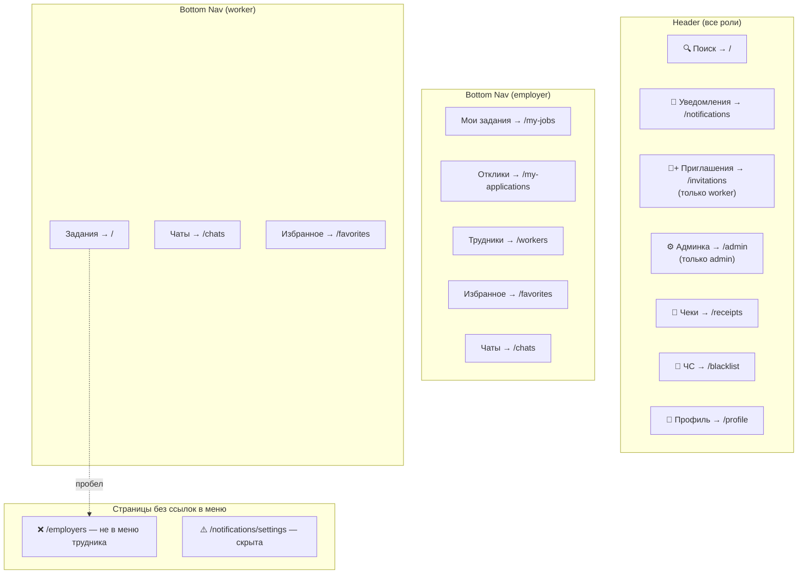

# Аудит бэкенд ↔ фронтенд взаимодействия «Трудник»

Дата: 2026-06-13

---

## Часть 1: Перекрёстный анализ маршруты ↔ шаблоны

### 1.1 Полный реестр маршрутов

#### auth.py
| Маршрут | Метод | Шаблон | Статус |
|---|---|---|---|
| `/login` | GET, POST | `login.html` | ✅ |
| `/register` | GET, POST | `register.html` | ✅ |
| `/logout` | GET | редирект | ✅ |

#### profile.py
| Маршрут | Метод | Шаблон | Статус |
|---|---|---|---|
| `/profile` | GET | `profile.html` | ✅ |
| `/profile/update` | POST | редирект | ✅ |
| `/profile/delete-photo` | POST | редирект | ✅ |
| `/profile/delete-account` | POST | редирект | ✅ |
| `/profile/change-password` | POST | редирект | ✅ |
| `/verify-employer` | GET, POST | `verify_employer.html` | ✅ |
| `/profile/<user_id>` | GET | `profile_worker.html` | ✅ |

#### jobs.py
| Маршрут | Метод | Шаблон | Статус |
|---|---|---|---|
| `/api/skills` | GET | JSON | ✅ |
| `/api/religions` | GET | JSON | ✅ |
| `/` | GET | `index.html` | ✅ |
| `/api/search/jobs` | GET | JSON | ✅ |
| `/api/search/workers` | GET | JSON | ✅ |
| `/workers` | GET | `workers.html` | ✅ |
| `/jobs/<job_id>` | GET | `job_detail.html` | ✅ |
| `/job/new` | GET, POST | `job_new.html` | ✅ |
| `/my-jobs` | GET | `my_jobs.html` | ✅ |
| `/my-jobs/action` | POST | редирект | ✅ |
| `/repost-job/<job_id>` | POST | редирект/JSON | ✅ |
| `/cancel-job/<job_id>` | GET, POST | редирект/JSON | ✅ |
| `/restore-job/<job_id>` | GET, POST | редирект/JSON | ✅ |
| `/api/jobs/<job_id>/force-complete` | POST | JSON | ✅ |
| `/delete-job/<job_id>` | GET, POST | редирект/JSON | ✅ |
| `/api/invite/<job_id>/<worker_id>` | POST | JSON | ✅ |
| `/invitations` | GET | `invitations.html` | ✅ |
| `/api/invitations` | GET | JSON | ✅ |
| `/api/invitations/<id>/respond` | POST | JSON | ✅ |
| `/api/invitations/reject-all` | POST | JSON | ✅ |
| `/jobs/<job_id>/edit` | GET, POST | `job_new.html` (is_edit=True) | ✅ |
| `/favorite-job/<job_id>` | POST | редирект | ✅ |
| `/unfavorite-job/<job_id>` | POST | редирект | ✅ |
| `/job/<job_id>/publish` | GET | `job_publish.html` | ✅ |
| `/api/jobs/<job_id>/publish` | POST | JSON | ✅ |
| `/api/jobs/<job_id>/renew` | POST | JSON | ✅ |

#### applications.py
| Маршрут | Метод | Шаблон | Статус |
|---|---|---|---|
| `/apply/<job_id>` | GET, POST | редирект | ✅ |
| `/apply-selected` | POST | редирект | ✅ |
| `/unapply/<job_id>` | POST | редирект | ✅ |
| `/unapply-selected` | POST | редирект | ✅ |
| `/api/applications/<app_id>/withdraw` | POST | JSON | ✅ |
| `/my-applications` | GET | `my_applications.html` | ✅ |
| `/api/applications/test` | GET, POST | JSON | ✅ |
| `/api/applications/batch` | POST | JSON | ✅ |
| `/application/<app_id>/cancel` | POST | редирект | ✅ |

#### favorites.py
| Маршрут | Метод | Шаблон | Статус |
|---|---|---|---|
| `/favorites` | GET | `favorites.html` | ✅ |
| `/favorite/<target_id>` | POST | редирект | ✅ |
| `/unfavorite/<target_id>` | POST | редирект | ✅ |
| `/api/favorites/add` | POST | JSON | ✅ |
| `/api/favorites/remove` | POST | JSON | ✅ |
| `/api/favorites/check` | POST | JSON | ✅ |
| `/api/favorites/remove-selected` | POST | JSON | ✅ |

#### employers.py
| Маршрут | Метод | Шаблон | Статус |
|---|---|---|---|
| `/employers` | GET | `employers.html` | ✅ |
| `/employers/<employer_id>` | GET | `employer_detail.html` | ✅ |
| `/employers/<employer_id>/favorite` | POST | редирект | ✅ |
| `/api/employers/favorites/add` | POST | JSON | ✅ |
| `/api/employers/favorites/remove` | POST | JSON | ✅ |
| `/api/employers/favorites/check` | POST | JSON | ✅ |

#### chat.py
| Маршрут | Метод | Шаблон | Статус |
|---|---|---|---|
| `/chats` | GET | `chats_list.html` | ✅ |
| `/chat/<application_id>` | GET | `chat.html` | ✅ |
| `/chat/new/<worker_id>` | GET | редирект | ✅ |
| `/api/send_message` | POST | JSON | ✅ |
| `/api/messages/<app_id>/poll` | GET | JSON | ✅ |
| `/api/delete-chats` | POST | JSON | ✅ |

#### ratings.py
| Маршрут | Метод | Шаблон | Статус |
|---|---|---|---|
| `/api/ratings/<job_id>` | GET | JSON | ✅ |
| `/api/ratings/user/<user_id>` | GET | JSON | ✅ |
| `/api/ratings` | POST | JSON | ✅ |
| `/api/ratings/user/<user_id>/details` | GET | JSON | ✅ |
| `/ratings/user/<user_id>` | GET | `user_ratings.html` | ✅ |
| `/jobs/<job_id>/rate-workers` | GET | `rate_workers.html` | ✅ |

#### monetization.py (`/api` префикс)
| Маршрут | Метод | Шаблон | Статус |
|---|---|---|---|
| `/api/receipts/<id>/resend` | POST | JSON | ✅ |
| `/api/hires/check` | GET | JSON | ✅ |
| `/api/act/generate/<app_id>` | GET | PDF | ✅ |
| `/api/cheque/remind/<app_id>` | POST | JSON | ✅ |
| `/api/admin/monetization-settings` | GET, POST | JSON | ✅ |
| `/api/admin/payments` | GET | JSON | ✅ |
| `/api/admin/job-stats` | GET | JSON | ✅ |
| `/api/receipts/my` | GET | JSON | ✅ |

#### admin.py
| Маршрут | Метод | Шаблон | Статус |
|---|---|---|---|
| `/api/health` | GET | JSON | ✅ |
| `/admin` | GET | `admin.html` | ✅ |
| `/admin/users/<id>/role` | POST | редирект | ✅ |
| `/admin/users/<id>/delete` | POST | редирект | ✅ |
| `/admin/jobs/<id>/status` | POST | редирект | ✅ |
| `/admin/jobs/<id>/delete` | POST | редирект | ✅ |
| `/admin/skills` | GET, POST | JSON | ✅ |
| `/admin/skills/reorder` | POST | JSON | ✅ |
| `/admin/skills/<id>` | PUT, DELETE | JSON | ✅ |
| `/admin/religions` | GET, POST | JSON | ✅ |
| `/admin/religions/reorder` | POST | JSON | ✅ |
| `/admin/religions/<id>` | PUT, DELETE | JSON | ✅ |
| `/admin/approve/<id>` | POST | редирект | ✅ |
| `/admin/reject/<id>` | POST | редирект | ✅ |
| `/admin/verify-employer/<id>` | POST | редирект | ✅ |

#### notifications.py
| Маршрут | Метод | Шаблон | Статус |
|---|---|---|---|
| `/notifications` | GET | `notifications.html` | ✅ |
| `/api/notifications/unread-count` | GET | JSON | ✅ |
| `/api/notifications` | GET | JSON | ✅ |
| `/api/notifications/read-all` | POST | JSON | ✅ |
| `/api/notifications/<id>/delete` | POST | JSON | ✅ |
| `/api/notifications/delete-all` | POST | JSON | ✅ |
| `/notification/<id>/read` | POST | редирект | ✅ |
| `/notifications/settings` | GET | `notification_settings.html` | ✅ |
| `/api/notifications/preferences` | GET, POST | JSON | ✅ |

#### blacklist.py
| Маршрут | Метод | Шаблон | Статус |
|---|---|---|---|
| `/blacklist` | GET | `blacklist.html` | ✅ |
| `/blacklist/<user_id>` | POST | JSON/редирект | ✅ |
| `/unblock/<user_id>` | POST | JSON/редирект | ✅ |

#### app/__init__.py (маршруты вне blueprint'ов)
| Маршрут | Метод | Шаблон | Статус |
|---|---|---|---|
| `/api/applications/<id>/accept` | POST | JSON | ✅ |
| `/api/applications/<id>/reject` | POST | JSON | ✅ |
| `/api/applications/<id>/reopen` | POST | JSON | ✅ |
| `/sw.js` | GET | статика | ✅ |
| `/offline` | GET | `offline.html` | ✅ |
| `/.well-known/assetlinks.json` | GET | статика | ✅ |
| `/receipts` | GET | `receipts.html` | ✅ |
| `/health` | GET | JSON | ✅ |

### 1.2 Выявленные разрывы (маршрут без шаблона / шаблон без маршрута)

| # | Проблема | Серьёзность | Описание |
|---|---|---|---|
| 🔴 1 | **`jobs.html` — шаблон без маршрута** | Низкая | Файл [`templates/jobs.html`](templates/jobs.html) существует, но ни один маршрут не рендерит его. Это мёртвый шаблон — кандидат на удаление. |
| 🔴 2 | **`profile_edit.html` — шаблон без маршрута** | Низкая | Файл [`templates/profile_edit.html`](templates/profile_edit.html) существует, но редактирование профиля происходит в [`profile.html`](templates/profile.html) (inline-форма). Мёртвый шаблон. |

---

## Часть 2: Навигация и доступность

### 2.1 Структура навигации

**Header (десктоп + мобильные, все роли)** — [`templates/base.html:579-641`](templates/base.html:579):

| Иконка | Ссылка | Доступность |
|---|---|---|
| 🔍 Поиск | `/` (десктоп) | Все |
| 🔔 Уведомления | `/notifications` | Все |
| 👤+ Приглашения | `/invitations` | Только `worker` |
| ⚙️ Админка | `/admin` | Только `admin` |
| 🧾 Чеки | `/receipts` | Все |
| 🚫 ЧС | `/blacklist` | Все |
| 👤 Профиль | `/profile` | Все |

**Bottom Navigation (мобильные)** — [`templates/base.html:756-835`](templates/base.html:756):

*Работодатель:*
| Пункт | Ссылка |
|---|---|
| Мои задания | `/my-jobs` |
| Отклики | `/my-applications` |
| Трудники | `/workers` |
| Избранное | `/favorites` |
| Чаты | `/chats` |

*Трудник:*
| Пункт | Ссылка |
|---|---|
| Задания | `/` |
| Чаты | `/chats` |
| Избранное | `/favorites` |

### 2.2 Выявленные проблемы навигации

| # | Проблема | Серьёзность | Описание |
|---|---|---|---|
| 🔴 1 | **Нет ссылки на `/employers` в нижнем меню трудника** | 🔶 Средняя | Страница [`/employers`](app/blueprints/employers.py:9) существует, но трудник может попасть на неё только через прямой URL или через другие страницы. Нижнее меню трудника содержит только 3 пункта (Задания, Чаты, Избранное). Страница работодателей — ключевая для трудника, который ищет работодателей для избранного. |
| 🔴 2 | **Асимметрия нижнего меню** | 🟡 Низкая | У работодателя 5 пунктов, у трудника — 3. Для трудника отсутствуют: просмотр работодателей, свой список откликов (хотя `/my-applications` есть только для employer), приглашения. Приглашения вынесены в header-иконку — это OK. |
| 🔴 3 | **Нет ссылки на `/notifications/settings`** | 🟡 Низкая | Страница настроек уведомлений существует, но ссылка на неё не очевидна — вероятно, доступна только со страницы уведомлений. |

---

## Часть 3: Supabase RLS для избранного работодателей

### 3.1 Анализ политик `favorites`

Миграция [`001_setup_rls.sql:208-236`](migrations/001_setup_rls.sql:208) создала политики:

```sql
-- INSERT: auth.uid() = user_id
-- SELECT: auth.uid() = user_id
-- DELETE: auth.uid() = user_id
```

Миграция [`036_add_employer_favorites.sql`](migrations/036_add_employer_favorites.sql) добавила:
- Колонку `favorite_type TEXT NOT NULL DEFAULT 'worker'`
- CHECK: `favorite_type IN ('worker', 'employer')`
- Первичный ключ: `(user_id, target_id, favorite_type)`

### 3.2 Ответы на контрольные вопросы

| Вопрос | Ответ | Статус |
|---|---|---|
| Может ли трудник читать/писать в `favorites` с `favorite_type='employer'`? | **Да.** RLS проверяет только `auth.uid() = user_id`. Тип избранного (`worker`/`employer`) не ограничивается RLS — это корректно, ограничение на уровне приложения. | ✅ Корректно |
| Может ли работодатель читать профили трудников (для старого избранного)? | **Да.** `profiles` RLS: `FOR SELECT USING (true)` — все авторизованные могут читать любые профили. При запросе избранного используется JOIN `target:profiles!favorites_target_id_fkey(...)` — работает. | ✅ Корректно |

### 3.3 Выявленные проблемы RLS

| # | Проблема | Серьёзность | Описание |
|---|---|---|---|
| 🔴 1 | **Нет DELETE-политики для таблицы `applications`** | 🔴 Высокая | В миграциях 001 и 002 для `applications` есть только INSERT и SELECT политики. Код вызывает `supabase_request('DELETE', f'applications?...')` в [`unapply_job`](app/blueprints/applications.py:108), [`unapply_selected`](app/blueprints/applications.py:126), [`api_withdraw_application`](app/blueprints/applications.py:210). **Без DELETE-политики эти операции будут заблокированы RLS.** Требуется проверка: возможно, политика была добавлена позже (028, 031) или используется `supabase_admin_request`. |
| 🔴 2 | **Нет UPDATE-политики для `applications`** | 🔴 Высокая | Аналогично: PATCH-запросы к `applications` (смена статуса) используют `supabase_request`. Без UPDATE-политики RLS заблокирует их. |
| 🔴 3 | **`profiles` INSERT-политика слишком широкая** | 🟡 Низкая | `FOR INSERT WITH CHECK (true)` — любой авторизованный может создать профиль. Это компенсируется тем, что при регистрации используется `SERVICE_KEY`, а не пользовательский токен. |

### 3.4 Статус RLS для jobs (историческая проблема — исправлена)

Миграция [`035_fix_rls_cancelled_status.sql`](migrations/035_fix_rls_cancelled_status.sql) обновила политику `jobs` SELECT:
```sql
status IN ('open', 'completed', 'cancelled')
OR ((SELECT auth.uid()) = employer_id)
OR (admin check)
```
Это соответствует текущей модели статусов. **Исправлено.** ✅

---

## Часть 4: Производительность

### 4.1 N+1 запросы

| # | Проблема | Серьёзность | Расположение | Описание |
|---|---|---|---|---|
| 🔴 1 | **UUID → имя в `job_detail`** | 🟡 Низкая | [`jobs.py:358-364`](app/blueprints/jobs.py:358) | Для каждого просмотра задания делается 2 дополнительных запроса: резолв `work_type` UUID → имя навыка и `preferred_religion` UUID → имя вероисповедания. При 100 просмотрах = 200 лишних запросов. Можно решить JOIN в основном запросе или кешированием справочников. |
| 🔴 2 | **`check_hires` запросы профилей** | 🟡 Низкая | [`monetization.py:93-97`](app/blueprints/monetization.py:93) | Для каждого партнёра с count ≥ 3 делается отдельный запрос профиля. Практически таких партнёров будет мало (1-2), но паттерн N+1 присутствует. |
| 🔴 3 | **Контекстный процессор `inject_application_count`** | 🔶 Средняя | [`jobs.py:29-37`](app/blueprints/jobs.py:29) | Выполняется на **каждом** запросе для роли `employer`. Считает pending-отклики. Добавляет 1 запрос к Supabase на каждую страницу. |

### 4.2 Избыточный `select=*`

| # | Проблема | Серьёзность | Расположение | Описание |
|---|---|---|---|---|
| 🔴 1 | **`index()` — все колонки jobs** | 🔶 Средняя | [`jobs.py:82`](app/blueprints/jobs.py:82) | `select=*,photos:job_photos(*)` загружает все колонки включая `detailed_description` (text, до 5000 символов). На главной странице описания не нужны — достаточно заголовка, города, оплаты. |
| 🔴 2 | **`workers()` — все колонки profiles** | 🔶 Средняя | [`jobs.py:310`](app/blueprints/jobs.py:310) | Нет явного `select=` — загружаются все колонки профилей, включая `bio`, `notification_prefs` (JSONB) и др. |
| 🔴 3 | **`/api/search/jobs` — все колонки** | 🟡 Низкая | [`jobs.py:153`](app/blueprints/jobs.py:153) | `select=*,photos:job_photos(*)` для поиска — избыточно. |
| 🔴 4 | **`/api/search/workers` — все колонки** | 🟡 Низкая | [`jobs.py:240`](app/blueprints/jobs.py:240) | `select=*` для поиска трудников — избыточно. |
| 🔴 5 | **`employer_detail` — все колонки** | 🟡 Низкая | [`employers.py:76`](app/blueprints/employers.py:76) | `select=*` для профиля работодателя — загружает все поля. |

### 4.3 Положительные моменты

| # | Паттерн | Расположение |
|---|---|---|
| ✅ | **Пакетная загрузка откликов** | [`jobs.py:524-535`](app/blueprints/jobs.py:524) — `my_jobs()` загружает все отклики одним `in.()` запросом |
| ✅ | **Пакетная загрузка открытых заданий** | [`employers.py:36-44`](app/blueprints/employers.py:36) — `employers_list()` считает открытые задания одним запросом |
| ✅ | **Кеширование в сессии (30 сек)** | [`app/__init__.py:66-126`](app/__init__.py:66) — `unread_notifications` и `pending_invitations` кешируются |
| ✅ | **JOIN через PostgREST embedded resources** | [`applications.py:231`](app/blueprints/applications.py:231) — `select=*,worker:profiles!inner(...),job:jobs(...)` |
| ✅ | **Атомарный PATCH с условием** | [`applications.py:313`](app/blueprints/applications.py:313) — `current_workers=lt.{max_workers}` предотвращает race condition |

---

## Часть 5: Сводка рекомендаций (по приоритету)

### 🔴 Высокий приоритет

| # | Рекомендация | Категория |
|---|---|---|
| 1 | **Добавить DELETE и UPDATE политики для `applications`** в RLS, либо убедиться, что все мутирующие операции используют `supabase_admin_request`. Без этого отзыв откликов (`unapply`) и смена статусов (`accept`/`reject`) могут молча падать на уровне RLS. | RLS |
| 2 | **Проверить фактическое выполнение RLS-миграций на production.** Сравнить [`ALL_PENDING.sql`](migrations/ALL_PENDING.sql) с реальным состоянием Supabase через [`dump_supabase_schema.py`](dump_supabase_schema.py). | RLS |

### 🔶 Средний приоритет

| # | Рекомендация | Категория |
|---|---|---|
| 3 | **Добавить `/employers` в нижнее меню трудника.** Страница существует и функциональна, но недоступна с мобильных устройств. | Навигация |
| 4 | **Оптимизировать `select` в `index()`** — убрать `detailed_description` из выборки на главной. Оставить: `id, organization_name, city, payment_amount, date_time, status, lat, lng, work_type, max_workers, current_workers, created_at, expires_at`. | Производительность |
| 5 | **Оптимизировать `select` в `workers()`** — выбрать только нужные колонки профилей. | Производительность |
| 6 | **Убрать или оптимизировать `inject_application_count`** — либо кешировать в сессии (как `unread_notifications`), либо считать на клиенте через отдельный API-запрос только на странице `/my-applications`. | Производительность |

### 🟡 Низкий приоритет

| # | Рекомендация | Категория |
|---|---|---|
| 7 | **Удалить мёртвые шаблоны** `jobs.html` и `profile_edit.html`. | Чистота кода |
| 8 | **Добавить ссылку на `/notifications/settings`** со страницы уведомлений (она там скорее всего есть, но проверить). | Навигация |
| 9 | **Резолвить UUID справочников через JOIN** в `job_detail()` вместо двух отдельных запросов. | Производительность |
| 10 | **Добавить `select=` в `employer_detail()`** — не загружать все колонки профиля. | Производительность |
| 11 | **Рассмотреть добавление пункта «Мои отклики» для трудника** — сейчас трудник видит свои отклики только через страницы заданий. Отдельная страница повысила бы UX. | Навигация |

---

## Приложение: Полная карта навигации


