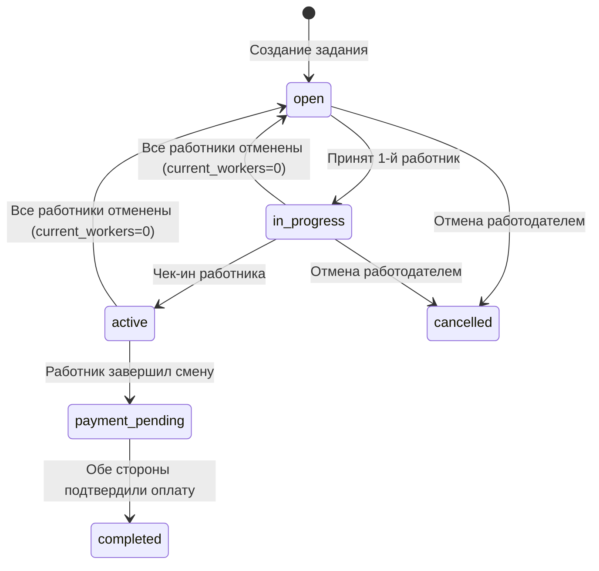

# План: Жизненный цикл статусов задания и доступные операции

## 1. Диаграмма статусов задания (jobs.status)



## 2. Статусы смены (shifts.status)

```
created → active → payment_pending → paid
```

## 3. Операции работодателя в зависимости от статуса задания

| Статус | Редактировать | Отменить | Удалить | Принять отклик | Отклонить отклик | Подтвердить оплату |
|--------|:---:|:---:|:---:|:---:|:---:|:---:|
| `open` | ✅ | ✅ | ✅ | ✅ | ✅ | ❌ |
| `in_progress` | ❌ | ✅ | ❌ | ✅ | ✅ | ❌ |
| `active` | ❌ | ⚠️ за 12ч | ❌ | ❌ | ❌ | ❌ |
| `payment_pending` | ❌ | ❌ | ❌ | ❌ | ❌ | ✅ (если ещё нет) |
| `completed` | ❌ | ❌ | ❌ | ❌ | ❌ | ❌ |
| `cancelled` | ❌ | ❌ | ✅ (дублировать) | ❌ | ❌ | ❌ |

## 4. Что нужно исправить

### 4.1. `app/blueprints/shifts.py` — `_handle_complete()` и `shift_complete()`

**Проблема:** PATCH jobs.status = 'payment_pending' не проверяется на успех.

**Исправление:** добавить проверку `job_patch_resp.ok`, при ошибке — flash + redirect.

### 4.2. `app/blueprints/shifts.py` — `_handle_confirm_payment()`

**Проблемы:**
- PATCH shifts.status = 'paid' не проверяется
- PATCH jobs.status = 'paid' не проверяется
- После оплаты статус должен быть `completed`, а не `paid`

**Исправление:**
- Добавить проверку ответа для всех PATCH
- Изменить jobs.status на `completed` (вместо `paid`)
- Если RLS блокирует PATCH shifts, показать ошибку

### 4.3. `app/blueprints/applications.py` — `api_handle_application()` accept

**Проблема:** атомарный PATCH с `current_workers` может падать если:
- Колонка `current_workers` не существует
- RLS блокирует (но политика UPDATE для jobs есть)
- Конкуренция запросов

**Исправление:** уже добавлено логирование. Дополнительно: проверить существование колонки `current_workers` в БД.

### 4.4. `app/blueprints/jobs.py` — my_jobs, отображение статусов

**Проблема:** шаблон `my_jobs.html` может неправильно отображать операции в зависимости от статуса.

**Исправление:** обновить шаблон согласно таблице в п.3.

### 4.5. RLS для таблицы shifts

**Проблема:** нет политики UPDATE (уже создана миграция 010).

**Действие:** выполнить `migrations/010_add_shifts_update_rls.sql` в Supabase SQL Editor.

### 4.6. RLS для таблицы jobs

**Проблема:** политика UPDATE есть, но нужно проверить, что она разрешает менять `status`.

**Текущая политика:** `auth.uid() = employer_id` — разрешает обновление всех полей. Ок.

## 5. План реализации (в порядке выполнения)

1. **[shifts.py]** Добавить проверку ответа для всех PATCH в `_handle_complete`, `shift_complete`, `_handle_confirm_payment`
2. **[shifts.py]** Изменить `jobs.status = 'paid'` на `jobs.status = 'completed'` в `_handle_confirm_payment`
3. **[applications.py]** Добавить проверку ответа для PATCH jobs.status в `_handle_complete`
4. **[jobs.py / my_jobs.html]** Обновить отображение доступных операций по статусу
5. **[Миграция]** Выполнить `010_add_shifts_update_rls.sql` в Supabase
6. **[Тесты]** Обновить тесты под новую логику статусов
7. **[Коммит]** Закоммитить и запушить
