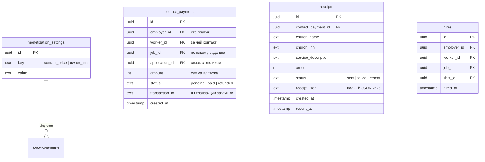
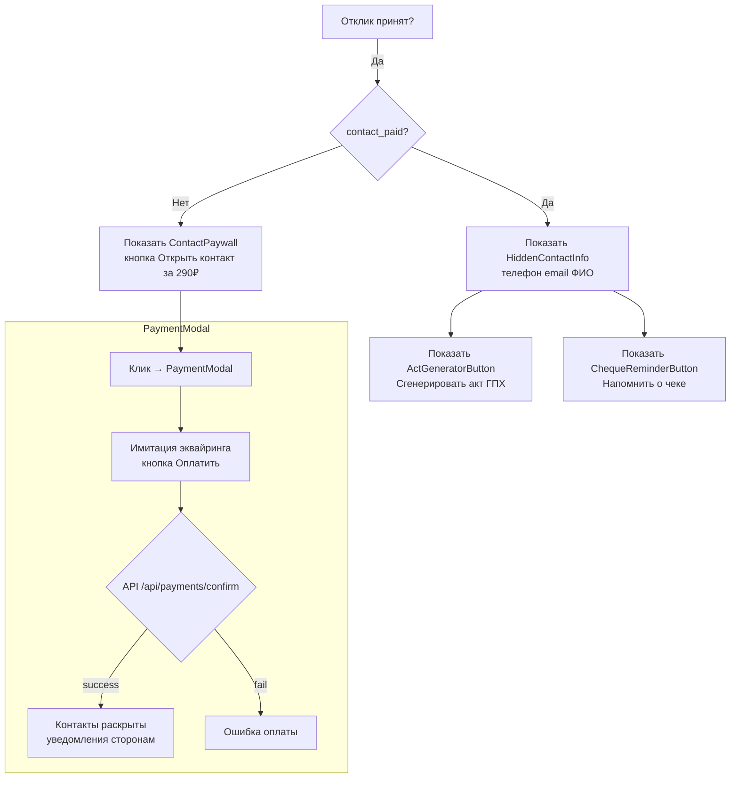
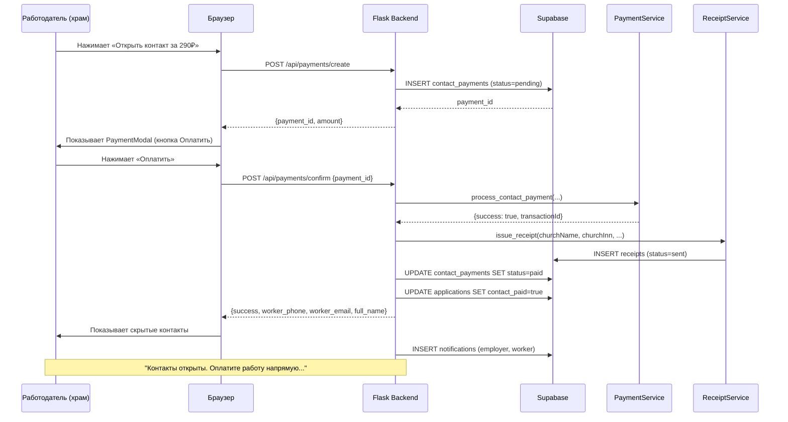

# План внедрения монетизации и юридической защиты

## 1. Обзор архитектуры

### Модульная структура

Новый функционал реализуется как **независимый модуль**, состоящий из:

```
app/
├── services/
│   ├── __init__.py
│   ├── payment_service.py      # PaymentService (заглушка эквайринга)
│   └── receipt_service.py      # ReceiptService (заглушка ФНС/Мой налог)
├── blueprints/
│   ├── monetization.py          # Новый blueprint: платежи, чеки, наймы
│   └── (изменяемые) auth.py, applications.py, profile.py, admin.py, jobs.py
└── (изменяемые) utils.py, decorators.py
```

```
templates/
├── monetization/                # Новые шаблоны модуля
│   ├── payment_modal.html
│   ├── hidden_contact_info.html
│   └── monetization_settings.html
├── (изменяемые) my_applications.html, register.html, admin.html,
│                job_new.html, profile_edit.html, base.html
```

```
migrations/
└── 006_add_monetization.sql     # Новые таблицы и поля
```

### Схема БД (новые таблицы)



### Изменения существующих таблиц

- **profiles**: добавить `inn` (text, 12 символов), `is_self_employed` (boolean), `email_public` (text)
- **applications**: добавить `contact_paid` (boolean, default false), `contact_payment_id` (uuid, nullable)

---

## 2. Пошаговый план реализации

### Шаг 1: Миграция базы данных (006_add_monetization.sql)

Создать SQL-миграцию для Supabase:
1. Таблица `monetization_settings`
2. Таблица `contact_payments`
3. Таблица `receipts`
4. Таблица `hires`
5. Поля `inn`, `is_self_employed`, `email_public` в `profiles`
6. Поля `contact_paid`, `contact_payment_id` в `applications`
7. RLS-политики для новых таблиц
8. Вставка настроек по умолчанию (contact_price = 290, owner_inn = '')

### Шаг 2: Сервисный слой (app/services/)

#### 2.1 `app/services/__init__.py`
- Экспорт всех сервисов

#### 2.2 `app/services/payment_service.py` — PaymentService

Класс `PaymentService`:
- Метод `process_contact_payment(order_id, amount, church_inn, executor_id)`:
  - Возвращает `{success: true, transactionId: "test_txn_" + Date.now()}`
  - Комментарий: "Здесь будет интеграция с Тинькофф.Платежи / CloudPayments / Сбер. Передаётся сумма, ИНН храма, идентификатор заказа"
  - После успеха вызывает `receipt_service.issue_receipt(...)`
- Метод `get_settings()` — загружает цену контакта и ИНН владельца из `monetization_settings`

#### 2.3 `app/services/receipt_service.py` — ReceiptService

Класс `ReceiptService`:
- Метод `issue_receipt(church_name, church_inn, service_description, amount, executor_id)`:
  - Формирует JSON-объект чека
  - Сохраняет в таблицу `receipts` со статусом `sent`
  - Комментарий: "Продакшн: отправка в API Мой налог через партнёрский сервис"
- Метод `resend_receipt(receipt_id)` — для админа, меняет статус на `resent` и обновляет `resent_at`

### Шаг 3: Blueprint монетизации (app/blueprints/monetization.py)

Новый blueprint `monetization_bp` с маршрутами:

#### 3.1 `POST /api/payments/create`
- Принимает `application_id`, `job_id`, `worker_id`
- Проверяет, что пользователь — работодатель и имеет отношение к заданию
- Создаёт запись в `contact_payments` со статусом `pending`
- Возвращает `{payment_id, amount, transaction_id}`

#### 3.2 `POST /api/payments/confirm`
- Принимает `payment_id`
- Вызывает `PaymentService.process_contact_payment()`
- При успехе:
  - Обновляет статус `contact_payments` на `paid`
  - Обновляет `applications.contact_paid = true`
  - Вызывает `ReceiptService.issue_receipt()`
  - Создаёт уведомления обеим сторонам
  - Возвращает `{success: true, worker_phone, worker_email, worker_full_name}`

#### 3.3 `GET /api/payments/status/<application_id>`
- Проверяет, оплачен ли контакт по данному отклику
- Возвращает `{paid: bool, worker_info: {...} | null}`

#### 3.4 `POST /api/hires/check`
- Проверяет количество наймов пары (храм, исполнитель) за 30 дней
- Если >= 3, возвращает предупреждение
- Вызывается при входе в личный кабинет и после оплаты контакта

#### 3.5 `POST /api/act/generate/<application_id>`
- Генерирует PDF акта ГПХ через `fpdf2`
- Возвращает PDF-файл для скачивания

#### 3.6 `POST /api/cheque/remind/<application_id>`
- Отправляет уведомление исполнителю: "Не забудьте выставить чек..."
- Доступно только исполнителю

### Шаг 4: Модификация существующих blueprint'ов

#### 4.1 `auth.py` — регистрация
- Добавить обязательное поле `inn` (валидация 12 цифр)
- Добавить чекбокс `is_self_employed` (обязательный для worker)
- Сохранять `inn`, `is_self_employed`, `email` в профиль

#### 4.2 `profile.py` — редактирование профиля
- Добавить поле `inn` (только для worker, с валидацией)
- Добавить поле `is_self_employed` (только чтение после регистрации)
- Добавить поле `email_public`

#### 4.3 `admin.py` — админ-панель
- Добавить вкладку "Настройки монетизации"
- Поля: цена контакта, ИНН самозанятого владельца
- Кнопка "Сохранить"
- Список всех контактных платежей (фильтр по статусу)
- Кнопка "Переотправить чек" для каждого receipt

#### 4.4 `applications.py` — отклики
- При принятии отклика (`handle_application` → accept):
  - Создавать запись в `hires`
  - Проверять лимит наймов за 30 дней → уведомление если >= 3

#### 4.5 `jobs.py` — создание задания
- Добавить валидацию стоп-слов на серверной стороне
- Добавить текст "Оплата труда производится напрямую исполнителю"

### Шаг 5: UI-компоненты (шаблоны и JS)

#### 5.1 Стоп-слова в `job_new.html`
- JS-валидация полей title и description при вводе
- Подсветка найденных стоп-слов красным
- Предупреждение: "Это может быть расценено как трудовая вакансия"
- Список стоп-слов: `ставка, зарплата, штат, трудовая, график, постоянная работа, вахта`

#### 5.2 ContactPaywall в `my_applications.html`
- Для каждого принятого отклика (status === 'accepted') проверять `contact_paid`
- Если не оплачен: показывать кнопку «Открыть контакт за XXX ₽»
- Если оплачен: показывать скрытые контакты (телефон, email, полное ФИО)

Схема логики отображения в карточке отклика:


#### 5.3 PaymentModal (inline HTML + JS в `my_applications.html`)
- Модальное окно с суммой и кнопкой «Оплатить XXX ₽»
- После нажатия вызывает `/api/payments/confirm`
- При успехе: обновляет карточку, показывает контакты

#### 5.4 ActGeneratorButton
- Кнопка «Сгенерировать акт ГПХ» (видна после оплаты контакта)
- Вызывает `/api/act/generate/<application_id>`
- Скачивает PDF с шаблоном договора-акта

#### 5.5 ChequeReminderButton
- Кнопка «Напомнить о чеке» (видна только исполнителю)
- Вызывает `/api/cheque/remind/<application_id>`
- Показывает всплывающее сообщение

#### 5.6 HireCounterWarning
- В личном кабинете (profile.html) при загрузке проверять через `/api/hires/check`
- Если превышен лимит — показывать баннер-предупреждение

#### 5.7 Настройки монетизации в `admin.html`
- Раздел «Настройки монетизации» с формой:
  - Цена за раскрытие контакта (input number)
  - ИНН самозанятого (владельца) (input text, 12 цифр)
  - Кнопка «Сохранить»

### Шаг 6: Юридические поля и проверки

#### 6.1 Регистрация исполнителя (`register.html`)
- Поле ИНН: `<input type="text" name="inn" pattern="\d{12}" required>`
- Чекбокс: «Я зарегистрирован как самозанятый и обязуюсь выдавать чеки...»
- Валидация: 12 цифр, чекбокс обязателен

#### 6.2 Создание задания (`job_new.html`)
- Поле бюджета с подписью: «Оплата труда производится напрямую исполнителю. Платформа не участвует в расчётах.»
- JS-фильтр стоп-слов с подсветкой

#### 6.3 Акт ГПХ (PDF)
Шаблон PDF-документа:
```
ДОГОВОР-АКТ №[номер]
оказания услуг (выполнения работ)

Дата: [дата]

Заказчик: [название храма]
ИНН: [ИНН храма]

Исполнитель: [ФИО исполнителя]
ИНН: [ИНН исполнителя]

Предмет договора: [описание услуги из задания]
Срок выполнения: [даты из задания]
Стоимость: [бюджет задания] руб.

Исполнитель является плательщиком налога на профессиональный
доход и обязуется выдать Заказчику чек через приложение
«Мой налог» на сумму полученной оплаты.

Подписи сторон:

Заказчик: _______________ / [ФИО представителя храма] /
Дата: ___________________

Исполнитель: _______________ / [ФИО исполнителя] /
Дата: ___________________
```

### Шаг 7: Защитный триггер от переквалификации

Логика:
1. При каждом принятии отклика создаётся запись в `hires`
2. В маршруте `/api/hires/check`:
   - `SELECT COUNT(*) FROM hires WHERE employer_id = X AND worker_id = Y AND hired_at > now() - interval '30 days'`
   - Если >= 3, возвращает `{warning: true, count: N, message: "..."}`
3. Уведомление: «Рекомендуем рассмотреть оформление трудовых отношений, если работа имеет постоянный характер. Частые разовые услуги могут быть переквалифицированы.»
4. Проверка срабатывает:
   - После каждого найма (в `handle_application`)
   - При входе в личный кабинет (проверка на клиенте через JS)

### Шаг 8: Дополнительные зависимости

Добавить в `requirements.txt`:
```
fpdf2
```

---

## 3. Матрица изменений файлов

| Файл | Действие | Описание |
|------|----------|----------|
| `requirements.txt` | Изменить | Добавить `fpdf2` |
| `app/config.py` | Изменить | Добавить настройки по умолчанию для монетизации |
| `app/__init__.py` | Изменить | Зарегистрировать `monetization_bp` |
| `app/services/__init__.py` | Создать | Экспорт сервисов |
| `app/services/payment_service.py` | Создать | PaymentService |
| `app/services/receipt_service.py` | Создать | ReceiptService |
| `app/blueprints/monetization.py` | Создать | Маршруты платежей, чеков, актов |
| `app/blueprints/auth.py` | Изменить | INN + самозанятый в регистрации |
| `app/blueprints/profile.py` | Изменить | INN в редактировании профиля |
| `app/blueprints/applications.py` | Изменить | Запись в hires, проверка лимита |
| `app/blueprints/admin.py` | Изменить | Настройки монетизации |
| `app/blueprints/jobs.py` | Изменить | Серверная валидация стоп-слов |
| `app/utils.py` | Изменить | Новая утилита `check_hire_limit()` |
| `templates/register.html` | Изменить | Поле ИНН + чекбокс |
| `templates/my_applications.html` | Изменить | Paywall, контакты, акт, чек |
| `templates/admin.html` | Изменить | Настройки монетизации |
| `templates/job_new.html` | Изменить | Стоп-слова, бюджет |
| `templates/profile_edit.html` | Изменить | Поле ИНН |
| `templates/base.html` | Изменить | Предупреждение о наймах |
| `migrations/006_add_monetization.sql` | Создать | Новые таблицы и поля |

---

## 4. UML-диаграмма потока оплаты контакта



---

## 5. Комментарии о юридической значимости

Каждый шаг содержит комментарии вида:

```python
# Юридически значимое действие: фиксация платежа за информационную услугу.
# Платформа не участвует в расчётах между храмом и исполнителем.
# Платёж — только за раскрытие контакта (информационная услуга самозанятого).
```

```python
# Юридически значимое действие: формирование чека самозанятого.
# В будущем — интеграция с API ФНС (Мой налог).
# Чек подтверждает легальность дохода самозанятого владельца платформы.
```

```python
# Юридически значимое действие: предупреждение о переквалификации.
# Ст. 15 ТК РФ — признаки трудовых отношений.
# Рекомендация оформления ГПХ или трудового договора при частых наймах.
```

---

## 6. Порядок реализации (todo-list)

1. Создать SQL-миграцию `006_add_monetization.sql`
2. Создать сервисы `payment_service.py` и `receipt_service.py`
3. Создать blueprint `monetization.py` со всеми API-маршрутами
4. Модифицировать `auth.py` — INN и самозанятый в регистрации
5. Модифицировать `register.html` — поля ИНН и чекбокс
6. Модифицировать `profile.py` и `profile_edit.html` — INN в профиле
7. Модифицировать `jobs.py` — серверная валидация стоп-слов
8. Модифицировать `job_new.html` — стоп-слова и бюджет
9. Модифицировать `my_applications.html` — ContactPaywall, контакты, акт, чек
10. Модифицировать `applications.py` — запись в hires + проверка лимита
11. Модифицировать `admin.py` и `admin.html` — настройки монетизации
12. Добавить генерацию PDF акта ГПХ
13. Добавить HireCounterWarning в profile.html
14. Добавить ChequeReminderButton
15. Зарегистрировать новый blueprint в `app/__init__.py`
16. Обновить `requirements.txt` и `app/config.py`
