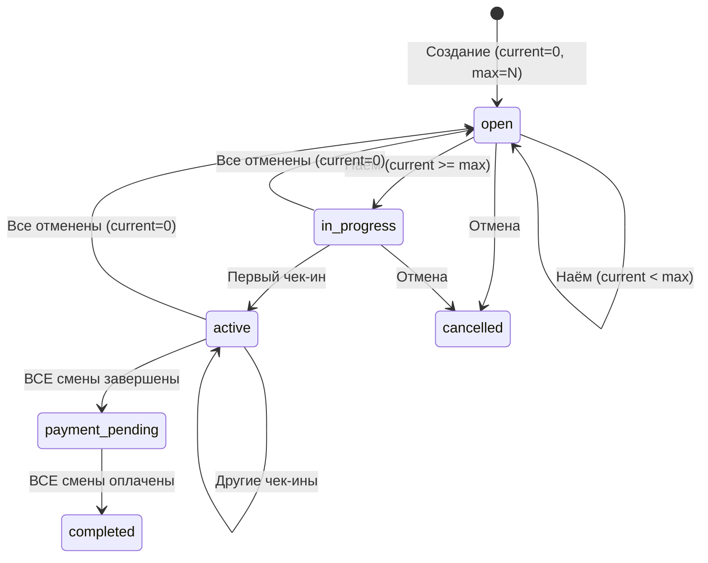

# План: Поддержка множественных исполнителей (Multi-Worker)

## 1. Анализ текущих пробелов

### 1.1. `_handle_complete()` — всегда ставит `jobs.status = 'payment_pending'`
При `max_workers > 1` первый завершивший трудник не должен менять статус задания. Статус меняется только когда **все** смены завершены.

### 1.2. `_handle_confirm_payment()` — ставит `jobs.status = 'completed'` после одной оплаты
Должен проверять, что **все** смены оплачены, прежде чем менять статус задания.

### 1.3. `api_handle_application()` accept — всегда ставит `jobs.status = 'in_progress'`
При `max_workers > 1` статус должен оставаться `open`, пока `current_workers < max_workers`. Переход в `in_progress` только при заполнении всех мест.

### 1.4. Статус `active` при неполном наборе
Если работник принят и начал работу, а набор ещё не завершён — задание должно оставаться `open` (можно нанимать ещё), но чек-ин должен работать.

---

## 2. Диаграмма статусов (Multi-Worker)



## 3. Правила переходов

| Текущий статус | Событие | Новый статус | Условие |
|---------------|---------|-------------|--------|
| `open` | Наём работника | `open` | `current + 1 < max` |
| `open` | Наём работника | `in_progress` | `current + 1 >= max` |
| `in_progress` | Чек-ин | `active` | любой |
| `active` | Чек-ин другого | `active` | любой |
| `active`/`in_progress` | Завершение смены | текущий | НЕ все завершены |
| `active`/`in_progress` | Завершение смены | `payment_pending` | ВСЕ завершены |
| `payment_pending` | Подтверждение оплаты | `payment_pending` | НЕ все оплачены |
| `payment_pending` | Подтверждение оплаты | `completed` | ВСЕ оплачены |
| любой кроме `completed` | Отмена/отклонение всех | `open` | `current = 0` |
| `open`/`in_progress`/`active` | Отмена работодателем | `cancelled` | — |

---

## 4. План реализации (7 шагов)

### Шаг 1: `_handle_complete()` — проверка «все ли завершены»

**Файл:** [`app/blueprints/shifts.py:129`](app/blueprints/shifts.py:129)

После успешного PATCH shifts.status, запросить все смены задания:
```
GET shifts?job_id=eq.{job_id}&select=status
```
Если **нет** смен со статусом `active` или `in_progress` → PATCH jobs.status = 'payment_pending'.  
Иначе → jobs.status не трогаем.

### Шаг 2: `_handle_confirm_payment()` — проверка «все ли оплачены»

**Файл:** [`app/blueprints/shifts.py:174`](app/blueprints/shifts.py:174)

После успешного PATCH shifts.status = 'paid', запросить все смены:
```
GET shifts?job_id=eq.{job_id}&select=status
```
Если **все** смены имеют status = 'paid' → PATCH jobs.status = 'completed'.  
Иначе → jobs.status не трогаем.

### Шаг 3: `api_handle_application()` accept — статус по заполненности

**Файл:** [`app/blueprints/applications.py:212`](app/blueprints/applications.py:212)

После атомарного PATCH:
- Если `current_workers + 1 >= max_workers` → `status: 'in_progress'`
- Иначе → `status: 'open'` (или не трогать status, оставить как есть)

### Шаг 4: `shift_checkin` / `_handle_checkin` — разрешить при `open`

**Файл:** [`app/blueprints/shifts.py:48,94`](app/blueprints/shifts.py:48)

Условие `if job['status'] == 'in_progress'` расширить до `if job['status'] in ('open', 'in_progress')`.

### Шаг 5: `my_jobs.html` — прогресс набора

**Файл:** [`templates/my_jobs.html`](templates/my_jobs.html)

При `max_workers > 1` показывать: «Нанято X из Y». Кнопка «Нанять» должна быть доступна пока `current_workers < max_workers`.

### Шаг 6: Тесты

**Файл:** [`tests/test_all_functions.py`](tests/test_all_functions.py)

- `test_complete_not_all_done` — завершение одного из нескольких: jobs.status не меняется
- `test_complete_all_done` — завершение последнего: jobs.status → 'payment_pending'
- `test_confirm_payment_not_all_paid` — оплата одной смены: jobs.status не меняется
- `test_confirm_payment_all_paid` — оплата всех: jobs.status → 'completed'
- `test_accept_not_full` — наём при `current < max`: status остаётся `open`
- `test_accept_full` — наём последнего: status → 'in_progress'

### Шаг 7: Коммит + пуш

---

## 5. Обратная совместимость

При `max_workers = 1` (значение по умолчанию):
- `current + 1 >= 1` всегда true → статус всегда `in_progress` при accept — **без изменений**
- «Все завершены» = один завершил → статус `payment_pending` — **без изменений**
- «Все оплачены» = один оплатил → статус `completed` — **без изменений**

Ветвление только через проверку `max_workers > 1` и подсчёт незавершённых/неоплаченных смен.
