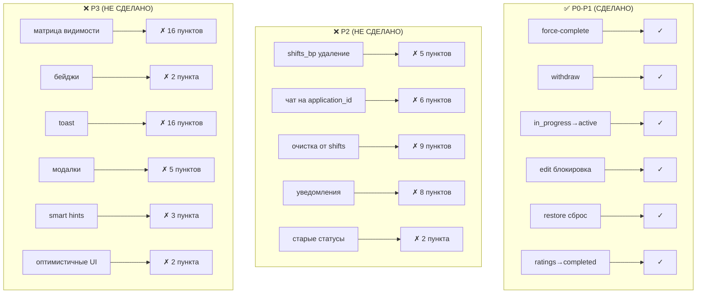

# Анализ пробелов: New_logic.md + New_logic2.md vs. текущий код

> **Дата:** 2026-06-12
> **Основание:** сверка [New_logic.md](../archive/New_logic.md), [New_logic2.md](../archive/New_logic2.md) и [new-logic-implementation-plan.md](new-logic-implementation-plan.md) с актуальным кодом
> **Статус:** Анализ завершён

---

## 1. Сводная статистика

| Категория | ✅ Сделано | ⚠️ Частично | ❌ Не сделано |
|-----------|-----------|-------------|---------------|
| P0 (Новые маршруты + автопереходы) | 3 | 0 | 0 |
| P1 (Исправление существующих маршрутов) | 4 | 2 | 3 |
| P2 (Удаление shifts + чат + уведомления) | 0 | 0 | 27 |
| P3 (UI/UX New_logic2.md) | 0 | 0 | 42 |
| **ИТОГО** | **7** | **2** | **72** |

---

## 2. Полная таблица ВСЕХ требований

### 2.1. New_logic.md — Архитектура и State Machine

| # | Требование | Источник (строки) | Статус | Где в коде / Комментарий |
|---|-----------|-------------------|--------|--------------------------|
| 1 | Статус `open` | New_logic.md:7 | ✅ | [`jobs.py:81`](app/blueprints/jobs.py:81), [`jobs.py:90`](app/blueprints/jobs.py:90) |
| 2 | Статус `in_progress` | New_logic.md:7 | ✅ | [`applications.py:285`](app/blueprints/applications.py:285) |
| 3 | Статус `active` | New_logic.md:7 | ✅ | [`jobs.py:509-530`](app/blueprints/jobs.py:509) |
| 4 | Статус `completed` | New_logic.md:7 | ✅ | [`ratings.py:105`](app/blueprints/ratings.py:105) |
| 5 | Статус `cancelled` | New_logic.md:7 | ✅ | [`jobs.py:554`](app/blueprints/jobs.py:554) |
| 6 | Удалить `payment_pending` | New_logic.md:13 | ❌ | [`shifts.py:99`](app/blueprints/shifts.py:99), [`shifts.py:136`](app/blueprints/shifts.py:136), [`applications.py:482`](app/blueprints/applications.py:482) — используется |
| 7 | Удалить `paid` | New_logic.md:13 | ❌ | [`shifts.py:178`](app/blueprints/shifts.py:178), [`shifts.py:185`](app/blueprints/shifts.py:185), [`applications.py:482`](app/blueprints/applications.py:482) |
| 8 | Удалить `disputed` | New_logic.md:13 | ❌ | [`shifts.py:285`](app/blueprints/shifts.py:285) |
| 9 | Редактировать задание (current=0) | New_logic.md:21 | ✅ | [`jobs.py:913-937`](app/blueprints/jobs.py:913) — разрешены только description/contact_phone при accepted |
| 10 | Принять/отклонить отклики в `open` | New_logic.md:21 | ✅ | [`applications.py:241-332`](app/blueprints/applications.py:241) |
| 11 | Отозвать задание → `cancelled` | New_logic.md:21 | ✅ | [`jobs.py:593-614`](app/blueprints/jobs.py:593) |
| 12 | Принять/отклонить новые отклики в `in_progress` | New_logic.md:22 | ✅ | [`applications.py:278`](app/blueprints/applications.py:278) — разрешены `open`, `in_progress` |
| 13 | Отозвать принятого работника (>12ч) | New_logic.md:22 | ⚠️ | [`applications.py:455-520`](app/blueprints/applications.py:455) — есть, но проверяет `shifts.start_time` вместо `jobs.date_time` |
| 14 | Редактировать задание в `in_progress` | New_logic.md:22 | ✅ | [`jobs.py:913-937`](app/blueprints/jobs.py:913) — заблокировано |
| 15 | Принудительно завершить → `completed` | New_logic.md:23 | ✅ | [`jobs.py:661-699`](app/blueprints/jobs.py:661) |
| 16 | Написать в чат в `active` | New_logic.md:23 | ❌ | Чат всё ещё на `shift_id`, см. [`chat.py`](app/blueprints/chat.py) |
| 17 | Оценить работников (1-5⭐) | New_logic.md:24 | ✅ | [`ratings.py:56-183`](app/blueprints/ratings.py:56) |
| 18 | Добавить в избранное | New_logic.md:24 | ✅ | [`jobs.py:968-973`](app/blueprints/jobs.py:968) |
| 19 | Удалить задание (архив) | New_logic.md:24 | ⚠️ | [`jobs.py:702-739`](app/blueprints/jobs.py:702) — каскадно удаляет `shifts` (стр. 725) |
| 20 | Восстановить задание → `open` | New_logic.md:25 | ✅ | [`jobs.py:617-658`](app/blueprints/jobs.py:617) |
| 21 | Отозвать pending-отклик | New_logic.md:33 | ✅ | [`applications.py:76-85`](app/blueprints/applications.py:76), [`applications.py:108-188`](app/blueprints/applications.py:108) |
| 22 | Откликнуться снова после rejected | New_logic.md:34 | ✅ | [`applications.py:36-50`](app/blueprints/applications.py:36) |
| 23 | Написать в чат (accepted) | New_logic.md:35 | ❌ | Всё ещё `shift_id`, см. [`chat.py:56`](app/blueprints/chat.py:56) |
| 24 | Отозвать accepted (>12ч) | New_logic.md:35 | ✅ | [`applications.py:144-160`](app/blueprints/applications.py:144) |
| 25 | Оценить работодателя | New_logic.md:37 | ✅ | [`ratings.py:73`](app/blueprints/ratings.py:73) — `target_type` |
| 26 | open → in_progress (current>=max) | New_logic.md:43 | ✅ | [`applications.py:285-289`](app/blueprints/applications.py:285) |
| 27 | in_progress → open (отзыв) | New_logic.md:43 | ✅ | [`applications.py:165-166`](app/blueprints/applications.py:165), [`applications.py:344`](app/blueprints/applications.py:344) |
| 28 | in_progress → active (по date_time) | New_logic.md:44 | ✅ | [`jobs.py:509-530`](app/blueprints/jobs.py:509) |
| 29 | Отзыв pending — без ограничений | New_logic.md:46 | ✅ | [`applications.py:181-182`](app/blueprints/applications.py:181) |
| 30 | Отзыв accepted — не позднее 12ч | New_logic.md:47 | ✅ | [`applications.py:144-160`](app/blueprints/applications.py:144) |
| 31 | Завершение в active → mass reject pending | New_logic.md:48 | ✅ | [`jobs.py:680-682`](app/blueprints/jobs.py:680) |
| 32 | Восстановление — старые отклики сброшены | New_logic.md:49 | ✅ | [`jobs.py:637-644`](app/blueprints/jobs.py:637) |
| 33 | Таблица `shifts` больше не используется | New_logic.md:55 | ❌ | [`shifts.py`](app/blueprints/shifts.py) — весь файл жив, 301 строка |
| 34 | `messages.application_id` (UUID, FK) | New_logic.md:56 | ❌ | Нет в БД и в коде |
| 35 | Чат создаётся после accepted | New_logic.md:57 | ❌ | Нет логики создания чата при accept |
| 36 | Исключить старые статусы из jobs | New_logic.md:60 | ❌ | `payment_pending`, `paid`, `disputed` ещё в коде |
| 37 | Удалить маршруты check-in/complete/payment/dispute | New_logic.md:64 | ❌ | Все в [`shifts.py`](app/blueprints/shifts.py) |
| 38 | Добавить force-complete | New_logic.md:64 | ✅ | [`jobs.py:661`](app/blueprints/jobs.py:661) |
| 39 | Оценка только в completed | New_logic.md:65 | ✅ | [`ratings.py:105`](app/blueprints/ratings.py:105) |
| 40 | Чат с момента accepted | New_logic.md:68 | ❌ | Всё ещё `shift_id` |
| 41 | Отклик на in_progress (есть места) | New_logic.md:22 | ❌ | [`applications.py:36`](app/blueprints/applications.py:36) — жёстко `!= 'open'` |
| 42 | `/api/jobs/<id>/force-complete` | New_logic.md:393 | ✅ | [`jobs.py:661`](app/blueprints/jobs.py:661) |
| 43 | `/api/applications/<id>/withdraw` | New_logic.md:395 | ✅ | [`applications.py:108`](app/blueprints/applications.py:108) |
| 44 | `/api/messages/<application_id>/...` | New_logic.md:394 | ❌ | Всё ещё `/api/messages/<shift_id>/poll` |
| 45 | Удалить `/shift/<id>/checkin` → 404 | New_logic.md:383 | ❌ | [`shifts.py:25`](app/blueprints/shifts.py:25) — жив |
| 46 | Удалить `/shift/<id>/complete` → 404 | New_logic.md:384 | ❌ | [`shifts.py:201`](app/blueprints/shifts.py:201) — жив |
| 47 | Удалить `/api/shifts/<id>/confirm-payment` → 404 | New_logic.md:385 | ❌ | [`shifts.py:207`](app/blueprints/shifts.py:207) — жив |
| 48 | Удалить `/api/shifts/<id>/confirm-receipt` → 404 | New_logic.md:386 | ❌ | Нет отдельного роута, но логика в `_handle_confirm_payment` |
| 49 | Удалить `/api/disputes/*` → 404 | New_logic.md:387 | ❌ | [`shifts.py:268`](app/blueprints/shifts.py:268) — жив |
| 50 | Удалить `/chats` (через shifts) | New_logic.md:388 | ❌ | [`chat.py:10-16`](app/blueprints/chat.py:10) — через shifts |
| 51 | Деактивировать `shift_checkin` | New_logic.md:404 | ❌ | [`notification_service.py:13`](app/services/notification_service.py:13) |
| 52 | Деактивировать `shift_complete` | New_logic.md:404 | ❌ | [`notification_service.py:14`](app/services/notification_service.py:14) |
| 53 | Деактивировать `payment_confirmed` | New_logic.md:404 | ❌ | [`notification_service.py:17`](app/services/notification_service.py:17) |
| 54 | Деактивировать `payment_received` | New_logic.md:404 | ❌ | [`notification_service.py:18`](app/services/notification_service.py:18) |
| 55 | Деактивировать `dispute_started` | New_logic.md:404 | ❌ | [`notification_service.py:25`](app/services/notification_service.py:25) |
| 56 | Убрать ссылки на `shift_id` в JS | New_logic.md:398 | ❌ | Не проверялось (файлы .js) |
| 57 | RLS для messages через application_id | New_logic.md:366-375 | ❌ | Не реализовано |
| 58 | `messages.shift_id` удалён | New_logic.md:258-261 | ❌ | Всё ещё используется |
| 59 | Все messages имеют application_id | New_logic.md:254-255 | ❌ | Нет столбца |

### 2.2. New_logic2.md — UI/UX State Machine & Feedback Loop

| # | Требование | Источник (строки) | Статус | Комментарий |
|---|-----------|-------------------|--------|-------------|
| 60 | `open`: бейдж «Оплачено», «Редактировать» (current=0) | New_logic2.md:15 | ❌ | Требует проверки шаблонов |
| 61 | `open`: кнопка «Отозвать задание» | New_logic2.md:15 | ❌ | Требует проверки шаблонов |
| 62 | `open`: кнопки «Принять»/«Отклонить» на карточках | New_logic2.md:15 | ❌ | Требует проверки шаблонов |
| 63 | `open`: скрыть «Оплатить», «Восстановить», «Завершить» | New_logic2.md:15 | ❌ | Требует проверки шаблонов |
| 64 | `open` трудник: кнопка «Откликнуться» | New_logic2.md:16 | ❌ | Требует проверки шаблонов |
| 65 | `open` трудник: скрыть «Начать смену», «Написать в чат» | New_logic2.md:16 | ❌ | Требует проверки шаблонов |
| 66 | `open` pending: кнопка «Отозвать отклик», бейдж «Отклик отправлен» | New_logic2.md:17 | ❌ | Требует проверки шаблонов |
| 67 | `open` rejected: кнопка «Откликнуться снова», бейдж «Отклик отклонён» | New_logic2.md:18 | ❌ | Требует проверки шаблонов |
| 68 | `open` гость: кнопка «Войти, чтобы откликнуться» | New_logic2.md:19 | ❌ | Требует проверки шаблонов |
| 69 | `in_progress` работодатель: бейдж «Все места заняты», счётчик | New_logic2.md:25 | ❌ | Требует проверки шаблонов |
| 70 | `in_progress` работодатель: скрыть «Редактировать», «Отозвать всё» | New_logic2.md:25 | ❌ | Требует проверки шаблонов |
| 71 | `in_progress` accepted: кнопка «Написать в чат», бейдж «Принято» | New_logic2.md:26 | ❌ | Требует проверки шаблонов |
| 72 | `in_progress` accepted: скрыть «Начать смену» | New_logic2.md:26 | ❌ | Требует проверки шаблонов |
| 73 | `in_progress` нет отклика: бейдж «Мест нет» / «Откликнуться» | New_logic2.md:27 | ❌ | Требует проверки шаблонов |
| 74 | `active` работодатель: 🔴 «Завершить задание», бейдж | New_logic2.md:33 | ❌ | Требует проверки шаблонов |
| 75 | `active` работодатель: скрыть ВСЕ кнопки управления | New_logic2.md:33 | ❌ | Требует проверки шаблонов |
| 76 | `active` accepted: кнопка «Написать в чат», бейдж | New_logic2.md:34 | ❌ | Требует проверки шаблонов |
| 77 | `active` pending/rejected: бейдж «Задание началось, приём закрыт» | New_logic2.md:35 | ❌ | Требует проверки шаблонов |
| 78 | `completed` работодатель: «Оценить», «В избранное», «Удалить» | New_logic2.md:41 | ❌ | Требует проверки шаблонов |
| 79 | `completed` accepted: «Оценить работодателя» | New_logic2.md:42 | ❌ | Требует проверки шаблонов |
| 80 | `completed` rejected: бейджи, скрыть «Оценить» | New_logic2.md:43 | ❌ | Требует проверки шаблонов |
| 81 | `cancelled` работодатель: «Восстановить», «Удалить навсегда» | New_logic2.md:49 | ❌ | Требует проверки шаблонов |
| 82 | `cancelled` трудник: бейдж «Задание отменено», скрыть всё | New_logic2.md:50 | ❌ | Требует проверки шаблонов |
| 83 | Toast: «Отклик отправлен работодателю» | New_logic2.md:79 | ❌ | Требует реализации в JS |
| 84 | Toast: «Отклик отозван» | New_logic2.md:80 | ❌ | Требует реализации в JS |
| 85 | Toast: «Отклик отозван, место освобождено» | New_logic2.md:81 | ❌ | Требует реализации в JS |
| 86 | Toast: «Отозвать можно не позднее чем за 12 часов» (error) | New_logic2.md:82 | ❌ | Требует реализации в JS |
| 87 | Toast: «Кандидат принят» | New_logic2.md:83 | ❌ | Требует реализации в JS |
| 88 | Toast: «Кандидат отклонен» | New_logic2.md:84 | ❌ | Требует реализации в JS |
| 89 | Toast: «Принято N кандидата» (массовое) | New_logic2.md:85 | ❌ | Требует реализации в JS |
| 90 | Toast: «Отклонено N кандидатов» (массовое) | New_logic2.md:86 | ❌ | Требует реализации в JS |
| 91 | Toast: «Все места заняты! Задание в ожидании начала» | New_logic2.md:87 | ❌ | Требует реализации в JS |
| 92 | Toast: «Задание снова открыто для откликов» | New_logic2.md:88 | ❌ | Требует реализации в JS |
| 93 | Toast: «Задание началось» | New_logic2.md:89 | ❌ | Требует реализации в JS |
| 94 | Toast: «Задание завершено, непринятые отклики отклонены» | New_logic2.md:90 | ❌ | Требует реализации в JS |
| 95 | Toast: «Спасибо за оценку!» | New_logic2.md:91 | ❌ | Требует реализации в JS |
| 96 | Toast: «Оценка доступна после завершения задания» (error) | New_logic2.md:92 | ❌ | Требует реализации в JS |
| 97 | Toast: «Действие уже выполняется» (двойной клик) | New_logic2.md:93 | ❌ | Требует реализации в JS |
| 98 | Toast: «Задание восстановлено, старые отклики сброшены» | New_logic2.md:94 | ❌ | Требует реализации в JS |
| 99 | Модалка: подтверждение force-complete | New_logic2.md:103-116 | ❌ | Требует реализации |
| 100 | Модалка: блокировка отзыва <12ч | New_logic2.md:103-109 | ❌ | Требует реализации |
| 101 | Модалка: редактирование при accepted → редирект + toast | New_logic2.md:118-123 | ❌ | Требует реализации |
| 102 | Модалка: массовое отклонение — confirm | New_logic2.md:124-129 | ❌ | Требует реализации |
| 103 | Модалка: восстановление из cancelled — confirm | New_logic2.md:131-135 | ❌ | Требует реализации |
| 104 | Smart hint: «⏳ Осталось N дней» | New_logic2.md:143 | ❌ | Требует реализации |
| 105 | Smart hint: «Мест нет» (disabled) | New_logic2.md:144 | ❌ | Требует реализации |
| 106 | Smart hint: «Заблокирован» в чёрном списке | New_logic2.md:145 | ❌ | Требует проверки |
| 107 | Smart hint: предупреждение о верификации | New_logic2.md:146 | ❌ | Требует проверки |
| 108 | Smart hint: баннер «Добавьте навыки» | New_logic2.md:147 | ❌ | Требует проверки |
| 109 | Smart hint: tooltip «Менее 12ч до начала» | New_logic2.md:148 | ❌ | Требует реализации |
| 110 | Smart hint: счётчик «2 принято из 5 откликов» | New_logic2.md:150 | ❌ | Требует реализации |
| 111 | Бейджи статусов задания (Tailwind) | New_logic2.md:156-169 | ❌ | Требует реализации в шаблонах |
| 112 | Бейджи статусов отклика (Tailwind) | New_logic2.md:171-182 | ❌ | Требует реализации в шаблонах |
| 113 | Оптимистичные обновления: избранное | New_logic2.md:191-207 | ❌ | Требует проверки JS |
| 114 | Оптимистичные обновления: принятие отклика | New_logic2.md:209-224 | ❌ | Требует проверки JS |
| 115 | Адаптивность: кнопки 44×44px на мобильных | New_logic2.md:232 | ❌ | Требует проверки |
| 116 | Адаптивность: бейджи не обрезаются | New_logic2.md:233 | ❌ | Требует проверки |
| 117 | Адаптивность: модалки не выходят за viewport | New_logic2.md:234 | ❌ | Требует проверки |
| 118 | Адаптивность: toast не перекрывают кнопки | New_logic2.md:235 | ❌ | Требует проверки |
| 119 | Playwright setup: авто-accept диалогов | New_logic2.md:252-268 | ❌ | Требует реализации в тестах |

### 2.3. Дополнительные пропущенные пункты из New_logic.md (не вошедшие в план)

| # | Требование | Источник (строки) | Статус | Комментарий |
|---|-----------|-------------------|--------|-------------|
| 120 | `applications.js` — нет ссылок на `shift_id`, `checkin` | New_logic.md:398 | ❌ | JS-файлы не проверены |
| 121 | `favorites.js` — toggleFavorite для completed | New_logic.md:399 | ❌ | JS-файлы не проверены |
| 122 | Чекбоксы массовых операций не для rejected/cancelled | New_logic.md:400 | ❌ | Требует проверки шаблонов |
| 123 | `messages.application_id` индекс | New_logic.md:449 | ❌ | Нет миграции |
| 124 | PostgreSQL триггер для автопереходов | New_logic.md:447 | ❌ | Рекомендация, не требование |
| 125 | cron для in_progress → active | New_logic.md:448 | ✅ | Реализовано через `_auto_transition_in_progress_to_active` |

---

## 3. Что конкретно нужно сделать (сгруппировано по приоритетам)

### P2: Удаление shifts (27 пунктов)

#### 3.1. Удалить файл и регистрацию shifts_bp

| # | Действие | Файл | Строки |
|---|----------|------|--------|
| P2-01 | Удалить импорт `from app.blueprints.shifts import shifts_bp` | [`app/__init__.py`](app/__init__.py) | 136 |
| P2-02 | Удалить `app.register_blueprint(shifts_bp)` | [`app/__init__.py`](app/__init__.py) | 149 |
| P2-03 | Удалить `from app.blueprints.shifts import shifts_bp` | [`app/blueprints/__init__.py`](app/blueprints/__init__.py) | 7 |
| P2-04 | Удалить `'shifts_bp'` из `__all__` | [`app/blueprints/__init__.py`](app/blueprints/__init__.py) | 17 |
| P2-05 | Удалить файл целиком | [`app/blueprints/shifts.py`](app/blueprints/shifts.py) | весь файл |

#### 3.2. Миграция чата с shift_id на application_id

| # | Действие | Файл | Строки |
|---|----------|------|--------|
| P2-06 | Создать миграцию: добавить `application_id UUID REFERENCES applications(id)` в `messages` | `migrations/` | новый файл |
| P2-07 | Создать миграцию: индекс на `messages.application_id` | `migrations/` | новый файл |
| P2-08 | Создать миграцию: удалить `shift_id` из `messages` | `migrations/` | новый файл |
| P2-09 | Создать миграцию: `DROP TABLE shifts CASCADE` | `migrations/` | новый файл |
| P2-10 | Создать миграцию: CHECK constraint на `jobs.status` | `migrations/` | новый файл |
| P2-11 | `/chats` — переписать: вместо `shifts` использовать `applications` (accepted) | [`chat.py`](app/blueprints/chat.py) | 10-16 |
| P2-12 | `/chat/<shift_id>` → `/chat/<application_id>` | [`chat.py`](app/blueprints/chat.py) | 19-30 |
| P2-13 | `/chat/new/<worker_id>` — искать через `applications` вместо `shifts` | [`chat.py`](app/blueprints/chat.py) | 33-48 |
| P2-14 | `POST /api/send_message` — `shift_id` → `application_id` | [`chat.py`](app/blueprints/chat.py) | 51-70 |
| P2-15 | `GET /api/messages/<shift_id>/poll` → `<application_id>/poll` | [`chat.py`](app/blueprints/chat.py) | 73-87 |
| P2-16 | `POST /api/delete-chats` — `shift_ids` → `application_ids` | [`chat.py`](app/blueprints/chat.py) | 90-125 |
| P2-17 | Удалить все обращения к `shifts` из `api_handle_application` (accept) | [`applications.py`](app/blueprints/applications.py) | 305-321 |
| P2-18 | Удалить `shift_id` из `api_handle_application` (reject) | [`applications.py`](app/blueprints/applications.py) | 253, 353-354, 512-513 |
| P2-19 | Удалить обращения к `shifts` из `cancel_application` | [`applications.py`](app/blueprints/applications.py) | 467-471, 487-495, 512-513 |
| P2-20 | Удалить проверку активных смен из `cancel_job` (shifts) | [`jobs.py`](app/blueprints/jobs.py) | 600-608 |
| P2-21 | Удалить `shifts` из каскадного удаления в `delete_job` | [`jobs.py`](app/blueprints/jobs.py) | 725 |
| P2-22 | Удалить создание смены в `respond_invitation` | [`jobs.py`](app/blueprints/jobs.py) | 862-878 |
| P2-23 | Заменить `shift_created` на `application_accepted` в `respond_invitation` | [`jobs.py`](app/blueprints/jobs.py) | 877-878 |
| P2-24 | Заменить `shift_created` на `application_accepted` в `api_handle_application` | [`applications.py`](app/blueprints/applications.py) | 320-321 |

#### 3.3. Деактивировать типы уведомлений

| # | Действие | Файл | Строки |
|---|----------|------|--------|
| P2-25 | Удалить `shift_checkin` из `NOTIFICATION_TYPES` | [`notification_service.py`](app/services/notification_service.py) | 13 |
| P2-26 | Удалить `shift_complete` | [`notification_service.py`](app/services/notification_service.py) | 14 |
| P2-27 | Удалить `shift_created` | [`notification_service.py`](app/services/notification_service.py) | 15 |
| P2-28 | Удалить `shift_reminder` | [`notification_service.py`](app/services/notification_service.py) | 16 |
| P2-29 | Удалить `payment_confirmed` | [`notification_service.py`](app/services/notification_service.py) | 17 |
| P2-30 | Удалить `payment_received` | [`notification_service.py`](app/services/notification_service.py) | 18 |
| P2-31 | Удалить `dispute_started` | [`notification_service.py`](app/services/notification_service.py) | 25 |
| P2-32 | Удалить соответствующие ключи из `DEFAULT_ENABLED_TYPES` | [`notification_service.py`](app/services/notification_service.py) | 35-40, 47 |

#### 3.4. Исправить оставшиеся ссылки на старые статусы

| # | Действие | Файл | Строки |
|---|----------|------|--------|
| P2-33 | `cancel_application` — убрать `payment_pending`, `paid` из проверки | [`applications.py`](app/blueprints/applications.py) | 482 |
| P2-34 | `apply_job` — разрешить `in_progress` (сейчас только `open`) | [`applications.py`](app/blueprints/applications.py) | 36 |

---

### P3: UI/UX изменения согласно New_logic2.md (42 пункта)

#### 3.5. Матрица видимости UI-элементов (State-Based Rendering)

| # | Действие | Комментарий |
|---|----------|-------------|
| P3-01 | `open` работодатель: бейдж «Оплачено», кнопка «Редактировать» только при `current_workers==0`, «Отозвать задание», «Принять»/«Отклонить», счётчик. Скрыть: «Оплатить», «Восстановить», «Завершить» | Шаблоны Jinja2 |
| P3-02 | `open` трудник (нет отклика): «Откликнуться». Скрыть: «Начать смену», «Отозвать», «Написать в чат» | Шаблоны Jinja2 |
| P3-03 | `open` трудник (pending): «Отозвать отклик», бейдж «Отклик отправлен». Скрыть: «Откликнуться», «Написать в чат» | Шаблоны Jinja2 |
| P3-04 | `open` трудник (rejected): «Откликнуться снова», бейдж «Отклик отклонён». Скрыть: «Отозвать», «Написать в чат» | Шаблоны Jinja2 |
| P3-05 | `open` гость: «Войти, чтобы откликнуться». Скрыть: «Откликнуться» | Шаблоны Jinja2 |
| P3-06 | `in_progress` работодатель: бейдж «Все места заняты», счётчик `N/M принято`, «Отозвать работника» (>12ч), «Написать в чат». Скрыть: «Редактировать», «Отозвать всё задание», «Принять» (нет мест) | Шаблоны Jinja2 |
| P3-07 | `in_progress` трудник (accepted): «Написать в чат», «Отозвать отклик» (>12ч), бейдж «Принято». Скрыть: «Откликнуться», «Начать смену» | Шаблоны Jinja2 |
| P3-08 | `in_progress` трудник (нет отклика): бейдж «Мест нет» ИЛИ «Откликнуться» (если места есть) | Шаблоны Jinja2 |
| P3-09 | `active` работодатель: 🔴 «Завершить задание» (красная), «Написать в чат», бейдж «Задание началось». Скрыть: ВСЕ кнопки управления | Шаблоны Jinja2 |
| P3-10 | `active` трудник (accepted): «Написать в чат», бейдж «Задание началось». Скрыть: «Отозвать», «Начать смену» | Шаблоны Jinja2 |
| P3-11 | `active` трудник (pending/rejected): бейдж «Задание началось, приём закрыт». Скрыть: «Откликнуться» | Шаблоны Jinja2 |
| P3-12 | `completed` работодатель: бейдж «Завершено», «Оценить» (для accepted), «В избранное», «Удалить». Скрыть: все активные кнопки | Шаблоны Jinja2 |
| P3-13 | `completed` трудник (accepted): бейдж «Задание завершено», «Оценить работодателя». Скрыть: все активные кнопки | Шаблоны Jinja2 |
| P3-14 | `completed` трудник (rejected): бейдж «Задание завершено», «Отклик отклонён». Скрыть: «Оценить» | Шаблоны Jinja2 |
| P3-15 | `cancelled` работодатель: «Восстановить», «Удалить навсегда», бейдж «Отменено». Скрыть: всё остальное | Шаблоны Jinja2 |
| P3-16 | `cancelled` трудник: бейдж «Задание отменено». Скрыть: «Откликнуться», «Написать в чат» | Шаблоны Jinja2 |

#### 3.6. Бейджи статусов (Tailwind)

| # | Действие |
|---|----------|
| P3-17 | Бейджи статусов задания: `open` (зелёный «Открыто»), `in_progress` (жёлтый «Все места заняты»), `active` (синий «Задание началось»), `completed` (фиолетовый «Завершено»), `cancelled` (красный «Отменено») |
| P3-18 | Бейджи статусов отклика: `pending` (серый «Ожидает»), `accepted` (зелёный «Принято ✓»), `rejected` (красный «Отклонено»), `cancelled`/`withdrawn` (серый «Отозвано») |

#### 3.7. Toast-уведомления (Feedback Loop)

| # | Действие |
|---|----------|
| P3-19 | Toast `success`: «Отклик отправлен работодателю» |
| P3-20 | Toast `info/success`: «Отклик отозван» (pending) |
| P3-21 | Toast `success`: «Отклик отозван, место освобождено» (accepted >12ч) |
| P3-22 | Toast `error`: «Отозвать можно не позднее чем за 12 часов до начала» |
| P3-23 | Toast `success`: «Кандидат принят» |
| P3-24 | Toast `info`: «Кандидат отклонен» |
| P3-25 | Toast `success`: «Принято N кандидата» (массовое) |
| P3-26 | Toast `success`: «Отклонено N кандидатов» (массовое) |
| P3-27 | Toast `info`: «Все места заняты! Задание в ожидании начала» (open→in_progress) |
| P3-28 | Toast `info`: «Задание снова открыто для откликов» (in_progress→open) |
| P3-29 | Toast `info`: «Задание началось» (in_progress→active) |
| P3-30 | Toast `success`: «Задание завершено, непринятые отклики отклонены» |
| P3-31 | Toast `success`: «Спасибо за оценку!» |
| P3-32 | Toast `error`: «Оценка доступна после завершения задания» |
| P3-33 | Toast `warning`: «Действие уже выполняется» (двойной клик) |
| P3-34 | Toast `success`: «Задание восстановлено, старые отклики сброшены» |

#### 3.8. Модальные окна (Guards)

| # | Действие |
|---|----------|
| P3-35 | Force-complete: confirm «Завершить задание? Все непринятые отклики будут отклонены» |
| P3-36 | Отзыв accepted <12ч: toast error (без модалки, просто блокировка) |
| P3-37 | Редактирование при accepted: редирект + toast error |
| P3-38 | Массовое отклонение: confirm «Вы уверены, что хотите отклонить N кандидатов?» |
| P3-39 | Восстановление: confirm «Все предыдущие отклики будут сброшены. Продолжить?» |

#### 3.9. Smart Hints

| # | Действие |
|---|----------|
| P3-40 | Бейдж «⏳ Осталось N дней» на карточке задания |
| P3-41 | Кнопка «Откликнуться» → «Мест нет» (disabled) при current==max |
| P3-42 | Tooltip «Менее 12ч до начала» на disabled-кнопке отзыва |

#### 3.10. Оптимистичные обновления

| # | Действие |
|---|----------|
| P3-43 | Избранное: кнопка меняется мгновенно, откат при ошибке сети |
| P3-44 | Принятие отклика: кнопка мгновенно → «✓ Принято», счётчик +1, бейдж при current==max |

---

## 4. Замечания к плану new-logic-implementation-plan.md

### 4.1. Несоответствия между планом и реальностью

| Пункт плана | Заявлено | Реальность | Комментарий |
|-------------|----------|------------|-------------|
| Этап 3 (Миграция чата) | P1, сделан | ❌ Не сделан | [`chat.py`](app/blueprints/chat.py) полностью на `shift_id` |
| Этап 1 (Миграция БД) | P1, сделан | ❌ Не сделан | Нет `messages.application_id`, `shift_id` не удалён, таблица `shifts` жива |
| Этап 5.4 (apply_job → in_progress) | P1, сделан | ❌ Не сделан | [`applications.py:36`](app/blueprints/applications.py:36) всё ещё `!= 'open'` |
| Этап 5.5 (cancel_application) | P1, сделан | ❌ Не сделан | [`applications.py:482`](app/blueprints/applications.py:482) — `payment_pending`, `paid` ещё в проверке |
| Этап 7 (Уведомления) | P2 | ❌ Не сделан | Все старые типы на месте |
| Этап 8 (Очистка ссылок на shifts) | P2 | ❌ Не сделан | Множество ссылок: [`jobs.py:600-608`](app/blueprints/jobs.py:600), [`jobs.py:725`](app/blueprints/jobs.py:725), [`jobs.py:862-878`](app/blueprints/jobs.py:862), [`applications.py:305-321`](app/blueprints/applications.py:305), [`applications.py:467-513`](app/blueprints/applications.py:467) |
| Этап 9 (UI/UX) | P3 | ❌ Не сделан | Ни один пункт New_logic2.md не реализован |

### 4.2. Что реально сделано в P0-P1 (подтверждено кодом)

| Что | Где |
|-----|-----|
| ✅ `api_force_complete_job` | [`jobs.py:661-699`](app/blueprints/jobs.py:661) |
| ✅ `api_withdraw_application` | [`applications.py:108-188`](app/blueprints/applications.py:108) |
| ✅ `_auto_transition_in_progress_to_active` | [`jobs.py:509-530`](app/blueprints/jobs.py:509) |
| ✅ Вызов автоперехода в `index`, `job_detail`, `my_jobs` | [`jobs.py:92`](app/blueprints/jobs.py:92), [`jobs.py:352`](app/blueprints/jobs.py:352), [`jobs.py:483`](app/blueprints/jobs.py:483) |
| ✅ `edit_job` — блокировка при accepted | [`jobs.py:913-937`](app/blueprints/jobs.py:913) |
| ✅ `restore_job` — сброс откликов и current_workers | [`jobs.py:617-658`](app/blueprints/jobs.py:617) |
| ✅ `ratings` — только `completed` | [`ratings.py:105`](app/blueprints/ratings.py:105) |

---

## 5. Итоговый приоритетный порядок для Code mode

### 🔴 P2: Удаление shifts (27 пунктов) — выполнять строго последовательно

1. **Миграции БД** (P2-06..P2-10): `application_id` в messages, индекс, constraint, удаление `shifts`
2. **Удаление shifts_bp** (P2-01..P2-05): файл, импорты, регистрация
3. **Миграция chat.py** (P2-11..P2-16): полная переработка на `application_id`
4. **Очистка applications.py** (P2-17..P2-19, P2-24, P2-33, P2-34): удалить shifts, старые статусы, разрешить in_progress
5. **Очистка jobs.py** (P2-20..P2-23): удалить shifts из cancel_job, delete_job, respond_invitation
6. **Деактивация уведомлений** (P2-25..P2-32): удалить 7 типов

### 🔵 P3: UI/UX (42 пункта) — после P2

7. **Бейджи статусов** (P3-17, P3-18): Jinja2 шаблоны
8. **Матрица видимости** (P3-01..P3-16): Jinja2 шаблоны
9. **Toast-уведомления** (P3-19..P3-34): JavaScript
10. **Модальные окна** (P3-35..P3-39): JavaScript + HTML
11. **Smart Hints** (P3-40..P3-42): Jinja2 шаблоны
12. **Оптимистичные обновления** (P3-43, P3-44): JavaScript

---

## 6. Диаграмма текущего состояния

---

## 7. Заключение

- **Сделано полностью:** 7 требований из 125 (P0 + часть P1)
- **Сделано частично:** 2 требования (cancel_application использует shifts.start_time вместо jobs.date_time; delete_job каскадно удаляет shifts)
- **Не сделано:** 72 требования (P2: 27 + P3: 42 + дополнительные: 3)
- **Не проверено (JS/шаблоны):** ~44 требования в категории P3 требуют изучения шаблонов и JavaScript-файлов для точной оценки

**Ключевой вывод:** план [new-logic-implementation-plan.md](new-logic-implementation-plan.md) некорректно утверждает, что этапы P1 (миграция чата, миграция БД, исправление apply_job/cancel_application) выполнены. Фактически выполнены только P0 (новые маршруты + автопереход) и часть P1 (edit_job, restore_job, ratings). Основной объём работы — P2 (удаление shifts, миграция чата, очистка кода) — ещё предстоит.
