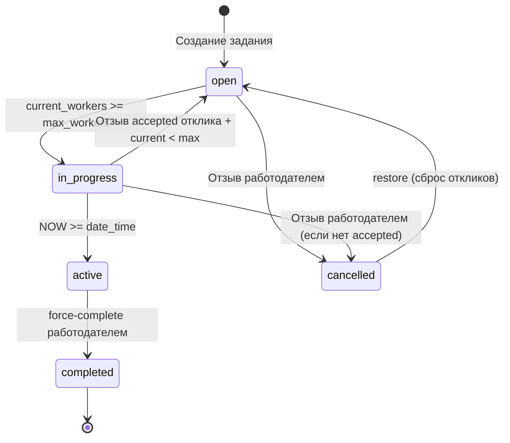

# План реализации упрощённой модели жизненного цикла заданий

> **Основание:** [New_logic.md](../New_logic.md) и [New_logic2.md](../New_logic2.md)
> **Дата анализа:** 2026-06-12
> **Статус:** Ожидает утверждения

---

## 1. Обзор предлагаемых изменений

### 1.1. New_logic.md — Упрощённая модель жизненного цикла заданий

**Новая State Machine:**

```
open → in_progress → active → completed
  ↑        ↓                      ↑
  └─── cancelled ←─── (отзыв) ────┘
```

| Статус | Описание |
|--------|----------|
| `open` | Приём откликов |
| `in_progress` | Набрано нужное количество (`current_workers >= max_workers`), начало не наступило |
| `active` | Наступило время начала (`date_time`) |
| `completed` | Принудительно завершено работодателем |
| `cancelled` | Отозвано работодателем до начала |

**Удаляемые статусы:** `payment_pending`, `paid`, `disputed`

**Ключевые изменения архитектуры:**
1. **Таблица `shifts` удаляется** — чат привязывается к [`applications`](app/blueprints/applications.py:1) через `messages.application_id`
2. **Чек-ины, подтверждение оплаты, споры удаляются**
3. **Автопереходы:** `open ↔ in_progress` (по `current_workers`), `in_progress → active` (по `date_time`)
4. **Принудительное завершение** работодателем из `active` → массовый reject всех `pending`
5. **12-часовое ограничение** на отзыв принятого отклика

### 1.2. New_logic2.md — UI/UX State Machine & Feedback Loop

Фокусируется на тестировании:
- **Видимость UI-элементов** для каждого статуса задания и роли
- **Toast-уведомления** при действиях и автопереходах
- **Модальные окна** подтверждения для критических действий
- **Оптимистичные обновления UI** (избранное, принятие/отклонение)
- **Адаптивность** на мобильных устройствах

---

## 2. Статус каждого изменения: сопоставление с текущим кодом

### 2.1. Модель статусов заданий

| Изменение | Статус | Где в коде |
|-----------|--------|------------|
| Статус `open` | ✅ Реализован | [`jobs.py:81`](app/blueprints/jobs.py:81), [`jobs.py:90`](app/blueprints/jobs.py:90) |
| Статус `in_progress` | ✅ Реализован | [`applications.py:202`](app/blueprints/applications.py:202), [`applications.py:261`](app/blueprints/applications.py:261) |
| Статус `active` | ⚠️ Частично | Используется в [`shifts.py:64`](app/blueprints/shifts.py:64) для статуса смены. Для заданий устанавливается через [`shifts.py:71`](app/blueprints/shifts.py:71), но **нет автоперехода `in_progress → active` по `date_time`** |
| Статус `completed` | ✅ Реализован | [`ratings.py:211`](app/blueprints/ratings.py:211) — через `_auto_complete_job_if_rated` |
| Статус `cancelled` | ✅ Реализован | [`jobs.py:506`](app/blueprints/jobs.py:506) |
| Статус `payment_pending` | ❌ **Требует удаления** | [`shifts.py:99`](app/blueprints/shifts.py:99), [`shifts.py:136`](app/blueprints/shifts.py:136), [`applications.py:399`](app/blueprints/applications.py:399) |
| Статус `paid` | ❌ **Требует удаления** | [`shifts.py:178`](app/blueprints/shifts.py:178), [`shifts.py:185`](app/blueprints/shifts.py:185), [`ratings.py:105`](app/blueprints/ratings.py:105), [`ratings.py:188`](app/blueprints/ratings.py:188) |
| Статус `disputed` | ❌ **Требует удаления** | [`shifts.py:285`](app/blueprints/shifts.py:285) |
| Статус `expired` | ⚠️ Сторонний | [`jobs.py:78`](app/blueprints/jobs.py:78) — не упоминается в новой логике, но используется для авто-истечения |

### 2.2. Автоматические переходы

| Переход | Статус | Комментарий |
|---------|--------|-------------|
| `open → in_progress` (current >= max) | ✅ Реализован | [`applications.py:202`](app/blueprints/applications.py:202) — атомарный PATCH с условием `current_workers=lt.{max_workers}` |
| `in_progress → open` (отзыв accepted) | ✅ Реализован | [`applications.py:261`](app/blueprints/applications.py:261), [`applications.py:421`](app/blueprints/applications.py:421) |
| `in_progress → active` (по date_time) | ❌ **Требует реализации** | Нет ни cron, ни триггера, ни проверки при запросе |
| `active → completed` (force-complete) | ❌ **Требует реализации** | Маршрут `POST /api/jobs/<id>/force-complete` отсутствует |

### 2.3. Таблица `shifts`

| Изменение | Статус | Где в коде |
|-----------|--------|------------|
| Удаление таблицы `shifts` | ❌ **Требует реализации** | Используется в 50+ местах |
| Удаление [`shifts_bp`](app/blueprints/shifts.py:9) | ❌ **Требует реализации** | Зарегистрирован в [`__init__.py:136`](app/__init__.py:136), [`__init__.py:149`](app/__init__.py:149), [`blueprints/__init__.py:7`](app/blueprints/__init__.py:7) |
| Удаление маршрута `/shift/<id>/checkin` | ❌ **Требует реализации** | [`shifts.py:25`](app/blueprints/shifts.py:25) |
| Удаление маршрута `/shift/<id>/complete` | ❌ **Требует реализации** | [`shifts.py:201`](app/blueprints/shifts.py:201) |
| Удаление маршрута `/shift/<id>/confirm-payment` | ❌ **Требует реализации** | [`shifts.py:207`](app/blueprints/shifts.py:207) |
| Удаление маршрута `/shift/<id>/dispute` | ❌ **Требует реализации** | [`shifts.py:268`](app/blueprints/shifts.py:268) |
| Удаление маршрута `/shifts` (список) | ❌ **Требует реализации** | [`shifts.py:12`](app/blueprints/shifts.py:12) |

### 2.4. Чат: миграция с `shift_id` на `application_id`

| Изменение | Статус | Где в коде |
|-----------|--------|------------|
| `messages.application_id` (новый столбец) | ❌ **Требует реализации** | Нет в БД |
| `messages.shift_id` (удалить) | ❌ **Требует реализации** | [`chat.py:23`](app/blueprints/chat.py:23), [`chat.py:56`](app/blueprints/chat.py:56), [`chat.py:63`](app/blueprints/chat.py:63), [`chat.py:78`](app/blueprints/chat.py:78) |
| `POST /api/send_message` → `application_id` | ❌ **Требует реализации** | [`chat.py:51-70`](app/blueprints/chat.py:51) |
| `GET /api/messages/<application_id>/poll` | ❌ **Требует реализации** | [`chat.py:73-87`](app/blueprints/chat.py:73) |
| `/chats` (список) → через `applications` | ❌ **Требует реализации** | [`chat.py:10-16`](app/blueprints/chat.py:10) |
| `/chat/<application_id>` | ❌ **Требует реализации** | [`chat.py:19-30`](app/blueprints/chat.py:19) |

### 2.5. Принудительное завершение задания

| Изменение | Статус |
|-----------|--------|
| `POST /api/jobs/<id>/force-complete` | ❌ **Требует реализации** |
| Массовый reject всех `pending` откликов | ❌ **Требует реализации** |
| Сохранение `accepted` с отметкой о завершении | ❌ **Требует реализации** |

### 2.6. Отзыв отклика работником (withdraw)

| Изменение | Статус | Где в коде |
|-----------|--------|------------|
| Отзыв `pending` в любое время | ✅ Реализован | [`applications.py:76-85`](app/blueprints/applications.py:76) — `unapply_job` |
| Отзыв `accepted` >12ч до начала | ❌ **Требует реализации** | Нет отдельного маршрута, только отмена работодателем в [`applications.py:372`](app/blueprints/applications.py:372) |
| Блокировка отзыва `accepted` <12ч | ❌ **Требует реализации** | Нет проверки |
| `POST /api/applications/<id>/withdraw` | ❌ **Требует реализации** | Маршрут отсутствует |

### 2.7. Оценки (ratings)

| Изменение | Статус | Где в коде |
|-----------|--------|------------|
| Оценка только в `completed` | ⚠️ Частично | Сейчас разрешено в `paid` и `completed` — [`ratings.py:105`](app/blueprints/ratings.py:105) |
| `_auto_complete_job_if_rated` | ❌ **Требует удаления** | Использует `shifts` и `paid` — [`ratings.py:181-211`](app/blueprints/ratings.py:181) |

### 2.8. Редактирование задания

| Изменение | Статус | Где в коде |
|-----------|--------|------------|
| Запрет редактирования при `current_workers > 0` | ❌ **Требует реализации** | [`jobs.py:778-821`](app/blueprints/jobs.py:778) — `edit_job` не проверяет `current_workers` |

### 2.9. Восстановление из `cancelled`

| Изменение | Статус | Где в коде |
|-----------|--------|------------|
| Восстановление → `open` | ⚠️ Частично | [`jobs.py:503-504`](app/blueprints/jobs.py:503) — меняет статус, но **не сбрасывает старые отклики** и не обнуляет `current_workers` |

### 2.10. Отклик на задание

| Изменение | Статус | Где в коде |
|-----------|--------|------------|
| Отклик на `open` | ✅ Реализован | [`applications.py:36`](app/blueprints/applications.py:36) |
| Отклик на `in_progress` (если есть места) | ❌ **Требует реализации** | [`applications.py:36`](app/blueprints/applications.py:36) — жёсткая проверка `!= 'open'` |
| Повторный отклик после `rejected` | ✅ Реализован | [`applications.py:64`](app/blueprints/applications.py:64) — нет блокировки |

### 2.11. Уведомления (notification types)

| Тип | Статус | Действие |
|-----|--------|----------|
| `shift_checkin` | ❌ Деактивировать | [`notification_service.py:13`](app/services/notification_service.py:13) |
| `shift_complete` | ❌ Деактивировать | [`notification_service.py:14`](app/services/notification_service.py:14) |
| `shift_created` | ❌ Деактивировать | [`notification_service.py:15`](app/services/notification_service.py:15) |
| `shift_reminder` | ❌ Деактивировать | [`notification_service.py:16`](app/services/notification_service.py:16) |
| `payment_confirmed` | ❌ Деактивировать | [`notification_service.py:17`](app/services/notification_service.py:17) |
| `payment_received` | ❌ Деактивировать | [`notification_service.py:18`](app/services/notification_service.py:18) |
| `dispute_started` | ❌ Деактивировать | [`notification_service.py:25`](app/services/notification_service.py:25) |
| `job_published` | ⚠️ Не упомянут | Может остаться или быть удалён |

---

## 3. Пошаговый план реализации

### Этап 1: Миграция базы данных (наивысший приоритет)

**Шаг 1.1.** Создать миграцию `026_new_state_machine.sql`:
- Добавить столбец `application_id UUID REFERENCES applications(id)` в таблицу `messages`
- Добавить индекс на `messages.application_id`
- Создать ENUM/CHECK constraint для статусов `jobs`: только `open`, `in_progress`, `active`, `completed`, `cancelled`
- Удалить столбец `shift_id` из `messages` (после миграции данных)
- Удалить таблицу `shifts` (после полной миграции кода)

**Шаг 1.2.** Создать миграцию `027_drop_shifts.sql` (отложенная):
- `DROP TABLE shifts CASCADE;`

### Этап 2: Удаление shifts_bp и старых маршрутов

**Шаг 2.1.** [`app/__init__.py`](app/__init__.py:136) — удалить импорт и регистрацию `shifts_bp`

**Шаг 2.2.** [`app/blueprints/__init__.py`](app/blueprints/__init__.py:7) — удалить `shifts_bp`

**Шаг 2.3.** [`app/blueprints/shifts.py`](app/blueprints/shifts.py:1) — удалить файл целиком

### Этап 3: Миграция чата с `shift_id` на `application_id`

**Шаг 3.1.** [`app/blueprints/chat.py`](app/blueprints/chat.py:10) — переписать все маршруты:

| Старый маршрут | Новый маршрут |
|----------------|---------------|
| `/chats` (через shifts) | `/chats` (через applications + accepted) |
| `/chat/<shift_id>` | `/chat/<application_id>` |
| `/chat/new/<worker_id>` | `/chat/new/<worker_id>` (поиск через applications) |
| `POST /api/send_message` (shift_id) | `POST /api/send_message` (application_id) |
| `GET /api/messages/<shift_id>/poll` | `GET /api/messages/<application_id>/poll` |
| `POST /api/delete-chats` | `POST /api/delete-chats` (через application_id) |

### Этап 4: Новые маршруты

**Шаг 4.1.** [`app/blueprints/jobs.py`](app/blueprints/jobs.py:1) — добавить `POST /api/jobs/<job_id>/force-complete`:
- Проверить, что задание в статусе `active`
- Проверить, что пользователь — работодатель-владелец
- Все `pending` отклики → `rejected` (массовый PATCH)
- `accepted` отклики остаются без изменений
- Статус задания → `completed`

**Шаг 4.2.** [`app/blueprints/applications.py`](app/blueprints/applications.py:1) — добавить `POST /api/applications/<app_id>/withdraw`:
- Проверить, что пользователь — владелец отклика
- Если `status == 'pending'`: удалить отклик (без ограничений)
- Если `status == 'accepted'`: проверить 12-часовое ограничение, уменьшить `current_workers`, обновить статус задания при необходимости

### Этап 5: Исправление существующих маршрутов

**Шаг 5.1.** [`app/blueprints/jobs.py`](app/blueprints/jobs.py:778) — `edit_job`: добавить проверку `current_workers == 0` с редиректом + toast

**Шаг 5.2.** [`app/blueprints/jobs.py`](app/blueprints/jobs.py:569) — `restore_job`: добавить сброс старых откликов и `current_workers=0`

**Шаг 5.3.** [`app/blueprints/jobs.py`](app/blueprints/jobs.py:545) — `cancel_job`: убрать проверку активных смен (таблица shifts удаляется), вместо неё проверять статус задания (нельзя отозвать `active`)

**Шаг 5.4.** [`app/blueprints/applications.py`](app/blueprints/applications.py:36) — `apply_job`: разрешить отклик на `in_progress` если `current_workers < max_workers`

**Шаг 5.5.** [`app/blueprints/applications.py`](app/blueprints/applications.py:372) — `cancel_application`: заменить проверки статусов (убрать `payment_pending`, `paid`), использовать `date_time` вместо `start_time` для 12-часового ограничения

**Шаг 5.6.** [`app/blueprints/ratings.py`](app/blueprints/ratings.py:105) — изменить проверку с `('paid', 'completed')` на только `('completed',)`

**Шаг 5.7.** [`app/blueprints/ratings.py`](app/blueprints/ratings.py:181) — удалить функцию `_auto_complete_job_if_rated`

### Этап 6: Автопереход `in_progress → active`

**Шаг 6.1.** [`app/blueprints/jobs.py`](app/blueprints/jobs.py:326) — в `job_detail`: добавить проверку: если `status == 'in_progress'` и `NOW() >= date_time`, обновить статус на `active`

**Шаг 6.2.** [`app/blueprints/jobs.py`](app/blueprints/jobs.py:65) — в `index`: при выборке заданий проверять `date_time` для перехода `in_progress → active`

**Шаг 6.3.** Опционально: добавить cron/триггер на стороне Supabase (если доступен `pg_cron`)

### Этап 7: Обновление уведомлений

**Шаг 7.1.** [`app/services/notification_service.py`](app/services/notification_service.py:8) — удалить из `NOTIFICATION_TYPES` и `DEFAULT_ENABLED_TYPES`:
- `shift_checkin`
- `shift_complete`
- `shift_created`
- `shift_reminder`
- `payment_confirmed`
- `payment_received`
- `dispute_started`

**Шаг 7.2.** Найти и удалить все вызовы `notify(...)` с этими типами из остальных файлов (в основном `shifts.py` — он будет удалён целиком, проверить [`jobs.py`](app/blueprints/jobs.py:757), [`applications.py`](app/blueprints/applications.py:237))

### Этап 8: Очистка ссылок на `shifts` в других файлах

**Шаг 8.1.** [`app/blueprints/jobs.py`](app/blueprints/jobs.py:552-560) — удалить проверку активных смен в `cancel_job`

**Шаг 8.2.** [`app/blueprints/jobs.py`](app/blueprints/jobs.py:600-605) — удалить `shifts` из списка каскадного удаления в `delete_job`

**Шаг 8.3.** [`app/blueprints/jobs.py`](app/blueprints/jobs.py:741-758) — удалить создание смены в `respond_invitation`

**Шаг 8.4.** [`app/blueprints/applications.py`](app/blueprints/applications.py:170) — удалить `shift_id` из `api_handle_application`

**Шаг 8.5.** [`app/blueprints/applications.py`](app/blueprints/applications.py:222-238) — удалить создание смены при accept, заменить уведомление `shift_created` на соответствующее

### Этап 9: UI/UX изменения (New_logic2.md)

**Шаг 9.1.** Шаблоны (Jinja2): обновить условную логику отображения кнопок согласно матрице видимости из New_logic2.md:
- `open`: кнопка «Редактировать» только при `current_workers == 0`
- `in_progress`: скрыть «Редактировать», показать счётчик `N/M принято`
- `active`: показать «Завершить задание» (красная), скрыть все кнопки управления
- `completed`: показать «Оценить», скрыть активные кнопки
- `cancelled`: показать «Восстановить», «Удалить»

**Шаг 9.2.** Шаблоны: обновить бейджи статусов согласно New_logic2.md (цвета Tailwind + текст)

**Шаг 9.3.** JavaScript: обновить [`applications.js`]() — убрать ссылки на `shift_id`, `checkin`, `payment_confirmed`

**Шаг 9.4.** JavaScript: добавить toast-уведомления для ключевых действий согласно матрице из New_logic2.md

**Шаг 9.5.** Добавить модальные окна подтверждения для:
- Принудительного завершения задания
- Восстановления из `cancelled`
- Массовых операций (принять/отклонить)

---

## 4. Сводка: что невозможно или нецелесообразно

### 4.1. Полное удаление `shifts` без миграции данных
**Риск:** в production могут быть активные смены, которые нужно корректно завершить перед удалением таблицы.
**Рекомендация:** создать миграцию, которая сначала переносит данные чата из `messages.shift_id` в `messages.application_id`, затем удаляет таблицу.

### 4.2. Автопереход `in_progress → active` по cron
**Ограничение:** Supabase бесплатный тариф не поддерживает `pg_cron`.
**Альтернатива:** проверять `date_time` при каждом запросе к заданию (в `job_detail`, `index`, `my_jobs`). Это не даёт мгновенного перехода без взаимодействия, но покрывает все сценарии использования.

### 4.3. Полный отказ от уведомлений `shift_*`
**Смягчение:** если есть активные уведомления в БД со старыми типами, они не должны ломать UI. Достаточно исключить их из новых вызовов, но не удалять исторические.

### 4.4. Изменение модели оплаты
**Важно:** New_logic.md не затрагивает модель монетизации (оплата за задание, чеки самозанятого). Монетизация остаётся как есть в [`monetization.py`](app/blueprints/monetization.py:1).

---

## 5. Приоритетность изменений

| Приоритет | Этап | Описание |
|-----------|------|----------|
| 🔴 P0 | Этап 4 | Новые маршруты: `force-complete`, `withdraw` (критический функционал) |
| 🔴 P0 | Этап 6 | Автопереход `in_progress → active` |
| 🟡 P1 | Этап 5 | Исправление существующих маршрутов (edit, restore, cancel, apply) |
| 🟡 P1 | Этап 3 | Миграция чата на `application_id` |
| 🟡 P1 | Этап 1 | Миграция БД (application_id в messages, constraint на статусы) |
| 🟢 P2 | Этап 7 | Обновление уведомлений |
| 🟢 P2 | Этап 2 | Удаление shifts_bp |
| 🟢 P2 | Этап 8 | Очистка ссылок на shifts |
| 🔵 P3 | Этап 9 | UI/UX изменения (New_logic2.md) |

---

## 6. Рекомендации по тестированию

### 6.1. Модульное тестирование (Python)
- Тесты для `force-complete`: проверка перехода `active → completed`, массовый reject
- Тесты для `withdraw`: проверка 12-часового ограничения, уменьшения `current_workers`
- Тесты для автопереходов: `open ↔ in_progress`, `in_progress → active`
- Тесты для `restore_job`: сброс старых откликов, `current_workers=0`

### 6.2. Интеграционное тестирование (API)
- [`test_api.py`](test_api.py) — дополнить тестами новых маршрутов
- [`test_rls.py`](test_rls.py) — проверить RLS для чата с `application_id`

### 6.3. E2E тестирование (Playwright/Selenium)
- [`test_selenium_v2.py`](test_selenium_v2.py) — дополнить сценариями из New_logic.md (раздел «ТЕСТ-ПЛАН: STATE MACHINE v2»)
- Проверка UI видимости согласно матрице из New_logic2.md
- Проверка toast-уведомлений
- Проверка модальных окон

### 6.4. Миграция БД
- Проверить, что `messages.application_id` правильно заполнен для существующих сообщений
- Проверить, что `messages.shift_id` удалён
- Проверить, что таблица `shifts` удалена
- Проверить constraint на статусы `jobs`

---

## 7. Диаграмма переходов состояний



---

## 8. Файлы, затронутые изменениями

| Файл | Этапы | Характер изменений |
|------|-------|-------------------|
| [`app/__init__.py`](app/__init__.py:136) | 2.1, 2.2 | Удалить shifts_bp, добавить force-complete/withdraw |
| [`app/blueprints/__init__.py`](app/blueprints/__init__.py:7) | 2.2 | Удалить shifts_bp |
| [`app/blueprints/shifts.py`](app/blueprints/shifts.py:1) | 2.3 | **Удалить** |
| [`app/blueprints/chat.py`](app/blueprints/chat.py:1) | 3.1 | Полная переработка (shift_id → application_id) |
| [`app/blueprints/jobs.py`](app/blueprints/jobs.py:1) | 4.1, 5.1-5.3, 6.1-6.2, 8.1-8.3 | force-complete, edit, restore, cancel, авто active |
| [`app/blueprints/applications.py`](app/blueprints/applications.py:1) | 4.2, 5.4-5.5, 8.4-8.5 | withdraw, apply, cancel_application |
| [`app/blueprints/ratings.py`](app/blueprints/ratings.py:1) | 5.6-5.7 | Проверка completed, удалить auto_complete |
| [`app/services/notification_service.py`](app/services/notification_service.py:1) | 7.1 | Удалить старые типы уведомлений |
| [`migrations/`](migrations/) | 1 | Новые миграции |
| Шаблоны (Jinja2) | 9 | UI видимость, бейджи, модалки |
| JavaScript файлы | 9 | Убрать shift_id, toast-уведомления |
