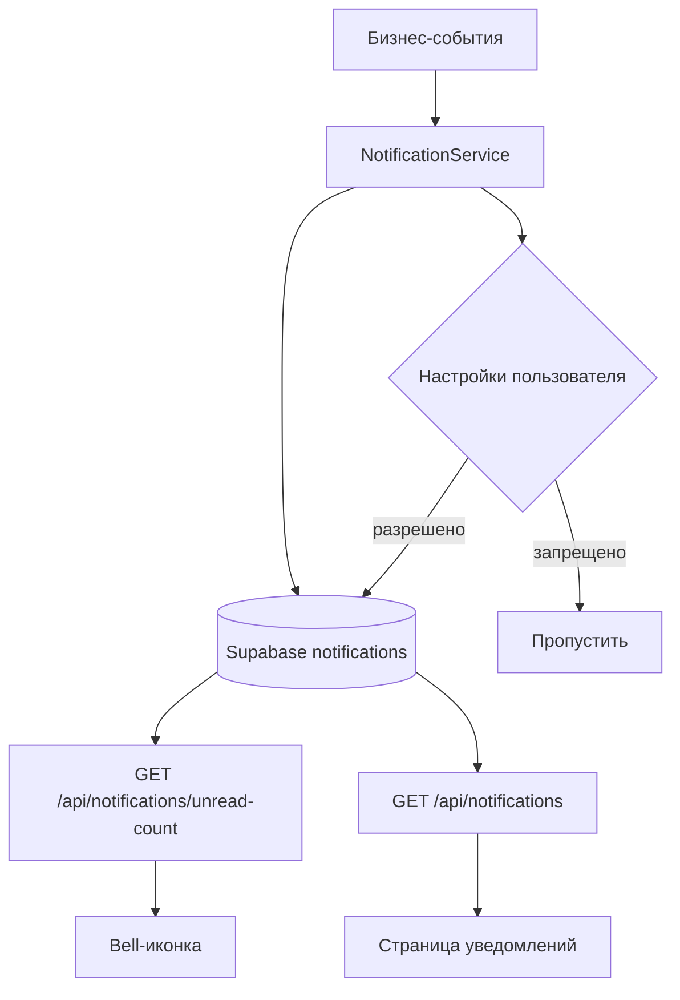

# План: Система уведомлений

## 1. Анализ существующей системы

### Что уже есть:
| Компонент | Файл | Описание |
|-----------|------|----------|
| `add_notification()` | [`app/utils.py:140`](app/utils.py:140) | Создаёт уведомление в Supabase |
| `notifications_bp` | [`app/blueprints/notifications.py`](app/blueprints/notifications.py) | Список + пометка прочитанным |
| `inject_unread_notifications` | [`app/__init__.py`](app/__init__.py) | Счётчик для bell-иконки (кеш 30с) |
| Таблица `notifications` | миграции 004, 005 | `id, user_id, type, title, message, is_read, created_at` |
| Шаблон | [`notifications.html`](templates/notifications.html) | Страница уведомлений |

### Где уже вызывается `add_notification`:
- [`shifts.py`](app/blueprints/shifts.py): checkin, complete, confirm_payment, dispute, rate
- [`applications.py`](app/blueprints/applications.py): accept, reject, cancel

### Чего не хватает:
- Типизация уведомлений (константы типов)
- Уведомления о чате, рейтинге, системные
- API для polling (обновление счётчика)
- Настройки пользователя (отключение типов)
- Приоритеты (срочные vs инфо)
- Email/push каналы (отложено)

---

## 2. Архитектура



---

## 3. Типы уведомлений (константы)

```python
NOTIFICATION_TYPES = {
    'application_received':  'Новый отклик',
    'application_accepted':  'Отклик принят',
    'application_rejected':  'Отклик отклонён',
    'application_cancelled': 'Отклик отменён',
    'shift_checkin':         'Чек-ин',
    'shift_complete':        'Смена завершена',
    'shift_reminder':        'Напоминание о смене',
    'payment_confirmed':     'Оплата подтверждена',
    'payment_received':      'Оплата получена',
    'new_message':           'Новое сообщение',
    'new_rating':            'Новая оценка',
    'job_filled':            'Задание укомплектовано',
    'job_completed':         'Задание завершено',
    'job_cancelled':         'Задание отменено',
    'system':                'Системное',
}
```

---

## 4. План реализации (5 шагов)

### Шаг 1: `NotificationService` + константы типов
**Файл:** [`app/services/notification_service.py`](app/services/notification_service.py) (новый)

- Класс/модуль с константами типов
- `create(user_id, type, title, message, data=None, priority='normal')`
- Проверка настроек пользователя перед созданием
- Сохранение `job_id`, `shift_id`, `application_id` в data JSON

### Шаг 2: API эндпоинты в `notifications.py`
- `GET /api/notifications/unread-count` — быстрый счётчик для polling
- `GET /api/notifications?page=1&per_page=20` — список с пагинацией (JSON)
- `POST /api/notifications/<id>/read` — пометка прочитанным (AJAX)
- `POST /api/notifications/read-all` — пометить все

### Шаг 3: Настройки уведомлений
**Файл:** [`app/blueprints/profile.py`](app/blueprints/profile.py) (дополнить)

- Поле `notification_prefs` в profiles (JSON: `{"application_received": true, ...}`)
- GET/POST эндпоинт для сохранения настроек
- Проверка в `NotificationService.create()`

### Шаг 4: Интеграция в бизнес-логику
- Добавить `add_notification` в [`chat.py`](app/blueprints/chat.py) для новых сообщений
- Добавить в rating flow
- Добавить системные уведомления (администратор через admin.py)
- Заменить прямые вызовы `add_notification` на `NotificationService.create`

### Шаг 5: Frontend
- JS polling каждые 30с для обновления bell-счётчика
- Шторка уведомлений с быстрым просмотром
- Кнопка «Прочитано» / «Отметить все»

### Отложено (v2):
- Email-рассылка (нужен SMTP-сервер)
- Push-уведомления (нужен service worker + VAPID keys)
- WebSocket (нужен отдельный сервер)
