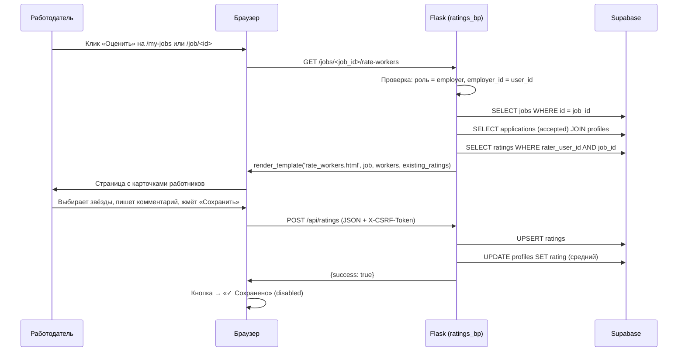

# План: Страница «Оценить работников задания»

## Обзор

Новая страница `GET /jobs/<job_id>/rate-workers` позволяет работодателю оценить всех принятых (`accepted`) работников конкретного задания. Каждый работник представлен отдельной карточкой с формой оценки (звёзды 1–5 + комментарий). Отправка идёт через `fetch()` на существующий `POST /api/ratings`.

---

## 1. Новый роут в [`app/blueprints/ratings.py`](app/blueprints/ratings.py)

### 1.1. Псевдокод

```python
@ratings_bp.route('/jobs/<job_id>/rate-workers')
@login_required
def rate_workers_page(job_id):
    """
    Страница оценки всех принятых работников задания.
    Доступна только работодателю — владельцу задания.
    """
    user_id = session['user_id']

    # --- 1. Проверка роли ---
    if session.get('role') != 'employer':
        flash('Только работодатели могут оценивать работников', 'danger')
        return redirect(url_for('jobs.index'))

    # --- 2. Получить задание и проверить владельца ---
    job_resp = supabase_request(
        'GET',
        f'jobs?id=eq.{job_id}&select=id,title,status,employer_id'
    )
    if not job_resp.ok or not job_resp.json():
        flash('Задание не найдено', 'danger')
        return redirect(url_for('jobs.my_jobs'))

    job = job_resp.json()[0]

    if job['employer_id'] != user_id:
        flash('Вы не являетесь работодателем этого задания', 'danger')
        return redirect(url_for('jobs.my_jobs'))

    # --- 3. Загрузить принятых работников с JOIN к profiles ---
    workers_resp = supabase_request(
        'GET',
        f'applications?job_id=eq.{job_id}&status=eq.accepted'
        f'&select=worker_id,profiles!worker_id(full_name,photo_url,rating)'
    )
    workers = []
    if workers_resp.ok and workers_resp.json():
        for app in workers_resp.json():
            profile = app.get('profiles') or {}
            workers.append({
                'worker_id': app['worker_id'],
                'full_name': profile.get('full_name', 'Пользователь'),
                'photo_url': profile.get('photo_url', ''),
                'rating': profile.get('rating', 0),
            })

    # --- 4. Загрузить существующие оценки (этого работодателя, этого задания) ---
    ratings_resp = supabase_request(
        'GET',
        f'ratings?rater_user_id=eq.{user_id}&job_id=eq.{job_id}'
        f'&select=rated_user_id,rating,comment'
    )
    existing_ratings = {}
    if ratings_resp.ok and ratings_resp.json():
        for r in ratings_resp.json():
            existing_ratings[r['rated_user_id']] = r

    # --- 5. Рендер шаблона ---
    return render_template(
        'rate_workers.html',
        job=job,
        workers=workers,
        existing_ratings=existing_ratings
    )
```

### 1.2. Пояснения

| Шаг | Описание |
|-----|----------|
| Проверка роли | `session.get('role') != 'employer'` → редирект на `/` с flash-сообщением. Аналогично [`my_jobs()`](app/blueprints/jobs.py:500). |
| Проверка владельца | Совпадение `job.employer_id == session['user_id']`. Если нет — редирект на `/my-jobs`. |
| Загрузка работников | JOIN `applications → profiles` через синтаксис Supabase `profiles!worker_id(...)`. Фильтр `status=eq.accepted`. |
| Загрузка оценок | WHERE `rater_user_id` AND `job_id`. Строится словарь `{rated_user_id: {rating, comment}}` для быстрого доступа в шаблоне. |
| Рендер | Передаётся `job`, `workers`, `existing_ratings`. |

---

## 2. Новый шаблон [`templates/rate_workers.html`](templates/rate_workers.html)

### 2.1. Полный HTML

```jinja


Оценить работников — {{ job.title }} — Трудник

<div class="px-4 pb-24 max-w-lg mx-auto">

    {# ============================================ #}
    {# Заголовок + кнопка «Назад»                     #}
    {# ============================================ #}
    <div class="flex items-center gap-3 mb-5">
        <a href="/my-jobs"
           class="w-10 h-10 flex items-center justify-center rounded-xl hover:bg-neutral-100 transition-colors touch-target"
           aria-label="Назад к моим заданиям">
            {{ chevron_left(20) }}
        </a>
        <div class="min-w-0">
            <h2 class="text-2xl font-bold text-neutral-900 truncate">Оценить работников</h2>
            <p class="text-sm text-neutral-400 truncate">{{ job.title }}</p>
        </div>
    </div>

    {# ============================================ #}
    {# Информация о задании                          #}
    {# ============================================ #}
    <div class="bg-white rounded-2xl shadow-sm border border-neutral-100 p-4 mb-5">
        <div class="flex items-center gap-3">
            <div class="w-10 h-10 rounded-xl bg-primary-50 flex items-center justify-center shrink-0">
                <svg width="20" height="20" viewBox="0 0 24 24" fill="none" stroke="currentColor"
                     stroke-width="2" stroke-linecap="round" stroke-linejoin="round"
                     class="text-primary-600">
                    <path d="M20 21v-2a4 4 0 0 0-4-4H8a4 4 0 0 0-4 4v2"/>
                    <circle cx="12" cy="7" r="4"/>
                </svg>
            </div>
            <div class="min-w-0">
                <p class="text-sm font-semibold text-neutral-900 truncate">{{ job.title }}</p>
                <p class="text-xs text-neutral-400">
                    
                    <span class="inline-flex items-center gap-1 px-2 py-0.5 rounded-full text-[11px] font-medium
                        bg-neutral-100 text-neutral-500
                        bg-blue-50 text-blue-700
                        bg-amber-50 text-amber-700
                        bg-red-50 text-red-700">
                        {{ status_labels.get(job.status, job.status) }}
                    </span>
                    · {{ workers|length }} работник{{ 'ов' if workers|length != 1 else '' }}
                </p>
            </div>
        </div>
    </div>

    {# ============================================ #}
    {# Список работников                             #}
    {# ============================================ #}
    
        <div class="flex flex-col items-center justify-center py-16 text-center">
            <div class="w-20 h-20 rounded-full bg-neutral-100 flex items-center justify-center mb-4">
                <span class="text-3xl">👤</span>
            </div>
            <p class="text-lg font-semibold text-neutral-700">Нет принятых работников</p>
            <p class="text-sm text-neutral-400 mt-1">По этому заданию ещё нет принятых откликов</p>
        </div>
    
        <div class="space-y-4" id="workers-list">
            
            
            <div class="app-card bg-white rounded-2xl shadow-sm border border-neutral-100 p-4 transition-all duration-200"
                 data-worker-id="{{ w.worker_id }}"
                 id="worker-card-{{ w.worker_id }}">

                {# --- Шапка: фото, имя, рейтинг --- #}
                <div class="flex items-center gap-3 mb-3">
                    <div class="w-12 h-12 rounded-full bg-primary-50 flex items-center justify-center shrink-0 overflow-hidden">
                        
                        {{ w.full_name[:1].upper() }}</span>'">
                        
                        <span class="text-primary-600 font-semibold text-lg">{{ w.full_name[:1].upper() }}</span>
                        
                    </div>
                    <div class="min-w-0 flex-1">
                        <p class="font-semibold text-neutral-900 text-sm truncate">{{ w.full_name }}</p>
                        <div class="flex items-center gap-1">
                            <span class="text-amber-500 text-sm">★</span>
                            <span class="text-xs text-neutral-400">
                                {{ '%.1f'|format(w.rating) if w.rating else '—' }}
                            </span>
                        </div>
                    </div>
                    {# Статус: оценён / не оценён #}
                    <span class="text-xs font-medium px-2 py-1 rounded-full shrink-0
                        bg-green-50 text-green-700bg-amber-50 text-amber-700"
                        id="status-badge-{{ w.worker_id }}">
                        ✓ ОценёнНе оценён
                    </span>
                </div>

                {# --- Форма оценки --- #}
                <div class="border-t border-neutral-100 pt-3">
                    {# Звёзды #}
                    <div class="flex items-center gap-1 mb-2" id="stars-{{ w.worker_id }}">
                        
                        <button type="button"
                                class="star-btn text-2xl hover:scale-110 transition-transform touch-target
                                    text-amber-500text-neutral-300"
                                data-value="{{ s }}"
                                data-worker="{{ w.worker_id }}"
                                aria-label="Оценка {{ s }}">
                            ★
                        </button>
                        
                    </div>

                    {# Комментарий #}
                    <textarea
                        id="comment-{{ w.worker_id }}"
                        class="w-full text-sm border border-neutral-200 rounded-lg p-2.5 resize-none bg-neutral-50 focus:bg-white transition-colors"
                        rows="2"
                        placeholder="Ваш отзыв (необязательно)"
                    >{{ existing.comment if existing else '' }}</textarea>

                    {# Кнопка + обратная связь #}
                    <div class="flex items-center gap-2 mt-2">
                        <button type="button"
                                class="btn-primary text-sm font-semibold px-5 py-2.5 rounded-xl bg-primary-500 text-white hover:bg-primary-600 active:scale-[0.98] transition-all duration-200 disabled:opacity-50 disabled:cursor-not-allowed disabled:active:scale-100"
                                id="save-btn-{{ w.worker_id }}"
                                onclick="saveRating('{{ w.worker_id }}')"
                                disabled>
                            
                                <span class="flex items-center gap-1.5">
                                    {{ check(16) }}
                                    Сохранено
                                </span>
                            
                                Сохранить оценку
                            
                        </button>
                        <span id="feedback-{{ w.worker_id }}" class="text-sm"></span>
                    </div>
                </div>
            </div>
            
        </div>
    
</div>

{# ============================================ #}
{# JavaScript                                    #}
{# ============================================ #}
<script>
    const csrfToken = '{{ csrf_token }}';
    const jobId = '{{ job.id }}';
    const raterUserId = '{{ session.user_id }}';

    // --- Обработчики звёзд ---
    document.querySelectorAll('.star-btn').forEach(function(btn) {
        btn.addEventListener('click', function() {
            var workerId = this.dataset.worker;
            var value = parseInt(this.dataset.value);
            highlightStars(workerId, value);
        });
    });

    function highlightStars(workerId, value) {
        var starsContainer = document.getElementById('stars-' + workerId);
        if (!starsContainer) return;
        var btns = starsContainer.querySelectorAll('.star-btn');
        btns.forEach(function(b) {
            var starVal = parseInt(b.dataset.value);
            if (starVal <= value) {
                b.className = 'star-btn text-2xl hover:scale-110 transition-transform touch-target text-amber-500';
            } else {
                b.className = 'star-btn text-2xl hover:scale-110 transition-transform touch-target text-neutral-300';
            }
        });
        // Сохраняем выбранное значение в dataset контейнера
        starsContainer.dataset.selectedRating = value;
    }

    function getSelectedRating(workerId) {
        var container = document.getElementById('stars-' + workerId);
        return parseInt(container.dataset.selectedRating) || 0;
    }

    // --- Сохранение оценки ---
    function saveRating(workerId) {
        var rating = getSelectedRating(workerId);
        if (!rating || rating < 1 || rating > 5) {
            showFeedback(workerId, 'Выберите оценку от 1 до 5', 'error');
            return;
        }

        var comment = document.getElementById('comment-' + workerId).value.trim();
        var saveBtn = document.getElementById('save-btn-' + workerId);
        var feedbackEl = document.getElementById('feedback-' + workerId);

        // Блокируем кнопку на время запроса
        saveBtn.disabled = true;
        saveBtn.textContent = 'Сохранение...';
        feedbackEl.textContent = '';
        feedbackEl.className = 'text-sm text-neutral-400';

        fetch('/api/ratings', {
            method: 'POST',
            headers: {
                'Content-Type': 'application/json',
                'X-CSRF-Token': csrfToken
            },
            body: JSON.stringify({
                job_id: jobId,
                rated_user_id: workerId,
                rating: rating,
                comment: comment,
                target_type: 'worker'
            })
        })
        .then(function(r) { return r.json(); })
        .then(function(data) {
            if (data.success) {
                // Успех: показать ✓ и заблокировать кнопку
                saveBtn.innerHTML = '<span class="flex items-center gap-1.5">{{ check(16) }}Сохранено</span>';
                saveBtn.classList.add('bg-green-500', 'hover:bg-green-600');
                saveBtn.classList.remove('bg-primary-500', 'hover:bg-primary-600');
                showFeedback(workerId, '✓ Оценка сохранена', 'success');

                // Обновить бейдж статуса
                var badge = document.getElementById('status-badge-' + workerId);
                if (badge) {
                    badge.textContent = '✓ Оценён';
                    badge.className = 'text-xs font-medium px-2 py-1 rounded-full shrink-0 bg-green-50 text-green-700';
                }
            } else {
                saveBtn.disabled = false;
                saveBtn.textContent = 'Сохранить оценку';
                showFeedback(workerId, data.error || 'Ошибка сохранения', 'error');
            }
        })
        .catch(function() {
            saveBtn.disabled = false;
            saveBtn.textContent = 'Сохранить оценку';
            showFeedback(workerId, 'Ошибка соединения с сервером', 'error');
        });
    }

    function showFeedback(workerId, message, type) {
        var el = document.getElementById('feedback-' + workerId);
        if (!el) return;
        el.textContent = message;
        if (type === 'success') {
            el.className = 'text-sm text-green-600 font-medium';
        } else if (type === 'error') {
            el.className = 'text-sm text-red-500 font-medium';
        } else {
            el.className = 'text-sm text-neutral-400';
        }
    }

    // --- Инициализация: сохраняем текущие значения звёзд из existing ---
    document.querySelectorAll('[id^="stars-"]').forEach(function(container) {
        var workerId = container.id.replace('stars-', '');
        // Ищем предзаполненное значение по классу text-amber-500
        var filledStars = container.querySelectorAll('.star-btn.text-amber-500');
        if (filledStars.length > 0) {
            container.dataset.selectedRating = filledStars.length;
        }
    });
</script>

```

### 2.2. Пояснения к шаблону

| Элемент | Описание |
|---------|----------|
| Заголовок | Название страницы + название задания + ссылка «← Назад к моим заданиям» (`/my-jobs`). |
| Инфо-карточка | Показывает название задания, статус (с цветовой кодировкой) и количество работников. |
| Карточка работника | Фото (с fallback на инициал), имя, средний рейтинг (из `profiles.rating`), бейдж «✓ Оценён» / «Не оценён». |
| Звёзды | 5 кнопок-звёзд. При клике подсвечиваются жёлтым (`text-amber-500`). Выбранное значение хранится в `dataset.selectedRating` контейнера. |
| Комментарий | `textarea`, предзаполненный существующим комментарием, если есть. |
| Кнопка «Сохранить оценку» | Если работник уже оценён — кнопка заблокирована (`disabled`), показывает «✓ Сохранено». После успешного сохранения — переходит в это же состояние. |
| `fetch()` | Отправляет `POST /api/ratings` с заголовком `X-CSRF-Token` (используется существующая CSRF-защита из [`app/__init__.py`](app/__init__.py:43)). |
| Обработка ошибок | При ошибке показывается сообщение рядом с кнопкой, кнопка разблокируется для повторной попытки. |

---

## 3. Исправление существующих ссылок

### 3.1. [`templates/my_jobs.html`](templates/my_jobs.html:204)

**Было:**
```jinja
<a href="/jobs/{{ job.id }}#ratings-section"
```

**Стало:**
```jinja
<a href="/jobs/{{ job.id }}/rate-workers"
```

Конкретно: строка 204, заменить `href="/jobs/{{ job.id }}#ratings-section"` на `href="/jobs/{{ job.id }}/rate-workers"`.

### 3.2. [`templates/job_detail.html`](templates/job_detail.html:124)

**Было:**
```jinja
<a href="/jobs/{{ job.id }}#ratings-section" class="w-full inline-flex items-center justify-center gap-2 bg-warning/20 hover:bg-warning/30 text-warning font-bold py-3.5 rounded-xl transition-all duration-200 active:scale-[0.98]">
```

**Стало:**
```jinja
<a href="/jobs/{{ job.id }}/rate-workers" class="w-full inline-flex items-center justify-center gap-2 bg-warning/20 hover:bg-warning/30 text-warning font-bold py-3.5 rounded-xl transition-all duration-200 active:scale-[0.98]">
```

Конкретно: строка 124, заменить `href="/jobs/{{ job.id }}#ratings-section"` на `href="/jobs/{{ job.id }}/rate-workers"`.

---

## 4. Диаграмма потока данных



---

## 5. Порядок реализации

1. **Добавить роут** `rate_workers_page()` в [`app/blueprints/ratings.py`](app/blueprints/ratings.py) (после строки ~225, после `user_ratings_page`).
2. **Создать шаблон** [`templates/rate_workers.html`](templates/rate_workers.html) с содержимым из раздела 2.
3. **Исправить ссылку** в [`templates/my_jobs.html`](templates/my_jobs.html:204).
4. **Исправить ссылку** в [`templates/job_detail.html`](templates/job_detail.html:124).

---

## 6. Примечания

- **CSRF**: Шаблон использует `{{ csrf_token }}` (внедряется через `inject_csrf_token` в [`app/__init__.py`](app/__init__.py:25)). Отправляется в заголовке `X-CSRF-Token`, что поддерживается существующей CSRF-проверкой.
- **Переоценка**: Текущий дизайн блокирует повторную отправку после сохранения (`disabled` на кнопке). Это предотвращает случайные дубли, но при необходимости можно добавить кнопку «Изменить оценку» позже.
- **Стили**: Используются существующие CSS-классы проекта: `app-card`, `btn-primary`, `status-badge`, `touch-target`, `hover:scale-110` и т.д.
- **API**: Используется существующий `POST /api/ratings`, который уже поддерживает upsert и все необходимые проверки (задание завершено, участник задания, нельзя оценить себя).
