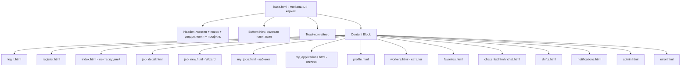

# План редизайна «Трудник» согласно UXUI.md

## Общая информация

**Источник:** [`UXUI.md`](../archive/UXUI.md) — системная инструкция для полного редизайна
**Цель:** Модернизация UI/UX с сохранением всей функциональности и архитектуры Flask/Blueprints
**Ветка:** `redesign-uxui`

---

## Дизайн-система (ключевые изменения)

### Текущая → Новая цветовая палитра

| Компонент | Сейчас | Станет |
|-----------|--------|--------|
| Основной цвет | `burgundy` (#5C1D26) | `primary-500` (#d97706) — тёплый янтарь |
| Акцент | `gold` (#D4AF37) | `primary-300` (#fbbf24) |
| Фон | `gray-50/80` | `neutral-50` (#fafafa) |
| Тема PWA | #800020 | #d97706 |
| Карты/бордеры | `border-gray-100/200` | `border-neutral-200` |

### Ключевые UI-паттерны

1. **Mobile-first** — базовые стили для мобильных, расширения через `sm:`, `md:`, `lg:`
2. **Нижнее меню** — фиксированная панель с 5 иконками, `safe-area-inset-bottom` для iOS
3. **Toast-уведомления** — вместо flash-сообщений, 4 типа (success/error/warning/info), autohide 3.5s
4. **Карточки** — `rounded-2xl`, `shadow-sm`, `hover:shadow-md`, `border-neutral-200`
5. **Кнопки** — `rounded-xl`, `py-3`, `px-6`, touch target 44x44px
6. **Пустые состояния** — SVG-иллюстрация + дружелюбный текст + CTA
7. **Микроанимации** — fade-in, skeleton-loader, scale-95 на active

---

## Пошаговый план

### Шаг 0: Создание git-ветки
- Выполнить: `git checkout -b redesign-uxui`
- Возможность безопасного отката

### Шаг 1: `templates/base.html` — глобальная структура
- Подключить Tailwind CDN + шрифт Inter (Google Fonts)
- **Настроить Tailwind config** с новой цветовой палитрой:
  - `neutral` (50-900), `primary` (50-700), `success`, `warning`, `danger`, `info`
- **Header** (sticky top):
  - Логотип: абстрактная иконка-рукопожатие + «Трудник»
  - Центр (ПК): поиск
  - Справа: колокольчик уведомлений с badge + аватар профиля
- **Нижнее меню** (мобильные, <768px):
  - Фиксированная панель снизу с `safe-area-inset-bottom`
  - 5 иконок с подписями, активная подсвечивается `text-primary-500`
  - Ролевая навигация (трудник vs работодатель)
- **Toast-контейнер** для уведомлений
- **Flash-сообщения** преобразовать в toast-уведомления
- **CSS**:
  - Кастомные анимации (slide-in, fade-in, scale-in)
  - Стили для `.action-icon-btn`, `.status-badge`
  - Стили для модалок `backdrop-blur-sm bg-black/50`

### Шаг 2: `templates/_icons.html` — SVG-иконки
- Сохранить все текущие макросы (star, heart, chat, trash, shield, map_pin, dollar, alert, camera, check и т.д.)
- Добавить недостающие из Heroicons/Lucide:
  - `bell` — уведомления
  - `home` — задания
  - `briefcase` — мои задания / смены
  - `search` — поиск
  - `filter` — фильтры
  - `menu` — бургер
  - `chevron_left`, `chevron_right` — навигация
  - `plus` — создание
  - `phone`, `mail` — контакты
  - `clock` — время
  - `map` — карта
  - Все в outline-стиле, `stroke-width=2`

### Шаг 3: `templates/login.html`, `register.html`, `verify_employer.html`
- **login.html**:
  - Центрированная карточка `max-w-md mx-auto`
  - Floating labels для полей
  - Real-time валидация
  - Кнопка «Войти» с primary-цветом
  - Ссылка на регистрацию
- **register.html**:
  - Пошаговая форма: шаг 1 (аккаунт) → шаг 2 (профиль)
  - Прогресс-бар сверху
  - Крупные карточки выбора роли (Трудник / Работодатель)
  - Поле ИНН только для самозанятых
  - Выпадающий список вероисповедания
  - Валидация в реальном времени
- **verify_employer.html**:
  - Drag-and-drop зона загрузки документа
  - Превью загруженного файла
  - Инфо-блок с пояснением

### Шаг 4: `templates/index.html` — лента заданий (главная)
- Заголовок «Задания рядом» + кнопка фильтров
- **Drawer фильтров** (снизу на мобильных):
  - Расстояние, оплата (от/до), типы работ, сортировка
- **Сетка карточек**: 1 колонка (моб), 2-3 колонки (ПК)
- **Карточка задания**:
  - Фото `aspect-video` или placeholder
  - Badge с ценой (primary-цвет)
  - Название организации
  - Мета: город, расстояние, дата
  - Описание (2 строки + ellipsis)
  - Кнопки: «Откликнуться» (primary), «В избранное» (иконка), чекбокс
- **Массовые действия** (Трудник):
  - Плавающая панель снизу при выборе ≥1 задания
  - Кнопки: «Откликнуться на выбранные (N)», «Отозвать», «Снять выделение»
- **Пустое состояние**: «Пока нет заданий» + CTA

### Шаг 5: `templates/job_detail.html`, `jobs.html`, `job_new.html`
- **job_detail.html**:
  - Hero с фото (или placeholder)
  - Крупная цена + заголовок
  - Блок «Где и когда» с Яндекс.Картой (высота 200px)
  - Описание, требования (теги), вероисповедание
  - Блок работодателя: аватар, имя, рейтинг, кнопка «Написать»
  - Sticky-кнопка «Откликнуться» снизу на мобильных
- **jobs.html**: привести к единому стилю карточек как в index.html
- **job_new.html**:
  - Wizard с прогресс-баром (4 шага)
  - Шаг 1: основная информация
  - Шаг 2: локация (Яндекс.Карта + автоадрес)
  - Шаг 3: оплата, сроки, max_workers
  - Шаг 4: предпросмотр
  - Предупреждение о трудовых отношениях (info-блок)
  - Автосохранение черновика в localStorage

### Шаг 6: `templates/my_jobs.html`, `my_applications.html`
- **my_jobs.html**:
  - Табы: Все | Открытые | В работе | Завершённые | Отозванные
  - Карточки заданий с бейджем статуса
  - Статистика: отклики, места (current/max)
  - Кнопки действий (иконки): Дублировать, Отозвать/Вернуть, Удалить
  - Массовые действия: чекбоксы + плавающая панель
- **my_applications.html**:
  - Карточка отклика: аватар + имя + рейтинг + навыки + оплата
  - Бейдж статуса (Ожидает/Принят/Отклонён)
  - Кнопки: Принять (✓), Отклонить (✗), Написать (💬)
  - Контакт-пейволл: кнопка «Раскрыть контакты — N ₽» → модалка оплаты
  - Массовые действия: принять/отклонить выбранные
  - Сохранить все AJAX-эндпоинты и data-атрибуты для `applications.js`

### Шаг 7: `templates/profile.html`, `profile_edit.html`, `profile_worker.html`
- **profile.html**:
  - Табы: Профиль | Безопасность | Верификация
  - Hero с аватаром (крупным, с рамкой)
  - Статистика: рейтинг, отзывы
  - Загрузка фото: drag-and-drop + превью
  - Смена пароля
  - Кнопка «Удалить аккаунт» (danger, с подтверждением)
- **profile_edit.html**:
  - Форма с секциями
  - Поля: имя, телефон, о себе, город, навыки (chips), опыт, оплата
  - Вероисповедание (dropdown), ИНН
  - Sticky-кнопка «Сохранить» снизу на мобильных
- **profile_worker.html** (публичный профиль):
  - Hero: аватар + имя + рейтинг + город
  - Блок «О себе», навыки (chips), опыт
  - Контакты (скрыты до оплаты)
  - Кнопки: «Написать», «В избранное», «Пригласить на задание»

### Шаг 8: `templates/workers.html`, `favorites.html`, `blacklist.html`
- **workers.html**:
  - Поиск + фильтры (город, навыки, рейтинг, вероисповедание)
  - Сетка карточек (2 моб, 3-4 ПК)
  - В карточке: аватар, имя, рейтинг, навыки (до 3 + +N), оплата
  - Кнопки: «Написать», «В избранное»
- **favorites.html**:
  - Табы: Трудники | Задания
  - Сетка карточек с чекбоксами
  - Кнопка массового удаления
  - Пустое состояние: «В избранном пока пусто» + CTA
- **blacklist.html**:
  - Список заблокированных с аватарами
  - Кнопка «Разблокировать» (с подтверждением)
  - Пустое состояние

### Шаг 9: `templates/chats_list.html`, `chat.html`
- **chats_list.html**:
  - Список диалогов с аватарами
  - Preview последнего сообщения (1 строка)
  - Время последнего сообщения
  - Индикатор непрочитанных (точка или badge)
  - Чекбоксы + массовое удаление
- **chat.html**:
  - Шапка: кнопка «Назад» (моб), аватар + имя
  - Лента сообщений: пузыри (свои справа с primary-bg, чужие слева с neutral-bg)
  - Время под сообщением
  - Индикатор «печатает...»
  - Поле ввода снизу: attachment + textarea + отправка
  - Авто-скролл

### Шаг 10: `templates/shifts.html`
- Карточка смены: название + организация + дата/время
- Бейдж статуса
- Timeline этапов (ожидает → активна → оплата → завершена)
- Динамические кнопки по статусу и роли:
  - Worker/pending: «Отметить начало»
  - Worker/active: «Завершить»
  - Employer/payment_pending: «Подтвердить оплату»
  - Worker/payment_pending: «Оплату получил»
  - Обе стороны/paid: «Оценить» (модалка)
  - Кнопка «Спор»

### Шаг 11: `templates/notifications.html`, `admin.html`, `error.html`
- **notifications.html**:
  - Список уведомлений с иконкой типа
  - Непрочитанные выделены фоном
  - Кнопка «Отметить все как прочитанные»
  - Клик → переход к объекту
- **admin.html**:
  - Sidebar слева (ПК) / табы сверху (моб)
  - Заявки на верификацию (карточки с превью)
  - Настройки монетизации
  - История платежей (таблица)
- **error.html**:
  - Центрированный блок
  - Крупный код ошибки + описание + SVG
  - Кнопка «На главную»

### Шаг 12: JS-файлы — адаптация под новые классы
- **`static/js/favorites.js`**:
  - Обновить CSS-классы в `updateButtonUI()` под новую дизайн-систему
  - Заменить `contact-btn`, `reject-btn` на новые классы
  - Сохранить все AJAX-эндпоинты (`/api/favorites/*`)
  - Сохранить data-атрибуты (`data-favorited`, `data-worker-id`)
- **`static/js/applications.js`**:
  - Обновить селекторы под новые классы карточек
  - Сохранить все AJAX-вызовы (`/api/applications/*`)
  - Сохранить логику массовых действий
  - Обновить классы `.app-card`, `.favorite-btn`, `.app-checkbox`

### Шаг 13: PWA — `manifest.json`, `sw.js`
- **manifest.json**:
  - Обновить `theme_color` на `#d97706` (primary-500)
  - Обновить `description` (убрать упоминание конкретной религии)
  - Добавить splash-screen иконки
- **sw.js**: оставить без изменений

### Шаг 14: Тестирование
- Запустить юнит-тесты: `python -m pytest tests/test_all_functions.py -v`
- Запустить интеграционные тесты: `python -m pytest tests/test_favorites_browser.py -v`
- Проверить визуальную регрессию (ручная проверка ключевых страниц)

### Шаг 15: Исправление ошибок
- Если тесты не пройдены — проанализировать ошибки
- Исправить и повторно запустить тесты
- Цикл до полного прохождения

### Шаг 16: Коммит
- `git add .`
- `git commit -m "feat: complete UX/UI redesign according to UXUI.md"`
  - Новая дизайн-система (neutral + primary palette)
  - Mobile-first bottom navigation
  - Toast notifications, empty states, micro-animations
  - All templates modernized with Tailwind CSS
  - PWA theme_color updated
  - All existing functionality preserved

### Шаг 17: Деплой
- `git push origin redesign-uxui`
- Деплой через Render (автоматический из GitHub)
- Проверить работоспособность на продакшене

---

## Чек-лист качества (из UXUI.md)

- [ ] Все страницы адаптивны (320px, 768px, 1440px)
- [ ] Все интерактивные элементы имеют hover/focus/active states
- [ ] Формы валидируются в реальном времени
- [ ] Пустые состояния имеют иллюстрации + CTA
- [ ] Все иконки из бесплатных источников
- [ ] Нет религиозной символики в UI
- [ ] Контраст WCAG AA (4.5:1)
- [ ] Все интерактивные элементы доступны с клавиатуры
- [ ] ARIA-атрибуты
- [ ] Jinja2-логика сохранена полностью
- [ ] AJAX-эндпоинты не изменены
- [ ] applications.js и favorites.js продолжают работать
- [ ] Mobile-first подход
- [ ] Safe-area-inset-bottom для iOS

---

## Схема архитектуры страниц

