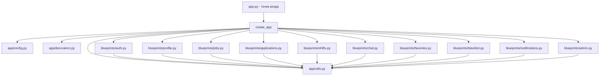

# План рефакторинга проекта «Трудник»

## Текущие проблемы

1. **`app.py` — монолит >1500 строк** — весь код в одном файле, нет модульной структуры
2. **Дублирование маршрутов** — `/job/new` и `/create-job` делают одно и то же с разными шаблонами; `/shift/:id/checkin`, `/shift/:id/complete`, `/confirm-payment` дублируются `/shift/:id/action`
3. **Дублирование API** — `/favorite/:id` и `/api/favorites/add`, `/unfavorite/:id` и `/api/favorites/remove`
4. **Лишние файлы в корне** — скрипты проверки, тесты, документация деплоя
5. **Дублирование миграций** — `setup_rls.sql` и `setup_rls_jobs_only.sql`
6. **Недостающие функции roadmap** — профессии, верификация, массовые операции, приглашения, файлы в чате, realtime, монетизация

---

## Этап 1: Переместить лишние файлы в `archive/`

### 1.1. Проверочные/диагностические скрипты
| Файл | Куда |
|------|------|
| `check_deploy.py` | → `archive/check_deploy.py` |
| `check_page_content.py` | → `archive/check_page_content.py` |
| `check_page_with_auth.py` | → `archive/check_page_with_auth.py` |
| `check_wsgi_reload.py` | → `archive/check_wsgi_reload.py` |

### 1.2. Тестовые скрипты
| Файл | Куда |
|------|------|
| `test_favorites_api.py` | → `archive/test_favorites_api.py` |
| `test_favorites.ps1` | → `archive/test_favorites.ps1` |
| `test_favorites.sh` | → `archive/test_favorites.sh` |
| `test_job_creation.py` | → `archive/test_job_creation.py` |
| `test_max_workers_manual.py` | → `archive/test_max_workers_manual.py` |

### 1.3. Скрипты деплоя
| Файл | Куда |
|------|------|
| `deploy_pa_one_line.sh` | → `archive/deploy_pa_one_line.sh` |
| `deploy_pythonanywhere.bat` | → `archive/deploy_pythonanywhere.bat` |
| `deploy_pythonanywhere.sh` | → `archive/deploy_pythonanywhere.sh` |
| `update_pa.sh` | → `archive/update_pa.sh` |
| `deploy.sh` (если есть) | → `archive/deploy.sh` |

### 1.4. Документация к деплою
| Файл | Куда |
|------|------|
| `DEPLOY_INSTRUCTION.md` | → `archive/DEPLOY_INSTRUCTION.md` |
| `FAVORITES_FIX.md` | → `archive/FAVORITES_FIX.md` |
| `FAVORITES_TEST.md` | → `archive/FAVORITES_TEST.md` |
| `FINAL_DEPLOY.md` | → `archive/FINAL_DEPLOY.md` |

### 1.5. Вспомогательные
| Файл | Куда |
|------|------|
| `.git_commit_msg` | → `archive/.git_commit_msg` |

**Остаются в корне (нужные):**
| Файл | Причина |
|------|---------|
| `app.py` | Основной код |
| `config.py` | Конфигурация |
| `.env` | Переменные окружения |
| `requirements.txt` | Зависимости |
| `PROJECT_CONTEXT.md` | Документация проекта |
| `README.md` | README |
| `supabase_agent.py` | AI-агент для Supabase |

---

## Этап 2: Рефакторинг `app.py` — разбить на модули (Flask Blueprints)

Новая структура `app/`:

```
app/
  __init__.py          # create_app() - фабрика приложения
  config.py            # настройки (перенести из корневого config.py)
  utils.py             # calculate_distance, refresh_access_token,
                       # supabase_request, upload_to_storage, copy_job,
                       # add_notification, update_rating

  decorators.py        # login_required, role_required

  blueprints/
    __init__.py
    auth.py            # /login, /register, /logout
    profile.py         # /profile, /profile/update, /profile/delete-photo,
                       # /profile/delete-account, /profile/change-password,
                       # /verify-employer, /profile/<user_id>
    jobs.py            # / (index), /workers, /jobs/<id>, /job/new (объединить с create-job),
                       # /create-job (удалить дубль), /my-jobs, /my-jobs/action,
                       # /repost-job/<id>, /cancel-job/<id>, /restore-job/<id>, /delete-job/<id>,
                       # /favorite-job/<id>, /unfavorite-job/<id>
    applications.py    # /apply/<job_id>, /apply-selected, /unapply/<job_id>,
                       # /unapply-selected, /my-applications,
                       # /applications/<app_id>/<action>, /application/<app_id>/cancel
    shifts.py          # /shifts, /shift/<id>/checkin, /shift/<id>/complete,
                       # /shift/<id>/confirm-payment, /shift/<id>/action,
                       # /shift/<id>/dispute, /rate-worker/<worker_id>/<job_id>
    chat.py            # /chats, /chat/<shift_id>, /chat/new/<worker_id>,
                       # /api/send_message
    favorites.py       # /favorites, /favorite/<id>, /unfavorite/<id>,
                       # /api/favorites/add, /api/favorites/remove,
                       # /api/favorites/check, /api/favorites/remove-selected
    blacklist.py       # /blacklist, /blacklist/<id>, /unblock/<id>
    notifications.py   # /notifications, /notification/<id>/read
    admin.py           # /admin, /admin/approve/<id>, /admin/reject/<id>
```

### 2.1. Создать `app/__init__.py`
```python
from flask import Flask
from app.config import Config

def create_app():
    app = Flask(__name__)
    app.config.from_object(Config)
    app.secret_key = app.config['SECRET_KEY']

    # Регистрация blueprints
    from app.blueprints.auth import auth_bp
    from app.blueprints.profile import profile_bp
    from app.blueprints.jobs import jobs_bp
    from app.blueprints.applications import applications_bp
    from app.blueprints.shifts import shifts_bp
    from app.blueprints.chat import chat_bp
    from app.blueprints.favorites import favorites_bp
    from app.blueprints.blacklist import blacklist_bp
    from app.blueprints.notifications import notifications_bp
    from app.blueprints.admin import admin_bp

    app.register_blueprint(auth_bp)
    app.register_blueprint(profile_bp)
    app.register_blueprint(jobs_bp)
    app.register_blueprint(applications_bp)
    app.register_blueprint(shifts_bp)
    app.register_blueprint(chat_bp)
    app.register_blueprint(favorites_bp)
    app.register_blueprint(blacklist_bp)
    app.register_blueprint(notifications_bp)
    app.register_blueprint(admin_bp)

    return app
```

### 2.2. Создать `app/config.py`
Перенести содержимое корневого `config.py`.

### 2.3. Создать `app/utils.py`
Вынести все вспомогательные функции:
- `calculate_distance()`
- `refresh_access_token()`
- `supabase_request()`
- `upload_to_storage()`
- `copy_job()`
- `add_notification()`
- `update_rating()`

И вынести константы:
- `SUPABASE_URL`, `SUPABASE_KEY`, `SERVICE_KEY`

### 2.4. Создать `app/decorators.py`
Вынести:
- `login_required`
- `role_required`

### 2.5. Создать каждый blueprint

**Структура blueprint:**
```python
from flask import Blueprint
from app.utils import supabase_request

bp = Blueprint('auth', __name__, url_prefix='')

@bp.route('/login', methods=['GET', 'POST'])
def login():
    ...
```

### 2.6. Обновить `app.py` (корневой) — сделать точкой входа
```python
from app import create_app
app = create_app()

if __name__ == '__main__':
    app.run(debug=True)
```

---

## Этап 3: Устранить дублирование

### 3.1. `/job/new` vs `/create-job`
- `/job/new` использует шаблон `job_new.html` — **более современный** (с картой Яндекса)
- `/create-job` использует шаблон `create_job.html`
- **Решение**: удалить `/create-job` и `create_job.html`; `/job/new` остаётся единственным маршрутом создания задания

### 3.2. `/shift/:id/checkin`, `/shift/:id/complete`, `/shift/:id/confirm-payment` vs `/shift/:id/action`
- Отдельные маршруты имеют **дополнительную логику** (проверки, уведомления)
- Общий `/shift/:id/action` — упрощённая версия
- **Решение**: оставить отдельные маршруты с полной логикой, удалить `/shift/:id/action`

### 3.3. `/favorite/:id` vs `/api/favorites/add`
- `/favorite/:id` — редирект обратно (для форм)
- `/api/favorites/add` — JSON API (для JS)
- **Решение**: оставить оба, они несут разную функцию

### 3.4. `migrations/setup_rls.sql` vs `migrations/setup_rls_jobs_only.sql`
- `setup_rls.sql` — полный набор RLS для всех таблиц
- `setup_rls_jobs_only.sql` — только jobs
- **Решение**: удалить `setup_rls_jobs_only.sql`

---

## Этап 4: Упорядочить миграции

### 4.1. Пронумеровать миграции
```
migrations/
  001_initial_schema.sql        # Создание таблиц (profiles, jobs, applications, shifts)
  002_rls_policies.sql          # Все RLS политики
  003_max_workers.sql           # max_workers, current_workers, ratings, notifications
  004_fix_notifications.sql     # Исправление уведомлений
  005_add_is_read_column.sql    # Добавление is_read в notifications
```

### 4.2. Удалить дубликаты
- Удалить `setup_rls_jobs_only.sql` (дубль `setup_rls.sql`)

---

## Этап 5: Реализовать недостающие функции (приоритет — первые в roadmap)

### 5.1. Список профессий (work_types)
- Создать таблицу `work_types` или константу в Python
- Добавить поле `work_type` в `profiles` как массив выбранных профессий
- Обновить форму регистрации и редактирования профиля
- Обновить поиск на странице «Трудники»

**Файлы:**
- `migrations/006_work_types.sql`
- `app/blueprints/profile.py` — обновить регистрацию/редактирование
- `templates/register.html` — добавить выбор профессий
- `templates/profile_edit.html` — добавить выбор профессий
- `templates/workers.html` — обновить фильтр

### 5.2. Верификация сотрудников
- Добавить флаг `verified` в `profiles` (есть `verification_status` — проверить)
- Механизм загрузки документа для сотрудников (аналогично работодателям)
- Страница админа для одобрения

**Файлы:**
- `migrations/007_worker_verification.sql`
- `app/blueprints/admin.py` — обновить админку
- `templates/verify_employer.html` → расширить для сотрудников
- `templates/admin.html` — добавить список сотрудников на верификацию

### 5.3. Массовые операции над откликами
- Чекбоксы в `my_applications.html`
- Кнопки «Принять выбранные», «Отклонить выбранные»
- Выделение всех одним кликом

**Файлы:**
- `app/blueprints/applications.py` — добавить маршрут `/applications/batch-action`
- `templates/my_applications.html` — добавить чекбоксы и кнопки

### 5.4. Приглашение трудников
- Кнопка «Пригласить» в карточке трудника на `workers.html`
- Отправка уведомления
- Создание отклика-приглашения

**Файлы:**
- `app/blueprints/jobs.py` — добавить маршрут `/invite/<worker_id>/<job_id>`
- `templates/workers.html` — добавить кнопку «Пригласить»

---

## Этап 6: Обновить PROJECT_CONTEXT.md

После завершения рефакторинга обновить:
- Секцию «Структура проекта» — отразить новую модульную структуру
- Секцию «Что уже реализовано» — отметить выполненные пункты roadmap
- Секцию «Полный Roadmap» — отметить прогресс

---

## Диаграмма новой архитектуры



---

## Сводная таблица: что с чем объединить/удалить

| Исходный файл | Действие | Результат |
|---------------|----------|-----------|
| `app.py` | Разбить на модули | `app/__init__.py` + `app/*.py` + `app/blueprints/*.py` |
| `config.py` | Перенести | `app/config.py` |
| `check_deploy.py` | → archive | `archive/check_deploy.py` |
| `check_page_content.py` | → archive | `archive/check_page_content.py` |
| `check_page_with_auth.py` | → archive | `archive/check_page_with_auth.py` |
| `check_wsgi_reload.py` | → archive | `archive/check_wsgi_reload.py` |
| `test_favorites_api.py` | → archive | `archive/test_favorites_api.py` |
| `test_favorites.ps1` | → archive | `archive/test_favorites.ps1` |
| `test_favorites.sh` | → archive | `archive/test_favorites.sh` |
| `test_job_creation.py` | → archive | `archive/test_job_creation.py` |
| `test_max_workers_manual.py` | → archive | `archive/test_max_workers_manual.py` |
| `deploy_pa_one_line.sh` | → archive | `archive/deploy_pa_one_line.sh` |
| `deploy_pythonanywhere.bat` | → archive | `archive/deploy_pythonanywhere.bat` |
| `deploy_pythonanywhere.sh` | → archive | `archive/deploy_pythonanywhere.sh` |
| `update_pa.sh` | → archive | `archive/update_pa.sh` |
| `DEPLOY_INSTRUCTION.md` | → archive | `archive/DEPLOY_INSTRUCTION.md` |
| `FAVORITES_FIX.md` | → archive | `archive/FAVORITES_FIX.md` |
| `FAVORITES_TEST.md` | → archive | `archive/FAVORITES_TEST.md` |
| `FINAL_DEPLOY.md` | → archive | `archive/FINAL_DEPLOY.md` |
| `.git_commit_msg` | → archive | `archive/.git_commit_msg` |
| `/create-job` маршрут | Удалить | Остаётся только `/job/new` |
| `create_job.html` | Удалить | Остаётся `job_new.html` |
| `/shift/:id/action` | Удалить | Остаются отдельные маршруты |
| `setup_rls_jobs_only.sql` | Удалить | Остаётся `setup_rls.sql` |
