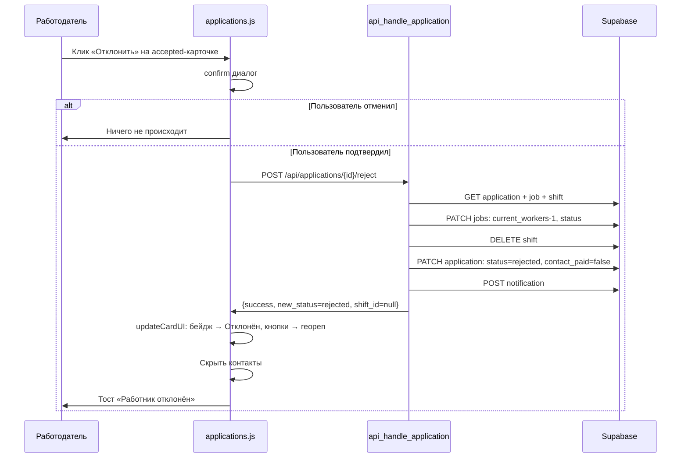

# План: Отклонение принятого отклика через AJAX

## Контекст

UI уже содержит кнопку «Отклонить» для откликов со статусом `accepted`:
- Шаблон: [`templates/my_applications.html:215-221`](../templates/my_applications.html:215)
- JS: [`static/js/applications.js:290-296`](../static/js/applications.js:290) — `buildActionButtonsHTML` для статуса `accepted`
- JS: [`static/js/applications.js:105-112`](../static/js/applications.js:105) — `singleAction` уже содержит `confirm()`-диалог для `accepted→reject`

Бэкенд пока блокирует эту операцию:
- [`app/blueprints/applications.py:231-233`](../app/blueprints/applications.py:231) — возвращает 409
- [`app/blueprints/applications.py:286-289`](../app/blueprints/applications.py:286) — аналогичная блокировка в batch

Существует референсная реализация с redirect (не AJAX):
- [`app/blueprints/applications.py:315`](../app/blueprints/applications.py:315) — `cancel_application()`

---

## Пошаговый план изменений

### Шаг 1. Бэкенд: доработка `api_handle_application()` — блок reject для `accepted`

**Файл:** [`app/blueprints/applications.py`](../app/blueprints/applications.py)

**1.1. Расширить SELECT в строке 155**

Сейчас эндпоинт получает только `job_id,worker_id,status`. Для отклонения принятого отклика понадобится `shift_id`.

```python
# строка 155 — было:
app_resp = supabase_request('GET', f'applications?id=eq.{app_id}&select=job_id,worker_id,status')
# стало:
app_resp = supabase_request('GET', f'applications?id=eq.{app_id}&select=job_id,worker_id,status,shift_id')
```

Добавить чтение `shift_id`:
```python
# после строки 162
shift_id = app_data.get('shift_id')
```

**1.2. Убрать блокировку и добавить логику отмены (строки 231-243)**

Заменить блок `elif action == 'reject':` (строки 231-243) на:

```python
elif action == 'reject':
    if current_status == 'accepted':
        # === ОТКЛОНЕНИЕ УЖЕ ПРИНЯТОГО РАБОТНИКА ===
        # 1. Получить данные задания
        job_resp = supabase_request('GET', f'jobs?id=eq.{job_id}&select=current_workers,max_workers,status')
        if not job_resp.ok or not job_resp.json():
            return jsonify({'success': False, 'error': 'Задание не найдено'}), 404

        job = job_resp.json()[0]
        current_workers = max(0, job.get('current_workers', 1) - 1)
        new_job_status = 'open' if current_workers == 0 else 'in_progress'

        # 2. Уменьшить счётчик и обновить статус задания
        supabase_request('PATCH', f'jobs?id=eq.{job_id}', json={
            'status': new_job_status,
            'current_workers': current_workers
        })

        # 3. Удалить смену (shift), если есть
        if shift_id:
            supabase_request('DELETE', f'shifts?id=eq.{shift_id}')

        # 4. Сбросить contact_paid (скрыть контактные данные)
        #    Устанавливаем contact_paid = false или удаляем запись оплаты
        supabase_request('PATCH', f'applications?id=eq.{app_id}', json={
            'status': 'rejected',
            'shift_id': None,
            'contact_paid': False
        })

        # 5. Уведомить работника
        add_notification(worker_id, 'application_rejected', 'Отклик отклонён',
                         f'Ваш отклик на задание #{job_id} был отклонён работодателем')

        return jsonify({
            'success': True,
            'new_status': 'rejected',
            'shift_id': None,
            'message': 'Работник отклонён'
        })

    # === ОБЫЧНОЕ ОТКЛОНЕНИЕ (pending → rejected) ===
    supabase_request('PATCH', f'applications?id=eq.{app_id}', json={'status': 'rejected'})
    add_notification(worker_id, 'application_rejected', 'Отклик отклонён',
                     f'Ваш отклик на задание #{job_id} был отклонён')

    return jsonify({
        'success': True,
        'new_status': 'rejected',
        'message': 'Отклик отклонён'
    })
```

**Важно:** При отклонении accepted → rejected необходимо сбросить `contact_paid` в БД (установить `False`), чтобы контакты не отображались после возврата на страницу. Это требует наличия колонки `contact_paid` в таблице `applications`. Если колонки нет — нужна миграция.

Если колонки `contact_paid` нет в таблице `applications`, а оплата хранится в отдельной таблице `payments`, то нужно:
- Либо удалять/помечать запись в `payments` как refunded
- Либо просто не показывать контакты на фронтенде (без изменения БД) — **менее надёжно**

---

### Шаг 2. Бэкенд: доработка `api_batch_applications()` — снять блокировку accepted→reject

**Файл:** [`app/blueprints/applications.py:286-289`](../app/blueprints/applications.py:286)

Удалить блокирующие строки 286-289:

```python
# было:
# Для reject проверяем, что не accepted
if action == 'reject' and current_status == 'accepted':
    results['errors'].append({'id': app_id, 'error': 'Нельзя отклонить уже принятого работника'})
    continue

# стало:
# убираем блок целиком — логика будет в api_handle_application()
```

Batch-эндпоинт делегирует вызов `api_handle_application()` на строке 293, которая теперь корректно обработает accepted→reject, включая сброс счётчика, удаление shift и т.д.

**Риск:** В batch-режиме ошибки обрабатываются как `errors` в results, а не выбрасывают HTTP-ошибку. Если операция accepted→reject не удалась по какой-то причине (например, задание уже в статусе `paid`), это будет отражено в `results.errors`, что соответствует общей логике batch-эндпоинта.

---

### Шаг 3. Фронтенд: `updateCardUI` — скрытие контактных данных при отклонении

**Файл:** [`static/js/applications.js:206`](../static/js/applications.js:206)

Добавить логику в функцию `updateCardUI`: при смене статуса с `accepted` на `rejected` скрывать секцию контактов.

После строки 250 (после перепривязки событий кнопок) добавить:

```javascript
// Скрыть контактные данные при отклонении принятого отклика
const contactSection = card.querySelector('#contact-section-' + appId);
if (contactSection) {
    if (newStatus === 'rejected') {
        // Скрыть блок контактов — заменяем на заглушку
        contactSection.innerHTML = `
            <div class="text-xs text-gray-400 italic mt-2">
                🔒 Контакты скрыты после отклонения
            </div>
        `;
    }
}
```

Также обновить счётчик занятости в карточке, если он отображается:
```javascript
// Обновить счётчик занятости, если он есть
const workersCount = card.querySelector('.workers-count');
if (workersCount && newStatus === 'rejected') {
    // Точное значение вернёт сервер, пока инкрементально уменьшаем
    // Лучше получить актуальное значение из ответа сервера
}
```

**Рекомендация:** Добавить в JSON-ответ сервера поле `current_workers` и `job_status`, чтобы фронтенд мог обновить эти данные без гадания:

```python
# В ответе эндпоинта
return jsonify({
    'success': True,
    'new_status': 'rejected',
    'shift_id': None,
    'current_workers': current_workers,
    'job_status': new_job_status,
    'message': 'Работник отклонён'
})
```

Тогда в `updateCardUI` можно добавить:

```javascript
// В singleAction, после data.success:
if (data.current_workers !== undefined) {
    const counter = card.querySelector('.workers-count');
    if (counter) counter.textContent = `${data.current_workers}/${...}`;
}
```

---

### Шаг 4. Фронтенд: `singleAction` — обновление обработчика ответа

**Файл:** [`static/js/applications.js:128-131`](../static/js/applications.js:128)

Текущий код уже вызывает `updateCardUI` с `data.new_status` и `data.shift_id`. 

После доработки бэкенда, при отклонении accepted→reject:
- `data.new_status` будет `'rejected'`
- `data.shift_id` будет `null`
- `data.message` будет `'Работник отклонён'`

`updateCardUI` вызовет `buildActionButtonsHTML(appId, 'rejected', null)`, что корректно отобразит бейдж «Отклонён» и кнопку «Повторно принять» (reopen).

Никаких дополнительных изменений в `singleAction` не требуется, если не добавляется поле `current_workers` — в этом случае нужно его прочитать и обновить счётчик.

---

## Диаграмма потока данных



---

## Риски и рекомендации

### Риск 1: Гонка состояний (race condition)
При параллельных запросах (несколько работодателей или batch) возможна ситуация, когда `current_workers` уже = 0, а эндпоинт пытается уменьшить его ещё раз. В `cancel_application()` используется защита `max(0, current - 1)`, что безопасно.

**Рекомендация:** Использовать атомарный PATCH с PostgREST (как в accept-логике):
```python
patch_resp = supabase_request('PATCH', f'jobs?id=eq.{job_id}&current_workers=gt.0', json={
    'current_workers': current_workers - 1,
    'status': new_job_status if current_workers - 1 == 0 else job['status']
})
```

### Риск 2: Отклонение после оплаты контактов
Если работодатель уже оплатил контакты (`contact_paid = True`), при отклонении нужно решить: возвращать ли деньги или просто скрыть контакты.

**Рекомендация:** Сейчас (в `cancel_application`) возврат средств не реализован. Предлагается просто сбрасывать `contact_paid = False` и скрывать контакты. Возврат средств — отдельная задача.

### Риск 3: Отсутствие колонки `contact_paid` в таблице `applications`
Если колонки нет, PATCH с `contact_paid: False` вызовет ошибку.

**Рекомендация:** 
- Проверить структуру таблицы `applications`.
- Если колонки нет — не включать её в PATCH, а скрытие контактов делать только на фронтенде (менее надёжно, но проще).
- Либо добавить миграцию для колонки.

### Риск 4: Batch-операция с accepted и non-accepted откликами
Batch принимает массив `app_ids`. Если среди них есть и accepted, и pending — каждый будет обработан отдельным вызовом `api_handle_application()`. Accepted будет обработан по новому пути, pending — по старому. Это корректно.

### Риск 5: Отсутствие валидации времени (как в cancel_application)
`cancel_application()` проверяет, что до начала смены > 12 часов. В `api_handle_application` такой проверки нет.

**Рекомендация:** Решить, нужна ли эта проверка. Для AJAX-эндпоинта она может быть избыточна, если работодатель может в любой момент отклонить работника. Если нужна — добавить аналогичную проверку.

---

## Сводка изменений по файлам

| Файл | Изменения | Строки |
|------|-----------|--------|
| [`app/blueprints/applications.py`](../app/blueprints/applications.py) | Расширить SELECT (shift_id), заменить блок `reject` с блокировкой на логику отмены | 155, 162, 231-243 |
| [`app/blueprints/applications.py`](../app/blueprints/applications.py) | Удалить блокировку accepted→reject в batch | 286-289 |
| [`static/js/applications.js`](../static/js/applications.js) | Добавить скрытие контактов в `updateCardUI` при `accepted→rejected` | после 250 |
| [`static/js/applications.js`](../static/js/applications.js) | (Опционально) обработка `current_workers` в ответе | 128-131 |

---

## Порядок реализации

1. **Бэкенд:** доработка `api_handle_application()` — новый reject для accepted (шаг 1)
2. **Бэкенд:** доработка `api_batch_applications()` — снять блокировку (шаг 2)
3. **Фронтенд:** `updateCardUI` — скрытие контактов + опционально счётчик (шаг 3)
4. **Тестирование:** индивидуальное отклонение + batch-отклонение + reopen после отклонения
