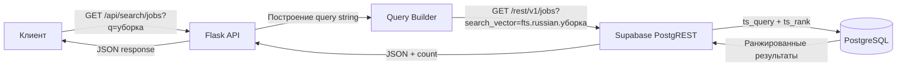

# План: Полнотекстовый поиск по заданиям и трудникам

## 1. Анализ существующего функционала

### Что уже есть:
- **`GET /`** (index) — фильтрация заданий по городу, оплате, навыкам (client-side), гео-радиусу, сортировке
- **`GET /workers`** — фильтрация трудников по городу, опыту, оплате, рейтингу, навыкам, вероисповеданию
- Оба используют PostgREST URL-параметры (Supabase REST API), без SQL

### Чего не хватает:
- Текстовый поиск по ключевым словам (название, описание)
- Пагинация на серверной стороне
- Гео-фильтрация на стороне БД (сейчас клиентская)
- API-эндпоинты (JSON ответы, а не HTML)
- Учёт multi-worker: показ свободных мест (`current < max`)

---

## 2. Выбор подхода: PostgreSQL FTS через PostgREST

**Почему не Elasticsearch:**
- Добавляет инфраструктурную сложность (отдельный сервис, синхронизация)
- Избыточен для масштаба приложения
- Текущий стек (PostgreSQL + PostgREST) уже покрывает потребности

**Почему PostgreSQL FTS:**
- Встроен в PostgreSQL (нужна только миграция)
- PostgREST поддерживает операторы `fts` и `plfts`
- GIN-индекс даёт быстрый поиск
- Ранжирование через `ts_rank`

### Схема индексации:

```sql
-- Для таблицы jobs
ALTER TABLE jobs ADD COLUMN search_vector tsvector
    GENERATED ALWAYS AS (
        setweight(to_tsvector('russian', coalesce(organization_name, '')), 'A') ||
        setweight(to_tsvector('russian', coalesce(object_description, '')), 'B') ||
        setweight(to_tsvector('russian', coalesce(detailed_description, '')), 'C') ||
        setweight(to_tsvector('russian', coalesce(work_type, '')), 'C') ||
        setweight(to_tsvector('russian', coalesce(address, '')), 'D')
    ) STORED;

CREATE INDEX idx_jobs_search ON jobs USING GIN(search_vector);

-- Для таблицы profiles (workers)
ALTER TABLE profiles ADD COLUMN search_vector tsvector
    GENERATED ALWAYS AS (
        setweight(to_tsvector('russian', coalesce(full_name, '')), 'A') ||
        setweight(to_tsvector('russian', coalesce(skills, '')), 'B') ||
        setweight(to_tsvector('russian', coalesce(bio, '')), 'C') ||
        setweight(to_tsvector('russian', coalesce(city, '')), 'D')
    ) STORED;

CREATE INDEX idx_profiles_search ON profiles USING GIN(search_vector);
```

Веса: A (название/имя) > B (описание/навыки) > C (детали) > D (адрес/город)

---

## 3. API эндпоинты

### 3.1. Поиск заданий

```
GET /api/search/jobs
```

**Параметры:**
| Параметр | Тип | Описание |
|----------|-----|----------|
| `q` | string | Поисковый запрос (ключевые слова) |
| `status` | string | Фильтр по статусу (по умолчанию: open) |
| `lat` | float | Широта для гео-поиска |
| `lng` | float | Долгота для гео-поиска |
| `radius` | float | Радиус в км (по умолчанию: 20) |
| `min_pay` | int | Минимальная оплата |
| `max_pay` | int | Максимальная оплата |
| `skills` | string | Навыки через запятую |
| `date_from` | string | Дата начала (ISO) |
| `date_to` | string | Дата окончания (ISO) |
| `available_slots` | bool | Только с свободными местами (current < max) |
| `page` | int | Страница (по умолчанию: 1) |
| `per_page` | int | На страницу (по умолчанию: 20) |
| `sort` | string | Сортировка: relevance, date_desc, payment_asc, payment_desc, distance |

**Ответ:**
```json
{
    "results": [...],
    "total": 42,
    "page": 1,
    "per_page": 20,
    "pages": 3
}
```

### 3.2. Поиск трудников

```
GET /api/search/workers
```

**Параметры:**
| Параметр | Тип | Описание |
|----------|-----|----------|
| `q` | string | Поисковый запрос |
| `skills` | string | Навыки через запятую |
| `rating_min` | float | Минимальный рейтинг |
| `lat` | float | Широта |
| `lng` | float | Долгота |
| `radius` | float | Радиус в км |
| `page` | int | Страница |
| `per_page` | int | На страницу |
| `sort` | string | relevance, rating_desc, payment_asc |

---

## 4. Реализация (PostgREST подход)

Поскольку приложение использует Supabase REST API (PostgREST), а не SQLAlchemy/сырой SQL, поиск строится через PostgREST-операторы:

### Full-text search через PostgREST:
```
GET /jobs?search_vector=fts.russian.уборка&status=eq.open&limit=20&offset=0
```

PostgREST оператор `fts(language, query)` выполняет `ts_query` и возвращает ранжированные результаты с `ts_rank` в поле `rank`.

### Гео-поиск:
PostgREST не поддерживает гео-фильтрацию напрямую. Решение:
- Через функцию PostGIS (если установлен) или
- Клиентский фильтр (как сейчас) — приемлемо для масштаба

### Multi-worker слоты:
```
&current_workers=lt.max_workers
```

---

## 5. План реализации (6 шагов)

### Шаг 1: SQL миграция
Файл: [`migrations/011_add_search_indexes.sql`](migrations/011_add_search_indexes.sql)
- Добавить `search_vector` (generated tsvector) в `jobs` и `profiles`
- Создать GIN индексы
- (Опционально) добавить триггер для автообновления

### Шаг 2: API эндпоинты в jobs.py
Добавить:
- `GET /api/search/jobs` — поиск заданий
- `GET /api/search/workers` — поиск трудников
- Построение PostgREST query string с `fts`, фильтрами, пагинацией
- Подсчёт total через `Prefer: count=exact`

### Шаг 3: Интеграция с существующими страницами
- Обновить `index.html` — использовать API для поиска (AJAX)
- Обновить `workers.html` — аналогично
- Добавить поисковую строку в UI

### Шаг 4: Серверная пагинация
- Заменить клиентскую фильтрацию на серверную (limit/offset)
- Отдавать метаданные пагинации в ответе

### Шаг 5: Тесты
- Юнит-тесты для построения query string
- Интеграционные тесты для API эндпоинтов
- Тесты пагинации и краевых случаев

### Шаг 6: Документация + коммит

---

## 6. Архитектурная схема


