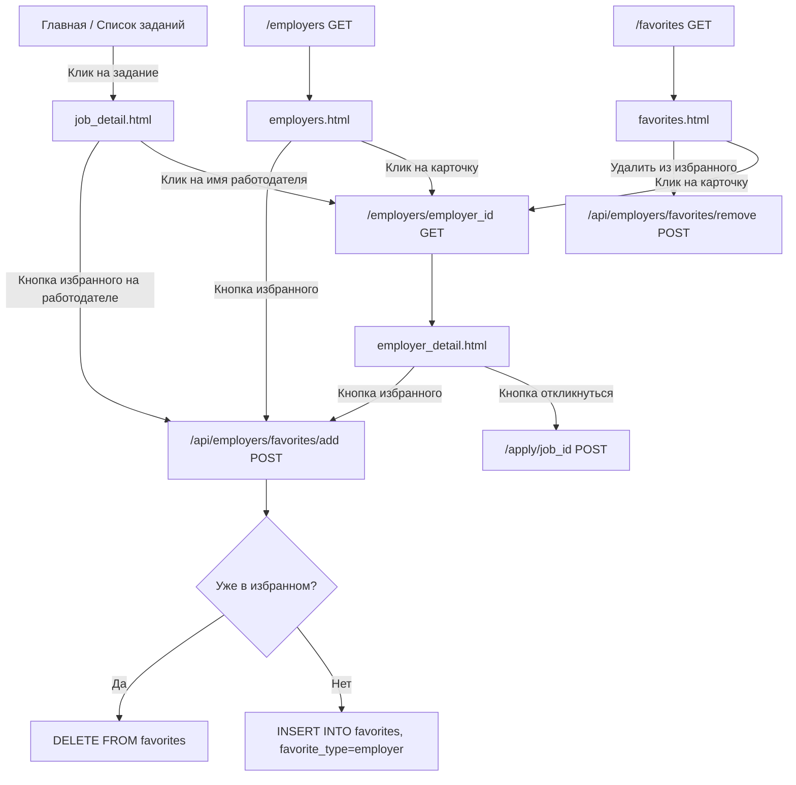

# План реализации: «Страница Работодатели» с избранным работодателей

## Анализ текущей системы

### Текущая схема БД (избранное)
- **`favorites`**: `user_id` (uuid) + `target_id` (uuid) + `created_at` (timestamptz). PK = `(user_id, target_id)`. RLS: "Users manage own favorites" (ALL на `auth.uid() = user_id`).
- **`job_favorites`**: `user_id` (uuid) + `job_id` (uuid) + `created_at` (timestamptz). PK = `(user_id, job_id)`. RLS: "Users manage own job favorites".

Сейчас `favorites` используется ТОЛЬКО для избранного работодателем трудников (`target_id` → профиль работника). API оперирует понятием `worker_id`.

### Текущие маршруты избранного (`favorites.py`)
| Маршрут | Назначение |
|---|---|
| `GET /favorites` | Страница избранного: для работодателя — трудники, для трудника — задания |
| `POST /favorite/<target_id>` | Добавить трудника в избранное (form-based) |
| `POST /unfavorite/<target_id>` | Удалить трудника из избранного (form-based) |
| `POST /api/favorites/add` | API: добавить в избранное (JSON: `{worker_id}`) |
| `POST /api/favorites/remove` | API: удалить из избранного (JSON: `{worker_id}`) |
| `POST /api/favorites/check` | API: проверить статус избранного (JSON: `{worker_id}`) |
| `POST /api/favorites/remove-selected` | API: массовое удаление (JSON: `{worker_ids: [...]}`) |

### Текущий JS (`static/js/favorites.js`)
- `toggleFavorite(workerId, btn, event)` — универсальная функция переключения избранного для трудников (workerId).
- Вызывает `/api/favorites/add` и `/api/favorites/remove` с полем `worker_id`.
- При загрузке проверяет статус через `/api/favorites/check`.

### Текущие шаблоны
- `job_detail.html` — детальная страница задания. НЕТ кнопки избранного работодателя.
- `favorites.html` — страница избранного: для работодателя — трудники, для трудника — задания.
- `workers.html` — список трудников с кнопкой избранного (образец карточек).
- `profile_worker.html` — публичный профиль трудника.

---

## Проектируемые изменения

### 1. Схема БД

#### Миграция: `migrations/036_add_employer_favorites.sql`

**Решение**: переиспользовать таблицу `favorites` с добавлением колонки `favorite_type`:

```sql
-- 1. Добавить колонку favorite_type
ALTER TABLE public.favorites
    ADD COLUMN IF NOT EXISTS favorite_type TEXT NOT NULL DEFAULT 'worker';

-- 2. Добавить CHECK-constraint
ALTER TABLE public.favorites
    ADD CONSTRAINT favorites_type_check CHECK (favorite_type IN ('worker', 'employer'));

-- 3. Обновить первичный ключ с учётом favorite_type
ALTER TABLE public.favorites DROP CONSTRAINT IF EXISTS favorites_pkey;
ALTER TABLE public.favorites
    ADD CONSTRAINT favorites_pkey PRIMARY KEY (user_id, target_id, favorite_type);

-- 4. Индекс для быстрого поиска по типу
CREATE INDEX IF NOT EXISTS idx_favorites_type ON public.favorites(favorite_type);
```

**Почему не новая таблица**: `favorites` — это универсальная junction-таблица «пользователь → избранный профиль». Роль избранного определяется ролью целевого профиля, а `favorite_type` делает это явным и позволяет индексировать/фильтровать.

#### Запросы Supabase (PostgREST)

- **Список работодателей**: `GET /profiles?role=eq.employer&select=id,full_name,photo_url,rating,city,verification_status&order=rating.desc`
- **Избранные работодатели (для трудника)**: `GET /favorites?user_id=eq.{uid}&favorite_type=eq.employer&select=target:profiles!favorites_target_id_fkey(id,full_name,photo_url,rating,city,verification_status)`
- **Избранные трудники (для работодателя)**: `GET /favorites?user_id=eq.{uid}&favorite_type=eq.worker&select=target:profiles!favorites_target_id_fkey(id,full_name,photo_url,rating,city,skills,experience,desired_payment)`
- **Toggle избранного работодателя**: `POST /favorites` → `{user_id, target_id, favorite_type: 'employer'}` / `DELETE /favorites?user_id=eq.{uid}&target_id=eq.{eid}&favorite_type=eq.employer`

---

### 2. Новый Blueprint: `app/blueprints/employers.py`

Новый файл для всех маршрутов, связанных с работодателями:

#### Маршруты

| Маршрут | Метод | Назначение |
|---|---|---|
| `/employers` | GET | Список всех работодателей с пагинацией и поиском |
| `/employers/<employer_id>` | GET | Профиль работодателя + его открытые задания |
| `/employers/<employer_id>/favorite` | POST | Toggle избранного работодателя (form-based) |
| `/api/employers/favorites/add` | POST | API: добавить работодателя в избранное |
| `/api/employers/favorites/remove` | POST | API: удалить работодателя из избранного |
| `/api/employers/favorites/check` | POST | API: проверить статус избранного |

**Псевдокод маршрутов**:

```python
employers_bp = Blueprint('employers', __name__)

# GET /employers
@employers_bp.route('/employers')
def employers_list():
    page = max(1, request.args.get('page', 1, type=int))
    per_page = 20
    city = request.args.get('city', '')
    skills = request.args.get('skills', '')
    search = request.args.get('q', '')
    
    query = 'role=eq.employer'
    if city: query += f'&city=ilike.*{sanitize(city)}*'
    if search: query += f'&full_name=ilike.*{sanitize(search)}*'
    query += f'&select=id,full_name,photo_url,rating,total_reviews,city,verification_status,bio'
    query += '&order=rating.desc'
    # пагинация: limit + offset
    
    resp = supabase_request('GET', f'profiles?{query}', headers={'Prefer': 'count=exact'})
    employers = resp.json() if resp.ok else []
    
    # Подсчёт открытых заданий для каждого работодателя
    if employers:
        ids = ','.join(e['id'] for e in employers)
        jobs_resp = supabase_request('GET', 
            f'jobs?employer_id=in.({ids})&status=eq.open&select=employer_id')
        # строим словарь employer_id → count
    
    # Проверка избранного
    favorited_ids = set()
    if session.get('user_id'):
        fav_resp = supabase_request('GET',
            f'favorites?user_id=eq.{session["user_id"]}&favorite_type=eq.employer&select=target_id')
        if fav_resp.ok:
            favorited_ids = {f['target_id'] for f in fav_resp.json()}
    
    return render_template('employers.html', employers=employers, 
                          favorited_employer_ids=favorited_ids, ...)


# GET /employers/<employer_id>
@employers_bp.route('/employers/<employer_id>')
def employer_detail(employer_id):
    # Запрос профиля
    resp = supabase_request('GET', f'profiles?id=eq.{employer_id}&select=*')
    employer = resp.json()[0] if resp.ok and resp.json() else None
    if not employer or employer.get('role') != 'employer':
        flash('Работодатель не найден', 'danger')
        return redirect(url_for('employers.employers_list'))
    
    # Открытые задания
    jobs_resp = supabase_request('GET', 
        f'jobs?employer_id=eq.{employer_id}&status=eq.open&select=*,photos:job_photos(*)&order=created_at.desc')
    open_jobs = jobs_resp.json() if jobs_resp.ok else []
    
    # Проверка избранного и откликов
    is_favorited = False
    already_applied_job_ids = set()
    if session.get('user_id'):
        fav_resp = supabase_request('GET',
            f'favorites?user_id=eq.{session["user_id"]}&target_id=eq.{employer_id}&favorite_type=eq.employer')
        is_favorited = fav_resp.ok and len(fav_resp.json()) > 0
        
        if open_jobs and session.get('role') == 'worker':
            job_ids = ','.join(j['id'] for j in open_jobs)
            app_resp = supabase_request('GET',
                f'applications?worker_id=eq.{session["user_id"]}&job_id=in.({job_ids})&select=job_id')
            if app_resp.ok:
                already_applied_job_ids = {a['job_id'] for a in app_resp.json()}
    
    return render_template('employer_detail.html', employer=employer,
                          open_jobs=open_jobs, is_favorited=is_favorited,
                          already_applied_job_ids=already_applied_job_ids)


# POST /employers/<employer_id>/favorite
@employers_bp.route('/employers/<employer_id>/favorite', methods=['POST'])
@login_required
def toggle_employer_favorite(employer_id):
    check = supabase_request('GET',
        f'favorites?user_id=eq.{session["user_id"]}&target_id=eq.{employer_id}&favorite_type=eq.employer')
    is_favorited = check.ok and len(check.json()) > 0
    
    if is_favorited:
        supabase_request('DELETE',
            f'favorites?user_id=eq.{session["user_id"]}&target_id=eq.{employer_id}&favorite_type=eq.employer')
        flash('Работодатель удалён из избранного', 'success')
    else:
        supabase_request('POST', 'favorites', json={
            'user_id': session['user_id'],
            'target_id': employer_id,
            'favorite_type': 'employer'
        })
        flash('Работодатель добавлен в избранное', 'success')
    
    return redirect(request.referrer or url_for('employers.employers_list'))


# API-роуты (аналогичны существующим в favorites.py, но с favorite_type='employer')

@employers_bp.route('/api/employers/favorites/add', methods=['POST'])
@login_required
def add_employer_favorite_api():
    data = request.get_json()
    employer_id = data.get('employer_id')
    if not employer_id:
        return jsonify({'success': False, 'error': 'Не указан employer_id'})
    try:
        resp = supabase_request('POST', 'favorites', json={
            'user_id': session['user_id'],
            'target_id': employer_id,
            'favorite_type': 'employer'
        })
        if resp.ok:
            return jsonify({'success': True, 'message': 'Работодатель добавлен в избранное'})
        if 'duplicate' in (resp.text or '').lower() or resp.status_code == 409:
            return jsonify({'success': True, 'message': 'Уже в избранном'})
        return jsonify({'success': False, 'error': f'Ошибка сервера: {resp.status_code}'})
    except Exception as e:
        return jsonify({'success': False, 'error': str(e)})

# ... аналогично для remove и check
```

---

### 3. Изменения в существующих файлах

#### 3.1 `app/blueprints/favorites.py` — Модификация

**Изменения**:
- `GET /favorites`: для трудников (`role == 'worker'`) запрашивать избранных **работодателей** вместо избранных заданий:
  ```python
  # Было: job_favorites?user_id=eq.{uid}&select=job:jobs(*)
  # Стало: favorites?user_id=eq.{uid}&favorite_type=eq.employer&select=target:profiles!favorites_target_id_fkey(...)
  # Данные: employer_favorites = [item['target'] for item in resp.json()]
  ```
- В шаблон передавать `employer_favorites` вместо `favorite_jobs`.
- API-роуты: добавить необязательный параметр `favorite_type` (по умолчанию `'worker'`) для универсальности.

#### 3.2 `app/blueprints/jobs.py` — Добавление

**Изменения**:
- В [`job_detail()`](app/blueprints/jobs.py:329): после загрузки `employer` проверить `is_employer_favorited`:
  ```python
  is_employer_favorited = False
  if session.get('role') == 'worker' and employer:
      fav_resp = supabase_request('GET',
          f'favorites?user_id=eq.{session["user_id"]}&target_id=eq.{employer["id"]}&favorite_type=eq.employer')
      is_employer_favorited = fav_resp.ok and len(fav_resp.json()) > 0
  ```
- Передать `is_employer_favorited` и `employer` в шаблон.

#### 3.3 `app/__init__.py` — Регистрация нового blueprint

Добавить после строки 148:
```python
from app.blueprints.employers import employers_bp
```
И после строки 167:
```python
app.register_blueprint(employers_bp)
```

#### 3.4 `templates/job_detail.html` — Кнопка избранного работодателя

Добавить в секцию информации о задании (рядом с verified-бейджем, строка 30-36) кнопку избранного:

```html

<span class="w-1 h-1 rounded-full bg-neutral-300 mx-1"></span>
<button onclick="event.stopPropagation(); toggleEmployerFavorite('{{ employer.id }}', this, event)"
        class="favorite-employer-btn inline-flex items-center gap-1 px-2 py-0.5 rounded-full text-xs font-semibold
               {{ 'bg-amber-100 text-amber-800' if is_employer_favorited else 'bg-neutral-100 text-neutral-600 hover:bg-amber-50 hover:text-amber-700' }}
               transition-colors"
        data-employer-id="{{ employer.id }}"
        data-favorited="{{ 'true' if is_employer_favorited else 'false' }}">
    <span class="favorite-icon">{{ '★' if is_employer_favorited else '☆' }}</span>
    <span class="favorite-text">{{ 'В избранном' if is_employer_favorited else 'В избранное' }}</span>
</button>

```

#### 3.5 `templates/favorites.html` — Показ работодателей для трудника

Секция «Задания» (строки 104-162) для трудника заменяется на секцию «Работодатели»:
- Аналогична секции «Трудники», но с данными работодателей
- Карточки: аватар, имя, рейтинг, город, количество открытых заданий
- Кнопка «Удалить из избранного»

#### 3.6 `static/js/favorites.js` — Добавление `toggleEmployerFavorite()`

Новая функция, аналогичная `toggleFavorite()`:
```javascript
function toggleEmployerFavorite(employerId, btn, event) {
    if (event) { event.stopPropagation(); event.preventDefault(); }
    
    const isFavorited = btn.dataset.favorited === 'true';
    
    if (isFavorited) {
        updateEmployerButtonUI(btn, false);
        fetch('/api/employers/favorites/remove', {
            method: 'POST',
            headers: {'Content-Type': 'application/json'},
            body: JSON.stringify({ employer_id: employerId })
        })
        .then(r => r.json())
        .then(data => {
            if (!data.success) {
                updateEmployerButtonUI(btn, true);
                if (window.showToast) window.showToast('Ошибка: ' + (data.error || 'Не удалось удалить'), 'error');
            }
        })
        .catch(() => { updateEmployerButtonUI(btn, true); });
    } else {
        updateEmployerButtonUI(btn, true);
        fetch('/api/employers/favorites/add', {
            method: 'POST',
            headers: {'Content-Type': 'application/json'},
            body: JSON.stringify({ employer_id: employerId })
        })
        .then(r => r.json())
        .then(data => {
            if (!data.success) {
                updateEmployerButtonUI(btn, false);
                if (window.showToast) window.showToast('Ошибка: ' + (data.error || 'Не удалось добавить'), 'error');
            }
        })
        .catch(() => { updateEmployerButtonUI(btn, false); });
    }
}

function updateEmployerButtonUI(btn, isFavorited) {
    const icon = btn.querySelector('.favorite-icon');
    const text = btn.querySelector('.favorite-text');
    btn.dataset.favorited = isFavorited ? 'true' : 'false';
    
    if (isFavorited) {
        btn.classList.remove('bg-neutral-100', 'text-neutral-600', 'hover:bg-amber-50', 'hover:text-amber-700');
        btn.classList.add('bg-amber-100', 'text-amber-800');
        if (icon) icon.textContent = '★';
        if (text) text.textContent = 'В избранном';
    } else {
        btn.classList.remove('bg-amber-100', 'text-amber-800');
        btn.classList.add('bg-neutral-100', 'text-neutral-600', 'hover:bg-amber-50', 'hover:text-amber-700');
        if (icon) icon.textContent = '☆';
        if (text) text.textContent = 'В избранное';
    }
}

// Авто-проверка статуса при загрузке
document.addEventListener('DOMContentLoaded', function() {
    document.querySelectorAll('.favorite-employer-btn').forEach(btn => {
        const employerId = btn.dataset.employerId;
        if (!employerId || btn.dataset.favorited === 'true') return;
        
        fetch('/api/employers/favorites/check', {
            method: 'POST',
            headers: {'Content-Type': 'application/json'},
            body: JSON.stringify({ employer_id: employerId })
        })
        .then(r => r.json())
        .then(data => {
            if (data.success && data.is_favorited) {
                updateEmployerButtonUI(btn, true);
            }
        })
        .catch(e => console.error('Ошибка проверки избранного работодателя:', e));
    });
});
```

---

### 4. Новые шаблоны

#### 4.1 `templates/employers.html` — Список работодателей

**Данные**:
```python
{
    'employers': [           # список профилей с role='employer'
        {
            'id': uuid,
            'full_name': str,
            'photo_url': str | None,
            'rating': float,
            'total_reviews': int,
            'city': str,
            'verification_status': str,
            'open_jobs_count': int,
        }
    ],
    'favorited_employer_ids': set,
    'page': int,
    'total_pages': int,
}
```

**UI**: Сетка карточек (как в `workers.html`):
- Аватар, имя, рейтинг (звёзды)
- Город
- Бейдж «Проверенный» (зелёный, если verification_status == 'approved')
- Количество открытых заданий
- Кнопка «В избранное» (звезда/сердечко) через `toggleEmployerFavorite()`
- Кнопка «Написать» (чат: `/chat/new/{employer_id}`)

#### 4.2 `templates/employer_detail.html` — Профиль работодателя

**Данные**:
```python
{
    'employer': {
        'id': uuid,
        'full_name': str,
        'photo_url': str | None,
        'rating': float,
        'total_reviews': int,
        'city': str,
        'bio': str,
        'phone': str,
        'email': str,
        'verification_status': str,
        'religion': str,
        'contact': str | None,
        'portfolio_link': str | None,
    },
    'open_jobs': [            # открытые задания этого работодателя
        {
            'id': uuid,
            'organization_name': str,
            'payment_amount': float,
            'city': str,
            'date_time': str,
            'object_description': str,
            'status': str,
            'photos': [...],
        }
    ],
    'is_favorited': bool,
    'already_applied_job_ids': set,
}
```

**UI**:
- Блок профиля (как в `profile_worker.html`): аватар, имя, рейтинг, кнопки «Написать», «В избранное»
- Данные: город, вероисповедание, контакты, bio, портфолио
- Бейдж «Проверенный работодатель» (зелёный)
- Секция «Актуальные задания»: карточки заданий с ценой и кнопкой «Откликнуться»

---

### 5. Порядок реализации

| # | Файл | Действие | Описание |
|---|---|---|---|
| 1 | `migrations/036_add_employer_favorites.sql` | **Создать** | Миграция: ALTER TABLE favorites + favorite_type |
| 2 | `app/blueprints/employers.py` | **Создать** | Новый blueprint со всеми маршрутами |
| 3 | `app/__init__.py` (строка ~148) | **Изменить** | Зарегистрировать employers_bp |
| 4 | `app/blueprints/favorites.py` | **Изменить** | Модифицировать для support favorite_type; для worker показывать избранных работодателей |
| 5 | `app/blueprints/jobs.py` (строка ~329) | **Изменить** | В `job_detail()` добавить `is_employer_favorited` |
| 6 | `templates/employers.html` | **Создать** | Страница списка работодателей |
| 7 | `templates/employer_detail.html` | **Создать** | Страница профиля работодателя с заданиями |
| 8 | `templates/job_detail.html` (~строка 36) | **Изменить** | Добавить кнопку «В избранное» на работодателя |
| 9 | `templates/favorites.html` (~строка 104) | **Изменить** | Заменить секцию «Задания» на «Работодатели» для трудника |
| 10 | `static/js/favorites.js` | **Изменить** | Добавить `toggleEmployerFavorite()` и авто-проверку |

---

### 6. Диаграмма потока данных



---

### 7. Обратная совместимость

- Существующие записи в `favorites` (работодатель → трудник) остаются с `favorite_type = 'worker'` (значение по умолчанию в миграции).
- API `/api/favorites/add`, `/api/favorites/remove`, `/api/favorites/check` остаются совместимыми: если `favorite_type` не передан в JSON, используется `'worker'`.
- `job_favorites` не трогаем — остаётся для будущих Use Case'ов.
- Страница `/favorites` для работодателя продолжает показывать избранных трудников без изменений.
